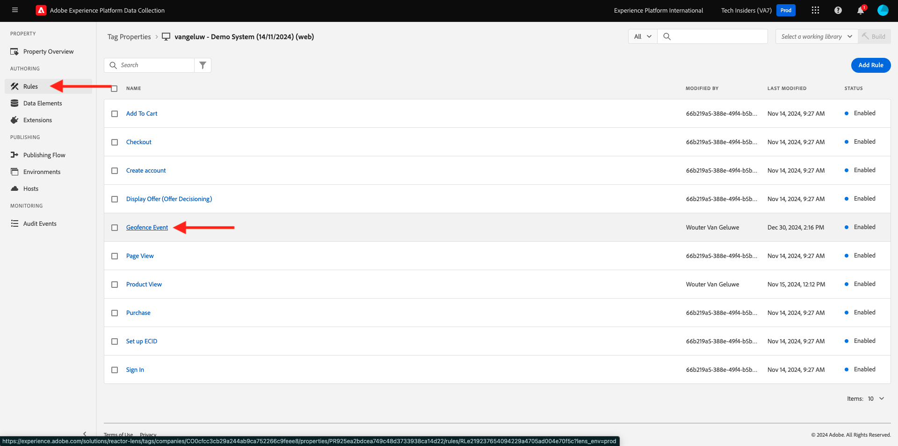

# 3.2.5 Acionar a jornada

Neste exercício, você testará e acionará a jornada configurada neste módulo.

## 3.2.5.1 Atualizar a configuração do evento geofence

Vá para [Coleção de dados do Adobe Experience Platform](https://experience.adobe.com/launch/) e selecione **Marcas**.

Esta é a página Propriedades da coleção de dados do Adobe Experience Platform que você viu antes.

No módulo 0, o Sistema de demonstração criou duas propriedades do cliente para você: uma para o site e outra para o aplicativo móvel. Localize-os procurando por `--aepUserLdap--` na caixa **[!UICONTROL Pesquisar]**. Clique para abrir a propriedade **Web**.

Você verá isso.

No menu esquerdo, vá para **Regras** e procure pela regra **Evento de geofence**. Clique na regra **Evento de geofence** para abri-la.

Você verá os detalhes dessa regra. Clique para abrir a ação **Enviar &quot;evento geofence&quot; para AEP - acionar JO**.

Você verá que, quando essa ação for acionada, um elemento de dados específico será usado para definir a estrutura de dados XDM. Você precisa atualizar esse elemento de dados e definir a **ID de Evento** do evento que você configurou no [Exercício 8.1](./ex1.md).

Agora é necessário atualizar o elemento de dados **XDM - Evento de geofence**. Para fazer isso, vá para **Elementos de dados**. Pesquise por **XDM - Evento de geofence** e clique em para abrir esse elemento de dados.

Você verá isto:

Navegue até o campo `_experience.campaign.orchestration.eventID`. Remova o valor atual e cole sua eventID lá.

Lembrando que a ID de Evento pode ser encontrada no Adobe Journey Optimizer em **Configurações > Eventos**, e você encontrará a ID de evento na carga de exemplo do seu evento, que tem esta aparência: `"eventID": "fa42ab7982ba55f039eacec24c1e32e5c51b310c67f0fa559ab49b89b63f4934"`.

Em seguida, você deve definir sua cidade neste elemento de dados. Vá para **placeContext > geo > city** e insira uma cidade da escolha. Em seguida, clique em **Salvar** ou **Salvar na Biblioteca**.

Por fim, você precisa publicar suas alterações. Vá para **Fluxo de Publicação** no menu esquerdo.

Clique em **Adicionar todos os recursos alterados** e em **Salvar e criar no desenvolvimento**.

## 3.2.5.2 Acionar a jornada

Ir para [https://builder.adobedemo.com/projects](https://builder.adobedemo.com/projects). Depois de fazer logon com sua Adobe ID, você verá isso. Clique no projeto do site para abri-lo.

Você verá seu site de demonstração aberto. Selecione o URL e copie-o para a área de transferência.

Abra uma nova janela incógnita do navegador.

Cole o URL do site de demonstração que você copiou na etapa anterior. Você será solicitado a fazer logon usando sua Adobe ID.

Selecione o tipo de conta e conclua o processo de logon.

Em seguida, você verá seu site carregado em uma janela incógnita do navegador. Para cada demonstração, será necessário usar uma janela do navegador nova e incógnita para carregar o URL do site de demonstração.

Clique no ícone do logotipo do Adobe no canto superior esquerdo da tela para abrir o Visualizador de perfis.

Consulte o painel Visualizador de perfis e o Perfil do cliente em tempo real com a **ID de Experience Cloud** como o identificador principal para este cliente atualmente desconhecido.

Vá para a página Registro/Logon. Clique em **CRIAR UMA CONTA**.

Preencha seus detalhes e clique em **Registrar**; depois disso, você será redirecionado para a página anterior.

Abra o painel Visualizador de perfis e vá para Perfil do cliente em tempo real. No painel Visualizador de perfis, você deve ver todos os seus dados pessoais exibidos, como emails recém-adicionados e identificadores de telefone.

No painel Visualizador de perfis, clique em **UTILITÁRIOS**. Insira `geofenceevent` e clique em **Enviar**.

Alguns segundos depois, você receberá um SMS do Adobe Journey Optimizer.

Próxima etapa: [Resumo e benefícios](./summary.md)

[Voltar ao módulo 3.2](journey-orchestration-external-weather-api-sms.md)

[Voltar a todos os módulos](../../../overview.md)
