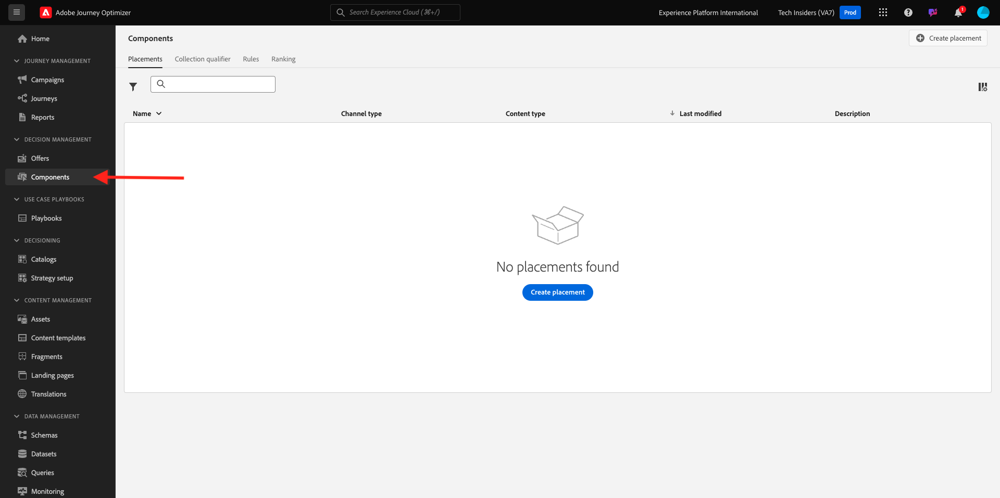
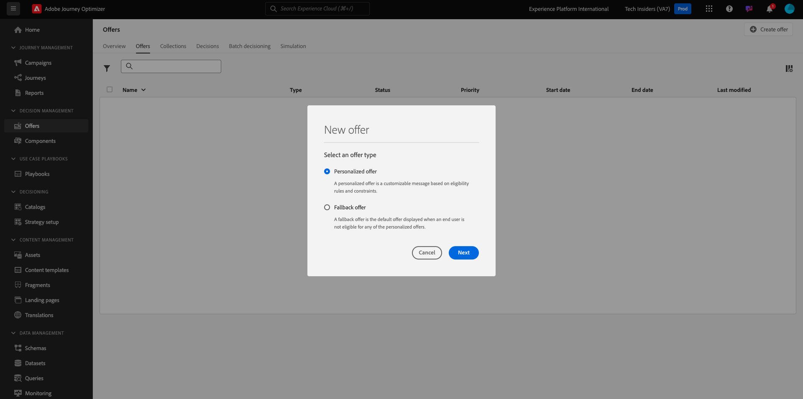

# 3.3.1 Offer decisioning 101

## 3.3.1.1 Terminologia

Para entender melhor sobre o Offer Decisioning, recomendamos que você leia a [visão geral](https://experienceleague.adobe.com/docs/journey-optimizer/using/offer-decisioniong/get-started-decision/starting-offer-decisioning.html?lang=en) sobre como o Serviço de Aplicativos do Offer Decisioning funciona com o Adobe Experience Platform.

Ao trabalhar com o Offer Decisioning, é necessário compreender os seguintes conceitos:

| Termo | Explicação |
| ------------------------- | -------------------------------------------------------------------------------------------------------------------------------------------------------------------------------------------------------------------------------------------------------- |
| **Oferta** | Uma oferta é uma mensagem de marketing que pode ter regras associadas que especificam quem está qualificado para ver a oferta. Uma oferta tem um status: rascunho, aprovado ou arquivado. |
| **Posicionamento** | A combinação de local (ou Tipo de canal) e contexto (ou Tipo de conteúdo) em que uma oferta é exibida para um usuário final. Efetivamente, é a combinação de Texto, HTML, Imagem, JSON em canais móveis, Web, Social, de Mensagens instantâneas e não digitais. |
| **Regra** | A lógica que define e controla a qualificação dos usuários finais para uma oferta. |
| **Oferta personalizada** | Uma mensagem de marketing personalizável com base em regras de elegibilidade e restrições. |
| **Oferta substituta** | A oferta padrão exibida quando um usuário final não está qualificado para nenhuma das ofertas na coleção usada. |
| **Limite** | Usado em uma definição de oferta para definir quantas vezes uma oferta pode ser apresentada no total e para um usuário específico. |
| **Prioridade** | Nível para determinar a classificação de prioridade de um conjunto de resultados de ofertas. |
| **Coleção** | Usado para filtrar um subconjunto de ofertas da lista de ofertas personalizadas para acelerar o processo de offer decisioning. |
| **Decisão** | Uma combinação de um conjunto de ofertas, disposição e perfil para os quais o profissional de marketing deseja que o mecanismo de decisão forneça a melhor oferta. |
| **AEM Assets Essentials** | Uma experiência universal e centralizada para armazenar, localizar e selecionar ativos nas soluções da Adobe Experience Cloud e da Adobe Experience Platform. |

{style="table-layout:auto"}

## 3.3.1.2 Offer decisioning

Faça login no Adobe Journey Optimizer em [Adobe Experience Cloud](https://experience.adobe.com). Clique em **Journey Optimizer**.

Você será redirecionado para a exibição **Página inicial** no Journey Optimizer. Primeiro, verifique se você está usando a sandbox correta. A sandbox a ser usada é chamada `--aepSandboxName--`. Para alterar a sandbox, clique em **Produção (VA7)** e selecione a sandbox na lista. Neste exemplo, a sandbox é chamada de **AEP Enablement FY22**. Você estará na exibição **Página inicial** da sua sandbox `--aepSandboxName--`.

No menu esquerdo, clique em **Ofertas**. Agora você verá o menu Ofertas, que contém itens como Ofertas, Coleções e Decisões.

Clique em **Componentes**. Agora você verá o menu Ofertas, que contém itens como Posicionamentos, Tags, Regras e Classificações.

## 3.3.1.3 Posicionamentos

Vá para **Posicionamentos**.

Na guia **Posicionamentos**, é possível definir seus posicionamentos para as ofertas. Ao definir uma decisão, o posicionamento define onde a oferta resultante será exibida (Tipo de canal) e em que forma ou formulário (Tipo de conteúdo).

Se você não vir nenhum posicionamento na instância do Adobe Experience Platform, crie-os conforme indicado abaixo e na captura de tela.

| Nome | Tipo de canal | Tipo de conteúdo |
| ---------------------- | ------------ | ------------ |
| **Não digital - Texto** | Não digital | Texto |
| **Web - JSON** | Web | JSON |
| **Web - HTML** | Web | HTML |
| **Web - Texto** | Web | Texto |
| **Web - Imagem** | Web | Imagem |
| **Email - JSON** | Email | JSON |
| **Email - HTML** | Email | HTML |
| **Email - Texto** | Email | Texto |
| **Email - Imagem** | Email | Imagem |

{style="table-layout:auto"}

**Observação**: não altere nada para os posicionamentos já disponíveis.

Clique em qualquer posicionamento para visualizar suas configurações.

Agora você verá todos os campos do Posicionamento:

- **Nome** do posicionamento
- **ID de posicionamento**
- **Tipo de canal** para o Posicionamento
- **Tipo de conteúdo** do Posicionamento, que pode ser **Texto**, **HTML**, **Imagem** ou **JSON**
- Campo **Descrição** permitindo adicionar descrição adicional ao Posicionamento

## 3.3.1.4 Regras de decisão

Uma Regra (também chamada de regra de elegibilidade) é equivalente a um **Segmento**. Uma regra é, na verdade, um segmento em si, com a única diferença de que uma regra pode ser usada com uma oferta para fornecer a melhor oferta a um perfil no Adobe Experience Platform.

Como você já sabe como definir Segmentos com base nos módulos de ativação anteriores, vamos rever rapidamente o Ambiente de segmentação:

Vá para **Regras**. Clique em **+ Criar regra**.

Em seguida, você verá o ambiente de Segmentação do Adobe Experience Platform.

Agora é possível acessar todos os campos que fazem parte do Esquema de união para o Perfil do cliente em tempo real e criar qualquer regra.

Também é interessante saber que você pode simplesmente reutilizar segmentos já definidos no Adobe Experience Platform acessando **Públicos-alvo** > ``--aepTenantId--``.

Você verá isto:

Se desejar, agora é possível configurar suas próprias Regras. Para este exercício, você precisará de duas regras:

- todos - Clientes do sexo masculino
- all - Clientes do sexo feminino

Se essas regras ainda não existirem, crie-as. Se já existirem, use essas regras e não crie novas.

O atributo a ser usado para criar a regra é **Perfil Individual XDM** > **Pessoa** > **Sexo**.

Como exemplo, aqui está a definição de regra para a regra **todos - Clientes do sexo masculino**:

Como exemplo, aqui está a definição de regra para a regra **todas - Clientes do sexo feminino**:

## 3.3.1.5 Ofertas

Vá para **Ofertas** e selecione **Ofertas**. Clique em **+ Criar oferta**.

Você então verá esse pop-up.

Não criar nenhuma oferta agora. Você fará isso no próximo exercício.

Agora você verá que há dois tipos de ofertas:

- Ofertas personalizadas
- Ofertas substitutas

Uma Oferta personalizada é um conteúdo específico que deve ser mostrado em uma situação específica. Uma Oferta personalizada é criada especificamente para fornecer uma experiência pessoal e contextual se critérios específicos forem atendidos.

Uma Oferta substituta é uma oferta exibida se os critérios para Ofertas personalizadas não forem atendidos.

## 3.3.1.6 Decisões

Uma decisão combina posicionamentos, uma coleção de ofertas personalizadas e uma oferta de fallback a ser usada pelo mecanismo do Offer Decisioning para encontrar a melhor oferta para um perfil específico, com base em cada uma das características de oferta personalizadas individuais, como prioridade, restrição de elegibilidade e limite total / usuário.

Para configurar sua **Decisão**, clique em **Decisões**.

No próximo exercício, você configurará suas próprias ofertas e decisões.

Próxima etapa: [3.3.2 Configurar as Ofertas e a Decisão](./ex2.md)

[Voltar ao módulo 3.3](./offer-decisioning.md)

[Voltar a todos os módulos](./../../../overview.md)
