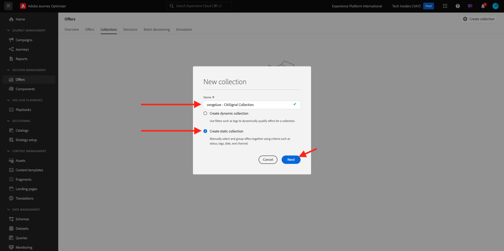
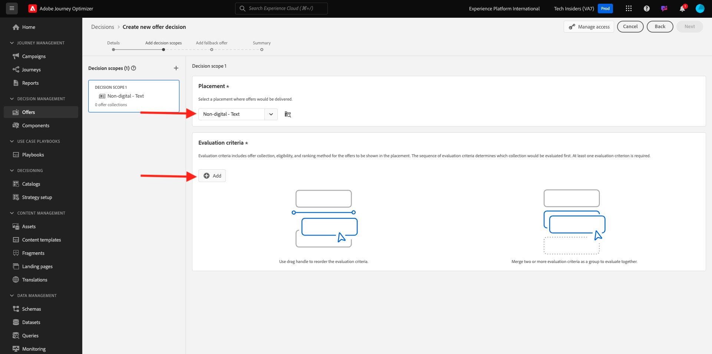

# 3.3.2 Configurar as ofertas e a decisão

## 3.3.2.1 Criar suas ofertas personalizadas

Neste exercício, você criará quatro **Ofertas personalizadas**. Estes são os detalhes a serem considerados ao criar essas ofertas:

| Nome | Date Range | Link de imagem para email | Link de imagem para a Web | Texto | Prioridade | Elegibilidade | Idioma |
|-----|------------|----------------------|--------------------|------|:--------:|--------------|:-------:|
| `--aepUserLdap-- - Nadia Elements Shell` | hoje - 1 mês depois | https://bit.ly/3nPiwdZ | https://bit.ly/2INwXjt | `{{ profile.person.name.firstName }}, 10% discount on Nadia Elements Shell` | 25 | all - Clientes do sexo feminino | Inglês (Estados Unidos) |
| `--aepUserLdap-- - Radiant Tee` | hoje - 1 mês depois | https://bit.ly/2HfA17v | https://bit.ly/3pEIdzn | `{{ profile.person.name.firstName }}, 5% discount on Radiant Tee` | 15 | all - Clientes do sexo feminino | Inglês (Estados Unidos) |
| `--aepUserLdap-- - Zeppelin Yoga Pant` | hoje - 1 mês depois | https://bit.ly/2IOaItW | https://bit.ly/2INZHZd | `{{ profile.person.name.firstName }}, 10% discount on Zeppelin Yoga Pant` | 25 | todos - Clientes do sexo masculino | Inglês (Estados Unidos) |
| `--aepUserLdap-- - Proteus Fitness Jackshirt` | hoje - 1 mês depois | https://bit.ly/330a43n | https://bit.ly/36USaQW | `{{ profile.person.name.firstName }}, 5% discount on Proteus Fitness Jackshirt` | 15 | todos - Clientes do sexo masculino | Inglês (Estados Unidos) |

{style="table-layout:auto"}

Faça login no Adobe Journey Optimizer em [Adobe Experience Cloud](https://experience.adobe.com). Clique em **Journey Optimizer**.

Você será redirecionado para a exibição **Página inicial** no Journey Optimizer. Primeiro, verifique se você está usando a sandbox correta. A sandbox a ser usada é chamada `--aepSandboxName--`. Para alterar a sandbox, clique em **Produção (VA7)** e selecione a sandbox na lista. Neste exemplo, a sandbox é chamada de **AEP Enablement FY22**. Você estará na exibição **Página inicial** da sua sandbox `--aepSandboxName--`.

No menu esquerdo, clique em **Ofertas** e vá para **Ofertas**. Clique em **+ Criar oferta**.

Você então verá esse pop-up. Selecione **Oferta personalizada** e clique em **Avançar**.

Agora você está na exibição **Detalhes**.

Nesse caso, você precisa configurar a oferta `--aepUserLdap-- - Nadia Elements Shell`. Use as informações na tabela acima para preencher os campos. Neste exemplo, o nome da Oferta personalizada é **vangeluw - Nadia Elements Shell**. Além disso, defina a **Data e hora de início** como ontem e defina a **Data e hora de término** como uma data em um mês a partir de agora.

Depois de concluído, você deve receber isto. Clique em **Next**.

Agora é necessário criar **Representações**. As representações são uma combinação de um **Posicionamento** e um ativo real.

Para **Representação 1**, selecione:

- Canal: Web
- Posicionamento: Web - Imagem
- Conteúdo: URL
- Local público: copie a URL da coluna **Link de Imagem para a Web** na tabela acima

Como alternativa, você pode selecionar **Biblioteca de ativos** para o conteúdo e clicar em **Procurar**.

Você verá um pop-up da Biblioteca da Assets, irá para a pasta **enablement-assets** e selecionará o arquivo de imagem **nadia-web.png**. Clique em **Selecionar**.

Você verá isto:

Clique em **+ Adicionar representação**.

Para **Representação 2**, selecione:

- Canal: Email
- Posicionamento: Email - Imagem
- Conteúdo: URL
- Local público: copie a URL da coluna **Link de Imagem para Email** na tabela acima

Como alternativa, você pode selecionar **Biblioteca de ativos** para o conteúdo e clicar em **Procurar**.

Você verá um pop-up da Biblioteca da Assets, irá para a pasta **enablement-assets** e selecionará o arquivo de imagem **nadia-email.png**. Clique em **Selecionar**.

Você verá isto:

Em seguida, clique em **+ Adicionar representação**.

Para **Representação 3**, selecione:

- Canal: não digital
- Posicionamento: Não digital - Texto

Em seguida, é necessário adicionar conteúdo. Nesse caso, isso significa adicionar o texto a ser usado como uma chamada para ação.

Clique em **Adicionar conteúdo**.

Você então verá esse pop-up.

Selecione **Texto personalizado** e preencha estes campos:

Examine o campo **Texto** da tabela acima e insira esse texto aqui, neste caso: `{{ profile.person.name.firstName }}, 10% discount on Nadia Elements Shell`.

Você também observará que pode selecionar qualquer atributo de perfil e incluí-lo como um campo dinâmico no texto da oferta. Neste exemplo, o campo `{{ profile.person.name.firstName }}` garantirá que o nome do cliente que receberá esta oferta será incluído no texto da oferta.

Você verá isso. Clique em **Salvar**.

Agora você tem isto. Clique em **Next**.

Você verá isto:

Selecione **Por regra de decisão definida** e clique no ícone **+** para adicionar a regra **todas - Clientes do sexo feminino**.

Você verá isso. Preencha a **Prioridade** conforme indicado na tabela acima. Clique em **Next**.

Você verá uma visão geral da sua nova **Oferta personalizada**.

Finalmente, clique em **Salvar e aprovar**.

Em seguida, você verá que sua Oferta personalizada recém-criada fica disponível na Visão geral das ofertas:

Você agora deve repetir os passos acima para criar as três outras ofertas personalizadas para os produtos Camiseta Radiant, Zeppelin Yoga e Camiseta fitness Proteus.

Quando terminar, sua tela **Visão geral das ofertas** para **Ofertas personalizadas** deverá mostrar todas as suas ofertas.

## 3.3.2.2 Criar sua oferta substituta

Depois de criar quatro Ofertas personalizadas, você deve configurar uma **Oferta substituta**.

Verifique se você está na exibição **Ofertas**:

Clique em **+ Criar oferta**.

Você então verá esse pop-up. Selecione **Oferta de fallback** e clique em **Avançar**.

Você verá isto:

Digite este nome para sua oferta substituta: `--aepUserLdap-- - Luma Fallback Offer`. Clique em **Next**.

Agora é necessário criar **Representações**. As representações são uma combinação de um **Posicionamento** e um ativo real.

Para **Representação 1**, selecione:

- Canal: Web
- Posicionamento: Web - Imagem
- Conteúdo: URL
- Local público: `https://bit.ly/3nBOt9h`

Como alternativa, você pode selecionar **Biblioteca de ativos** para o conteúdo e clicar em **Procurar**.

Você verá um pop-up da Biblioteca da Assets, irá para a pasta **enablement-assets** e selecionará o arquivo de imagem **spriteyogastraps-web.png**. Clique em **Selecionar**.

Você verá isto:

Para **Representação 2**, selecione:

- Canal: Email
- Posicionamento: Email - Imagem
- Conteúdo: URL
- Local público: `https://bit.ly/3nF4qvE`

Como alternativa, você pode selecionar **Biblioteca de ativos** para o conteúdo e clicar em **Procurar**.

Você verá um pop-up da Biblioteca da Assets, irá para a pasta **enablement-assets** e selecionará o arquivo de imagem **spriteyogastraps-email.png**. Clique em **Selecionar**.

Você verá isto:

Em seguida, clique em **+ Adicionar representação**.

Para **Representação 3**, selecione:

- Canal: não digital
- Posicionamento: Não digital - Texto

Em seguida, é necessário adicionar conteúdo. Nesse caso, significa adicionar o Link da imagem.

Clique em **Adicionar conteúdo**.

Você então verá esse pop-up.

Selecione **Texto personalizado** e preencha estes campos:

Insira o texto `{{ profile.person.name.firstName }}, discover our Sprite Yoga Straps!` e clique em **Salvar**.

Você verá isso. Clique em **Next**.

Você verá uma visão geral de sua nova **Oferta Substituta**. Clique em **Concluir**.

Finalmente, clique em **Salvar e aprovar**.

Na tela **Visão geral das ofertas**, você verá o seguinte:

## 3.3.2.3 Criar sua coleção

Uma Coleção é usada para **filtrar** um subconjunto de ofertas da lista de ofertas personalizadas e usá-la como parte de uma Decisão para acelerar o processo de decisão.

Ir para **Coleções**. Clique em **+ Criar coleção**.

Você então verá esse pop-up. Configure sua coleção desta forma. Clique em **Next**.

- Nome da coleção: use `--aepUserLdap-- - Luma Collection`
- Selecione **Criar coleção estática**.

Na próxima tela, selecione as quatro **Ofertas personalizadas** que você criou no exercício anterior. Clique em **Salvar**.

Agora você verá isto:

## 3.3.2.4 Crie sua decisão

Uma decisão combina disposições, uma coleção de ofertas personalizadas e uma oferta substituta a ser usada pelo mecanismo do Offer Decisioning para encontrar a melhor oferta para um perfil específico, com base em cada uma das características de oferta personalizadas individuais, como prioridade, restrição de elegibilidade e limite total/usuário.

Para configurar sua **Decisão**, vá para **Decisões**. Clique em **+ Criar atividade**.

Você verá isto:

Preencha os campos assim. Clique em **Next**.

- Nome: `--aepUserLdap-- - Luma Decision`
- Data e hora de início: ontem
- Data e hora de término: hoje + 1 mês

Na próxima tela, você precisa adicionar disposições aos escopos de decisão. Você precisará criar escopos de decisão para os posicionamentos **Web - Imagem**, **Email - Imagem** e **Não digital - Texto**.

Primeiro, crie o escopo de decisão para **Não digital - Texto** selecionando esse posicionamento na lista suspensa. Em seguida, clique no botão **Adicionar** para adicionar critérios de avaliação.

Selecione sua coleção `--aepUserLdap-- - Luma Collection` e clique em **Adicionar**.

Você verá isso. Clique no botão **-** para adicionar um novo escopo de decisão.

Selecione a **Web - Image** de posicionamento e adicione sua coleção `--aepUserLdap-- - Luma Collection` nos critérios de avaliação. Em seguida, clique no botão **+** novamente para adicionar um novo escopo de decisão.

Selecione o posicionamento **Email - Image** e adicione sua coleção `--aepUserLdap-- - Luma Collection` nos critérios de avaliação. Em seguida, clique em **Avançar**.

Agora é necessário selecionar sua **Oferta Substituta**, que se chama `--aepUserLdap-- - Luma Fallback Offer`. Clique em **Next**.

Revise sua decisão. Clique em **Concluir**.

No pop-up, clique em **Salvar e ativar**.

E, finalmente, você verá sua decisão na visão geral:

Você configurou sua decisão com êxito. Sua decisão agora está ativa e pode ser usada para fornecer ofertas otimizadas e personalizadas aos seus clientes, em tempo real.

Próxima Etapa: [3.3.3 Prepare a propriedade do Cliente da Coleção de Dados e a configuração do SDK da Web para o Offer Decisioning](./ex3.md)

[Voltar ao módulo 3.3](./offer-decisioning.md)

[Voltar a todos os módulos](./../../../overview.md)
