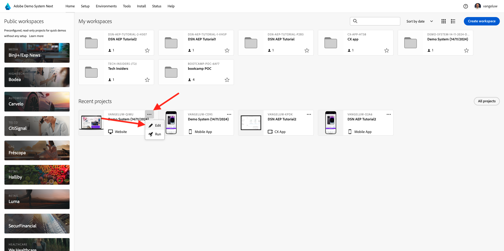
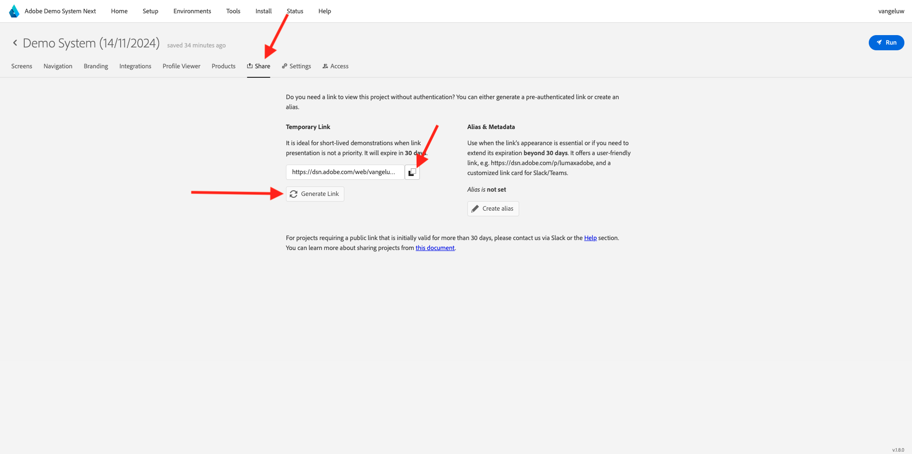

# 3.3.4 Combinar Adobe Target e Offer Decisioning

## 3.3.4.1 Coletar o link compartilhável do projeto de demonstração

Para carregar o projeto do site de demonstração no Adobe Target, primeiro é necessário coletar um link especial que permitirá à Adobe Target carregar o projeto do site de demonstração.

Para fazer isso, vá para [https://builder.adobedemo.com/projects](https://builder.adobedemo.com/projects). Depois de fazer logon com sua Adobe ID, você verá isso. Clique no projeto do site para abri-lo.

Agora vocês verão isto. Clique em **Compartilhar**.

Clique em **Gerar link** e copie o link para a área de transferência.

Vá para [https://bitly.com](https://bitly.com), cole o link copiado e clique em **Encurtar**. Agora você receberá um link encurtado, que tem esta aparência: `https://bit.ly/3JxN7aG`. Você precisará desse link no próximo exercício.

## 3.3.4.2 Coletar

Agora vá para a página inicial do Adobe Experience Cloud em [https://experiencecloud.adobe.com/](https://experiencecloud.adobe.com/). Clique em **Target**.

Na página inicial do **Adobe Target**, você verá todas as atividades existentes.

Clique em **+ Criar atividade** para criar uma nova Atividade.

Selecione **Direcionamento de experiência**.

Agora selecione **Visual** e cole seu link encurtado no campo **Inserir URL da Atividade**. Clique em **Next**.

Você verá seu projeto de site de demonstração ser carregado no Visual Experience Composer.

Vá para o modo **Procurar** e clique em **Permitir tudo** no pop-up de consentimento do cookie.

Clique na área que contém o texto **Categorias em destaque**. Clique em **Inserir antes** e selecione **Decisão de Oferta**.

Você então verá esse pop-up. Selecione sua sandbox `--aepSandboxName--` e selecione o posicionamento **Web - Image**.

Em seguida, selecione sua decisão `--aepUserLdap-- - Luma Decision`. Clique em **Salvar**.

Você verá isso. Certifique-se de adicionar uma regra de modelo adicional **URL** **contém** **nome-do-seu-projeto**. Clique em **Salvar**.

Você verá isso. Clique em **Next**.

Digite um nome para sua oferta, use este nome: `--aepUserLdap-- - XT with Offers (VEC)`. Clique em **Next**.

Você verá isso. Defina sua **Métrica de meta** conforme indicado. Clique em **Salvar e fechar**.

Sua oferta foi criada e está sendo publicada.

Depois que a oferta for publicada, você poderá habilitá-la.

Próxima Etapa: [3.3.5 Use sua decisão em um email e sms](./ex5.md)

[Voltar ao módulo 3.3](./offer-decisioning.md)

[Voltar a todos os módulos](./../../../overview.md)
