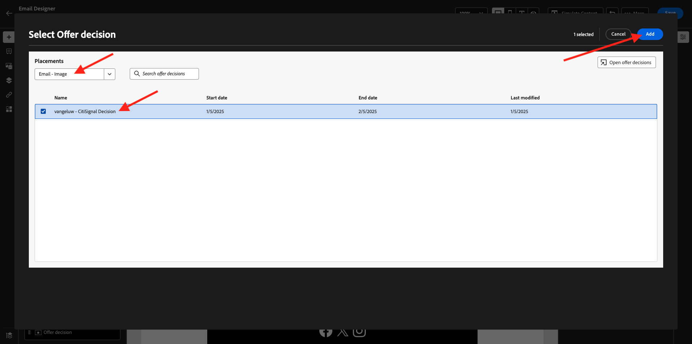

# 3.3.5 Use sua decisão em um email

Neste exercício, você usará sua decisão para personalizar o delivery de um email e SMS.

Vá para **Jornada**. Localize a jornada que você criou no exercício 7.2, denominado `--aepUserLdap-- - Account Creation Journey`. Clique na jornada para abri-la.

Você verá isso. Clique em **Criar uma nova versão**.

Clique em **Criar uma nova versão**.

Clique na ação **Email** e em **Editar conteúdo**.

Em seguida, você verá o painel da mensagem. Clique em **Designer de email**.

Você verá isso.

Você verá isso. Arraste um novo componente de estrutura **1:1 coluna** para a tela.

No menu, vá para **Componentes de Conteúdo**. Selecione o componente **Offer decision** e arraste e solte esse componente no espaço reservado de oferta de conteúdo do email, conforme indicado. Em seguida, clique em **Adicionar**.

Selecione o tipo de posicionamento que deseja incluir no email. No menu suspenso **Posicionamentos**, selecione **Email - Imagem** e escolha sua decisão `--aepUserLdap-- - Luma Decision`. Clique em **Adicionar**.

Agora você vê todas as ofertas personalizadas e a oferta substituta sendo visualizada no designer de email. Clique em **Simular Conteúdo** para visualizar a mensagem de email com um perfil de cliente real.

Comece identificando qual perfil você deseja usar para a visualização. Selecione o namespace **email** e insira o endereço de email de um perfil de cliente que você criou no site de demonstração. Em seguida, clique em **Visualizar**.

Depois que o email for exibido e a oferta for exibida corretamente, clique no botão **Fechar**.

Finalmente, clique em **Salvar**.

Agora, clique na seta para voltar à tela anterior.

Você verá isso. Clique na seta no canto superior esquerdo para voltar à jornada.

Clique em **Ok** para fechar sua ação de **Email**.

Clique em **Publish** para publicar sua jornada atualizada.

Confirme clicando em **Publish** novamente.

Sua mensagem foi publicada.

Ao criar uma nova conta no site de demonstração, você receberá este email:

Você concluiu este exercício.

Próxima etapa: [3.3.6 Teste sua decisão usando a API](./ex6.md)

[Voltar ao módulo 3.3](./offer-decisioning.md)

[Voltar a todos os módulos](./../../../overview.md)
