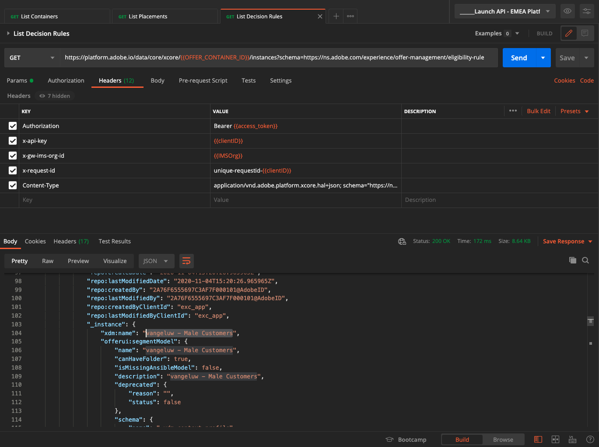

# 3.3.6 Testar sua decisão usando a API

## 3.3.6.1 Trabalhar com a API do Offer Decisioning usando o Postman

Baixe [esta Coleção do Postman para Offer Decisioning](./../../../assets/postman/postman_offer-decisioning.zip) na área de trabalho e descompacte-a. Você terá isto:

Agora você tem este arquivo na área de trabalho:

- [!UICONTROL _Módulo 14- Serviço de Decisão.postman_collection.json]

No [Exercício 2.1.3 - Autenticação do Postman para o Adobe I/O](./../../../modules/rtcdp-b2c/module2.1/ex3.md), você instalou o Postman. Você precisará usar o Postman novamente para este exercício.

Abra o Postman. Clique em **[!UICONTROL Importar]**.

Clique em **[!UICONTROL Carregar arquivos]**.

Selecione o arquivo **[!UICONTROL _Module 14- Decisioning Service.postman_collection.json]** e clique em **[!UICONTROL Abrir]**.

Em seguida, você terá essa coleção disponível no Postman.

Agora você tem tudo o que precisa no Postman para começar a interagir com o Adobe Experience Platform por meio das APIs.

### 3.3.6.1.1 Listar contêineres

Clique para abrir a solicitação **[!UICONTROL GET - Listar Contêineres]**.

Em **[!UICONTROL Params]**, você verá isto:

- propriedade: `_instance.parentName==aepenablementfy22`

Nesse parâmetro, **[!UICONTROL aepenablementfy22]** é o nome da sandbox usada no Adobe Experience Platform. A sandbox que você deve usar é `--aepSandboxName--`. Substituir o texto **[!UICONTROL aepenablementfy22]** por `--aepSandboxName--`.

Depois de substituir o nome da sandbox, clique em **[!UICONTROL Enviar]**.

Essa é a resposta, que mostra o container de oferta da sandbox especificada. Copie o **[!UICONTROL container instanceId]** conforme indicado abaixo e anote-o em um arquivo de texto no seu computador. Você precisará usar esta **[!UICONTROL instanceId do contêiner]** para o próximo exercício!

### 3.3.6.1.2 Posicionamentos de lista

Clique para abrir a solicitação **[!UICONTROL GET - Listar Posicionamentos]**. Clique em **[!UICONTROL Enviar]**.

Agora você está vendo todos os posicionamentos disponíveis no seu contêiner de ofertas. Os posicionamentos exibidos foram definidos na interface do usuário do Adobe Experience Platform, como você pode ver no [Exercício 3.3.1.3](./ex1.md).

### 3.3.6.1.3 Lista de regras de decisão

Clique para abrir a solicitação **[!UICONTROL GET - Listar Regras de Decisão]**. Clique em **[!UICONTROL Enviar]**.

Na resposta, você verá as Regras de decisão definidas na interface do usuário do Adobe Experience Platform, como pode ver no [Exercício 3.3.1.4](./ex1.md).

### 3.3.6.1.4 Listar Ofertas Personalizadas

Clique para abrir a solicitação **[!UICONTROL GET - Listar Ofertas Personalizadas]**. Clique em **[!UICONTROL Enviar]**.

Na resposta, você verá as Ofertas personalizadas definidas na interface do usuário do Adobe Experience Platform no [Exercício 3.3.2.1](./ex2.md).

### 3.3.6.1.5 Ofertas substitutas de lista

Clique para abrir a solicitação **[!UICONTROL GET - Listar Ofertas Substitutas]**. Clique em **[!UICONTROL Enviar]**.

Na resposta, você verá a Oferta de Fallback que definiu na interface do usuário do Adobe Experience Platform no [Exercício 3.3.2.2](./ex2.md).

### 3.3.6.1.6 Coleções de listas

Clique para abrir a solicitação **[!UICONTROL GET - Listar Coleções]**.

Na resposta, você verá a Coleção que definiu na interface do usuário do Adobe Experience Platform no [Exercício 3.3.2.3](./ex2.md).

### 3.3.6.1.7 Obtenha ofertas detalhadas para o perfil do cliente

Clique para abrir a solicitação **[!UICONTROL POST - Obtenha ofertas detalhadas para o Perfil do cliente]**. Essa solicitação é semelhante à anterior, mas retornará detalhes como URLs de imagem, texto etc.

Para esta solicitação, semelhante ao exercício anterior que tem requisitos semelhantes, é necessário fornecer os valores de **[!UICONTROL xdm:placementId]** e **[!UICONTROL xdm:activityId]** para recuperar os detalhes específicos da oferta para um cliente.

O campo **[!UICONTROL xdm:activityId]** precisa ser preenchido. Você pode recuperá-lo na interface do usuário do Adobe Experience Platform, conforme indicado abaixo.

O campo **[!UICONTROL xdm:placementId]** precisa ser preenchido. Você pode recuperá-lo na interface do usuário do Adobe Experience Platform, conforme indicado abaixo. No exemplo abaixo, você pode ver o placementId para o posicionamento **[!UICONTROL Web - Image]**.

Vá para **[!UICONTROL Body]** e insira o endereço de email do cliente para o qual você gostaria de solicitar uma oferta. Clique em **[!UICONTROL Enviar]**.

Por fim, você verá o resultado de que tipo de oferta personalizada e quais ativos precisam ser exibidos para esse cliente.

Você concluiu este exercício agora.

Próxima etapa: [Resumo e benefícios](./summary.md)

[Voltar ao módulo 3.3](./offer-decisioning.md)

[Voltar a todos os módulos](./../../../overview.md)
