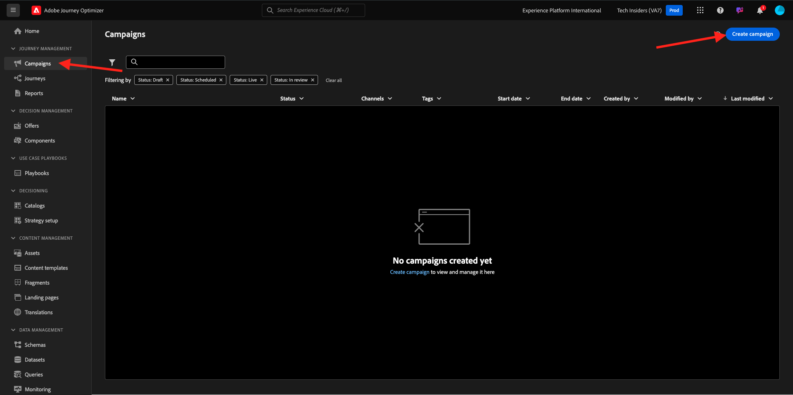

# 3.4.2 Configurar uma jornada de boletim informativo baseada em lote

Faça login no Adobe Journey Optimizer em [Adobe Experience Cloud](https://experience.adobe.com). Clique em **Journey Optimizer**.

Você será redirecionado para a exibição **Página inicial** no Journey Optimizer. Primeiro, verifique se você está usando a sandbox correta. A sandbox a ser usada é chamada `--aepSandboxName--`. Para alterar a sandbox, clique em **Produção (VA7)** e selecione a sandbox na lista. Neste exemplo, a sandbox é chamada de **AEP Enablement FY22**. Você estará na exibição **Página inicial** da sua sandbox `--aepSandboxName--`.

## 3.4.2.1 Criar jornada de informativo

Agora você criará uma jornada baseada em lote. Ao contrário da jornada baseada em eventos do exercício anterior, que depende de eventos de experiência de entrada, entradas de público-alvo ou saídas para acionar uma jornada para um cliente específico, as jornadas baseadas em lote têm como alvo um público-alvo inteiro, uma vez com conteúdo exclusivo, como boletins informativos, promoções únicas ou informações genéricas ou periodicamente com conteúdo semelhante enviado regularmente, como por exemplo campanhas de aniversário e lembretes.

No menu, vá para **Jornadas** e clique em **Criar Jornada**.

No lado direito, você verá um formulário em que precisa especificar o nome e a descrição da jornada. Insira os seguintes valores:

- **Nome**: `--aepUserLdap-- - Newsletter Journey`. Por exemplo: **vangeluw - Jornada do informativo**.
- **Descrição**: informativo mensal

Clique em **Ok**.

Em **Orquestração**, arraste e solte **Ler público-alvo** na tela. Isso significa que, uma vez publicada, a jornada começará recuperando todo o público-alvo, que se tornará o público-alvo da jornada e da mensagem. Clique em **Selecionar uma audiência**.

No pop-up **Escolher um público-alvo**, pesquise pelo seu ldap e selecione o público-alvo criado no [Módulo 2.3 - CDP em tempo real - Criar um público-alvo e executar a ação](./../../../modules/rtcdp-b2c/module2.3/real-time-cdp-build-a-segment-take-action.md) chamada `--aepUserLdap-- - Interest in Galaxy S24`. Clique em **Salvar**.

Clique em **Ok**.

No menu esquerdo, localize a seção **Ações** e arraste e solte na tela uma ação de **Email**.

Defina a **Categoria** como **Marketing** e selecione uma superfície de email que permita o envio de emails. Nesse caso, a superfície de email a ser selecionada é **Email**. Verifique se as caixas de seleção para **Cliques no email** e **aberturas de email** estão habilitadas.

A próxima etapa é criar a mensagem. Para fazer isso, clique em **Editar conteúdo**.

Agora vocês podem ver isso. Clique no campo de texto **Linha de assunto**.

Digite este texto para a linha de assunto: `Luma Newsletter - your monthly update has arrived.`. Clique em **Salvar**.

Você estará de volta aqui. Clique em **Enviar Designer por email** para começar a criar o conteúdo do email.

Você verá isso. Clique em **Importar HTML**.

Na tela pop-up, será necessário arrastar e soltar o arquivo HTML do email. Você pode encontrar o modelo de HTML [aqui](./../../../assets/html/ajo-newsletter.html.zip). Baixe o arquivo zip com o modelo de HTML para o computador local e descompacte em seu desktop.

Arraste e solte o arquivo **ajo-newsletter.html** para carregá-lo no Journey Optimizer. Clique em **Importar**.

Esse conteúdo de email está pronto para ser enviado, pois tem toda a personalização, imagens e texto esperados. Somente o espaço reservado da oferta fica vazio.

Você pode receber uma mensagem de erro: **Erro ao tentar buscar ativos**. Isso é vinculado à imagem no email.

Se você receber este erro, selecione a imagem e clique no botão **Editar imagem**.

Clique em **Assets Essentials** para voltar para a biblioteca do AEM Assets Essentials.

Você então verá esse pop-up. Navegue até a pasta **enablement-assets** e selecione a imagem **luma-newsletterContent.png**. Clique em **Selecionar**.

O email básico do informativo agora está pronto. Clique em **Salvar**.

Volte para o painel da mensagem clicando na **seta** ao lado do texto da linha de assunto no canto superior esquerdo.

Clique na seta no canto superior esquerdo para voltar à jornada.

Clique em **Ok** para fechar sua ação de email.

A jornada do informativo agora está pronta para ser publicada. Antes de fazer isso, observe a seção **Agenda**, na qual você pode alternar essa jornada de campanha única para recorrente. Clique no botão **Agendar**.

Você verá isso. Selecione **Uma Vez**.

Selecione uma data e hora na próxima hora para testar a jornada. Clique em **Ok**.

>[!NOTE]
>
>A data e a hora de envio da mensagem devem estar dentro de mais de uma hora.

Clique em **Publish**.

Clique novamente em **Publish**.

A jornada básica do informativo agora está publicada. A mensagem de email do informativo será enviada conforme você a definiu na programação, e a jornada será interrompida assim que o último email for enviado.

Você concluiu este exercício.

Próxima Etapa: [3.4.3 Aplicar personalização em uma mensagem de email](./ex3.md)

[Voltar ao módulo 3.4](./journeyoptimizer.md)

[Voltar a todos os módulos](../../../overview.md)
