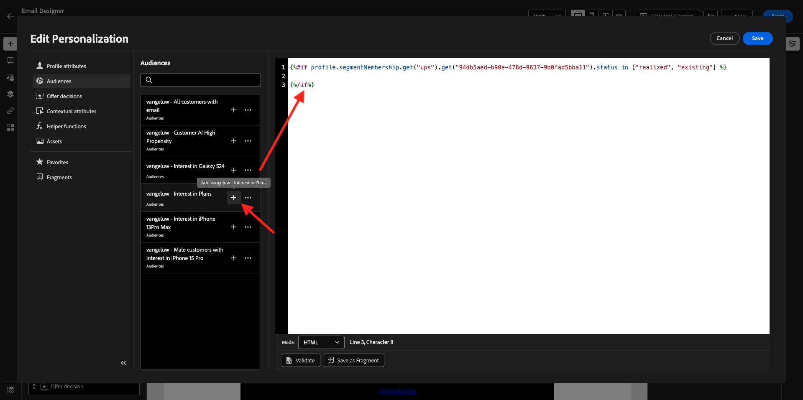

# 3.4.3 Aplicar personalização em uma mensagem de email

Faça login no Adobe Experience Cloud em [Adobe Experience Cloud](https://experience.adobe.com). Clique em **Adobe Journey Optimizer**.

Você será redirecionado para a exibição **Página inicial** no Journey Optimizer. Antes de continuar, você precisa selecionar uma **sandbox**. A sandbox a ser selecionada é chamada ``--aepTenantId--``.

## 3.4.3.1 Personalização baseada em segmentos

Neste exercício, você melhorará a mensagem de email do seu informativo com um texto personalizado com base na associação do segmento.

Vá para **Jornada**. Localize a jornada do informativo criada no exercício anterior. Pesquisar por `--aepUserLdap-- - Newsletter`. Clique na jornada para abri-la.

Você verá isso. Clique em **Duplicate**.

Clique em **Duplicate**.

Selecione sua ação **Email** e clique em **Editar conteúdo**.

Clique em **Designer de email**.

Você verá isso.

Abra os **Componentes do Conteúdo** e arraste um componente **Texto** abaixo do conteúdo do informativo atual.

Selecione todo o texto padrão e exclua. Em seguida, clique no botão **Adicionar personalização** na barra de ferramentas.

Você verá isto:

No menu esquerdo, clique em **Associações de segmento**.

>[!NOTE]
>
>Se você não conseguir encontrar o segmento nessa lista, role para baixo um pouco para encontrar instruções sobre como recuperar a ID do segmento manualmente.

Selecione o segmento `Luma - Women's Category Interest` e clique no ícone **+**, que deve ter esta aparência:

Em seguida, você deve deixar a primeira linha como está e substituir as linhas 2 e 3 por este código:

``
    Psssst... a private sale in the women category will launch soon, we will keep you posted

    Thanks for taking the time to read our newsletter. Here is a 10% promo code to use on the website: READER10

``

Você terá isto:

Clique em **Validar** para verificar se o código está correto. Clique em **Salvar**.

Agora você pode salvar esta mensagem clicando no botão **Salvar** no canto superior direito. Em seguida, clique em **Simular conteúdo**.

Selecione um dos perfis que você criou como parte deste tutorial e clique em **Visualizar**. Você verá o resultado da sua configuração.

Você verá isso. Em seguida, clique em **Fechar**.

Volte para o painel da mensagem clicando na **seta** ao lado do texto da linha de assunto no canto superior esquerdo.

Clique na seta no canto superior esquerdo para voltar à jornada.

Clique em **Ok** para fechar sua ação de email.

Altere seu **Calendário** para **Uma Vez** e defina uma **Data/Hora**. Clique em **Ok**.

>[!NOTE]
>
>A data e a hora de envio da mensagem devem estar dentro de mais de uma hora.

Clique no botão **Publish** na jornada.

Na janela pop-up, clique novamente em **Publish**.

A jornada básica do informativo agora está publicada. A mensagem de email do informativo será enviada de acordo com a sua programação. A jornada será interrompida assim que o último email for enviado.

Você concluiu este exercício.

Próxima Etapa: [3.4.4 Configurar e usar notificações por push para iOS](./ex4.md)

[Voltar ao módulo 3.4](./journeyoptimizer.md)

[Voltar a todos os módulos](../../../overview.md)
