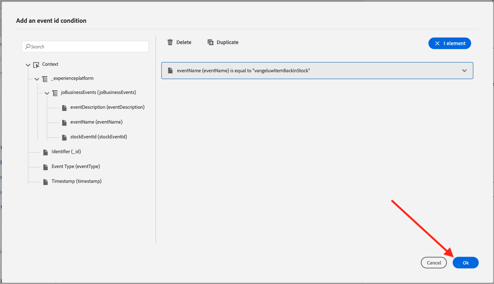
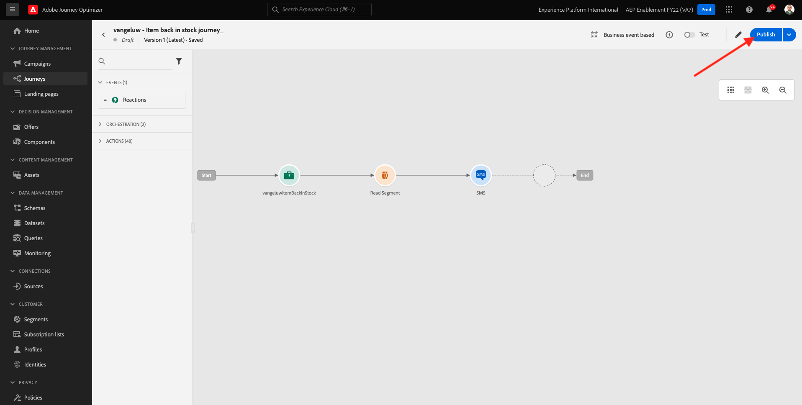
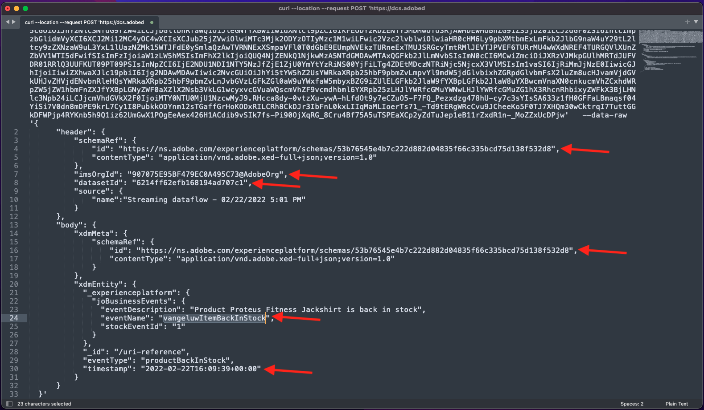
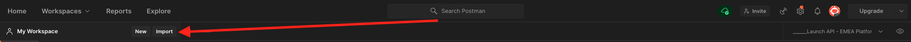

# 3.4.5 Criar uma jornada de eventos comerciais

Faça login no Adobe Journey Optimizer em [Adobe Experience Cloud](https://experience.adobe.com). Clique em **Journey Optimizer**.


Você será redirecionado para a exibição **Página inicial** no Journey Optimizer. Primeiro, verifique se você está usando a sandbox correta. A sandbox a ser usada é chamada `--aepSandboxName--`. Para alterar a sandbox, clique em **Produção (VA7)** e selecione a sandbox na lista. Neste exemplo, a sandbox é chamada de **AEP Enablement FY22**. Você estará na exibição **Página inicial** da sua sandbox `--aepSandboxName--`.


## 3.4.5.1 Criar um evento comercial

No menu esquerdo, clique em **Configurações**. Clique no botão **Gerenciar** dentro do cartão **Eventos**.


Os eventos comerciais são um novo tipo de evento que pode ser criado no Journey Optimizer. Ao contrário dos eventos **Unitários** criados em módulos anteriores, os eventos comerciais não são acionados pelo cliente, mas pela organização. Agora você criará seu evento comercial.

Clique em **Criar Evento**.


Insira os seguintes valores no formulário de criação do Evento:

- **Nome**: `--aepUserLdap--ItemBackInStock`. Por exemplo: **vangeluwItemBackInStock**
- **Descrição**: este evento é disparado quando um produto volta ao estoque
- **Tipo**: selecione **Negócios** na lista suspensa


Para o Esquema, selecione **Sistema de demonstração - Esquema de evento para Eventos comerciais do JO (Global v1.1) v.1**. Agora é necessário selecionar os campos no esquema que são necessários para o nosso caso de uso.


Siga estas etapas:

Clique no ícone de **lápis** no campo onde está escrito **1 campo selecionado**.


Selecione todos os campos disponíveis no esquema e clique em **OK**.


Para a condição: é necessário especificar quais registros neste esquema acionarão o evento comercial.

Siga estas etapas:

Clique no ícone de **lápis** no campo em que diz **Adicionar uma condição**.


No lado esquerdo, expanda o objeto `--aepTenantId--`, expanda o objeto **joBusinessEvents** e arraste e solte o campo **eventName** na tela.


Para o campo **eventName**, insira o seguinte valor: `--aepUserLdap--ItemBackInStock`. Por exemplo: vangeluwItemBackInStock.
Clique em **OK**.


Clique em **OK**.



Por fim, seu formulário de criação de evento deve ter esta aparência. Clique em **Salvar** para salvar seu evento comercial.


## 3.4.5.2 Criar uma jornada de eventos comerciais

Agora você pode aproveitar esse evento comercial e a mensagem dentro de uma jornada. Vá para **Jornada**. Clique em **Criar Jornada**.


No lado direito, você verá um formulário em que precisa especificar o nome e a descrição da jornada. Insira os seguintes valores:

- **Nome**: `--aepUserLdap-- - Item back in stock journey`. Por exemplo: vangeluw - Item de volta na jornada de estoque
- **Descrição**: esta jornada envia um SMS quando um item está de volta no estoque para um visitante que demonstrou interesse.

Clique em **OK**.


No menu esquerdo, em **Eventos**, pesquise por seu ldap. Você encontrará o evento comercial `--aepUserLdap--ItemBackInStock` criado anteriormente. Arraste e solte esse evento na tela, pois ele será o ponto inicial da jornada.


Como você pode ver, uma atividade **Ler público-alvo** foi automaticamente adicionada à tela. Isso ocorre porque os eventos comerciais só enviam um acionador para a jornada ler um público específico, que recuperará a lista de perfis dessa jornada.

Clique na atividade **Ler público**.
A configuração **Ler Público** espera que você selecione o público que deseja notificar sobre o evento comercial que acabou de acontecer. Clique no campo **Selecionar um público-alvo**.


No pop-up **Escolher um público-alvo**, pesquise pelo seu ldap e selecione o público-alvo criado no [Módulo 2.3 - CDP em tempo real - Criar um público-alvo e executar a ação](./../../../modules/rtcdp-b2c/module2.3/real-time-cdp-build-a-segment-take-action.md) chamada `--aepUserLdap-- - Interest in Galaxy S24`. Clique em **Salvar**.


Em seguida, clique em **Ok**.


A próxima etapa é arrastar e soltar a ação que queremos executar nessa jornada. Selecione a ação **SMS** e arraste-a e solte-a depois da condição que você acabou de adicionar.


Defina a **Categoria** como **Marketing** e selecione uma superfície de sms que permita enviar sms. Nesse caso, a superfície de email a ser selecionada é **SMS**.


A próxima etapa é criar a mensagem. Para fazer isso, clique em **Editar conteúdo**.


Agora você verá o painel da mensagem, onde é possível configurar o texto do SMS. Clique na área **Compor mensagem** para criar sua mensagem.


Digite o seguinte texto: `Hi {{profile.person.name.firstName}}, the Proteus Fitness Jackshirt is back in stock at Luma.`. Clique em **Salvar**.


Volte para o painel da mensagem clicando na **seta** ao lado do texto da linha de assunto no canto superior esquerdo.


Agora você verá sua ação de SMS concluída. Clique em **Ok**.


Sua jornada está pronta para ser publicada. Clique em **Publish**.



Clique novamente em **Publish**.


Sua jornada foi publicada. Agora você pode testá-la!


## 3.4.5.3 Testar a jornada de eventos comerciais

Agora você simulará o novo estoque de um produto assimilando um novo evento no **Sistema de demonstração - Esquema de evento para Eventos comerciais do JO (Global v1.1) v.1** usando o Postman.

No menu esquerdo, clique em **Fontes** e depois clique na guia **Contas**.


Na guia **Contas**, você encontrará a conta denominada **Journey Optimizer Business Events**. Clique para abri-lo.


Essa conta tem apenas um fluxo de dados. Clique no nome do fluxo de dados para selecioná-lo.


Clique em **Copiar carga do esquema** no menu à direita. Esta opção copia todo o comando **curl** para inserir um registro no **Sistema de Demonstração - Esquema de Evento para Eventos Comerciais do JO (Global v1.1) v.1** na área de transferência.


Colar o comando Curl dentro de um editor de texto


Vamos analisar essa solicitação mais detalhadamente,

- A solicitação POST é enviada para a ID de entrada do DCS
- A solicitação faz referência ao esquema, ao conjunto de dados e à ID da organização.
- Por fim, contém o nó xdmEntity que representa os dados que queremos criar dentro do conjunto de dados.

Agora é necessário substituir a seguinte linha `xdmEntity`...

```json
"xdmEntity": {
  "_experienceplatform": {
    "joBusinessEvents": {
      "eventDescription": "string",
      "eventName": "string",
      "stockEventId": "string"
    }
  },
  "_id": "/uri-reference",
  "eventType": "advertising.completes",
  "timestamp": "2018-11-12T20:20:39+00:00"
}
```

... nesta linha, verifique o campo eventName como deve dizer `--aepUserLdap--ItemBackInStock`, que representa a condição especificada em seu evento comercial para acionar sua jornada.

```json
"xdmEntity": {
  "_experienceplatform": {
    "joBusinessEvents": {
      "eventDescription": "Product Proteus Fitness Jackshirt is back in stock",
      "eventName": "--aepUserLdap--ItemBackInStock",
      "stockEventId": "1"
    }
  },
  "_id": "/uri-reference",
  "eventType": "productBackInStock",
  "timestamp": "2021-04-19T15:25:39+00:00"
}
```

O comando **curl** atualizado deve ter esta aparência:



Selecione tudo e copie para a área de transferência.

Abra o Postman. No lado esquerdo do Postman, clique em **Importar**.



Selecione a guia **Raw text** e cole o comando copiado anteriormente aqui. Clique em **Continuar**.


Clique em **Importar**.


O Postman converteu automaticamente o comando **curl** em um comando REST pronto para ser acionado. Basta pressionar o botão **Enviar** para solicitar a criação desse registro no conjunto de dados.


Verifique se sua solicitação foi recebida com êxito. Procure um status **200 OK** no postman.


O SMS pode levar alguns minutos para chegar ao seu celular. Caso contrário, seu segmento **Interest in Proteus Fitness Jackshirt** pode não conter um perfil com um telefone celular correto. Em caso afirmativo, acesse o site da Luma, visite o produto **Proteus Fitness Jackshirt** e registre-se enquanto garante que você forneça o número de telefone celular correto.


Você já terminou este exercício.

Próxima etapa: [Resumo e benefícios](./summary.md)

[Voltar ao módulo 3.4](./journeyoptimizer.md)

[Voltar a todos os módulos](../../../overview.md)
