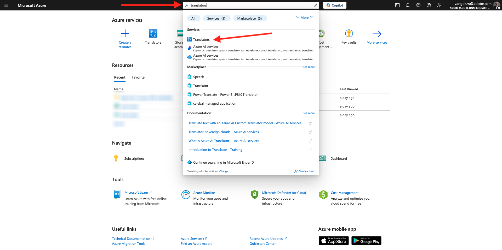
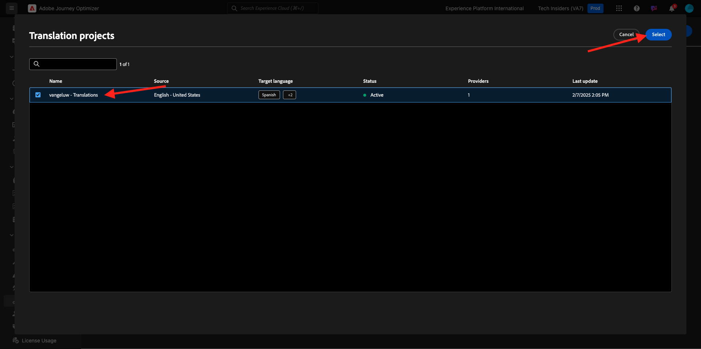
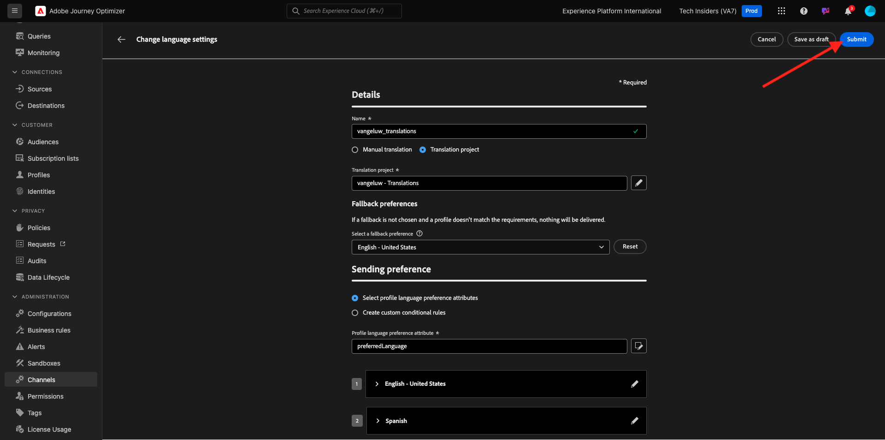

# 3.5.1 Provedor de traduções

## 3.5.1.1 Configurar o Microsoft Azure Translator

Ir para [https://portal.azure.com/#home](https://portal.azure.com/#home).

Na barra de pesquisa, digite `translators`. Em seguida, clique em **+ Criar**.

Selecione **Criar Tradutor**.

Escolha sua **ID de Assinatura** e o **Grupo de Recursos**.
Defina **Região** como **Global**.
Definir **Camada de Preços** como **F0** Gratuito.

Selecione **Revisar + criar**.

Selecione **Criar**.

Selecione **Ir para o recurso**.

No menu esquerdo, vá para **Gerenciamento de Recursos** > **Chaves e Ponto de Extremidade**. Clique em para copiar a chave.

## 3.5.1.2 Dicionário de localidade

Ir para [https://experience.adobe.com/](https://experience.adobe.com/). Clique em **Journey Optimizer**.

No menu esquerdo, vá para **Traduções** e, em seguida, vá para **Dicionário da localidade**. Se você vir esta mensagem, clique em **Adicionar Localidades Padrão**.

Você deverá ver isso.

## 3.5.1.3 Configurar o provedor de traduções no AJO

Ir para [https://experience.adobe.com/](https://experience.adobe.com/). Clique em **Journey Optimizer**.

No menu esquerdo, vá para **Traduções** e vá para **Provedores**. Clique em **Adicionar Provedor**.

Em **Provedores**, selecione **Microsoft Translator**. Marque a caixa de seleção para habilitar o uso do provedor de tradução. Cole a chave copiada dos Tradutores do Microsoft Azure. Em seguida, clique em **Validar credenciais**.

Suas credenciais devem ser validadas com êxito. Se estiverem, role para baixo para selecionar os idiomas para tradução.

Selecione `[en-US] English`, `[es] Spanish`, `[fr] French`, `[nl] Dutch`.

Role para cima e clique em **Salvar**.

Seu **Provedor de Traduções** está pronto para ser usado.

## 3.5.1.4 Configurar projeto de traduções

Ir para [https://experience.adobe.com/](https://experience.adobe.com/). Clique em **Journey Optimizer**.

No menu esquerdo, vá para **Traduções** e, em seguida, vá para **Dicionário da localidade**. Se você vir esta mensagem, clique em **Criar projeto**.

Insira o nome `--aepUserLdap-- - Translations`, defina a **Localidade do Source** como `[en-US] English - United States` e marque as caixas de seleção para habilitar **Publicar automaticamente traduções aprovadas** e **Habilitar fluxo de trabalho de revisão**. Em seguida, clique em **+ Adicionar uma localidade**.

Pesquise por `fr`, habilite a caixa de seleção para `[fr] French` e habilite a caixa de seleção para **Microsoft Translator**. Clique em **+ Adicionar uma localidade**.

Pesquise por `es`, habilite a caixa de seleção para `[es] Spanish` e habilite a caixa de seleção para **Microsoft Translator**. Clique em **+ Adicionar uma localidade**.

Pesquise por `nl`, habilite a caixa de seleção para `[nl] Spanish` e habilite a caixa de seleção para **Microsoft Translator**. Clique em **+ Adicionar uma localidade**.

Clique em **Salvar**.

Seu projeto **Traduções** está pronto para ser usado.

## 3.5.1.5 Definir configurações de idioma

Vá para **Canais** > **Configurações Gerais** > **Configurações de Idioma**. Clique em **Criar configurações de idioma**.

Use o nome `--aepUserLdap--_translations`. Selecione **Projeto de tradução**. Clique no ícone **editar**.

Selecione o Projeto de traduções criado na etapa anterior. Clique em **Selecionar**.

Você deverá ver isso. Defina a **preferência de Fallback** para **Inglês - Estados Unidos**. Clique para selecionar **Selecionar atributo preferencial do idioma do perfil**, que decidirá qual campo do perfil de cliente usar para carregar as traduções. Em seguida, clique no ícone **editar** para selecionar qual campo será usado.

Digite o **idioma preferencial** na barra de pesquisa e selecione o campo **Idioma preferencial**.

Clique no ícone **editar** de **inglês - Estados Unidos** e **holandês** para examinar sua configuração.

Esta é a configuração de **inglês - Estados Unidos**. Clique em **Cancelar**.

Clique para exibir a configuração de **Holandês**. Clique em **Cancelar**.

Role para cima e clique em **Enviar**.

As configurações de idioma estão definidas agora.

Você concluiu este exercício.

## Próximas etapas

Ir para [3.5.2 Criar sua campanha](./ex2.md)

Voltar para [Módulo 3.5](./ajotranslationsvcs.md){target="_blank"}

Voltar para [Todos os módulos](./../../../overview.md){target="_blank"}
