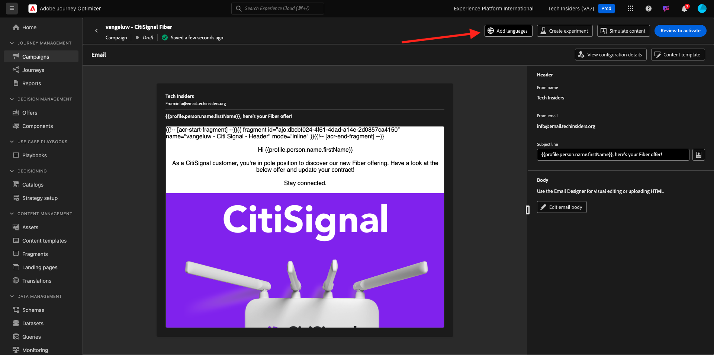

# 3.5.3 Adicionar idiomas ao email

Ir para [https://experience.adobe.com/](https://experience.adobe.com/). Clique em **Journey Optimizer**.

Você será redirecionado para a exibição **Página inicial** no Journey Optimizer. Primeiro, verifique se você está usando a sandbox correta. A sandbox a ser usada é chamada `--aepSandboxName--`.

Vá para **Campanhas** e clique para abrir a campanha que você acabou de criar.

Clique em **Modificar campanha**.

Clique em **Modificar**.

Role para baixo até a ação **Email** e clique em **Editar conteúdo**.

Clique em **Adicionar idiomas**.

Selecione suas **Configurações de idioma**, chamadas de `--aepUserLdap--_translations`. Clique em **Selecionar**.

Você deverá ver isso. Clique em **Enviar para tradução**.

Você deverá ver uma mensagem como essa. O fluxo de trabalho **Enviar para tradução** foi iniciado e levará alguns minutos para ser concluído.
Você verá que o status muda para **Tradução em andamento**.

Após alguns minutos, o status do fluxo de trabalho de traduções será alterado para **Tradução concluída**.

Clique na tradução **`[es] Spanish`**. Você verá o texto atualizado na pré-visualização de email e também na **linha de assunto**.
Caso seja necessário, você ainda poderá revisar e atualizar a tradução diretamente no campo **Linha de assunto**.

Clique em **Editar corpo do email** para revisar a tradução dentro do email.

Você pode alterar o texto manualmente caso a tradução precise ser revisada.

Volte para a visão geral da campanha clicando na **seta** ao lado do texto da linha de assunto no canto superior esquerdo.

Você deveria voltar aqui. Não há necessidade de ativar esta campanha novamente.

Volte para a campanha clicando na **seta** no canto superior esquerdo.

Certifique-se de que sua campanha esteja no estado **Parada**.

Você terminou este exercício agora.

## Próximas etapas

Ir para [Resumo e Benefícios](./summary.md)

Voltar para [Módulo 3.5](./ajotranslationsvcs.md){target="_blank"}

Voltar para [Todos os módulos](./../../../overview.md){target="_blank"}
