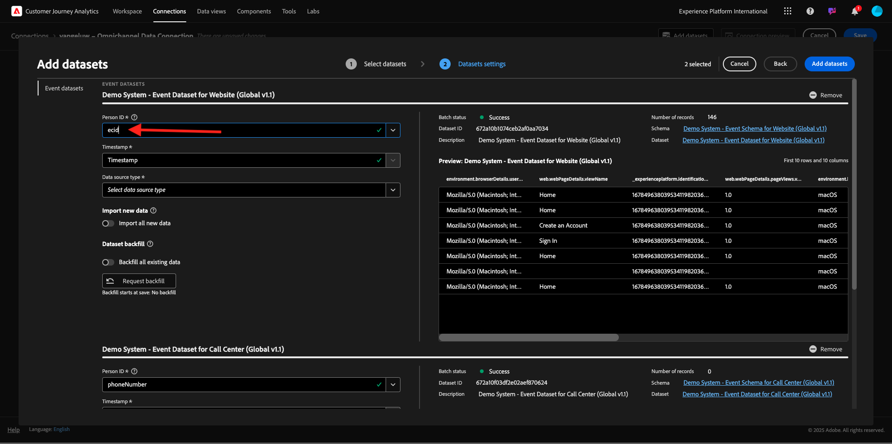

# 4.1.2 Conectar conjuntos de dados da Adobe Experience Platform no Customer Journey Analytics

## Objetivos

- Entender a interface da conexão de dados
- Trazer dados do Adobe Experience Platform para o CJA
- Entender a ID de pessoa e a compilação de dados
- Saiba mais sobre o conceito de transmissão de dados no Customer Journey Analytics

## 4.1.2.1 Conexão

Acesse [analytics.adobe.com](https://analytics.adobe.com) para acessar o Customer Journey Analytics.

Na página inicial do Customer Journey Analytics, vá para **Conexões**.

Aqui você pode ver todas as diferentes conexões feitas entre o CJA e a Platform. Essas conexões têm o mesmo objetivo que os conjuntos de relatórios no Adobe Analytics. Mas a coleta de dados é totalmente diferente. Todos os dados vêm dos conjuntos de dados da Adobe Experience Platform.

Vamos criar sua primeira conexão. Clique em **Criar nova conexão**.

Você verá a interface do usuário **Criar conexão**.

Agora você pode dar um nome à sua conexão.

Use esta convenção de nomenclatura: `--aepUserLdap-- – Omnichannel Data Connection`.

Você também precisa selecionar a sandbox correta para usar. No menu da sandbox, selecione sua sandbox, que deve ser `--aepSandboxName--`. Neste exemplo, a sandbox é **Tech Insiders**. Você também precisa definir o **número médio de eventos diários** para **menos de 1 milhão**.

Depois de selecionar a sandbox, você pode começar a adicionar conjuntos de dados. Clique em **Adicionar conjuntos de dados**.

## 4.1.2.2 Selecionar conjuntos de dados do Adobe Experience Platform

Pesquisar o conjunto de dados `Demo System - Event Dataset for Website (Global v1.1)`. Ative a caixa para esse conjunto de dados adicioná-lo a essa conexão.

Permaneça na mesma tela e agora pesquise e marque a caixa de seleção `Demo System - Event Dataset for Call Center (Global v1.1)`.

Então você terá isto. Clique em **Next**.

## 4.1.2.3 Compilação de ID de pessoa e dados

### ID de pessoa

A meta agora é unir esses conjuntos de dados. Para cada conjunto de dados selecionado, você verá um campo chamado **ID de pessoa**. Cada conjunto de dados tem seu próprio campo ID de pessoa.

Como você pode ver, a maioria deles tem a ID de pessoa selecionada automaticamente. Isso ocorre porque uma Identidade primária está selecionada em cada esquema no Adobe Experience Platform. Como exemplo, aqui está o esquema para `Demo System - Event Schema for Website (Global v1.1)`, no qual você pode ver que a Identidade primária está definida como `ecid`.

No entanto, você ainda pode influenciar qual identificador será usado para compilar conjuntos de dados para sua conexão. Você pode usar qualquer identificador configurado no esquema vinculado ao seu conjunto de dados. Clique na lista suspensa para explorar as IDs disponíveis em cada conjunto de dados.

Como mencionado, você pode definir IDs de pessoa diferentes para cada conjunto de dados. Isso permite reunir diferentes conjuntos de dados de várias origens no CJA. Imagine trazer o NPS ou dados de pesquisa que seriam muito interessantes e úteis para entender o contexto e por que algo aconteceu.

O nome do campo ID de pessoa não é importante, desde que o valor nos campos ID de pessoa corresponda. Digamos que temos `email` em um conjunto de dados e `emailAddress` em outro conjunto de dados definido como ID de pessoa. Se `delaigle@adobe.com` for o mesmo valor para o campo de ID de pessoa em ambos os conjuntos de dados, o CJA poderá compilar os dados.

Revise as Perguntas frequentes do CJA aqui para entender as nuances da identificação: [Perguntas frequentes](https://experienceleague.adobe.com/docs/analytics-platform/using/cja-overview/cja-faq.html?lang=pt-BR).

### Costura de dados usando a ID de pessoa

Agora que você entende o conceito de compilação de conjuntos de dados usando a ID de pessoa, vamos escolher `email` como sua ID de pessoa para cada conjunto de dados.

Acesse cada conjunto de dados para atualizar a ID de pessoa. Agora preencha o campo ID de pessoa escolhendo o `email` na lista suspensa.

Depois de compilar os dois conjuntos de dados, você estará pronto para continuar.

| conjunto de dados | ID de pessoa |
| ----------------- |-------------| 
| Sistema de demonstração - Conjunto de dados de evento para site (Global v1.1) | email |
| Sistema de demonstração - Conjunto de dados de evento para call center (Global v1.1) | email |

Também é necessário garantir que, para ambos os conjuntos de dados, essas opções estejam ativadas:

- Importar todos os novos dados
- Preencher retroativamente todos os dados existentes

(Não se esqueça de ativar essas duas opções para o segundo conjunto de dados)

Você também precisa selecionar um **tipo de fonte de dados** para cada conjunto de dados.

Estas são as configurações do conjunto de dados **Sistema de demonstração - Conjunto de dados de evento para o site (Global v1.1)**.

Estas são as configurações do conjunto de dados **Sistema de demonstração - Conjunto de dados de evento para o site (Global v1.1)**.

Clique em **Adicionar conjuntos de dados**.

Clique em **Salvar** e vá para o próximo exercício.

Após criar sua **Conexão**, pode levar algumas horas até que seus dados estejam disponíveis no CJA.

Próxima Etapa: [4.1.3 Criar uma Exibição de Dados](./ex3.md)

[Voltar ao módulo 4.1](./customer-journey-analytics-build-a-dashboard.md)

[Voltar a todos os módulos](./../../../overview.md)
