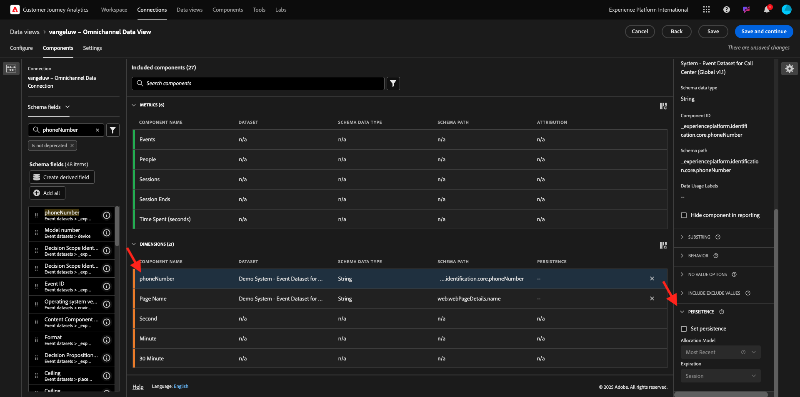
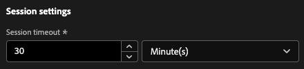

# 4.1.3 Criar uma visualização de dados

## Objetivos

- Entender a interface da Visualização de dados
- Entender as configurações básicas da definição de visita
- Entender a atribuição e a persistência em uma visualização de dados

## 4.1.3.1 Visualização de dados

Com a conexão concluída, agora é possível avançar para a visualização de influência. Uma diferença entre o Adobe Analytics e o CJA é que o CJA precisa de uma Visualização de dados para limpar e preparar os dados antes da visualização.

Uma Visualização de dados é semelhante ao conceito de Conjuntos de relatórios virtuais no Adobe Analytics, onde você define definições de visita com reconhecimento de contexto, filtragem e também como os componentes são chamados.

Você precisará de, no mínimo, uma Visualização de dados por Conexão. No entanto, para alguns casos de uso, é ótimo ter várias visualizações de dados para a mesma conexão, com o objetivo de fornecer diferentes insights para equipes diferentes.
Se quiser que sua empresa se torne orientada por dados, você deve adaptar como os dados são visualizados em cada equipe. Alguns exemplos:

- Métricas de UX somente para a equipe de design de UX
- Use os mesmos nomes para KPIs e Métricas para Google Analytics e para Customer Journey Analytics, de modo que a equipe de análise digital possa falar apenas 1 idioma.
- Visualização de dados filtrada para mostrar, por exemplo, dados de apenas um mercado ou uma marca ou apenas para Dispositivos móveis.

Na tela **Conexões**, marque a caixa de seleção na frente da conexão que você acabou de criar. Clique em **Criar visualização de dados**.

Você será redirecionado para o fluxo de trabalho **Criar Exibição de Dados**.

## 4.1.3.2 Definição da visualização de dados

Agora você pode configurar as definições básicas para a Visualização de dados.

A **Conexão** criada no exercício anterior já está selecionada. Sua conexão é nomeada `--aepUserLdap-- – Omnichannel Data Connection`.

Em seguida, dê um nome à sua Visualização de Dados seguindo esta convenção de nomenclatura: `--aepUserLdap-- – Omnichannel Data View`.

Insira o mesmo valor para a descrição: `--aepUserLdap-- – Omnichannel Data View`.

| Nome | Descrição | ID externa |
| ----------------- |-------------|-------------| 
| `--aepUserLdap-- – Omnichannel Data View` | `--aepUserLdap-- – Omnichannel Data View` | `--aepUserLdap--123` |

Para o **Fuso Horário**, selecione o fuso horário **Horário de Greenwich; Monróvia, Casablanca [GMT]**. Este é um cenário realmente interessante, já que algumas empresas operam em diferentes países e regiões geográficas. A alocação do fuso horário certo para cada país evitará erros típicos de dados, como acreditar que, por exemplo, no Peru, a maioria das pessoas compra camisetas às 4h.

Você também pode modificar a nomeação das métricas principais (Pessoa, Sessão e Evento). Isso não é necessário, mas alguns clientes gostam de usar Pessoas, Visitas e Ocorrências em vez de Pessoa, Sessão e Eventos (convenção de nomenclatura padrão do Customer Journey Analytics).

Agora você deve ter as seguintes configurações definidas:

Clique em **Salvar e continuar**.

Clique em **Salvar**.

## 4.1.3.3 Componentes da visualização de dados

Neste exercício, você configurará os componentes necessários para analisar os dados e visualizá-los usando o Analysis Workspace. Nesta interface, há três áreas principais:

- Lado esquerdo: componentes disponíveis dos conjuntos de dados selecionados
- Meio: Componentes adicionados à Visualização de dados
- Lado direito: Configurações do componente

Agora é necessário arrastar e soltar os componentes necessários para a análise no **Componentes adicionados**. Para fazer isso, você precisa selecionar os componentes no menu esquerdo e arrastá-los e soltá-los na tela no meio.

Vamos começar com o primeiro componente: **Nome (web.webPageDetails.name)**. Procure por esse componente, em seguida, arraste e solte-o na tela.

Esse componente é o nome da página, como você pode derivar da leitura do campo de esquema `(web.webPageDetails.name)`.

No entanto, usar **Nome** como o nome não é a melhor convenção de nomenclatura para um usuário empresarial entender rapidamente essa dimensão.

Vamos mudar o nome para **Nome da página**. Clique no componente e renomeie-o na área **Configurações do componente**.

Algo realmente importante são as **configurações de Persistência**. O conceito de evars e prop não existe no CJA, mas as configurações de Persistência possibilitam um comportamento semelhante.

Se você não alterar essas configurações, o CJA interpretará a dimensão como uma **Prop** (nível de ocorrência). Além disso, podemos alterar a Persistência para tornar a dimensão um **eVar** (manter o valor na jornada).

Se você não estiver familiarizado com eVars e Props, poderá [ler mais sobre eles na documentação](https://experienceleague.adobe.com/docs/analytics/landing/an-key-concepts.html?lang=pt-BR).

Vamos deixar o Nome da página como uma propriedade. Dessa forma, você não precisa alterar nenhuma **Configuração de persistência**.

| Nome do componente a ser pesquisado | Novo nome | Configurações de persistência |
| ----------------- |-------------| --------------------| 
| Nome (web.webPageDetails.name) | Nome da página |          |

Em seguida, escolha a dimensão **phoneNumber** e solte-a na tela. O novo nome deve ser **Número de Telefone**.

Por fim, vamos alterar as configurações de Persistência, pois o número de celular deve persistir no nível do usuário.

Para alterar a Persistência, role para baixo no menu direito e abra a guia **Persistência**:

Marque a caixa de seleção para modificar as configurações de persistência. Selecione o escopo **Mais recente** e **Pessoa (Janela de relatórios)**, pois só nos importamos com o último número de celular dessa pessoa. Se o cliente não preencher o dispositivo móvel em visitas futuras, você ainda verá esse valor preenchido.

| Nome do componente a ser pesquisado | Novo nome | Configurações de persistência |
| ----------------- |-------------| --------------------| 
| phoneNumber | Número de telefone | Mais recente, Janela Relatório de pessoas |

O próximo componente é `web.webPageDetails.pageViews.value`.

No menu do lado esquerdo, procure por `web.webPageDetails.pageViews.value`. Arraste e solte essa métrica na tela.

Altere o nome para **Exibições de página** nas **Configurações de componente**.

| Nome do componente a ser pesquisado | Novo nome | Configurações de atribuição |
| ----------------- |-------------| --------------------| 
| web.webPageDetails.pageViews.value | Page Views |         |

Para as configurações de atribuição, não é necessário alterar nada.

Observação: as configurações de persistência em métricas também podem ser alteradas no Analysis Workspace. Em alguns casos, você pode optar por defini-lo aqui para evitar que os usuários empresariais precisem pensar qual é o melhor modelo de persistência.

Em seguida, será necessário configurar vários Dimension e métricas, conforme indicado na tabela abaixo.

### DIMENSION

| Nome do componente a ser pesquisado | Novo nome | Configurações de persistência |
| ----------------- |-------------| --------------------| 
| brandName | Nome da marca | Mais recente, Sessão |
| callfeel | Sensação de chamada |          |
| ID de chamada | Tipo de Interação com Chamada |          |
| callTopic | Chamar tópico | Mais recente, Sessão |
| ecid | ECID | Mais recente, Janela Relatório de pessoas |
| email | ID de e-mail | Mais recente, Janela Relatório de pessoas |
| Tipo de pagamento | Tipo de pagamento |          |
| Método de adição de produto | Método de adição de produto | Mais recente, Sessão |
| Tipo de evento | Tipo de evento |         |
| Nome (productListItems.name) | Nome do produto |         |
| SKU | SKU (Sessão) | Mais recente, Sessão |
| ID da transação | ID da transação |         |
| URL (web.webPageDetails.URL) | URL |         |
| Agente do usuário | Agente do usuário | Mais recente, Sessão |

### MÉTRICAS

| Nome do componente a ser pesquisado | Novo nome | Configurações de atribuição |
| ----------------- |-------------| --------------------| 
| Quantidade | Quantidade |          |
| commerce.order.priceTotal | Receita |         |

Sua configuração deve ter esta aparência. Não esqueça de **Salvar** sua Visualização de Dados. Clique em **Salvar** agora.

## 4.1.3.4 Métricas calculadas

Embora todos os componentes tenham sido organizados na Visualização de dados, ainda é necessário adaptar alguns deles, para que os usuários empresariais estejam prontos para iniciar a análise.

Caso se lembre, você não trouxe especificamente Métricas, como Adicionar ao carrinho, Visualização do produto ou Compras, para a Visualização de dados.
No entanto, você tem uma dimensão chamada: **Tipo de Evento**. Portanto, você pode derivar esses tipos de interação criando 3 métricas calculadas.

Vamos começar com a primeira Métrica: **Exibições do produto**.

No lado esquerdo, pesquise **Tipo de Evento** e selecione a dimensão. Em seguida, arraste e solte-o na tela **Componentes incluídos**.
Clique para selecionar a nova métrica **Tipo de evento**.

Agora, altere o nome e a descrição do componente para os seguintes valores:

| Nome do componente | Descrição do componente |
| ----------------- |-------------| 
| Visualizações de produto | Visualizações de produto |

Agora, vamos contar apenas **Exibições do Produto** eventos. Para fazer isso, role para baixo nas **Configurações de componente** até ver **Incluir valores de exclusão**. Habilite a opção **Definir valores de inclusão/exclusão**.

Como você deseja contar apenas **Exibições do Produto**, especifique **commerce.productViews** sob os critérios.

Sua métrica calculada agora está pronta.

Em seguida, repita o mesmo processo para os eventos **Adicionar ao carrinho** e **Comprar**.

### Adicionar ao carrinho

Primeiro arraste e solte a mesma dimensão **Tipo de evento**.

Você verá um alerta pop-up de um Campo duplicado, pois estamos usando a mesma variável. Clique em **Adicionar mesmo assim**:

Agora, siga o mesmo processo que seguimos para a métrica Visualizações do produto:
- Primeiro, altere o nome e a descrição.
- Finalmente, adicione **commerce.productListAdds** como critério para contar apenas Adicionar ao carrinho

| Nome | Descrição | Critérios |
| ----------------- |-------------| -------------|
| Adicionar ao carrinho | Adicionar ao carrinho | commerce.productListAdds |

### Compras

Primeiro, arraste e solte a mesma dimensão **Tipo de evento** que foi usada para ambas as métricas anteriores.

Você verá um alerta pop-up de um Campo duplicado, pois estamos usando a mesma variável. Clique em **Adicionar mesmo assim**:

Agora, siga o mesmo processo que seguimos para as métricas Exibições do produto e Adicionar ao carrinho:
- Primeiro, altere o nome e a descrição.
- Finalmente, adicione **commerce.purchases** como critério para contar apenas Adicionar aos Carrinhos

| Nome | Descrição | Critérios |
| ----------------- |-------------| -------------|
| Compras | Compras | commerce.purchases |

A configuração final deve ser semelhante a esta. Clique em **Salvar e continuar**.

## 4.1.3.5 Configurações de visualização de dados

Você deve ser redirecionado para esta tela:

Nesta guia, você pode modificar algumas configurações importantes para alterar como os dados são processados. Vamos começar definindo o **Tempo limite da sessão** para 30 min. Graças ao carimbo de data e hora de cada evento de experiência, você pode estender o conceito de uma sessão em todos os canais. Por exemplo, o que acontece se um cliente ligar para a central de atendimento depois de visitar o site? Usando Timeouts de sessão personalizados, você tem muita flexibilidade para decidir o que é uma sessão e como essa sessão mesclará os dados.

Nesta guia, é possível modificar outras coisas, como filtrar os dados usando um segmento/filtro. Você não precisará fazer isso neste exercício.

Quando terminar, clique em **Salvar e concluir**.

>[!NOTE]
>
>Você pode voltar a essa Visualização de dados posteriormente e alterar configurações e componentes a qualquer momento. As alterações afetarão como os dados históricos são mostrados.

Agora você pode continuar com a parte de visualização e análise!

Próxima etapa: [4.1.4 Preparação de Dados em Customer Journey Analytics](./ex4.md)

[Voltar ao módulo 4.1](./customer-journey-analytics-build-a-dashboard.md)

[Voltar a todos os módulos](./../../../overview.md)
