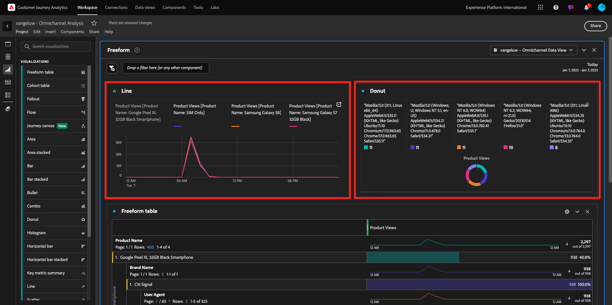
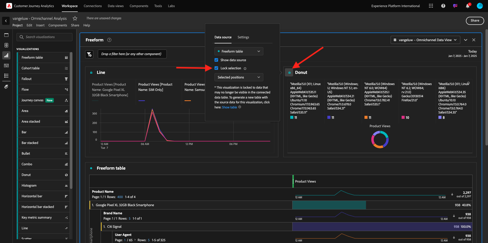
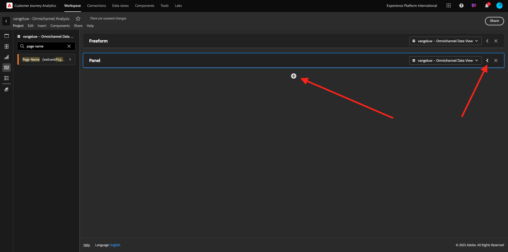
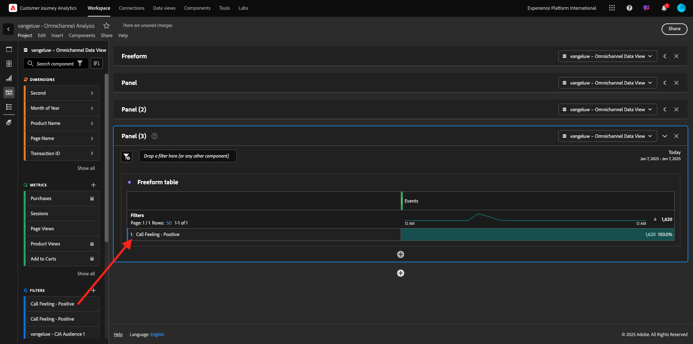

# 4.1.5 Visualização usando o Customer Journey Analytics

## Objetivos

- Compreensão da interface do Analysis Workspace
- Conheça alguns recursos que tornam o Analysis Workspace tão diferente.
- Saiba como analisar no CJA usando o Analysis Workspace

## Contexto

Neste exercício, você usará o Analysis Workspace no CJA para analisar visualizações de produtos, funis de produtos, churn etc.

Abordaremos algumas das consultas feitas no Módulo 7 - Serviço de consulta para que você possa ver como é fácil executar as mesmas consultas e muito mais, mas sem usar o SQL e depender apenas da filosofia de arrastar e soltar do Analysis Workspace.

Vamos usar o projeto que você criou em [4.1.4 Preparação de Dados no Analysis Workspace](./ex4.md), então vá para [https://analytics.adobe.com](https://analytics.adobe.com).

Clique para abrir o projeto `--aepUserLdap-- - Omnichannel Analysis`.

Com seu projeto aberto e a Visualização de Dados `--aepUserLdap-- - Omnichannel Analysis` selecionada, você está pronto para começar a criar suas primeiras visualizações.

## Quantas visualizações de produto temos diariamente

Primeiro, é necessário selecionar as datas certas para analisar os dados. Vá para a lista suspensa de calendário no lado direito da tela. Clique nele e selecione o intervalo de datas aplicável.

No menu à esquerda (área de componentes), localize a Métrica calculada **Exibições do produto**. Selecione-a e arraste-a e solte-a na tela de desenho, na parte superior direita da tabela de forma livre.

Automaticamente, a dimensão **Dia** será adicionada para criar sua primeira tabela. Agora você pode ver sua pergunta respondida em tempo real.

Em seguida, clique com o botão direito do mouse no resumo da métrica. Clique em **Visualizar**.

Clique em **Linha**.

Você verá suas visualizações de produtos por hora.

Você pode alterar o escopo de tempo para dia, clicando em **Configurações** na visualização.

Clique no ponto ao lado de **Linha** para **Gerenciar a Source de Dados**.

Em seguida, clique em **Bloquear seleção** e selecione **Itens selecionados** para bloquear essa visualização de forma que ela sempre exiba uma linha do tempo de Exibições de produtos.

## 5 principais produtos visualizados

Quais são os 5 principais produtos visualizados?

Lembre-se de salvar o projeto de vez em quando.

| Sistema operacional | Atalho |
| ----------------- |-------------| 
| Windows | Ctrl+S |
| Mac | Command+S |

Vamos começar a encontrar os 5 principais produtos visualizados. No menu à esquerda, encontre o **Nome do produto** - Dimension.

Agora arraste e solte o **Nome do Produto** para substituir a dimensão **Dia**:

Esse será o resultado. Selecione os 4 nomes de produtos e você verá a atualização da visualização.

Em seguida, tente detalhar um dos produtos por Nome da marca. Pesquise por **brandName** e arraste-o para o primeiro nome de produto.

Em seguida, faça um detalhamento usando o Agente do usuário. Procure por **Agente do usuário** e arraste-o para o nome da marca.

Você verá isto:

Por fim, você pode adicionar mais visualizações. No lado esquerdo, em visualizações, pesquise por `Donut`. Pegue a `Donut`, arraste e solte-a na tela sob a visualização **Linha**.

Em seguida, na Tabela, selecione as primeiras 5 **linhas de Agente do Usuário** do detalhamento que fizemos em **Smartphone Google Pixel XL 32GB Preto** > **Citi Signal**. Ao selecionar as 3 linhas, pressione o botão **CTRL** (no Windows) ou o botão **Command** (no Mac). Você verá o gráfico de rosca sendo atualizado.

É possível até mesmo adaptar o design para torná-lo mais legível, tornando o gráfico de **Linha** e o gráfico de **Rosca** um pouco menor para que eles possam se ajustar próximos um do outro:

Clique no ponto ao lado de **Rosca** para **Gerenciar a Source de Dados**.
Em seguida, clique em **Bloquear seleção** para bloquear essa visualização para que ela sempre exiba uma linha do tempo de Exibições de produtos.

Saiba mais sobre visualizações usando o Analysis Workspace aqui:

- [https://experienceleague.adobe.com/docs/analytics/analyze/analysis-workspace/visualizations/freeform-analysis-visualizations.html?lang=pt-BR](https://experienceleague.adobe.com/docs/analytics/analyze/analysis-workspace/visualizations/freeform-analysis-visualizations.html?lang=pt-BR)
- [https://experienceleague.adobe.com/docs/analytics/analyze/analysis-workspace/visualizations/t-sync-visualization.html?lang=pt-BR](https://experienceleague.adobe.com/docs/analytics/analyze/analysis-workspace/visualizations/t-sync-visualization.html?lang=pt-BR)

## Funil de interação do produto, da visualização à compra

Há muitas maneiras de resolver essa questão. Uma delas é usar o Tipo de interação do produto e usá-lo em uma tabela de forma livre. Outra maneira é usar uma **Visualização de Fallout**. Vamos usar o último conforme queremos visualizar e analisar ao mesmo tempo.

Feche o painel atual que temos clicando aqui:

Agora adicione um novo painel em branco clicando em **+ Adicionar painel em branco**.

Clique no **Fallout** da visualização.

Selecione o mesmo intervalo de datas do exercício anterior.

Você verá isso.

Localize a dimensão **Tipo de Evento** abaixo dos componentes à esquerda. Clique na seta para abrir a dimensão.

Você verá todos os Tipos de evento disponíveis.

Selecione o item **commerce.productViews** e arraste-o e solte-o no campo **Adicionar ponto de contato** dentro da **Visualização de fallout**.

Faça o mesmo com **commerce.productListAdds** e **commerce.purchases** e solte-os no campo **Adicionar ponto de contato** dentro da **Visualização de Fallout**. Sua visualização ficará assim:

Você pode fazer muitas coisas aqui. Alguns exemplos: compare ao longo do tempo, compare cada etapa por dispositivo ou compare por fidelidade. No entanto, se você quiser analisar aspectos interessantes, como por que os clientes não compram depois de adicionar um item ao carrinho, podemos usar a melhor ferramenta no CJA: clicar com o botão direito do mouse.

Clique com o botão direito no ponto de contato **commerce.productListAdds**. Em seguida, clique em **Fallout de detalhamento neste ponto de contato**.

Uma nova tabela de forma livre será criada para analisar o que as pessoas fizeram se não compraram.

Altere o **Tipo de Evento** por **Nome da Página**, na nova tabela de forma livre, para ver em quais páginas eles irão, em vez da Página de Confirmação de Compra.

## O que as pessoas fazem no site antes de acessar a página Cancelar Serviço?

Novamente, há muitas maneiras de fazer essa análise. Vamos usar a análise de fluxo para iniciar a parte de descoberta.

Feche o painel atual clicando aqui e, em seguida, adicione um novo painel em branco clicando em **+ Adicionar painel em branco**.

Clique no **Fluxo** da visualização.

Você verá isso. Selecione o mesmo intervalo de datas do exercício anterior. Clique em **Aplicar**.

Encontre a dimensão **Nome da página** sob os componentes no lado esquerdo e clique na seta para abrir a dimensão.

Você encontrará todas as páginas visualizadas. Localize o nome da página: **Cancelar Serviço**.
Arraste e solte **Cancelar Serviço** na Visualização de Fluxo no campo intermediário. Clique em **Build**.

Você verá isto:

Agora vamos analisar se os clientes que visitaram a página **Cancelar Serviço** no site também chamaram a central de atendimento e qual foi o resultado.

Nas dimensões, volte e encontre **Tipo de Interação de Chamada**.
Arraste e solte o **Tipo de Interação de Chamada** para substituir a primeira interação à direita na **Visualização de Fluxo**.

Você está vendo o tíquete de suporte dos clientes que ligaram para a central de atendimento depois de visitar a página **Cancelar Serviço**.

Em seguida, nas dimensões, pesquise por **Sensação de Chamada**.  Arraste e solte-a para substituir a primeira interação à direita na **Visualização de fluxo**.

Você verá isto:

Como você pode ver, executamos uma análise omnicanal usando a Visualização de fluxo. Graças a isso, descobrimos que parece que alguns clientes que estavam pensando em cancelar seu serviço, tiveram uma sensação positiva depois de ligar para a central de atendimento. Será que mudamos de ideia com uma promoção?

## Como os clientes com um contato de Callcenter positivo estão se saindo em relação aos KPIs principais?

Vamos primeiro segmentar os dados para obter somente usuários com chamadas **positivas**. No CJA, os segmentos são chamados de Filtros. Vá para filtros dentro da área de componente (no lado esquerdo) e clique em **+**.

No construtor de filtros, dê um nome ao filtro

| Nome | Descrição |
| ----------------- |-------------| 
| Sensação de chamada - Positiva | Sensação de chamada - Positiva |

Nos componentes (dentro do Construtor de filtros), encontre **Sensação de chamada** e arraste e solte-a na Definição do Construtor de filtros.

Agora selecione **positivo** como valor para o filtro.

Altere o escopo para o nível de **Pessoa**. Clique em **Salvar**.

Você estará de volta aqui. Se ainda não tiver sido feito, feche o painel anterior e adicione um novo painel em branco clicando em **+ Adicionar painel em branco**.

Selecione o mesmo intervalo de datas do exercício anterior. Clique em **Aplicar**.

Clique em **Tabela de forma livre**.

Agora, arraste e solte o filtro que acabou de criar.

Tempo para adicionar algumas métricas. Comece com **Exibições do Produto**. Arraste e solte na tabela de forma livre. Você também pode excluir a métrica **Eventos**.

Faça o mesmo com **Pessoas**, **Adicionar ao carrinho** e **Compras**. Você vai acabar com uma mesa como esta.

Graças à primeira análise de fluxo, surgiu-me uma nova questão. Decidimos criar essa tabela e verificar alguns KPIs em relação a um segmento para responder a essa pergunta. Como você pode ver, o tempo de insight é muito mais rápido do que o SQL ou o uso de outras soluções de BI.

## Customer Journey Analytics e recapitulação do Analysis Workspace

Como você aprendeu neste laboratório, a Analysis Workspace compila os dados de todos os canais para analisar a jornada completa do cliente. Além disso, lembre-se de que é possível trazer dados para o mesmo espaço de trabalho que não está anexado à jornada.
Pode ser realmente útil trazer dados desconectados para a análise para contextualizar a jornada. Alguns exemplos incluem dados de NPS, pesquisas, eventos do Facebook Ads ou interações offline (não identificadas).

Próxima etapa: [Resumo e benefícios](./summary.md)

[Voltar ao módulo 4.1](./customer-journey-analytics-build-a-dashboard.md)

[Voltar a todos os módulos](./../../../overview.md)
