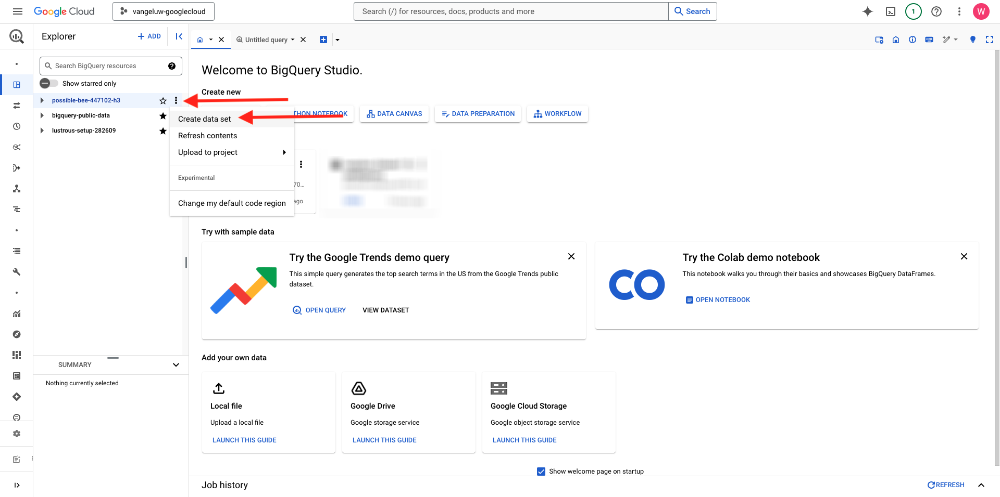
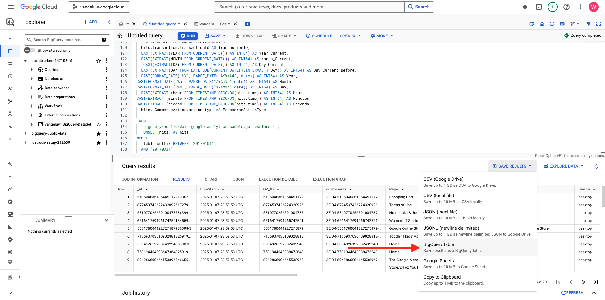

# 4.2.2 Crie sua primeira consulta no BigQuery

## Objetivos

- Explore a interface do usuário do BigQuery
- Criar uma consulta SQL no BigQuery
- Salve os resultados da consulta SQL em um conjunto de dados no BigQuery

## Contexto

Quando os dados do Google Analytics estiverem no BigQuery, dimensões, métricas e outras variáveis serão aninhadas. Além disso, os dados do Google Analytics são carregados diariamente em diferentes tabelas. Isso significa que tentar conectar Google Analytics tabelas no BigQuery diretamente ao Adobe Experience Platform é muito difícil e não é uma boa ideia.

A solução para esse problema é transformar os dados do Google Analytics em um formato legível para facilitar a assimilação no Adobe Experience Platform.

## 4.2.2.1 Criar um conjunto de dados para salvar novas tabelas do BigQuery

Vá para o [Console do BigQuery](https://console.cloud.google.com/bigquery).


No **Explorer**, você verá sua ID do Projeto. Clique na ID do projeto (não clique no conjunto de dados **bigquery-public-data**).


Você pode ver que ainda não há um conjunto de dados, então, vamos criar um agora.
Clique em 3 **...** e em **CRIAR CONJUNTO DE DADOS**.



No lado direito da tela, você verá o menu **Criar conjunto de dados**.


Para a **ID do Conjunto de Dados**, use a convenção de nomenclatura abaixo. Para os outros campos, deixe as configurações padrão.

| Nomenclatura | Exemplo |
| ----------------- | ------------- | 
| `--aepUserLdap--_BigQueryDataSet` | vangeluw_BigQueryDataSet |

Clique em **CRIAR CONJUNTO DE DADOS**.


Você voltará ao console do BigQuery com seu conjunto de dados criado.


## 4.2.2.2 Criar seu primeiro SQL BigQuery

Em seguida, você criará sua primeira query no BigQuery. O objetivo desse query é pegar os dados de amostra de Google Analytics e transformá-los para que possam ser assimilados no Adobe Experience Platform. Vá para a guia **Consulta sem título**.


Copie a consulta SQL a seguir e cole-a no Editor de consultas. Fique à vontade para ler a consulta e entender a sintaxe do Google Analytics BigQuery.


```sql
SELECT
  CONCAT(fullVisitorId, CAST(hitTime AS String), '-', hitNumber) AS _id,
  TIMESTAMP(DATETIME(Year_Current, Month_Current, Day_Current, Hour, Minutes, Seconds)) AS timeStamp,
  fullVisitorId as GA_ID,
  -- Fake CUSTOMER ID
  CONCAT('3E-D4-',fullVisitorId, '-1W-93F' ) as customerID,
  Page,
  Landing_Page,
  Exit_Page,
  Device,
  Browser,
  MarketingChannel,
  TrafficSource,
  TrafficMedium,
  -- Enhanced Ecommerce
  TransactionID,
  CASE
      WHEN EcommerceActionType = '2' THEN 'Product_Detail_Views'
      WHEN EcommerceActionType = '3' THEN 'Adds_To_Cart'
      WHEN EcommerceActionType = '4' THEN 'Product_Removes_From_Cart'
      WHEN EcommerceActionType = '5' THEN 'Product_Checkouts'
      WHEN EcommerceActionType = '6' THEN 'Product_Refunds'
    ELSE
    NULL
  END
     AS Ecommerce_Action_Type,
  -- Entrances (metric)
  SUM(CASE
      WHEN isEntrance = TRUE THEN 1
    ELSE
    0
  END
    ) AS Entries,
    
--Pageviews (metric)
    COUNT(*) AS Pageviews,
    
 -- Exits 
    SUM(
    IF
      (isExit IS NOT NULL,
        1,
        0)) AS Exits,
        
 --Bounces
   SUM(CASE
      WHEN isExit = TRUE AND isEntrance = TRUE THEN 1
    ELSE
    0
  END
    ) AS Bounces,
        
  -- Unique Purchases (metric)
  COUNT(DISTINCT TransactionID) AS Unique_Purchases,
  -- Product Detail Views (metric)
  COUNT(CASE
      WHEN EcommerceActionType = '2' THEN fullVisitorId
    ELSE
    NULL
  END
    ) AS Product_Detail_Views,
  -- Product Adds To Cart (metric)
  COUNT(CASE
      WHEN EcommerceActionType = '3' THEN fullVisitorId
    ELSE
    NULL
  END
    ) AS Adds_To_Cart,
  -- Product Removes From Cart (metric)
  COUNT(CASE
      WHEN EcommerceActionType = '4' THEN fullVisitorId
    ELSE
    NULL
  END
    ) AS Product_Removes_From_Cart,
  -- Product Checkouts (metric)
  COUNT(CASE
      WHEN EcommerceActionType = '5' THEN fullVisitorId
    ELSE
    NULL
  END
    ) AS Product_Checkouts,
  -- Product Refunds (metric)
  COUNT(CASE
      WHEN EcommerceActionType = '7' THEN fullVisitorId
    ELSE
    NULL
  END
    ) AS Product_Refunds
  FROM (
  SELECT
    -- Landing Page (dimension)
    CASE
      WHEN hits.isEntrance = TRUE THEN hits.page.pageTitle
    ELSE NULL
  END
    AS Landing_page,
    
        -- Exit Page (dimension)
    CASE
      WHEN hits.isExit = TRUE THEN hits.page.pageTitle
    ELSE
    NULL
  END
    AS Exit_page,
    
    hits.page.pageTitle AS Page,
    hits.isEntrance,
    hits.isExit,
    hits.hitNumber as hitNumber,
    hits.time as hitTime,
    date as Fecha,
    fullVisitorId,
    visitStartTime,
    device.deviceCategory AS Device,
    device.browser AS Browser,
    channelGrouping AS MarketingChannel,
    trafficSource.source AS TrafficSource,
    trafficSource.medium AS TrafficMedium,
    hits.transaction.transactionId AS TransactionID,
    CAST(EXTRACT(YEAR FROM CURRENT_DATE()) AS INT64) AS Year_Current,
    CAST(EXTRACT(MONTH FROM CURRENT_DATE()) AS INT64) AS Month_Current,
     CAST(EXTRACT(DAY FROM CURRENT_DATE()) AS INT64) AS Day_Current,
    CAST(EXTRACT(DAY FROM DATE_SUB(CURRENT_DATE(),INTERVAL 1 DAY)) AS INT64) AS Day_Current_Before,
    CAST(FORMAT_DATE('%Y', PARSE_DATE("%Y%m%d", date)) AS INT64) AS Year,
  CAST(FORMAT_DATE('%m', PARSE_DATE("%Y%m%d",date)) AS INT64) AS Month,
  CAST(FORMAT_DATE('%d', PARSE_DATE("%Y%m%d",date)) AS INT64) AS Day,
    CAST(EXTRACT (hour FROM TIMESTAMP_SECONDS(hits.time)) AS INT64) AS Hour,
  CAST(EXTRACT (minute FROM TIMESTAMP_SECONDS(hits.time)) AS INT64) AS Minutes,
  CAST(EXTRACT (second FROM TIMESTAMP_SECONDS(hits.time)) AS INT64) AS SecondS,
    hits.eCommerceAction.action_type AS EcommerceActionType
  
  FROM
    `bigquery-public-data.google_analytics_sample.ga_sessions_*`,
     UNNEST(hits) AS hits
  WHERE
    _table_suffix BETWEEN '20170101'
    AND '20170331'
    AND totals.visits = 1
    AND hits.type = 'PAGE'
    )
    
GROUP BY
  1,
  2,
  3,
  4,
  5,
  6,
  7,
  8,
  9,
  10,
  11,
  12,
  13,
  14
    
  ORDER BY 2 DESC
```

Quando estiver pronto, clique em **Executar** para executar a consulta:


A execução da consulta pode levar alguns minutos.

Após a conclusão da execução da consulta, você verá a saída abaixo nos **Resultados da consulta**.


## 4.2.2.3 Salve os resultados da sua consulta SQL do BigQuery

A próxima etapa é salvar a saída de sua consulta clicando no botão **SALVAR RESULTADOS**.


Como o local da saída, selecione **tabela BigQuery**.



Você verá um novo pop-up, no qual o **Nome do Projeto** e o **Nome do Conjunto de Dados** são preenchidos previamente. O nome do conjunto de dados deve ser o conjunto de dados criado no início deste exercício, com esta convenção de nomenclatura:

| Nomenclatura | Exemplo |
| ----------------- | ------------- | 
| `--aepUserLdap--_BigQueryDataSet` | `vangeluw_BigQueryDataSet` |

Agora é necessário inserir um nome de Tabela. Use esta convenção de nomenclatura:

| Nomenclatura | Exemplo |
| ----------------- |------------- | 
| `--aepUserLdap--_GAdataTableBigQuery` | `vangeluw_GAdataTableBigQuery` |

Clique em **SALVAR**.


Pode levar algum tempo até que os dados estejam prontos na tabela criada. Após alguns minutos, atualize o navegador. Em seguida, você deve ver em seu conjunto de dados a tabela `--aepUserLdap--_GAdataTableBigquery` no **Explorer** dentro do seu projeto do BigQuery.


Agora você pode continuar com o próximo exercício, em que conectará essa tabela ao Adobe Experience Platform.

Próxima etapa: [4.2.3 Conectar GCP e BigQuery ao Adobe Experience Platform](./ex3.md)

[Voltar ao módulo 4.2](./customer-journey-analytics-bigquery-gcp.md)

[Voltar a todos os módulos](./../../../overview.md)
