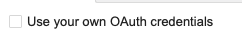
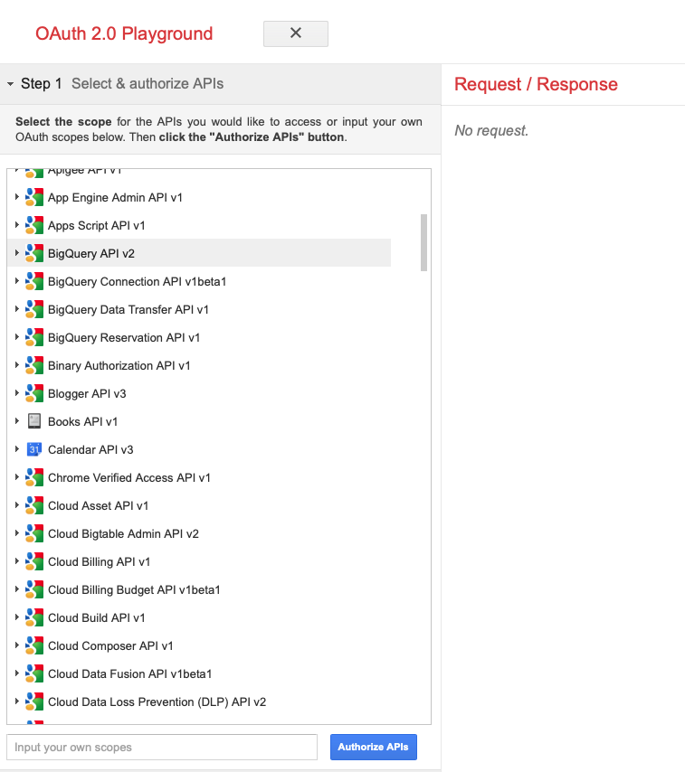
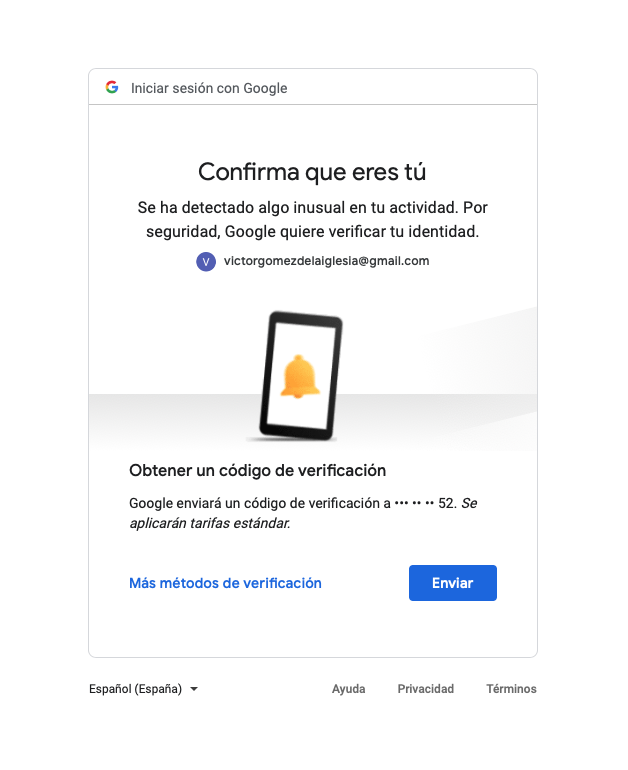
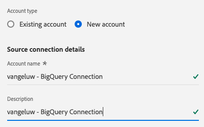

# 4.2.3 Conectar o GCP e o BigQuery ao Adobe Experience Platform

## Objetivos

- Explore a API e os serviços na Google Cloud Platform
- Estar familiarizado com o OAuth Playground para testar APIs do Google
- Crie sua primeira conexão do BigQuery no Adobe Experience Platform

## Contexto

A Adobe Experience Platform fornece um conector em **Fontes** que ajudará você a trazer conjuntos de dados do BigQuery para a Adobe Experience Platform. Esse conector de dados é baseado na API do Google BigQuery. Portanto, é importante preparar corretamente a Plataforma de nuvem do Google e o ambiente do BigQuery para receber chamadas de API da Adobe Experience Platform.

Para configurar o Conector do Source do BigQuery no Adobe Experience Platform, você precisará desses 4 valores:

- projeto
- clientId
- clientSecret
- refreshToken

Até agora você só tem o primeiro, a **ID do Projeto**. Esse valor de **ID do projeto** é uma ID aleatória que foi gerada pela Google quando você criou seu projeto BigQuery durante o exercício 12.1.

Copie a ID do projeto em um arquivo de texto separado.

| Credencial | Nomenclatura | Exemplo |
| ----------------- |-------------| -------------|
| ID do projeto | random | composto-tarefa-306413 |

Você pode verificar sua ID de projeto a qualquer momento clicando em seu **Nome do projeto** na barra de menu superior:

Você verá a ID do projeto no lado direito:

Neste exercício, você aprenderá a obter os outros 3 campos obrigatórios:

- clientId
- clientSecret
- refreshToken

## 4.2.3.1 API e serviços da nuvem do Google

Para iniciar, volte para a página inicial da Google Cloud Platform. Para fazer isso, basta clicar no logotipo no canto superior esquerdo da tela.

Quando você estiver na página inicial, vá para o menu esquerdo e clique em **APIs e serviços** e, em seguida, clique em **Painel**.

Você verá agora a página inicial de **APIs e serviços**.

Nesta página, você pode ver o uso de suas várias conexões de API do Google. Para configurar uma Conexão de API para que o Adobe Experience Platform possa ler a partir do BigQuery, é necessário seguir estas etapas:

- Primeiro, é necessário criar uma tela de consentimento OAuth para habilitar autenticações futuras. As razões de segurança da Google também exigem que um ser humano faça a primeira autenticação, antes que um acesso programático seja permitido.
- Em segundo lugar, você precisa de credenciais de API (clientId e clientSecret) que serão usadas para autenticação de API e acesso ao seu conector BigQuery.

## 4.2.3.2 Tela de consentimento do OAuth

Vamos começar com a criação da Tela de consentimento do OAuth. No menu esquerdo da página inicial de **APIs e serviços**, clique em **Tela de consentimento do OAuth**.

Você verá isto:

Selecione o Tipo de Usuário: **Externo**. Em seguida, clique em **CRIAR**.

Você estará na **janela Configuração da tela de consentimento do OAuth**.

Aqui, basta inserir o nome da tela de consentimento no campo **Nome do aplicativo** e selecionar o **Email de suporte do usuário**. Para o Nome do aplicativo, use esta convenção de nomenclatura:

| Nomenclatura | Exemplo |
| ----------------- |-------------| 
| `--aepUserLdap-- - AEP BigQuery Connector` | vangeluw - Conector do AEP BigQuery |

Em seguida, role para baixo até ver **Informações de contato do desenvolvedor** e preencha um endereço de email.

Clique em **SALVAR E CONTINUAR**.

Você verá isso. Clique em **SALVAR E CONTINUAR**.

Você verá isso. Clique em **SALVAR E CONTINUAR**.

Você verá isso. Clique em **VOLTAR AO PAINEL**.

Você verá isso. Clique em **PUBLISH APP**.

Clique em **CONFIRM**.

Você verá isso.

Na próxima etapa, você concluirá a configuração da API e obterá suas credenciais de API.

## 4.2.3.3 Credenciais da API do Google: segredo do cliente e ID do cliente

No menu esquerdo, clique em **Credenciais**. Você verá isto:

Clique no botão **+ CRIAR CREDENCIAIS**.

Você verá três opções. Clique na **ID do cliente OAuth**:

Na próxima tela, selecione **Aplicativo web**.

Vários novos campos aparecerão. Agora é necessário inserir o **Nome** da ID de Cliente OAuth e também inserir os **URIs de redirecionamento autorizados**.

Siga esta convenção de nomenclatura:

| Campo | Valor | Exemplo |
| ----------------- |-------------| -------------| 
| Nome | ldap - Conector AEP BigQuery | vangeluw - Conector do Platform BigQuery |
| URIs de redirecionamento autorizados | https://developers.google.com/oauthplayground | https://developers.google.com/oauthplayground |

O campo **URIs de redirecionamento autorizados** é muito importante porque você precisará dele mais tarde para obter o RefreshToken necessário para concluir a configuração do Conector de Source do BigQuery no Adobe Experience Platform.

Antes de continuar, você precisa pressionar fisicamente o botão **Inserir** depois de inserir a URL para armazenar o valor no campo **URIs de redirecionamento autorizados**. Se você não clicar no botão **Inserir**, ocorrerão problemas posteriormente, no **Playground do OAuth 2.0**.

Em seguida, clique em **Criar**:

Agora você verá sua ID do cliente e seu Segredo do cliente.

Copie estes dois campos e cole-os em um arquivo de texto na sua área de trabalho. Você sempre pode acessar essas credenciais em um estágio posterior, mas é mais fácil salvá-las em um arquivo de texto ao lado da ID do projeto do BigQuery.

Para recapitular a configuração do BigQuery Source Connector no Adobe Experience Platform, agora você já tem esses valores disponíveis:

| Credenciais do BigQuery Connector | Valor |
| ----------------- |-------------| 
| ID do projeto | sua própria ID do projeto (por exemplo,: composer-task-306413) |
| clientid | yourclientid |
| cilentsecret | yourclientsecret |

O **refreshToken** ainda está ausente. O refreshToken é um requisito por motivos de segurança. No mundo das APIs, os tokens normalmente expiram a cada 24 horas. Portanto, o **refreshToken** é necessário para atualizar o token de segurança a cada 24 horas, para que a instalação do Source Connector possa continuar se conectando à Google Cloud Platform e ao BigQuery.

## 4.2.3.4 API do BigQuery e o refreshToken

Há muitas maneiras de obter um refreshToken para acessar as APIs da Google Cloud Platform. Uma dessas opções é, por exemplo, usar o Postman.
No entanto, o Google criou algo mais fácil de testar e reproduzir com suas APIs, uma ferramenta chamada **Playground do OAuth 2.0**.

Para acessar o **Playground do OAuth 2.0**, vá para [https://developers.google.com/oauthplayground](https://developers.google.com/oauthplayground).

Você verá a página inicial do **Playground** do OAuth 2.0.

Clique no ícone de **engrenagem** na parte superior direita da tela:

Verifique se as configurações são as mesmas que você pode ver na imagem acima.

Verifique novamente as configurações para ter 100% de certeza.

Quando terminar, marque a caixa de **Usar suas próprias credenciais do OAuth**

Dois campos devem aparecer e você tem o valor para eles.

Preencha os campos após esta tabela:

| Configurações da API do Playground | Suas credenciais da API do Google |
| ----------------- |-------------| 
| ID do cliente OAuth | sua ID do cliente (no arquivo de texto da área de trabalho) |
| Segredo do cliente OAuth | seu próprio Segredo do cliente (no arquivo de texto da área de trabalho) |

Copie a **ID do Cliente** e o **Segredo do Cliente** do arquivo de texto criado na área de trabalho.

Depois de preencher suas credenciais, clique em **Fechar**

No menu esquerdo, você pode ver todas as APIs do Google disponíveis. Pesquise por **BigQuery API v2**.

Em seguida, selecione o escopo conforme indicado na imagem abaixo:

Depois de selecioná-los, você verá um botão azul que diz **Autorizar APIs**. Clique nele.

Selecione a Conta da Google usada para configurar o GCP e o BigQuery.

Você pode ver um grande aviso: **Este aplicativo não foi verificado**. Isso está acontecendo porque seu Conector da Platform BigQuery ainda não foi revisado formalmente, portanto, a Google não sabe se é um aplicativo autêntico ou não. Você deve ignorar essa notificação.

Clique em **Avançado**.

Em seguida, clique em **Ir para ldap - Conector AEP BigQuery (não seguro)**.

Você será redirecionado para nossa Tela de consentimento OAuth criada.

Se você usar a Autenticação de dois fatores (2FA), insira o código de verificação enviado a você.

O Google mostrará oito prompts de **Permissão** diferentes. Clique em **Permitir** para todas as oito solicitações de permissão. (Esse é um procedimento que deve ser seguido e confirmado uma vez por um ser humano real, antes que a API permita solicitações programáticas)

Novamente, **oito janelas pop-up diferentes** não serão exibidas. Clique em **Permitir** para todas elas.

Após as oito solicitações de permissão, você verá esta visão geral. Clique em **Permitir** para concluir o processo.

Após o último clique de **Permitir**, você será redirecionado para o Playground do OAuth 2.0 e verá o seguinte:

Clique em **Código de autorização do Exchange para tokens**.

Após alguns segundos, a exibição **Etapa 2 - Código de autorização do Exchange para tokens** será fechada automaticamente, e você verá **Etapa 3 - Configurar solicitação para API**.

Você precisa voltar para a **Etapa 2 do código de autorização do Exchange para tokens**, portanto, clique na **Etapa 2 do código de autorização do Exchange para tokens** novamente para visualizar o **Atualizar token**.

Você verá agora o **token de atualização**.

Copie o **token de atualização** e cole-o no arquivo de texto na área de trabalho junto com as outras Credenciais do BigQuery Source Connector:

| Credenciais do BigQuery Source Connector | Valor |
| ----------------- |-------------| 
| ID do projeto | sua própria ID de projeto aleatória (por exemplo,: apt-summer-273608) |
| clientid | yourclientid |
| cilentsecret | yourclientsecret |
| refreshtoken | yourrefreshtoken |

Em seguida, vamos configurar seu Source Connector no Adobe Experience Platform.

## 4.2.3.5 - Conectar a Platform com sua própria tabela do BigQuery

Faça logon no Adobe Experience Platform acessando esta URL: [https://experience.adobe.com/platform](https://experience.adobe.com/platform).

Depois de fazer logon, você chegará à página inicial do Adobe Experience Platform.

Antes de continuar, você precisa selecionar uma **sandbox**. A sandbox a ser selecionada é chamada ``--aepSandboxName--``. Depois de selecionar a sandbox apropriada, você verá a alteração da tela e agora estará em sua sandbox dedicada.

No menu esquerdo, vá para Origens. Você verá a página inicial de **Fontes**. No menu **Fontes**, clique em **Bancos de dados**. Clique no cartão **Google BigQuery**. Em seguida, clique em **Configurar** ou **+ Configurar**.

Agora você deve criar uma nova conexão.

Clique em **Nova conta**. Agora é necessário preencher todos os campos abaixo, com base na configuração que você fez no GCP e no BigQuery.

Vamos começar nomeando a conexão:

Use esta convenção de nomenclatura:

| Credenciais do BigQuery Connector | Valor | Exemplo |
| ----------------- |-------------| -------------| 
| Nome da conta | `--aepUserLdap-- - BigQuery Connection` | vangeluw - Conexão BigQuery |
| Descrição | `--aepUserLdap-- - BigQuery Connection` | vangeluw - Conexão BigQuery |

O que deve dar a você algo como isso:

Em seguida, preencha os detalhes do GCP e da API do BigQuery **Autenticação de conta** que você armazenou em um arquivo de texto na sua área de trabalho:

| Credenciais do BigQuery Connector | Valor |
| ----------------- |-------------| 
| ID do projeto | sua própria ID de projeto aleatória (por exemplo,: apt-summer-273608) |
| clientId | ... |
| clientSecret | ... |
| refreshToken | ... |

Os detalhes da **Autenticação da Conta** agora devem ter esta aparência:

Após preencher todos esses campos, clique em **Conectar à origem**.

Se os detalhes da **Autenticação da Conta** foram preenchidos corretamente, você verá agora uma confirmação visual de que a conexão está funcionando corretamente, ao ver a confirmação **Conectado**.

Agora que sua conexão foi criada, clique em **Avançar**:

Agora você verá o conjunto de dados do BigQuery criado durante o exercício 12.2.

Muito bem! No próximo exercício, você carregará dados dessa tabela e os mapeará em relação a um esquema e conjunto de dados na Adobe Experience Platform.

Próxima etapa: [4.2.4 Carregar dados do BigQuery no Adobe Experience Platform](./ex4.md)

[Voltar ao módulo 4.2](./customer-journey-analytics-bigquery-gcp.md)

[Voltar a todos os módulos](./../../../overview.md)
