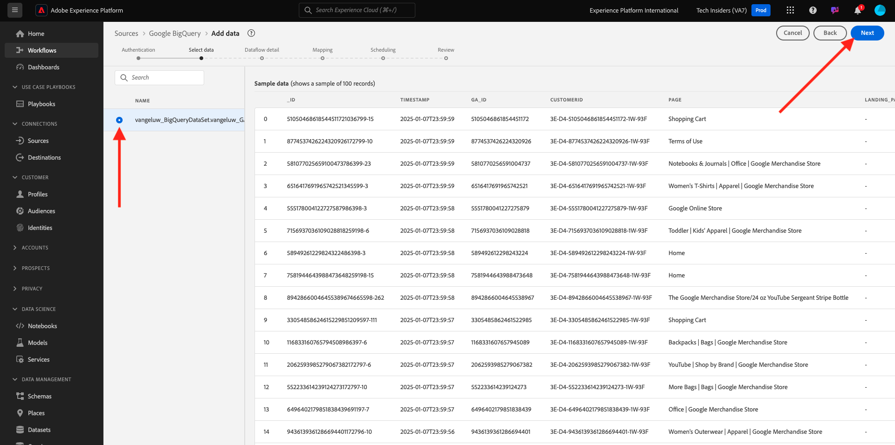

# 4.2.4 Carregar dados do BigQuery no Adobe Experience Platform

## Objetivos

- Mapear dados do BigQuery para um esquema XDM
- Carregar dados do BigQuery no Adobe Experience Platform
- Familiarize-se com a interface do usuário do BigQuery Source Connector

## Antes de começar

Após o exercício anterior, essa página deve ser aberta no Adobe Experience Platform:

**Se estiver aberto, continue com o próximo exercício.**

**Se não estiver aberto, vá para [Adobe Experience Platform](https://experience.adobe.com/platform/home).**

No menu esquerdo, vá para Origens. Você verá a página inicial de **Fontes**. No menu **Fontes**, vá para o conector de origem do **Google BigQuery** e clique em **Configurar**.

Em seguida, você verá a tela de seleção da conta do Google BigQuery. Selecione sua conta e clique em **Avançar**.

Você verá a tela **Selecionar dados**.

## 4.2.4.1 Seleção de tabela do BigQuery

Na tela **Selecionar dados**, selecione seu conjunto de dados do BigQuery. Agora você pode ver uma pré-visualização de dados de amostra dos dados do Google Analytics no BigQuery.

Clique em **Next**.

## 4.2.4.2 Mapeamento do XDM

Agora você verá isto:

Agora é necessário criar um novo conjunto de dados ou selecionar um conjunto de dados existente para carregar os dados do Google Analytics. Para este exercício, um conjunto de dados e um esquema já foram criados. Não é necessário criar um novo esquema ou conjunto de dados.

Selecione **Conjunto de dados existente**. Abra o menu suspenso para selecionar um conjunto de dados. Procure o conjunto de dados chamado `Demo System - Event Dataset for BigQuery (Global v1.1)` e selecione-o. Clique em **Next**.

Role para baixo. Agora é necessário mapear cada **Campo Source** de Google Analytics/BigQuery para um **Campo Target** XDM, campo por campo. Você poderá ver vários erros, que serão abordados pelo exercício de mapeamento abaixo.

Use a tabela de mapeamento abaixo para este exercício.

| Campo de origem | Campo de público alvo |
| ----------------- |-------------| 
| `_id` | `_id` |
| `_id` | canal._id |
| `timeStamp` | carimbo de data e hora |
| `GA_ID` | ``--aepTenantId--``.identification.core.gaid |
| `customerID` | ``--aepTenantId--``. identification.core.crmId |
| `Page` | web.webPageDetails.name |
| `Device` | device.type |
| `Browser` | environment.browserDetails.vendor |
| `MarketingChannel` | marketing.trackingCode |
| `TrafficSource` | channel.typeAtSource |
| `TrafficMedium` | channel.mediaType |
| `TransactionID` | commerce.order.payments.transactionID |
| `Ecommerce_Action_Type` | eventType |
| `Pageviews` | web.webPageDetails.pageViews.value |

Para alguns campos, é necessário remover o mapeamento original e criar um novo, para um **Campo Calculado**.

| Campo calculado | Campo de público alvo |
| ----------------- |-------------| 
| `iif("Ecommerce_Action_Type".equalsIgnoreCase("Product_Refunds"), 1, 0)` | commerce.purchases.value |
| `iif("Ecommerce_Action_Type".equalsIgnoreCase("Product_Detail_Views"), 1, 0)` | commerce.productViews.value |
| `iif("Adds_To_Cart".equalsIgnoreCase("Adds_To_Cart"), 1, 0)` | commerce.productListAdds.value |
| `iif("Ecommerce_Action_Type".equalsIgnoreCase("Product_Removes_From_Cart"), 1, 0)` | commerce.productListRemovals.value |
| `iif("Ecommerce_Action_Type".equalsIgnoreCase("Product_Checkouts"), 1, 0)` | commerce.checkouts.value |

Para criar um **Campo Calculado**, clique em **+ Novo tipo de campo** e em **Campo calculado**.

Cole a regra acima e clique em **Salvar** para cada um dos campos na tabela acima.

Agora você tem um **Mapeamento** como este.

Os campos de origem **GA_ID** e **customerID** estão mapeados para um Identificador neste Esquema XDM. Isso permitirá enriquecer os dados do Google Analytics (dados de comportamento da Web/aplicativo) com outros conjuntos de dados, como dados de fidelidade ou da central de atendimento.

Clique em **Next**.

## 4.2.4.3 Conexão e agendamento da assimilação de dados

Você verá a guia **Agendamento**:

Na guia **Agendamento**, você pode definir uma frequência para o processo de assimilação de dados para este **Mapeamento** e dados.

Como você está usando dados de demonstração no Google BigQuery que não serão atualizados, não há necessidade real de definir um cronograma neste exercício. Você precisa selecionar algo e, para evitar muitos processos de assimilação de dados inúteis, é necessário definir a frequência da seguinte maneira:

- Frequência: **Semana**
- Intervalo: **200**
- Hora de início: **a qualquer momento na próxima hora**

**Importante**: certifique-se de ativar a opção **Preenchimento retroativo**.

Por último, mas não menos importante, você deve definir um campo **delta**.

O campo **delta** é usado para agendar a conexão e carregar somente novas linhas que chegam ao seu conjunto de dados do BigQuery. Um campo delta geralmente é sempre uma coluna de carimbo de data e hora. Portanto, para assimilações de dados agendadas futuras, somente as linhas com um novo carimbo de data e hora mais recente serão assimiladas.

Selecione **timeStamp** como o campo delta.
Clique em **Next**.

## 4.2.4.4 Analisar e iniciar conexão

Agora você verá uma visão geral detalhada da sua conexão. Verifique se tudo está correto antes de continuar, pois algumas configurações não podem mais ser alteradas posteriormente, como por exemplo, o mapeamento XDM.

Clique em **Concluir**.

Depois que a conexão for criada, você verá o seguinte:

Agora você está pronto para continuar com o próximo exercício, no qual usará o Customer Journey Analytics para criar visualizações poderosas sobre os dados do Google Analytics.

Próxima etapa: [4.2.5 Analisar dados do Google Analytics usando o Customer Journey Analytics](./ex5.md)

[Voltar ao módulo 4.2](./customer-journey-analytics-bigquery-gcp.md)

[Voltar a todos os módulos](./../../../overview.md)
