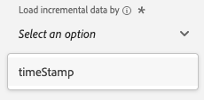

# 4.2.4 Carregar dados do BigQuery no Adobe Experience Platform

## Objetivos

- Mapear dados do BigQuery para um esquema XDM
- Carregar dados do BigQuery no Adobe Experience Platform
- Familiarize-se com a interface do usuário do BigQuery Source Connector

## Antes de começar

Após o exercício 12.3, essa página deve ser aberta no Adobe Experience Platform:

**Se estiver aberto, continue com o exercício 12.4.1.**

**Se não estiver aberto, vá para [Adobe Experience Platform](https://experience.adobe.com/platform/home).**

No menu esquerdo, vá para Origens. Você verá a página inicial de **Fontes**. No menu **Fontes**, clique em **Bancos de dados**.

Selecione o **Google BigQuery** Source Connector e clique em **+ Configurar**.

Em seguida, você verá a tela de seleção da conta do Google BigQuery.

Selecione sua conta e clique em **Avançar**.

Você verá a exibição **Adicionar dados**.

## 4.2.4.1 Seleção de tabela do BigQuery

Na visualização **Adicionar dados**, selecione seu conjunto de dados do BigQuery.

Agora você pode ver uma pré-visualização de dados de amostra dos dados do Google Analytics no BigQuery.

Clique em **Next**.

## 4.2.4.2 Mapeamento do XDM

Agora você verá isto:

Agora é necessário criar um novo conjunto de dados ou selecionar um conjunto de dados existente para carregar os dados do Google Analytics. Para este exercício, um conjunto de dados e um esquema já foram criados. Não é necessário criar um novo esquema ou conjunto de dados.

Selecione **Conjunto de dados existente**. Abra o menu suspenso para selecionar um conjunto de dados. Procure o conjunto de dados chamado `Demo System - Event Dataset for BigQuery (Global v1.1)` e selecione-o. Clique em **Next**.

Role para baixo. Agora é necessário mapear cada **Campo Source** de Google Analytics/BigQuery para um **Campo Target** XDM, campo por campo.

Use a tabela de mapeamento abaixo para este exercício.

| Campo de origem | Campo de público alvo |
| ----------------- |-------------| 
| **_id** | _id |
| **_id** | canal._id |
| timeStamp | carimbo de data e hora |
| GA_ID | ``--aepTenantId--``.identification.core.gaid |
| customerID | ``--aepTenantId--``.identification.core.fidelizaçãoId |
| Página | web.webPageDetails.name |
| Dispositivo | device.type |
| Navegador | environment.browserDetails.vendor |
| MarketingChannel | marketing.trackingCode |
| TrafficSource | channel.typeAtSource |
| TrafficMedium | channel.mediaType |
| TransactionID | commerce.order.payments.transactionID |
| Ecommerce_Action_Type | eventType |
| Pageviews | web.webPageDetails.pageViews.value |
| Compras_Exclusivas | commerce.purchases.value |
| Product_Detail_Views | commerce.productViews.value |
| Adds_To_Cart | commerce.productListAdds.value |
| Product_Removes_From_Cart | commerce.productListRemovals.value |
| Product_Checkouts | commerce.checkouts.value |

Depois de copiar e colar o mapeamento acima na interface do usuário do Adobe Experience Platform, verifique se não vê erros devido a erros de digitação ou espaços à esquerda/direita.

Agora você tem um **Mapeamento** como este:

Os campos de origem **GA_ID** e **customerID** estão mapeados para um Identificador neste Esquema XDM. Isso permitirá enriquecer os dados do Google Analytics (dados de comportamento da Web/aplicativo) com outros conjuntos de dados, como dados de fidelidade ou da central de atendimento.

Clique em **Next**.

## 4.2.4.3 Conexão e agendamento da assimilação de dados

Você verá a guia **Agendamento**:

Na guia **Agendamento**, você pode definir uma frequência para o processo de assimilação de dados para este **Mapeamento** e dados.

Como você está usando dados de demonstração no Google BigQuery que não serão atualizados, não há necessidade real de definir um cronograma neste exercício. Você precisa selecionar algo e, para evitar muitos processos de assimilação de dados inúteis, é necessário definir a frequência da seguinte maneira:

- Frequência: **Semana**
- Intervalo: **200**

**Importante**: certifique-se de ativar a opção **Preenchimento retroativo**.

Por último, mas não menos importante, você deve definir um campo **delta**.

O campo **delta** é usado para agendar a conexão e carregar somente novas linhas que chegam ao seu conjunto de dados do BigQuery. Um campo delta geralmente é sempre uma coluna de carimbo de data e hora. Portanto, para assimilações de dados agendadas futuras, somente as linhas com um novo carimbo de data e hora mais recente serão assimiladas.

Selecione **timeStamp** como o campo delta.

Agora você tem isto.

Clique em **Next**.

## 4.2.4.4 Analisar e iniciar conexão

Na exibição **detalhes do fluxo do conjunto de dados**. é necessário nomear a conexão, o que ajudará você a localizá-la posteriormente.

Use esta convenção de nomenclatura:

| Campo | Nomenclatura | Exemplo |
| ----------------- |-------------| -------------|
| Nome do fluxo do conjunto de dados | Fluxo de dados - ldap - Interação do site do BigQuery | DataFlow - vangeluw - Interação com o site BigQuery |
| Descrição | Fluxo de dados - ldap - Interação do site do BigQuery | DataFlow - vangeluw - Interação com o site BigQuery |

Clique em **Next**.

Agora você verá uma visão geral detalhada da sua conexão. Verifique se tudo está correto antes de continuar, pois algumas configurações não podem mais ser alteradas posteriormente, como por exemplo, o mapeamento XDM.

Clique em **Concluir**.

A configuração da conexão pode levar algum tempo, portanto, não se preocupe se você vir isto:

Depois que a conexão for criada, você verá o seguinte:

Agora você está pronto para continuar com o próximo exercício, no qual usará o Customer Journey Analytics para criar visualizações poderosas sobre os dados do Google Analytics.

Próxima etapa: [4.2.5 Analisar dados do Google Analytics usando o Customer Journey Analytics](./ex5.md)

[Voltar ao módulo 4.2](./customer-journey-analytics-bigquery-gcp.md)

[Voltar a todos os módulos](./../../../overview.md)
