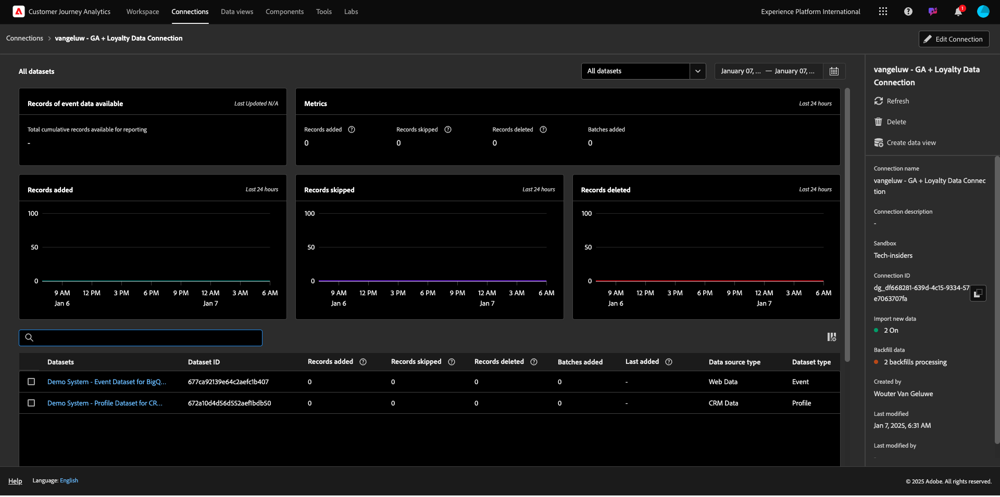
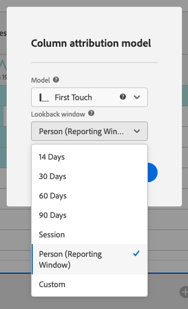
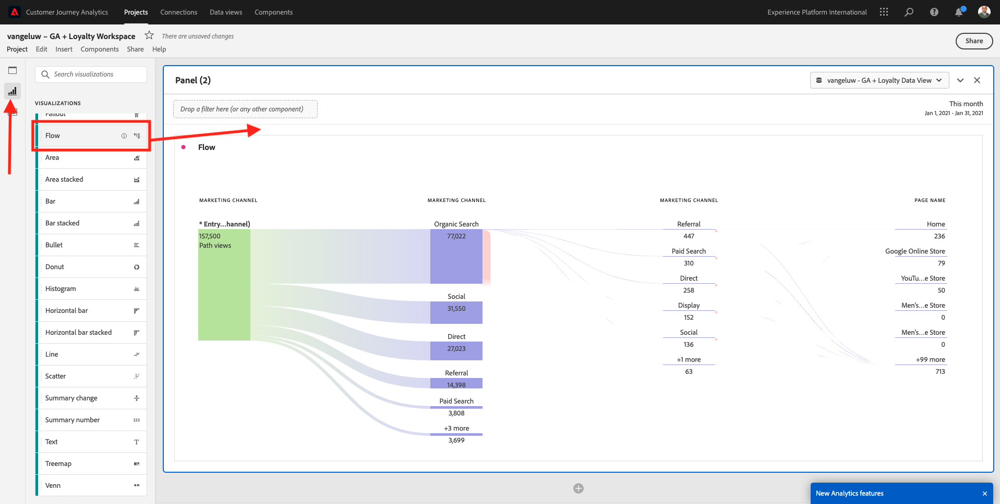
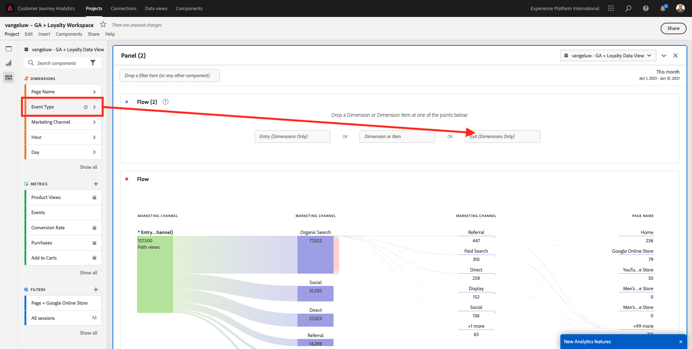

# 4.2.5 Analisar dados do Google Analytics usando o Customer Journey Analytics

## Objetivos

- Conecte nosso conjunto de dados do BigQuery ao Customer Journey Analytics (CJA)
- Conecte-se e associe-se a Google Analytics com dados de fidelidade.
- Familiarizar-se com a interface do CJA

## 4.2.5.1 Criar uma conexão

Acesse [analytics.adobe.com](https://analytics.adobe.com) para acessar o Customer Journey Analytics.

Na página inicial do Customer Journey Analytics, vá para **Conexões**.

Aqui você pode ver todas as diferentes conexões feitas entre o CJA e a Platform. Essas conexões têm o mesmo objetivo que os conjuntos de relatórios no Adobe Analytics. Mas a coleta de dados é totalmente diferente. Todos os dados vêm dos conjuntos de dados da Adobe Experience Platform.

Clique em **Criar nova conexão**.

Você verá a interface do usuário **Criar conexão**.

Para o nome, use este: `--aepUserLdap-- - GA + Loyalty Data Connection`.

Você precisa selecionar a sandbox correta para usar. No menu da sandbox, selecione sua sandbox, que deve ser `--aepSandboxName--`. Neste exemplo, a sandbox a ser usada é **Tech Insiders**.

Defina o **número médio de eventos diários** para **menos de 1 milhão**.

No menu Conjunto de dados, agora é possível começar a adicionar conjuntos de dados. Clique em **Adicionar conjuntos de dados**.

Os conjuntos de dados a serem adicionados são:
- `Demo System - Profile Dataset for CRM (Global v1.1)`
- `Demo System - Event Dataset for BigQuery (Global v1.1)`

Pesquise os dois conjuntos de dados, marque a caixa de seleção e clique em **Avançar**.

Você verá isto:

Para o conjunto de dados `Demo System - Event Dataset for BigQuery (Global v1.1)`, altere a **ID da Pessoa** para **fidelyid** e defina o **tipo de fonte de dados** como **Dados da Web**. Habilite ambas as opções para **Importar todos os dados novos** e **Preencher retroativamente todos os dados existentes**.

Para o conjunto de dados `Demo System - Event Dataset for BigQuery (Global v1.1)`, verifique se a **ID da Pessoa** está definida como **crmId** e defina o **tipo de fonte de dados** como **Dados da Web**. Habilite ambas as opções para **Importar todos os dados novos** e **Preencher retroativamente todos os dados existentes**. Clique em **Adicionar conjuntos de dados**.

Você estará aqui. Clique em **Salvar**.

Após criar sua **Conexão**, pode levar algumas horas até que seus dados estejam disponíveis no CJA.

Em seguida, você verá sua conexão na lista de conexões disponíveis.

## 4.2.5.2 Criar uma visualização de dados

Com a conexão concluída, agora é possível avançar para a visualização de influência. Uma diferença entre o Adobe Analytics e o CJA é que o CJA precisa de uma visualização de dados para limpar e preparar os dados antes da visualização.

Uma visualização de dados é semelhante ao conceito de conjuntos de relatórios virtuais no Adobe Analytics, onde você define definições de visita com reconhecimento de contexto, filtragem e também como os componentes são chamados.

Você precisará de, no mínimo, uma visualização de dados por conexão. No entanto, para alguns casos de uso, é ótimo ter várias visualizações de dados para a mesma conexão, com o objetivo de fornecer diferentes insights para equipes diferentes.

Se quiser que sua empresa se torne orientada por dados, você deve adaptar como os dados são visualizados em cada equipe. Alguns exemplos:

- Métricas de UX somente para a equipe de design de UX
- Use os mesmos nomes para KPIs e Métricas para Google Analytics e para Customer Journey Analytics, de modo que a equipe de análise digital possa falar apenas 1 idioma.
- visualização de dados filtrada para mostrar, por exemplo, dados de apenas um mercado ou uma marca ou apenas para Dispositivos móveis.

Na tela **Conexões**, marque a caixa de seleção na frente da conexão que você acabou de criar. Clique em **Criar exibição de dados**.

Você será redirecionado para o fluxo de trabalho **Criar Exibição de Dados**.

Agora você pode configurar as definições básicas para a visualização de dados. Coisas como Fuso horário, Tempo limite da sessão ou a filtragem de visualização de dados (a parte de segmentação é semelhante aos Conjuntos de relatórios virtuais no Adobe Analytics).

A **Conexão** criada no exercício anterior já está selecionada. Sua conexão é nomeada `--aepUserLdap-- - GA + Loyalty Data Connection`.

Em seguida, dê um nome à sua visualização de dados seguindo esta convenção de nomenclatura: `--aepUserLdap-- - GA + Loyalty Data View`.

Insira o mesmo valor para a descrição: `--aepUserLdap-- - GA + Loyalty Data View`.

Antes de fazer qualquer análise ou visualização, precisamos criar uma visualização de dados com todos os campos, dimensões e métricas e suas configurações de atribuição.

| Campo | Convenção de nomeação |
| ----------------- |-------------|  
| Nomear conexão | `--aepUserLdap-- - GA + Loyalty Data View` | vangeluw - GA + Visualização de dados de fidelidade |
| Descrição | `--aepUserLdap-- - GA + Loyalty Data View` |
| ID externa | `--aepUserLdap--GA` |

Clique em **Salvar e continuar**.

Clique em **Salvar**.

Agora é possível adicionar componentes à visualização de dados. Como você pode ver, algumas métricas e dimensões são adicionadas automaticamente.

Adicione os componentes abaixo à visualização de dados. Atualize também os nomes de campo para nomes amigáveis. Para fazer isso, selecione a métrica ou a dimensão e atualize o campo **Nome do componente** no menu direito.

| Tipo de componente | Nome original do componente | Nome de exibição | Caminho do componente |
| -----------------| -----------------|-----------------|-----------------|
| Métrica | commerce.checkouts.value | Check-outs | `commerce.checkouts.value` |
| Métrica | commerce.productListRemovals.value | Remoções do carrinho | `commerce.productListRemovals.value` |
| Métrica | commerce.productListAdds | Adições ao carrinho | `commerce.productListAdds` |
| Métrica | commerce.productViews.value | Visualizações de produto | `commerce.productViews.value` |
| Métrica | commerce.purchases.value | Compras | `commerce.purchases.value` |
| Métrica | web.webPageDetails.pageViews | Page Views | `web.webPageDetails.pageViews` |
| Métrica | pontos | Pontos de fidelidade | `_experienceplatform.loyaltyDetails.points` |
| Dimensão | nível | Nível de fidelidade | `_experienceplatform.loyaltyDetails.level` |
| Dimensão | channel.mediaType | Tráfego Medium | `channel.mediaType` |
| Dimensão | channel.typeAtSource | Traffic Source | `channel.typeAtSource` |
| Dimensão | Código de rastreamento | Canal de marketing | `marketing.trackingCode` |
| Dimensão | gaid | ID do Google Analytics | `_experienceplatform.identification.core.gaid` |
| Dimensão | web.webPageDetails.name | Título da página | `web.webPageDetails.name` |
| Dimensão | Fornecedor | Navegador | `environment.browserDetails.vendor` |
| Dimensão | Tipo | Device Type | `device.type` |
| Dimensão | fidelisd | ID de fidelidade | `_experienceplatform.identification.core.loyaltyId` |
| Dimensão | commerce.order.payments.transactionID | ID da transação | `commerce.order.payments.transactionID` |
| Dimensão | eventType | Tipo de evento | `eventType` |
| Dimensão | carimbo de data e hora | Carimbo de data e hora | `timestamp` |
| Dimensão | `_id` | Identificador | `_id` |

Você terá algo assim:

Em seguida, você precisa fazer algumas alterações no contexto de Pessoa e Sessão para alguns desses componentes alterando as **Configurações de Atribuição ou Persistência**.

Altere as **Configurações de atribuição** dos componentes abaixo:

| Componente |
| -----------------|
| Traffic Source |
| Canal de marketing |
| Navegador |
| Tráfego Medium |
| Device Type |
| ID do Google Analytics |

Para fazer isso, selecione o componente, clique em **Usar modelo de atribuição personalizado** e defina o **Modelo** como **Mais recente**, e a **Expiração** como **Janela de Relatório de Pessoa**. Repita isso para todos os componentes mencionados acima.

Depois de fazer as alterações nas configurações de atribuição para todos os componentes mencionados acima, você deve ter essa visualização. Clique em **Salvar e continuar**.

Na tela **Configurações**, nenhuma alteração é necessária. Clique em **Salvar e concluir**.

Agora você está pronto para analisar dados do Google Analytics no Adobe Analytics Analysis Workspace. Vamos passar para o próximo exercício.

## 4.2.5.3 Criar o projeto

No Customer Journey Analytics, vá para **Workspace**. Clique em **Criar projeto**

Selecione **Projeto do Workspace em branco** e clique em **Criar**.

Agora você tem um projeto em branco:

Primeiro, salve o projeto e dê um nome a ele. Você pode usar o seguinte comando para salvar:

| Sistema operacional | Atalho |
| ----------------- |-------------| 
| Windows | Ctrl+S |
| Mac | Command+S |

Vocês verão esse popup. Use esta convenção de nomenclatura:

| Nome | Descrição |
| ----------------- |-------------| 
| `--aepUserLdap-- – GA + Loyalty Workspace` | `--aepUserLdap-- – GA + Loyalty Workspace` |

Em seguida, clique em **Salvar**.

Em seguida, selecione a visualização de dados correta no canto superior direito da tela. Esta é a visualização de dados criada no exercício anterior, com a convenção de nomenclatura `--aepUserLdap-- - GA + Loyalty Data View`.

### 4.2.5.3.1 Tabelas de forma livre

As tabelas de forma livre funcionam, mais ou menos, como tabelas dinâmicas no Excel. Você escolhe algo na barra esquerda, arrasta e solta na Forma livre e obtém um relatório de tabela.

As tabelas de forma livre são quase ilimitadas. Você pode fazer (quase) qualquer coisa e isso traz tanto valor quando comparado a Google Analytics (já que essa ferramenta tem algumas limitações de análise). Esse é um dos motivos para carregar dados do Google Analytics em outra ferramenta de análise.

Veja dois exemplos em que você precisa usar o SQL, o BigQuery e algum tempo para responder a perguntas simples que não são possíveis de fazer na interface do Google Analytics ou no Google Data Studio:

- Quantas pessoas chegam ao checkout do Navegador Safari dividido por canal de marketing? Verifique se a métrica de check-out está sendo filtrada pelo Navegador Safari. Acabamos de arrastar e soltar a variável Navegador = Safari na parte superior da coluna de check-out.

- Como analista, posso ver que o Canal de marketing social tem baixas conversões. Estou usando a atribuição Último contato como padrão, mas e quanto ao Primeiro contato? Ao passar o mouse sobre qualquer métrica, as configurações da métrica são exibidas. Posso selecionar o modelo de atribuição que desejo. Você pode fazer a Atribuição no GA (não no Data Studio) como uma atividade independente, mas não pode ter outras métricas ou dimensões não relacionadas à análise de atribuição na mesma tabela.

Vamos responder a essas perguntas e a outras mais com o Analysis Workspace no CJA.

Primeiro, selecione o intervalo de datas correto (**Hoje**) no lado direito do painel. Clique em **Aplicar**.

>[!NOTE]
>
>Se você acabou de criar a **Conexão de dados** e a **Visualização de dados**, talvez precise aguardar algumas horas. O CJA precisa de algum tempo para preencher dados históricos quando há uma grande quantidade de registros de dados.

Vamos arrastar e soltar algumas dimensões e métricas para analisar os canais de marketing. Primeiro use a dimensão **Canal de marketing** e arraste e solte-a na tela da **Tabela de forma livre**. (Clique em **Mostrar tudo** caso não veja a métrica imediatamente no menu Métricas)

Você verá isto:

Em seguida, é necessário adicionar as Métricas à Tabela de forma livre. Você deve adicionar estas Métricas: **Pessoas**, **Sessões**, **Exibições de Produtos**, **Check-outs**, **Compras**, **Taxa de Conversão** (Métrica Calculada).

Antes de fazer isso, é necessário criar a Métrica calculada **Taxa de conversão**. Para fazer isso, clique no ícone **+** ao lado de Métricas:

Como nome da Métrica Calculada, use **Taxa de Conversão** e **conversionRate** para **ID Externa**. Em seguida, arraste as Métricas **compra** e **Sessões** para a tela. Definir **Formato** a **Percentual** e **Casas Decimais** a **2**. Finalmente, clique em **Salvar**.

Clique em **Salvar**.

Em seguida, para usar todas essas Métricas na **Tabela de forma livre**, arraste e solte-as uma por uma na **Tabela de forma livre**. Veja o exemplo abaixo.

Você terminará com uma tabela como esta:

Como mencionado acima, as **Tabelas de forma livre** oferecem a liberdade necessária para executar uma análise detalhada. Por exemplo, você pode escolher qualquer outro Dimension para analisar uma métrica específica dentro da tabela.

Como exemplo, vá para dimensões e pesquisa e selecione a variável **Navegador**.

Você verá uma visão geral dos valores disponíveis para esse Dimension.

Escolha o Dimension **Safari** e arraste-o e solte-o sobre uma Métrica, por exemplo **Check-outs**. Você verá isto:

Ao fazer isso, você acabou de responder a uma possível pergunta que tinha: Quantas pessoas chegam à página de check-out usando o Safari, divididas pelo Canal de marketing?

Agora vamos responder à pergunta sobre Atribuição.

Localize a métrica **Compra** na tabela.

Passe o mouse sobre a métrica e um ícone de **Configurações** será exibido. Clique nele.

Um menu contextual será exibido. Marque a caixa de seleção para **modelo de atribuição não padrão**.

No pop-up que você verá, é possível alterar facilmente os modelos de atribuição e a janela de pesquisa (o que é bastante complexo de se obter com o SQL).

Selecione **Primeiro contato** como seu modelo de atribuição.

Escolha **Pessoa** para a Janela de Pesquisa.

Agora clique em **Aplicar**.

Agora é possível ver que o modelo de atribuição para essa métrica específica agora é Primeiro contato.

Você pode fazer o detalhamento que quiser, sem limites de tipos de variável, segmentos, dimensão ou intervalos de datas.

Algo ainda mais especial é a capacidade de unir qualquer conjunto de dados do Adobe Experience Platform para enriquecer os dados de comportamento digital do Google Analytics. Por exemplo, offline, call center, fidelidade ou dados de CRM.

Para mostrar essa funcionalidade, vamos configurar seu primeiro detalhamento que combina dados offline com dados online. Escolha o **Nível de Fidelidade** da dimensão e arraste-o e solte-o em qualquer **Canal de Marketing**, por exemplo, **Pesquisa Orgânica**:

Em seguida, vamos analisar qual **Tipo de Dispositivo** é usado pelos clientes que vieram ao site usando a **Pesquisa Orgânica** com um **Nível de Fidelidade** que é **Bronze**. Pegue o Dimension **Tipo de dispositivo** e arraste e solte-o no **Bronze**. Você verá isto:

Você pode ver que, para o primeiro detalhamento, é usado o Nível de fidelidade. Essa dimensão vem de um conjunto de dados e de um esquema diferentes do que você usou para o conector do BigQuery. A ID de pessoa **fidelidID** (Sistema de demonstração - Esquema de evento para BigQuery (Global v1.1)) e **fidelidID** (Sistema de demonstração - Esquema de perfil para fidelização (Global v1.1)) correspondem entre si. Portanto, você pode combinar eventos de experiência de Google Analytics com dados de perfil do esquema de fidelidade.

Podemos continuar dividindo as linhas com segmentos ou intervalos de datas específicos (talvez para refletir campanhas de TV específicas) para fazer perguntas ao Customer Journey Analytics e obter as respostas em movimento.

Alcançar o mesmo resultado final com SQL e, em seguida, uma ferramenta de visualização de terceiros é um grande desafio. Especialmente quando você faz perguntas e tenta obter as respostas em tempo real. O Customer Journey Analytics não tem esse desafio e permite que os analistas de dados consultem os dados de forma flexível e em tempo real.

## 4.2.5.3.2 Análise de funil ou fallout

Os funis são um ótimo mecanismo para entender as principais etapas em uma jornada do cliente. Essas etapas também podem vir de interações offline (por exemplo, da central de atendimento) e, em seguida, você pode combiná-las com pontos de contato digitais no mesmo funil.

O Customer Journey Analytics permite fazer isso e muito mais. Se você se lembrar do Módulo 13, nós conseguimos clicar com o botão direito do mouse e fazer coisas como:

- Analisar para onde os usuários estão indo após uma etapa de fallout
- Criar um segmento a partir de qualquer ponto do funil
- Ver a tendência em qualquer estágio em uma visualização de Gráfico de linha

Vamos ver outra coisa que você pode fazer: como está o funil de Jornada para clientes este mês em relação ao mês anterior? E quanto a mobilidade vs desktop?

Abaixo, você criará dois painéis:

- Análise de funil (janeiro)
- Análise de funil (fevereiro)

Você verá que estamos comparando um funil em diferentes períodos de tempo (janeiro e fevereiro) divididos por Tipo de dispositivo.

Esse tipo de análise não é possível na interface do usuário do Google Analytics ou é muito limitado. Assim, o CJA novamente adiciona muito valor aos dados capturados pelo Google Analytics.

Para criar sua primeira visualização de fallout. Feche o painel atual para começar com um novo.

Observe o lado direito do painel e clique na seta para fechá-lo.

Em seguida, clique em **+** para criar um novo painel.

Agora selecione a Visualização **Fallout**.

Como um analista, imagine que deseja entender o que está acontecendo com seu funil principal de comércio eletrônico: Página inicial > Pesquisa interna > Detalhes do produto > Check-out > Compra.

Vamos começar adicionando algumas novas etapas ao funil. Para fazer isso, abra a dimensão **Nome da página**.

Em seguida, você verá todas as páginas disponíveis que foram visitadas.

Arraste e solte a **Página inicial** na primeira etapa.

Como segunda etapa, use os **Armazenar resultados de pesquisa**

Agora é necessário adicionar algumas ações de comércio eletrônico. Nos Dimension, pesquise a dimensão Dimension **Tipo de evento**. Clique em para abrir a dimensão.

Selecione **Product_Detail_Views** e arraste-o e solte-o na próxima etapa.

Selecione **Product_Checkouts** e arraste-o e solte-o na próxima etapa.

Redimensionar a visualização de Fallout.

A visualização de fallout agora está pronta.

Para começar a analisar e documentar os insights, é sempre uma boa ideia usar uma visualização de **Texto**. Para adicionar uma visualização de **Texto**, clique no ícone **Gráfico** no menu esquerdo para ver todas as visualizações disponíveis. Em seguida, arraste e solte a visualização **Texto** na tela. Redimensione e mova-a para que fique parecida com a imagem abaixo.

E, novamente, redimensione-o para caber no painel:

As visualizações de Fallouts também permitem detalhamentos. Use a dimensão **Tipo de dispositivo** abrindo-a e arraste e solte alguns dos valores em por um na visualização:

Você terá uma visualização mais avançada:

O Customer Journey Analytics permite fazer isso e muito mais. Ao clicar com o botão direito do mouse em qualquer lugar do fallout, você pode...

- Analisar para onde os usuários vão em uma etapa de fallout
- Criar um segmento a partir de qualquer ponto do funil
- Colocar em tendência qualquer etapa em uma visualização de Linha
- Compare qualquer funil a diferentes períodos de tempo visualmente.

Como exemplo, clique com o botão direito do mouse em qualquer etapa do fallout para ver algumas dessas opções de análise.

## 4.2.5.3.3 Análise e visualização de fluxo

Se você quiser fazer análise de fluxo avançada usando o Google Analytics, será necessário usar SQL para extrair os dados e usar uma solução de terceiros para a parte de visualização. O Customer Journey Analytics vai ajudar nisso.

Nesta etapa, você configurará uma análise de fluxo para responder esta pergunta: Quais são os principais canais de contribuição antes de uma Landing Page específica.  Com dois arrastar e soltar e um clique, como analista, você pode descobrir o fluxo do usuário em direção à Landing page com os dois últimos toques de canais de marketing.

Outras perguntas que o Customer Journey Analytics pode ajudar a responder:

- Qual é a principal combinação de canais antes de uma landing page específica?
- O que faz com que um usuário saia da sessão quando chega ao Product_Checkout? Quais são as etapas anteriores?

Vamos começar com um painel em branco novamente para responder a essas perguntas. Feche o painel atual e clique em **+**.

Agora selecione a visualização **Fluxo**.

Agora vamos configurar uma Análise de fluxo de canal de marketing de vários caminhos. Arraste e solte a dimensão **Canal de marketing** na área **Dimension** de entrada.

Agora você pode ver os primeiros caminhos de entrada:

Clique no primeiro caminho para detalhá-lo.

Agora você pode ver o próximo caminho (Canal de marketing).

Vamos fazer um terceiro detalhamento. Clique na primeira opção dentro do novo caminho, **Referência**.

Agora você deve ver a visualização assim:

Vamos complicar as coisas. Imagine que você queira analisar o que era a landing page após dois caminhos de marketing? Para fazer isso, é possível usar uma dimensão secundária para alterar o último caminho. Localize a dimensão **Nome da Página** e arraste-a e solte-a assim:

Agora você verá isto:

Vamos fazer outra análise de fluxo. Desta vez, você analisará o que aconteceu após um ponto de saída específico. Outras soluções do Analytics exigem o uso do SQL/ETL e, novamente, uma ferramenta de visualização de terceiros para alcançar a mesma coisa.

Traga uma nova **Visualização de Fluxo** para o painel.

Você terá isto:

Localize o Dimension **Tipo de Evento** e arraste-o e solte-o na área **Dimensão de saída**.

Agora você pode ver quais caminhos de **Tipo de evento** levaram os clientes para a saída.

Vamos investigar o que aconteceu antes da saída da ação de check-out. Clique no caminho **Product_Checkouts**:

Um novo caminho de ação será exibido com alguns dados que não são reveladores.

Vamos analisar mais detalhadamente! Pesquise o Dimension **Nome da página** e arraste-o e solte-o no novo caminho gerado.

Agora você tem uma análise avançada de fluxo feita em minutos. Você pode clicar nos diferentes caminhos para ver como eles se conectam da saída para as etapas anteriores.

Agora você tem um kit eficiente para analisar funis e explorar caminhos do comportamento do cliente em pontos de contato digitais, mas também offline.

Não se esqueça de salvar suas alterações!

## 4.2.5.4 Compartilhamento do projeto

>[!IMPORTANT]
>
>O conteúdo abaixo é destinado a informação pessoal - Você **NÃO** precisa compartilhar seu projeto com outra pessoa.

INFO - Você pode compartilhar este projeto com colegas para colaborar ou analisar perguntas comerciais juntos.

Próxima etapa: [Resumo e benefícios](./summary.md)

[Voltar ao módulo 4.2](./customer-journey-analytics-bigquery-gcp.md)

[Voltar a todos os módulos](./../../../overview.md)
