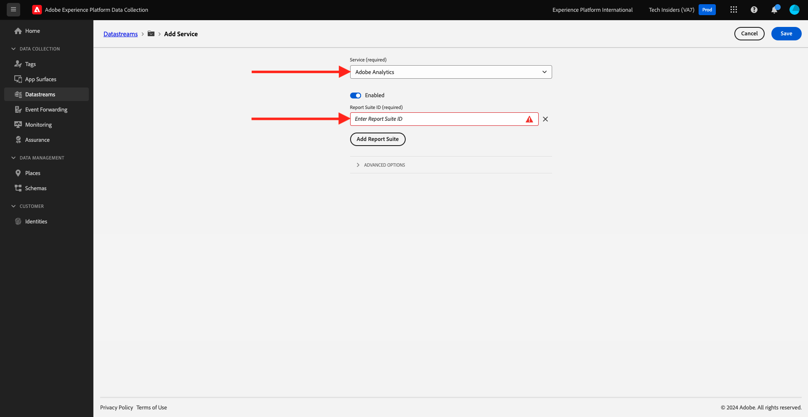

# 1.1.5 - Implementação do Adobe Analytics e do Adobe Audience Manager

## Contexto

Agora você sabe que os dados XDM estão fluindo para a plataforma. Você explorará mais sobre o que é o XDM no [Módulo 2](./../module1.2/data-ingestion.md), bem como sobre como criar seu próprio esquema para rastrear variáveis personalizadas. Por enquanto, você observará o que acontece quando você define a sequência de dados para encaminhar dados para o Analytics e o Audience Manager.

## 1.1.5.1 Mapeamento de variáveis no Analytics

O Adobe Experience Platform [!DNL Web SDK] mapeia determinados valores automaticamente, fazendo uma nova implementação do Analytics por meio do SDK da Web o mais rápido possível. As variáveis mapeadas automaticamente estão listadas [aqui](https://experienceleague.adobe.com/docs/experience-platform/edge/data-collection/adobe-analytics/automatically-mapped-vars.html#data-collection).

Para dados XDM que não são mapeados automaticamente para [!DNL Adobe Analytics], você pode usar [dados de contexto](https://experienceleague.adobe.com/docs/analytics/implementation/vars/page-vars/contextdata.html?lang=pt-BR) para corresponder ao seu [esquema](https://experienceleague.adobe.com/docs/experience-platform/xdm/schema/composition.html?lang=pt-BR). Em seguida, ele pode ser mapeado para [!DNL Analytics] usando [regras de processamento](https://experienceleague.adobe.com/docs/analytics/admin/admin-tools/processing-rules/processing-rules-configuration/t-processing-rules.html) para preencher [!DNL Analytics] variáveis. Dados de contexto e regras de processamento serão conceitos familiares àqueles que trabalharam com o Analytics no passado, mas não se preocupe com os detalhes por enquanto se forem novos conceitos.

Você também pode usar um conjunto padrão de ações e listas de produtos para enviar ou recuperar dados com a AEP [!DNL Web SDK]. Para fazer isso, consulte [Produtos](https://experienceleague.adobe.com/docs/experience-platform/edge/data-collection/collect-commerce-data.html?lang=en#data-collection).

### Dados de contexto

Para serem usados por [!DNL Analytics], os dados XDM são nivelados por meio de notação de pontos e disponibilizados como `contextData`. A lista de pares de valores a seguir mostra um exemplo de `context data`:

```javascript
{
    "bh": "900",
    "bw": "1680",
    "c": "24",
    "c.a.d.key.[0]": "value1",
    "c.a.d.key.[1]": "value2",
    "c.a.d.object.key1": "value1",
    "c.a.d.object.key2.[0]": "value2",
    "c.a.x.environment.browserdetails.javascriptenabled": "true",
    "c.a.x.environment.type": "browser",
    "cust_hit_time_gmt": "1579781427",
    "g": "http://example.com/home",
    "gn": "home",
    "j": "1.8.5",
    "k": "Y",
    "s": "1680x1050",
    "tnta": "218287:1:0|0,218287:1:0|2,218287:1:0|1,218287:1:0|32767,218287:1:01,218287:1:0|0,218287:1:0|1,218287:1:0|0,218287:1:0|1",
    "user_agent": "Mozilla/5.0 AppleWebKit/537.36 Safari/537.36",
    "v": "Y"
}
```

### Regras de processamento

Todos os dados coletados pela rede de borda podem ser acessados pelas [regras de processamento](https://experienceleague.adobe.com/docs/analytics/admin/admin-tools/processing-rules/processing-rules-configuration/t-processing-rules.html). No [!DNL Analytics], você pode usar as regras de processamento para incorporar dados de contexto às variáveis [!DNL Analytics].

## 1.1.5.2 Audience Manager no Edge Network Experience Platform

O encaminhamento pelo lado do servidor não é um conceito novo para o Audience Manager e é aplicável o mesmo processo de antes. Você também pode sincronizar identidades.

## 1.1.5.3 Revise sua sequência de dados para enviar dados ao Adobe Analytics

Caso deseje enviar dados coletados pelo SDK da Web para o Adobe Analytics e o Adobe Audience Manager, siga estas etapas.

Vá para [https://experience.adobe.com/launch/](https://experience.adobe.com/launch/) e vá para **Datastreams**.

No canto superior direito da tela, selecione o nome da sandbox, que deve ser `--aepSandboxName--`. Abra a sequência de dados específica chamada `--aepUserLdap-- - Demo System Datastream`.


Você verá isso. Para habilitar o Adobe Analytics, clique em **+Adicionar Serviço**.


Você verá isso. Selecione o serviço **Adobe Analytics**, após o qual você precisará adicionar o conjunto de relatórios no Adobe Analytics para enviar dados ao. Neste tutorial, isso está fora do escopo. Clique em **Cancelar**.



## 1.1.5.4 Revise sua sequência de dados para enviar dados ao Adobe Audience Manager

Você verá isso. Para habilitar o Adobe Audience Manager, clique em **+Adicionar Serviço**.


Você verá isso. Selecione o serviço **Adobe Audience Manager** após o qual você pode decidir ativar ou desativar destinos de cookies e/ou URL do Adobe Audience Manager. Neste tutorial, essa configuração está fora do escopo. Clique em **Cancelar**.


Próxima etapa: [1.1.6 Implementar o Adobe Target](./ex6.md)

[Voltar ao módulo 1.1](./data-ingestion-launch-web-sdk.md)

[Voltar a todos os módulos](./../../../overview.md)
