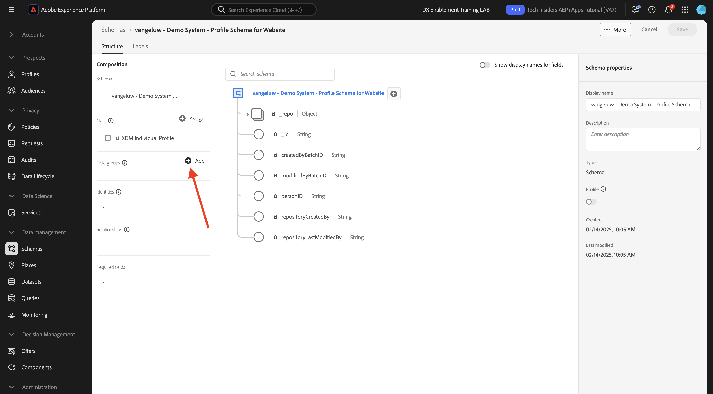
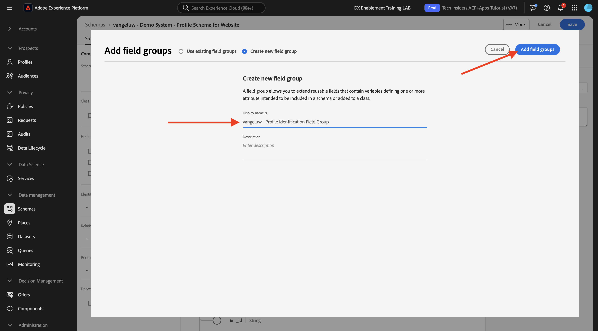
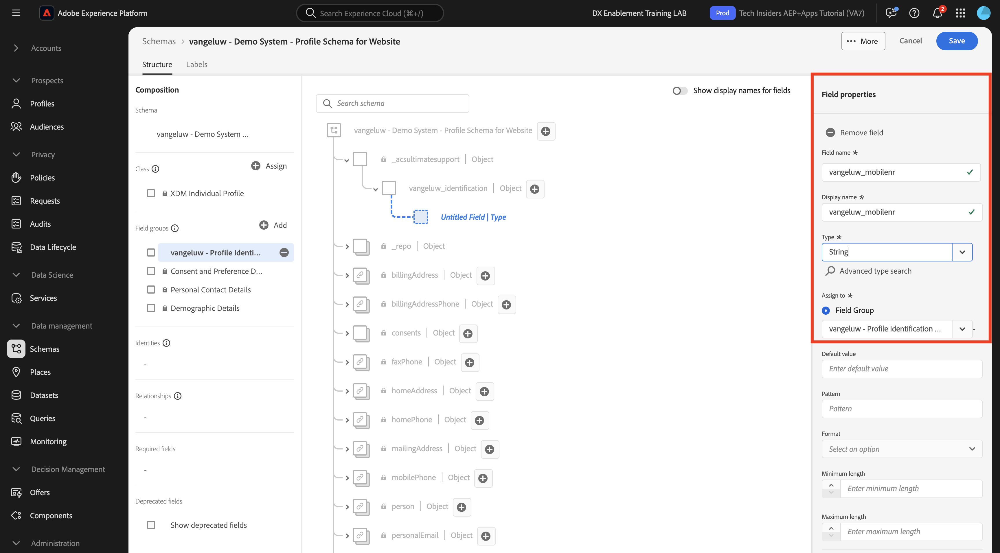
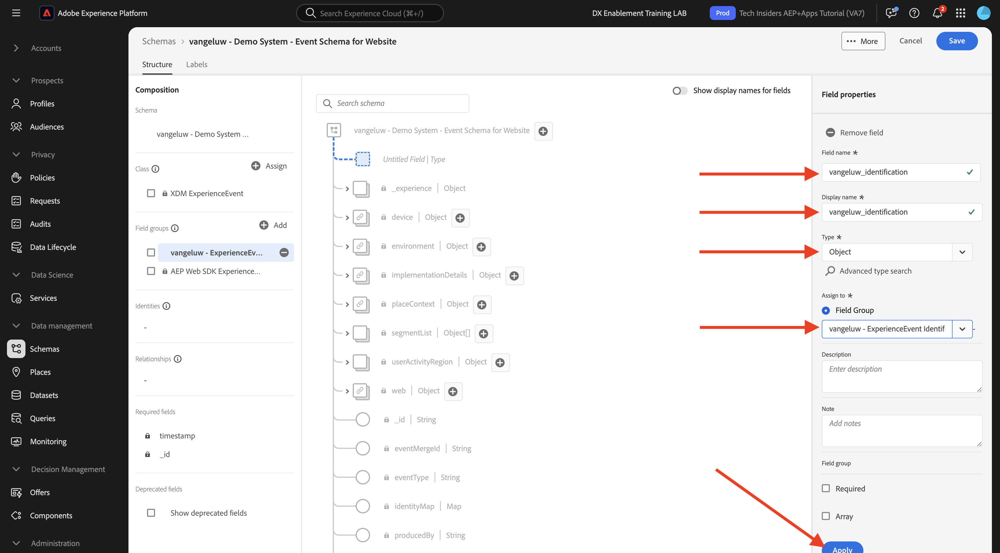
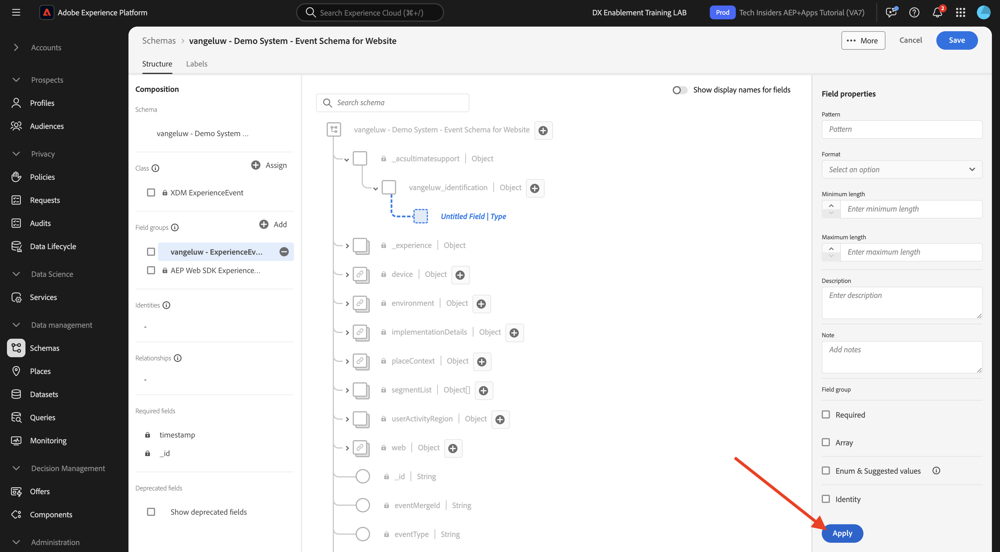
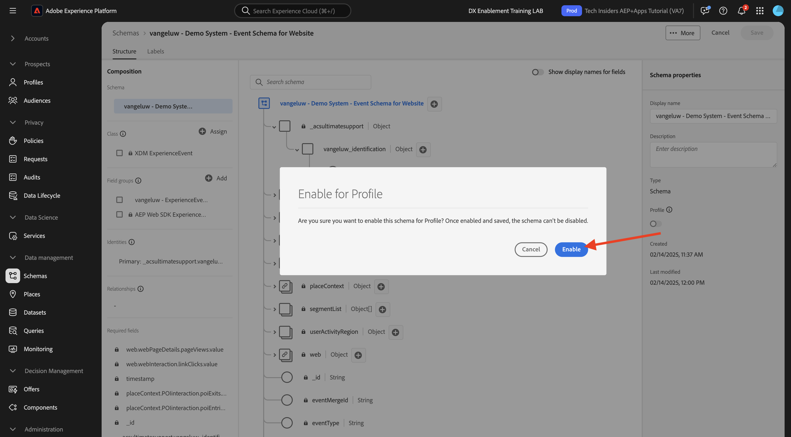

# 1.2.2 Configurar esquemas e definir identificadores

Neste exercício, você revisará a configuração dos esquemas XDM necessários para classificar as informações do perfil e o comportamento do cliente. Em cada esquema XDM, você também verá que um identificador principal é definido para vincular todas as informações relacionadas ao cliente ao.

## Story

Antes de começar a configurar o Esquema XDM e definir Identificadores, você precisa pensar no contexto de negócios do que estamos tentando fazer:

- Você deseja dados
- Você deseja vincular dados a um cliente
- Você deseja criar um Perfil de cliente progressivo em tempo real

Há dois tipos de dados que queremos capturar:

- Quem é esse cliente?
- O que este cliente faz?

No entanto, a pergunta **Quem é esse cliente?** é uma pergunta muito aberta e com muitas respostas. Quando sua organização quiser ver essa pergunta respondida, você procura informações demográficas como Nome, Sobrenome e Endereço. Mas também para informações de contato, como um endereço de email ou um número de celular. E também para informações vinculadas a Idioma, OptIn/OptOut e talvez até mesmo Imagens de perfil. E, finalmente, o que você realmente precisa saber é como vamos identificar esse cliente nos vários sistemas que sua organização usa.

O mesmo vale para a pergunta **O que este cliente faz?**. É uma pergunta muito aberta e com muitas respostas. Quando sua organização quiser ver essa pergunta respondida, você procura qualquer interação que um cliente tenha tido com qualquer uma de suas propriedades online e offline. Quais páginas ou produtos foram visitados? Esse cliente adicionou um produto ao carrinho ou até comprou um item? Qual dispositivo e navegador foram usados para navegar no site? Que tipo de informações esse cliente está procurando e como podemos usá-las para configurar e fornecer uma experiência agradável a esse cliente? E, finalmente, o que realmente precisamos saber é como vamos identificar esse cliente nos vários sistemas que sua organização usará.

## Quem é este cliente

Capturando a resposta para **Quem é este cliente?O** da sua organização é feito por meio da página de Logon/Registro.

Da perspectiva do Esquema, vemos isso como uma **Classe**. A pergunta: **Quem é este cliente?** é algo que definimos no **[!UICONTROL Perfil Individual XDM]** da Classe.

Portanto, ao criar um esquema XDM para capturar a resposta para **Quem é esse cliente?**, primeiro, será necessário criar e definir 1 esquema que faça referência à classe **[!UICONTROL Perfil Individual XDM]**.

Para especificar que tipo de respostas podem ser dadas a essa pergunta, você precisará definir [!UICONTROL Grupos de Campos]. [!UICONTROL Grupos de Campos] são extensões da classe de Perfil e têm configurações muito específicas. Por exemplo, informações demográficas como Nome, Sobrenome, Sexo e Aniversário fazem parte do [!UICONTROL Grupo de Campos]: **[!UICONTROL Detalhes Demográficos]**.

Em segundo lugar, sua organização precisa decidir como identificar esse cliente. No caso de sua organização, o identificador principal de um cliente conhecido pode ser uma ID de cliente específica, como por exemplo um endereço de email. Mas, tecnicamente, há outras maneiras de identificar um cliente em sua organização, como usar um número de celular.
Neste laboratório, vamos definir o endereço de email como o identificador principal e o número de telefone como um identificador secundário.

Por fim, é importante distinguir o canal no qual os dados foram capturados. Nesse caso, falaremos sobre Registros de Site e o esquema que precisa ser definido precisa refletir **onde** os dados de registro foram capturados. O canal também terá um papel importante em influenciar quais dados são capturados. Dessa forma, é uma prática recomendada definir esquemas para cada combinação de canal, identificador principal e tipo de dados coletados.

Com base no exposto acima, os esquemas foram criados no Adobe Experience Platform.

Faça logon no Adobe Experience Platform acessando esta URL: [https://experience.adobe.com/platform](https://experience.adobe.com/platform).

Depois de fazer logon, você chegará à página inicial do Adobe Experience Platform.

Antes de continuar, você precisa selecionar uma **sandbox**. A sandbox a ser selecionada é chamada ``--aepSandboxName--``. Depois de selecionar a sandbox apropriada, você verá a alteração da tela e agora estará em sua sandbox dedicada.

No Adobe Experience Platform, clique em **[!UICONTROL Esquemas]** no menu à esquerda da tela. Você verá a lista de [!UICONTROL Esquemas] disponíveis.

Você deve criar um novo schema. Para criar um novo esquema, clique em **[!UICONTROL + Criar esquema]**.

Selecione **Manual** e clique em **Selecionar**.

Em seguida, selecione **Perfil Individual** e clique em **Avançar**.

Insira o nome do esquema desta forma: `--aepUserLdap-- - Demo System - Profile Schema for Website`. Clique em **Concluir**.

Um novo schema foi criado.

Agora é necessário definir qual é a resposta à pergunta **Quem é esse cliente?** deve ter a aparência de.
Na introdução desse laboratório, observamos a necessidade dos seguintes atributos para definir um cliente:

- Informações demográficas, como nome, sobrenome e endereço
- Informações de contato, como endereço residencial, endereço de email ou número de celular
- Outras informações vinculadas ao idioma, aceitação/recusa e talvez até mesmo Imagens de perfil.
- Identificador principal de um cliente

Para fazer com que essas informações façam parte do esquema, você precisa adicionar os seguintes [!UICONTROL Grupos de Campos] ao esquema:

- Detalhes demográficos (Informações demográficas)
- Detalhes de contato pessoal (Informações de contato)
- Detalhes sobre consentimento e preferência (outras informações)
- Grupo de campos de identificação de perfil personalizado da sua organização (Identificadores primário e secundário)

Clique no botão **+Adicionar** em **Grupos de campos**.

Na tela **[!UICONTROL Adicionar Grupo de Campos]**, selecione os [!UICONTROL Detalhes Demográficos do Grupo de Campos]****, **[!UICONTROL Detalhes de Contatos Pessoais]** e **[!UICONTROL Detalhes de Consentimento e Preferência]**.

Clique no botão **[!UICONTROL Adicionar Grupos de Campos]** para adicionar o [!UICONTROL Grupo de Campos] ao esquema.

Agora você terá isto:

Em seguida, você precisa de um novo [!UICONTROL Grupo de Campos] para capturar o **[!UICONTROL Identificador]** usado para a coleta de dados. Como você viu no exercício anterior, há um conceito de Identificadores. O Identificador principal é o mais importante, pois todos os dados coletados serão vinculados a esse Identificador.

Agora você criará seu próprio [!UICONTROL Grupo de campos] personalizado e, como tal, estenderá o [!UICONTROL Esquema XDM] para atender aos requisitos de sua própria organização.

Clique em **[!UICONTROL + Adicionar]** em **Grupos de campos** para começar a adicionar um [!UICONTROL Grupo de Campos].

Em vez de reutilizar um [!UICONTROL Grupo de Campos] existente, você criará seu próprio [!UICONTROL Grupo de Campos]. Você pode fazer isso selecionando **[!UICONTROL Criar Novo Grupo de Campos]**.

Agora você precisa fornecer um **[!UICONTROL Nome para Exibição]** e uma **[!UICONTROL Descrição]** para o seu novo [!UICONTROL Grupo de Campos].

Como o nome do esquema, usaremos:
`--aepUserLdap-- - Profile Identification Field Group`

Clique no botão **[!UICONTROL Adicionar Grupos de Campos]** para adicionar o [!UICONTROL Grupo de Campos] recém-criado ao esquema.

Agora essa estrutura de esquema está em vigor.

Seu novo [!UICONTROL Grupo de Campos] ainda está vazio, portanto, agora você terá que adicionar campos a esse [!UICONTROL Grupo de Campos].
Na lista do [!UICONTROL Grupo de campos], clique no [!UICONTROL Grupo de Campos] personalizado e em **Procurar**.

Agora você vê vários novos botões serem exibidos.

No nível superior do esquema, clique no botão **[!UICONTROL + Adicionar campo]**.

Depois de clicar no botão **[!UICONTROL + Adicionar campo]**, você verá um novo campo sem título no esquema.

Agora você deve inserir as informações desse novo campo, usando estas definições de objeto:

- Nome do campo: **[!UICONTROL identificação]**
- Nome de exibição: **[!UICONTROL identificação]**
- Tipo: **[!UICONTROL objeto]**
- Grupo de campos: **`--aepUserLdap-- - Profile Identification Field Group`**

Clique em **Aplicar**.

Agora você verá um novo objeto no esquema, que representa um **[!UICONTROL objeto]** personalizado no esquema e que é nomeado com base na sua ID de locatário do Adobe Experience Platform. Sua ID de locatário do Adobe Experience Platform é `--aepTenantId--` e é exclusiva de cada instância da AEP.

Agora você adicionará um novo objeto de 3 campos sob esse locatário, no objeto **identificação** que acabou de criar. Para começar a adicionar cada um desses três campos, clique no ícone **+** em **identificação** para cada campo.

Use as informações abaixo para criar esses três novos campos no objeto **[!UICONTROL identification]**:

- ecid:
   - Nome do campo: **[!UICONTROL ecid]**
   - Nome de exibição: **[!UICONTROL ecid]**
   - Tipo: **[!UICONTROL Cadeia de caracteres]**
   - Grupo de campos: **`--aepUserLdap-- - Profile Identification Field Group`**

- emailId
   - Nome do campo: **[!UICONTROL emailId]**
   - Nome de exibição: **[!UICONTROL emailId]**
   - Tipo: **[!UICONTROL Cadeia de caracteres]**
   - Grupo de campos: **`--aepUserLdap-- - Profile Identification Field Group`**

- mobilener
   - Nome do campo: **[!UICONTROL mobilener]**
   - Nome de exibição: **[!UICONTROL mobilener]**
   - Tipo: **[!UICONTROL Cadeia de caracteres]**
   - Grupo de campos: **`--aepUserLdap-- - Profile Identification Field Group`**

Esta é a aparência de cada campo após a configuração inicial do campo.

- mobilener

Para salvar seu campo, role para baixo nas **[!UICONTROL Propriedades do Campo]** até ver o botão **[!UICONTROL Aplicar]**. Clique no botão **[!UICONTROL Aplicar]**.

- ecid

Não se esqueça de rolar para baixo e clicar em **Aplicar**.

- emailId

Não se esqueça de rolar para baixo e clicar em **Aplicar**.

Cada campo é definido como tipo **[!UICONTROL Cadeia de caracteres]** e você configurará esses campos como **[!UICONTROL Identidades]**. Para este esquema, pressupomos que um cliente sempre será identificado por seu endereço de email, o que significa que você deve configurar o campo **[!UICONTROL emailId]** como um identificador **[!UICONTROL principal]** e os outros campos como identificadores normais.

Seus 3 campos agora devem ser definidos como campos de **[!UICONTROL identidade]**.

Para começar a definir esses campos como campos de **[!UICONTROL identidade]**, siga estas etapas:

- Selecione o campo **[!UICONTROL emailId]**.
- No lado direito, nas propriedades do campo, role para baixo até ver **[!UICONTROL Identidade]**. Marque a caixa de seleção de **[!UICONTROL Identidade]**.

- Marque agora a caixa de seleção de **[!UICONTROL Identidade principal]**.

- Por fim, selecione o namespace **[!UICONTROL Email]** na lista de **[!UICONTROL Namespaces]**. Um Namespace é usado pelo Gráfico de identidade no Adobe Experience Platform para classificar identificadores em namespaces e definir a relação entre esses namespaces. Clique em **[!UICONTROL Aplicar]** para salvar as alterações.

Em seguida, defina os outros campos para **[!UICONTROL ecid]** e **[!UICONTROL mobilener]** como identificadores padrão.

Selecione o campo **[!UICONTROL ecid]**. No lado direito, nas propriedades do campo, role para baixo até ver **[!UICONTROL Identidade]**. Marque a caixa de seleção de **[!UICONTROL Identidade]**.
Em seguida, selecione o namespace **[!UICONTROL ECID]** na lista de **[!UICONTROL Namespaces]**.
Clique em **[!UICONTROL Aplicar]** para salvar as alterações.

Selecione o campo **[!UICONTROL mobilener]**. No lado direito, nas propriedades do campo, role para baixo até ver **[!UICONTROL Identidade]**. Marque a caixa de seleção de **[!UICONTROL Identidade]**.
Selecione o namespace **[!UICONTROL Telefone]** na lista de **[!UICONTROL Namespaces]**.
Clique em **[!UICONTROL Aplicar]** para salvar as alterações.

O objeto **[!UICONTROL identification]** agora deve ter esta aparência, com os 3 campos id agora mostrando também um ícone **[!UICONTROL impressão digital]** para mostrar que eles foram definidos como identificadores.

Clique em **[!UICONTROL Salvar]** para salvar as alterações.

A última coisa a fazer aqui é ativar o Esquema a ser vinculado ao **[!UICONTROL Perfil]**.
Ao ativar o esquema para Perfil, você garante que todos os dados enviados para a Adobe Experience Platform em relação a esse esquema farão parte do ambiente Perfil do cliente em tempo real, que garante que todos esses dados possam ser usados em tempo real para consulta, segmentação e ativação.

Para fazer isso, selecione o nome do schema.

Na guia direita do esquema, clique em **[!UICONTROL Alternância de perfil]**, que está desativada no momento.

Ative o [!UICONTROL Perfil] - alterne clicando nele.

Clique em **[!UICONTROL Habilitar]** para habilitar este esquema para o Perfil.

Seu Esquema agora está configurado para fazer parte do [!UICONTROL Perfil de cliente em tempo real]. Clique em **[!UICONTROL Salvar]** para salvar seu esquema.

### O que um cliente faz?

Captura da resposta à pergunta **O que este cliente faz?O** da sua organização é feito por meio, por exemplo, de uma exibição de produto em uma página de produto.

De uma perspectiva de esquema, vemos isso como uma **[!UICONTROL Classe]**. A pergunta: **O que este cliente faz?** é algo que definimos na classe **[!UICONTROL ExperienceEvent]**.

Portanto, ao criar um [!UICONTROL Esquema XDM] para capturar a resposta para **O que este cliente faz?**, primeiro, será necessário criar e definir 1 esquema que faça referência à classe **[!UICONTROL ExperienceEvent]**.

Para especificar que tipo de respostas podem ser dadas a essa pergunta, você precisará definir o [!UICONTROL Grupo de Campos]. [!UICONTROL Grupos de Campos] são extensões da Classe [!UICONTROL ExperienceEvent] e têm configurações muito específicas. Por exemplo, informações sobre que tipo de produtos um cliente visualizou ou adicionou ao carrinho fazem parte do [!UICONTROL Grupo de campos] **Detalhes do Commerce**.

Em segundo lugar, sua organização precisa decidir como você identificará o comportamento desse cliente. Como estamos falando de interações em um site, é possível que sua organização conheça o cliente, mas é igualmente possível que um visitante desconhecido e anônimo esteja ativo no site. Portanto, não podemos usar um identificador como endereço de email. Nesse caso, sua organização provavelmente decidirá usar a [!UICONTROL Experience Cloud ID (ECID)] como o identificador principal.

Por fim, é importante distinguir o canal no qual os dados foram capturados. Nesse caso, falaremos sobre Interações de Site e o esquema que precisa ser definido precisa refletir **onde** os dados de interação foram capturados. O canal também terá um papel importante em influenciar quais dados são capturados. Dessa forma, é uma prática recomendada definir esquemas para cada combinação de canal, identificador principal e tipo de dados coletados.

Com base no exposto acima, será necessário configurar um esquema no Adobe Experience Platform.

Depois de fazer logon, você chegará à página inicial do Adobe Experience Platform.

Antes de continuar, você precisa selecionar uma **[!UICONTROL sandbox]**. A [!UICONTROL sandbox] a ser selecionada chama-se ``--aepSandboxName--``. Depois de selecionar a sandbox apropriada, você verá a alteração da tela e agora estará em sua sandbox dedicada.

No Adobe Experience Platform, clique em **[!UICONTROL Esquemas]** no menu no lado esquerdo da tela e vá para **Procurar**.

Em [!UICONTROL Esquemas], você verá todos os esquemas existentes. Você deve criar um novo schema. Para criar um novo esquema, clique no botão **[!UICONTROL + Criar Esquema]**.

Selecione **Manual** e clique em **Selecionar**.

Selecione **Evento de experiência** e clique em **Avançar**.

Insira um nome para o esquema, desta forma: `--aepUserLdap-- - Demo System - Event Schema for Website`. Clique em **Concluir**.

Um novo schema é criado e você pode configurar em quais dados serão coletados.

Agora é necessário definir o que responder à pergunta **O que este cliente faz?** deve ter a aparência de.
Na introdução desse laboratório, observamos a necessidade dos seguintes atributos para definir o que um cliente faz:

- Quais páginas ou produtos foram visitados?
- Esse cliente adicionou um produto ao carrinho ou até comprou um item?
- Qual dispositivo e navegador foram usados para navegar no site?
- Que tipo de informações esse cliente está procurando e como podemos usá-las para configurar e fornecer uma experiência agradável a esse cliente?
- Identificador principal de um cliente

Para fazer com que essas informações façam parte do esquema, você precisa adicionar o seguinte [!UICONTROL Grupo de campos] ao esquema:

- AEP Web SDK ExperienceEvent
- a identificação de perfil personalizada da sua organização [!UICONTROL Grupo de campos]

Clique em **+ Adicionar** em **Grupos de campos**.

Na tela **[!UICONTROL Adicionar Grupo de Campos]**, selecione o [!UICONTROL Grupo de Campos] **[!UICONTROL AEP Web SDK ExperienceEvent]**. Clique em **[!UICONTROL Adicionar grupos de campos]**.

Você terá isto:

Em seguida, é necessário criar um novo [!UICONTROL Grupo de Campos] para capturar o **[!UICONTROL Identificador]** usado para a coleta de dados.

Agora você criará seu próprio [!UICONTROL Grupo de campos] personalizado e, como tal, estenderá o [!UICONTROL Esquema XDM] para atender aos requisitos de sua própria organização.

Um [!UICONTROL Grupo de Campos] está vinculado a uma [!UICONTROL Classe], o que significa que você não pode simplesmente reutilizar o [!UICONTROL Grupo de Campos] criado anteriormente.

Clique no botão **[!UICONTROL + Adicionar]** para começar a adicionar um [!UICONTROL Grupo de Campos].

Em vez de reutilizar um [!UICONTROL Grupo de Campos] existente, você criará seu próprio [!UICONTROL Grupo de Campos]. Selecione **[!UICONTROL Criar Novo Grupo de Campos]** e digite o nome do Grupo de Campos, desta forma: `--aepUserLdap-- - ExperienceEvent Identification Field Group`.
Clique em **Adicionar grupos de campos**

Agora você deve ter essa estrutura [!UICONTROL Esquema] em vigor.

Seu novo [!UICONTROL Grupo de Campos] ainda está vazio, portanto, agora você terá que adicionar campos a esse Grupo de Campos.
Na lista do [!UICONTROL Grupo de campos], clique no [!UICONTROL Grupo de Campos] personalizado.

Agora você vê vários novos botões serem exibidos.

No nível superior do Esquema, ao lado do Esquema - nome, clique no botão **[!UICONTROL +]**.

Depois de clicar no botão **+**, você verá um novo campo sem título no esquema.

Use esta opção para definir seu novo campo:

- Nome do campo: **[!UICONTROL identificação]**
- Nome de exibição: **[!UICONTROL identificação]**
- Tipo: **[!UICONTROL objeto]**
- Grupo de campos: `--aepUserLdap-- - ExperienceEvent Identification Field Group`

Clique em **Aplicar**.

O novo campo foi criado na ID de locatário do Adobe Experience Platform. Sua ID de locatário do Adobe Experience Platform é `--aepTenantId--`.

Agora você adicionará 1 novo campo sob o objeto **[!UICONTROL identification]**.

Clique no botão **[!UICONTROL +]** ao lado do objeto **[!UICONTROL identification]** para criar um novo campo.

O campo da ECID será definido como tipo **[!UICONTROL Cadeia de caracteres]** e você configurará este campo como uma **[!UICONTROL Identidade]**. Para o Esquema **[!UICONTROL Sistema de demonstração - Esquema de evento para o site]**, pressupomos que um cliente sempre será identificado por sua [!UICONTROL ECID], o que significa que você deve configurar o campo **[!UICONTROL ECID]** como um identificador **primário**

Agora você tem um campo vazio. Você precisa configurar o campo acima conforme indicado.

- ecid:

   - Nome do campo: **[!UICONTROL ecidweb]**
   - Nome de exibição: **[!UICONTROL ecidweb]**
   - Tipo: **[!UICONTROL Cadeia de caracteres]**
   - Grupo de campos: `--aepUserLdap-- - ExperienceEvent Identification Field Group`

É assim que o campo [!UICONTROL ecid] deve parecer após a configuração inicial do campo:

Role para baixo e clique em **[!UICONTROL Aplicar]**.

Agora você tem um novo campo, mas esse campo ainda não foi definido como um campo de **[!UICONTROL Identidade]**.

Para começar a definir esses campos como **[!UICONTROL Identidade]**-campos, selecione o campo **[!UICONTROL ecid]**.
No lado direito, nas propriedades do campo, role para baixo até ver **[!UICONTROL Identidade]**. Marque a caixa de seleção de **[!UICONTROL Identidade]** e marque a caixa de seleção de **[!UICONTROL Identidade principal]**.
Selecione o namespace **[!UICONTROL ECID]** na lista de **[!UICONTROL Namespaces]**.

Clique em **[!UICONTROL Aplicar]** para salvar as alterações.

O objeto **[!UICONTROL identification]** agora deve ter esta aparência, com o campo ecid mostrando também um ícone **impressão digital** para mostrar que foram definidos como identificadores.
Clique em **[!UICONTROL Salvar]** para salvar as alterações.

É importante observar que, ao assimilar dados em relação a esse esquema, alguns campos são obrigatórios.
Por exemplo, os campos **[!UICONTROL _id]** e **[!UICONTROL timestamp]** são campos obrigatórios, que é um requisito imposto pela Classe ExperienceEvent.

- _id precisa conter uma id exclusiva para uma assimilação de dados específica
- o carimbo de data/hora precisa ser o carimbo de data/hora desta ocorrência, no formato **`"YYYY-MM-DDTHH:MM:SSSZ"`**, como por exemplo: **`"2024-11-18T07:20:000Z"`**

Agora você definiu um esquema, vinculou [!UICONTROL Grupos de Campos] existentes e recém-criados e definiu identificadores.

A última coisa a fazer aqui é ativar o Esquema a ser vinculado ao **[!UICONTROL Perfil]**.
Ao habilitar seu esquema para o [!UICONTROL Perfil], você garante que todos os dados enviados para a Adobe Experience Platform com base nesse esquema farão parte do Perfil do cliente em tempo real, o que garante que todos esses dados possam ser usados em tempo real para consulta, segmentação e ativação.

Para fazer isso, clique no nome do schema.

Na guia direita do esquema, você verá um **[!UICONTROL Alternância de perfil]**, que está desativado no momento. Clique em [!UICONTROL Perfil] - alternar para habilitá-lo.

Você verá esta mensagem. Clique em **[!UICONTROL Habilitar]** para habilitar este esquema para o Perfil.

Seu esquema agora está configurado para fazer parte do Perfil de cliente em tempo real.

Clique em **[!UICONTROL Salvar]** para salvar seu esquema.

Agora você concluiu a criação de esquemas que estão ativados para serem usados no Perfil do cliente em tempo real.

Vamos analisar os conjuntos de dados no próximo exercício.

Próxima Etapa: [1.2.3 Configurar Conjuntos De Dados](./ex3.md)

[Voltar ao módulo 1.2](./data-ingestion.md)

[Voltar a todos os módulos](../../../overview.md)
