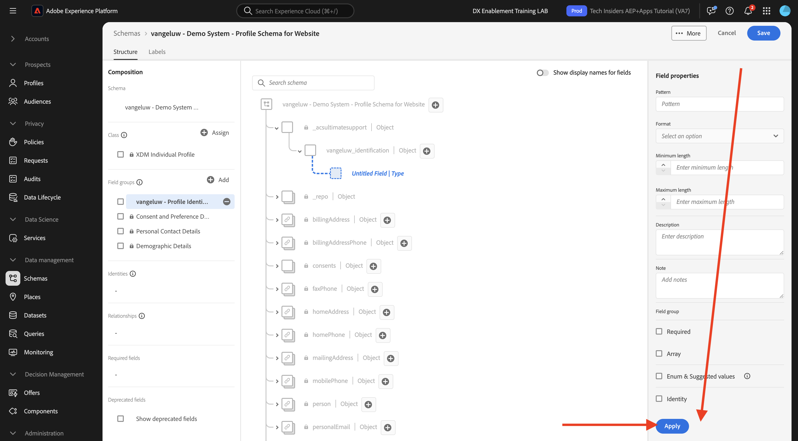
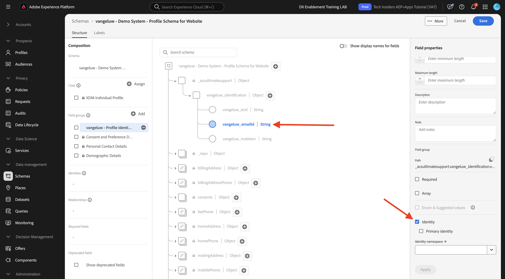
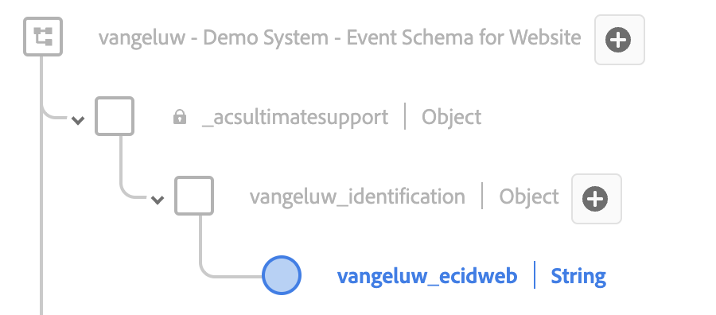
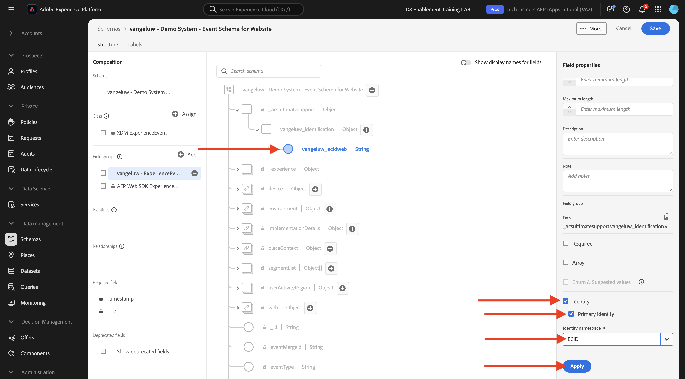

# 1.2.2 Configurar esquemas e definir identificadores

Neste exercício, você configurará os esquemas XDM necessários para classificar as informações do perfil e o comportamento do cliente. Em cada esquema XDM, também será necessário configurar um identificador primário para vincular todas as informações.

## Story

Antes de começar a configurar o esquema XDM e definir os Identificadores primários, precisamos pensar no contexto de negócios do que estamos tentando fazer:

- Você deseja dados
- Você deseja vincular dados a um cliente
- Você deseja criar um Perfil de cliente progressivo em tempo real

Há dois tipos de dados que queremos capturar:

- Quem é esse cliente?
- O que este cliente faz?

No entanto, a pergunta **Quem é esse cliente?** é uma pergunta muito aberta e com muitas respostas. Quando sua empresa quer ver essa pergunta respondida, você procura informações demográficas como Nome, Sobrenome e Endereço. Mas também para informações de contato, como um endereço de email ou um número de celular. E também para informações vinculadas a Idioma, OptIn/OptOut e talvez até mesmo Imagens de perfil. E, finalmente, o que você realmente precisa saber é como vamos identificar esse cliente nos vários sistemas que sua empresa usa.

O mesmo vale para a pergunta **O que este cliente faz?**. É uma pergunta muito aberta e com muitas respostas. Quando sua empresa quiser ver essa pergunta respondida, você procura qualquer interação que um cliente tenha tido com qualquer uma de suas propriedades online e offline. Quais páginas ou produtos foram visitados? Esse cliente adicionou um produto ao carrinho ou até comprou um item? Qual dispositivo e navegador foram usados para navegar no site? Que tipo de informações esse cliente está procurando e como podemos usá-las para configurar e fornecer uma experiência agradável a esse cliente? E, finalmente, o que realmente precisamos saber é como vamos identificar esse cliente nos vários sistemas que sua empresa usará.

## 1.2.1.1 - Quem é esse cliente

Capturando a resposta para **Quem é este cliente?O** da sua empresa é feito por meio da página de Logon/Registro.

Da perspectiva do Esquema, vemos isso como uma **Classe**. A pergunta: **Quem é este cliente?** é algo que definimos no **[!UICONTROL Perfil Individual XDM]** da Classe.

Portanto, ao criar um esquema XDM para capturar a resposta para **Quem é esse cliente?**, primeiro, será necessário criar e definir 1 esquema que faça referência à classe **[!UICONTROL Perfil Individual XDM]**.

Para especificar que tipo de respostas podem ser dadas a essa pergunta, você precisará definir [!UICONTROL Grupos de Campos]. [!UICONTROL Grupos de Campos] são extensões da classe de Perfil e têm configurações muito específicas. Por exemplo, informações demográficas como Nome, Sobrenome, Sexo e Aniversário fazem parte do [!UICONTROL Grupo de Campos]: **[!UICONTROL Detalhes Demográficos]**.

Em segundo lugar, sua empresa precisa decidir como identificar esse cliente. No caso de sua empresa, o identificador principal de um cliente conhecido pode ser uma ID de cliente específica, como por exemplo um endereço de email. Mas, tecnicamente, há outras maneiras de identificar um cliente em sua empresa, como usar um número de celular.
Neste laboratório, vamos definir o endereço de email como o identificador principal e o número de telefone como um identificador secundário.

Por fim, é importante distinguir o canal no qual os dados foram capturados. Nesse caso, falaremos sobre Registros de Site e o esquema que precisa ser definido precisa refletir **onde** os dados de registro foram capturados. O canal também terá um papel importante em influenciar quais dados são capturados. Dessa forma, é uma prática recomendada definir esquemas para cada combinação de canal, identificador principal e tipo de dados coletados.

Com base no que foi descrito acima, será necessário configurar um Esquema no Adobe Experience Platform.

Faça logon no Adobe Experience Platform acessando esta URL: [https://experience.adobe.com/platform](https://experience.adobe.com/platform).

Depois de fazer logon, você chegará à página inicial do Adobe Experience Platform.

Antes de continuar, você precisa selecionar uma **sandbox**. A sandbox a ser selecionada é chamada ``--module2sandbox--``. Você pode fazer isso clicando no texto **[!UICONTROL Produção]** na linha azul na parte superior da tela. Depois de selecionar a sandbox apropriada, você verá a alteração da tela e agora estará em sua sandbox dedicada.

No Adobe Experience Platform, clique em **[!UICONTROL Esquemas]** no menu à esquerda da tela. Você verá a lista de [!UICONTROL Esquemas] disponíveis.

Você deve criar um novo schema. Para criar um novo esquema, clique no botão **[!UICONTROL + Criar esquema]** e selecione **[!UICONTROL Perfil Individual XDM]**.

Depois de clicar no botão **[!UICONTROL + Criar Esquema]**, um novo esquema é criado e você será solicitado a selecionar ou criar **grupos de campos**.

Agora é necessário definir qual é a resposta à pergunta **Quem é esse cliente?** deve ter a aparência de.
Na introdução desse laboratório, observamos a necessidade dos seguintes atributos para definir um cliente:

- Informações demográficas, como nome, sobrenome e endereço
- Informações de contato, como endereço residencial, endereço de email ou número de celular
- Outras informações vinculadas ao idioma, aceitação/recusa e talvez até mesmo Imagens de perfil.
- Identificador principal de um cliente

Para fazer com que essas informações façam parte do esquema, você precisa adicionar os seguintes [!UICONTROL Grupos de Campos] ao esquema:

- Detalhes demográficos (Informações demográficas)
- Detalhes de contato pessoal (Informações de contato)
- Detalhes da preferência (outras informações)
- Grupo de campos de identificação de perfil personalizado da sua empresa (Identificadores primário e secundário)

Na tela **[!UICONTROL Adicionar Grupo de Campos]**, selecione os [!UICONTROL Grupo de Campos] **[!UICONTROL Detalhes Demográficos]**, **[!UICONTROL Detalhes de Contato Pessoal]** e **[!UICONTROL Detalhes de Preferência]**.

Clique no botão **[!UICONTROL Adicionar Grupos de Campos]** para adicionar o [!UICONTROL Grupo de Campos] ao esquema.

Agora você terá isto:

Em seguida, você precisa de um novo [!UICONTROL Grupo de Campos] para capturar o **[!UICONTROL Identificador]** usado para a coleta de dados. Como você viu no exercício anterior, há um conceito de Identificadores primário e secundário. O Identificador principal é o mais importante, pois todos os dados coletados serão vinculados a esse Identificador.

Agora você criará seu próprio [!UICONTROL Grupo de campos] personalizado e, como tal, estenderá o [!UICONTROL Esquema XDM] para atender aos requisitos de sua própria empresa.

Clique no botão **[!UICONTROL + Adicionar]** para começar a adicionar um [!UICONTROL Grupo de Campos].

Em vez de reutilizar um [!UICONTROL Grupo de Campos] existente, você criará seu próprio [!UICONTROL Grupo de Campos]. Você pode fazer isso selecionando **[!UICONTROL Criar Novo Grupo de Campos]**.

Agora você precisa fornecer um **[!UICONTROL Nome para Exibição]** e uma **[!UICONTROL Descrição]** para o seu novo [!UICONTROL Grupo de Campos].

Como o nome do esquema, usaremos:
`--aepUserLdap-- - Profile Identification Field Group`

Por exemplo, para ldap **[!UICONTROL vangeluw]**, este deve ser o nome do esquema:

**[!UICONTROL vangeluw - Grupo de Campos de Identificação de Perfil]**

Isso deve dar a você algo como isso:

Clique no botão **[!UICONTROL Adicionar Grupos de Campos]** para adicionar o [!UICONTROL Grupo de Campos] recém-criado ao esquema.

Agora você deve ter essa estrutura de esquema em vigor.

Seu novo [!UICONTROL Grupo de Campos] ainda está vazio, portanto, agora você terá que adicionar campos a esse [!UICONTROL Grupo de Campos].
Na lista do [!UICONTROL Grupo de campos], clique no [!UICONTROL Grupo de Campos] personalizado.

Agora você vê vários novos botões serem exibidos.

No nível superior do Esquema, clique no botão **[!UICONTROL + Adicionar campo]**.

Depois de clicar no botão **[!UICONTROL + Adicionar campo]**, você verá um novo **[!UICONTROL objeto]** no esquema. Este objeto representa um **[!UICONTROL objeto]** personalizado em seu Esquema e é nomeado de acordo com sua ID de locatário do Adobe Experience Platform. Sua ID de locatário do Adobe Experience Platform é `--aepTenantId--`.

Agora você adicionará um novo objeto sob esse locatário. Para fazer isso, clique no campo **[!UICONTROL Novo campo]** sob o objeto-locatário.

Use estas definições de objeto:

- Nome do campo: **[!UICONTROL identificação]**
- Nome de exibição: **[!UICONTROL identificação]**
- Tipo: **[!UICONTROL objeto]**

Clique em **[!UICONTROL Aplicar]** para salvar as alterações.

Depois de clicar em **[!UICONTROL Aplicar]**, você verá seu objeto **[!UICONTROL identificação]** no Esquema.

Agora você adicionará 3 novos campos no objeto **[!UICONTROL identificação]**:

- ecid:
   - Nome do campo: **[!UICONTROL ecid]**
   - Nome de exibição: **[!UICONTROL ecid]**
   - Tipo: **[!UICONTROL Cadeia de caracteres]**

- emailId
   - Nome do campo: **[!UICONTROL emailId]**
   - Nome de exibição: **[!UICONTROL emailId]**
   - Tipo: **[!UICONTROL Cadeia de caracteres]**

- mobilener
   - Nome do campo: **[!UICONTROL mobilener]**
   - Nome de exibição: **[!UICONTROL mobilener]**
   - Tipo: **[!UICONTROL Cadeia de caracteres]**

Cada campo será definido como tipo **[!UICONTROL Cadeia de caracteres]** e vamos configurar esses campos como **[!UICONTROL Identidades]**. Para o Esquema **[!UICONTROL Esquema de Registro de Site]**, pressupomos que um cliente sempre será identificado por seu endereço de email, o que significa que você deve configurar o campo **[!UICONTROL emailId]** como um identificador **[!UICONTROL principal]** e os outros campos como identificadores **[!UICONTROL secundários]**.

Para adicionar os campos, clique no botão **[!UICONTROL +]** ao lado do objeto **[!UICONTROL identification]**.

Agora você tem um campo vazio. Você precisa configurar os três campos acima conforme indicado.

Esta é a aparência de cada campo após a configuração inicial do campo.

Clique no botão **[!UICONTROL +]** ao lado do objeto **[!UICONTROL identification]** para criar um novo campo e preencher os campos conforme indicado.

- ecid

Para salvar seu campo, role para baixo nas **[!UICONTROL Propriedades do Campo]** até ver o botão **[!UICONTROL Aplicar]**. Clique no botão **[!UICONTROL Aplicar]**.

Clique no botão **[!UICONTROL +]** ao lado do objeto **[!UICONTROL identification]** para criar um novo campo e preencher os campos conforme indicado.

- emailId

Para salvar seu campo, role para baixo nas **[!UICONTROL Propriedades do Campo]** até ver o botão **[!UICONTROL Aplicar]**. Clique no botão **[!UICONTROL Aplicar]**.

Clique no botão **[!UICONTROL +]** ao lado do objeto **[!UICONTROL identification]** para criar um novo campo e preencher os campos conforme indicado.

- mobilener

Para salvar seu campo, role para baixo nas **[!UICONTROL Propriedades do Campo]** até ver o botão **[!UICONTROL Aplicar]**. Clique no botão **[!UICONTROL Aplicar]**.

Agora você tem três campos, mas eles ainda não foram definidos como campos de **[!UICONTROL identidade]**.

Para começar a definir esses campos como campos de **[!UICONTROL identidade]**, siga estas etapas:

- Selecione o campo **[!UICONTROL emailId]**.
- No lado direito, nas propriedades do campo, role para baixo até ver **[!UICONTROL Identidade]**. Marque a caixa de seleção de **[!UICONTROL Identidade]**.

  

- Marque agora a caixa de seleção de **[!UICONTROL Identidade principal]**.

  

- Por fim, selecione o namespace **[!UICONTROL Email]** na lista de **[!UICONTROL Namespaces]**. Um Namespace é usado pelo Gráfico de identidade no Adobe Experience Platform para classificar identificadores em namespaces e definir a relação entre esses namespaces.

  

- Finalmente, clique em **[!UICONTROL Aplicar]** para salvar suas alterações.

  

Em seguida, você deve definir os outros campos para **[!UICONTROL ecid]** e **[!UICONTROL mobilener]** como identificadores secundários.

- Selecione o campo **[!UICONTROL ecid]**.
- No lado direito, nas propriedades do campo, role para baixo até ver **[!UICONTROL Identidade]**. Marque a caixa de seleção de **[!UICONTROL Identidade]**.

  

- Em seguida, selecione o namespace **[!UICONTROL ECID]** na lista de **[!UICONTROL Namespaces]**. Um [!UICONTROL Namespace] é usado pelo Gráfico de identidade no Adobe Experience Platform para classificar identificadores em namespaces e definir a relação entre esses namespaces.

  

- Clique em **[!UICONTROL Aplicar]** para salvar as alterações.

  

- Selecione o campo **[!UICONTROL mobilener]**.
- No lado direito, nas propriedades do campo, role para baixo até ver **[!UICONTROL Identidade]**. Marque a caixa de seleção de **[!UICONTROL Identidade]**.

  

- Selecione o namespace **[!UICONTROL Telefone]** na lista de **[!UICONTROL Namespaces]**. Um Namespace é usado pelo Gráfico de identidade no Adobe Experience Platform para classificar identificadores em namespaces e definir a relação entre esses namespaces.

  

- Clique em **[!UICONTROL Aplicar]** para salvar as alterações.

  

O objeto **[!UICONTROL identification]** agora deve ter esta aparência, com os 3 campos id agora mostrando também um ícone **[!UICONTROL impressão digital]** para mostrar que eles foram definidos como identificadores.

Agora vamos dar um nome ao seu esquema. Selecione o campo **Esquema sem título**.

Como o nome do nosso esquema, você usará isto:

`--aepUserLdap-- - Demo System - Profile Schema for Website`

Substitua **[!UICONTROL ldap]** pelo seu ldap específico. Por exemplo, para ldap **[!UICONTROL vangeluw]**, este deve ser o nome do esquema:

**[!UICONTROL vangeluw - Sistema de Demonstração - Esquema de Perfil para Site]**

Isso deve dar a você algo como isso:

Agora você definiu um Esquema, vinculou [!UICONTROL Grupos de Campos] existentes e recém-criados e definiu identificadores.

Clique em **[!UICONTROL Salvar]** para salvar as alterações.

A última coisa a fazer aqui é ativar o Esquema a ser vinculado ao **[!UICONTROL Perfil]**.
Ao ativar o esquema para Perfil, você garante que todos os dados enviados para a Adobe Experience Platform em relação a esse esquema farão parte do ambiente Perfil do cliente em tempo real, que garante que todos esses dados possam ser usados em tempo real para consulta, segmentação e ativação.

Para fazer isso, vamos selecionar o nome do esquema.

Na guia direita do esquema, você verá um **[!UICONTROL Alternância de perfil]**, que está desativado no momento.

Ative o [!UICONTROL Perfil] - alterne clicando nele.

Você verá esta mensagem:

Clique em **[!UICONTROL Habilitar]** para habilitar este esquema para o Perfil.

Seu Esquema agora está configurado para fazer parte do [!UICONTROL Perfil de cliente em tempo real].

Finalmente, clique em **[!UICONTROL Salvar]** para salvar seu esquema.

### 1.2.1.2 - O que esse cliente faz

Captura da resposta à pergunta **O que este cliente faz?O** da sua empresa é feito por meio, por exemplo, de uma exibição de produto em uma página de produto.

De uma perspectiva de esquema, vemos isso como uma **[!UICONTROL Classe]**. A pergunta: **O que este cliente faz?** é algo que definimos na classe **[!UICONTROL ExperienceEvent]**.

Portanto, ao criar um [!UICONTROL Esquema XDM] para capturar a resposta para **O que este cliente faz?**, primeiro, será necessário criar e definir 1 esquema que faça referência à classe **[!UICONTROL ExperienceEvent]**.

Para especificar que tipo de respostas podem ser dadas a essa pergunta, você precisará definir o [!UICONTROL Grupo de Campos]. [!UICONTROL Grupos de Campos] são extensões da classe [!UICONTROL ExperienceEvent] e têm configurações muito específicas. Por exemplo, informações sobre que tipo de produtos um cliente visualizou ou adicionou ao carrinho fazem parte do [!UICONTROL Grupo de campos] **Detalhes do Commerce**.

Em segundo lugar, sua empresa precisa decidir como você identificará o comportamento desse cliente. Como estamos falando de interações em um site, é possível que sua empresa conheça o cliente, mas é igualmente possível que um visitante desconhecido e anônimo esteja ativo no site. Portanto, não podemos usar um identificador como endereço de email. Nesse caso, sua empresa provavelmente decidirá usar a [!UICONTROL Experience Cloud ID (ECID)] como o identificador principal.

Por fim, é importante distinguir o canal no qual os dados foram capturados. Nesse caso, falaremos sobre Interações de Site e o esquema que precisa ser definido precisa refletir **onde** os dados de interação foram capturados. O canal também terá um papel importante em influenciar quais dados são capturados. Dessa forma, é uma prática recomendada definir esquemas para cada combinação de canal, identificador principal e tipo de dados coletados.

Com base no exposto acima, será necessário configurar um esquema no Adobe Experience Platform.

Depois de fazer logon, você chegará à página inicial do Adobe Experience Platform.

Antes de continuar, você precisa selecionar uma **[!UICONTROL sandbox]**. A [!UICONTROL sandbox] a ser selecionada chama-se ``--module2sandbox--``. Você pode fazer isso clicando no texto **[!UICONTROL Produção]** na linha azul na parte superior da tela. Depois de selecionar a sandbox apropriada, você verá a alteração da tela e agora estará em sua sandbox dedicada.

No Adobe Experience Platform, clique em **[!UICONTROL Esquemas]** no menu à esquerda da tela.

Em [!UICONTROL Esquemas], você verá todos os esquemas existentes.

Você deve criar um novo schema. Para criar um novo esquema, clique no botão **[!UICONTROL + Criar esquema]** e selecione **[!UICONTROL XDM ExperienceEvent]**.

Depois de clicar no botão **[!UICONTROL + Criar Esquema]**, um novo esquema é criado e você será solicitado a selecionar ou criar **grupos de campos**.

Agora é necessário definir o que responder à pergunta **O que este cliente faz?** deve ter a aparência de.
Na introdução desse laboratório, observamos a necessidade dos seguintes atributos para definir o que um cliente faz:

- Quais páginas ou produtos foram visitados?
- Esse cliente adicionou um produto ao carrinho ou até comprou um item?
- Qual dispositivo e navegador foram usados para navegar no site?
- Que tipo de informações esse cliente está procurando e como podemos usá-las para configurar e fornecer uma experiência agradável a esse cliente?
- Identificador principal de um cliente

Para fazer com que essas informações façam parte do esquema, você precisa adicionar o seguinte [!UICONTROL Grupo de campos] ao esquema:

- Detalhes da Web
- Detalhes de comércio
- Detalhes do ambiente
- Identificação de perfil personalizada da sua empresa [!UICONTROL Grupo de campos] (Identificadores primário e secundário)

Na tela **[!UICONTROL Adicionar Grupo de Campos]**, selecione os [!UICONTROL Grupos de Campos] **[!UICONTROL Detalhes da Web]**, **[!UICONTROL Detalhes do Commerce]** e **[!UICONTROL Detalhes do Ambiente]**.

Clique no botão **[!UICONTROL Adicionar Grupos de Campos]** para adicionar o Grupo de Campos ao esquema.

Você terá isto:

Em seguida, é necessário criar um novo [!UICONTROL Grupo de Campos] para capturar o **[!UICONTROL Identificador]** usado para a coleta de dados. Como você viu no exercício anterior, há um conceito de Identificadores primário e secundário. O Identificador principal é o mais importante, pois todos os dados coletados serão vinculados a esse Identificador.

Agora você criará seu próprio [!UICONTROL Grupo de campos] personalizado e, como tal, estenderá o [!UICONTROL Esquema XDM] para atender aos requisitos de sua própria empresa.

Um [!UICONTROL Grupo de Campos] está vinculado a uma [!UICONTROL Classe], o que significa que você não pode simplesmente reutilizar o [!UICONTROL Grupo de Campos] criado anteriormente.

Clique no botão **[!UICONTROL + Adicionar]** para começar a adicionar um [!UICONTROL Grupo de Campos].

Em vez de reutilizar um [!UICONTROL Grupo de Campos] existente, você criará seu próprio [!UICONTROL Grupo de Campos]. Você pode fazer isso selecionando **[!UICONTROL Criar Novo Grupo de Campos]**.

Agora é necessário fornecer um **[!UICONTROL Nome para Exibição]** e uma **[!UICONTROL Descrição]** para o novo Grupo de Campos.

Como o nome do Grupo de campos, use:

`--aepUserLdap-- - ExperienceEvent Identification Field Group`

Por exemplo, para ldap **[!UICONTROL vangeluw]**, este deve ser o nome do esquema:

**[!UICONTROL vangeluw - Grupo de Campos de Identificação ExperienceEvent]**

Isso deve dar a você algo como isso:

Clique no botão **[!UICONTROL Adicionar Grupo de Campos]** para adicionar o [!UICONTROL Grupo de Campos] recém-criado ao esquema.

Agora você deve ter essa estrutura [!UICONTROL Esquema] em vigor.

Seu novo [!UICONTROL Grupo de Campos] ainda está vazio, portanto, agora você terá que adicionar campos a esse Grupo de Campos.
Na lista do [!UICONTROL Grupo de campos], clique no [!UICONTROL Grupo de Campos] personalizado.

Agora você vê vários novos botões serem exibidos.

No nível superior do Esquema, ao lado do Esquema - nome, clique no botão **[!UICONTROL +]**.

Depois de clicar no botão **[!UICONTROL +]**, você verá um novo **[!UICONTROL objeto]** no esquema. Este objeto representa um **[!UICONTROL objeto]** personalizado em seu [!UICONTROL Esquema] e é nomeado de acordo com sua ID de Locatário do Adobe Experience Platform. Sua ID de locatário do Adobe Experience Platform é `--aepTenantId--`.

Agora você adicionará um novo objeto sob esse locatário. Para fazer isso, clique no campo **[!UICONTROL Novo campo]** sob o objeto-locatário.

Use estas definições de objeto:

- Nome do campo: **[!UICONTROL identificação]**
- Nome de exibição: **[!UICONTROL identificação]**
- Tipo: **[!UICONTROL objeto]**

Role para baixo e clique em **[!UICONTROL Aplicar]** para salvar suas alterações.

Depois de clicar em **[!UICONTROL Aplicar]**, você verá seu objeto **[!UICONTROL identificação]** no Esquema.

Agora você adicionará 1 novo campo sob o objeto **[!UICONTROL identification]**.

Clique no botão **[!UICONTROL +]** ao lado do objeto **[!UICONTROL identification]** para criar um novo campo.

O campo da ECID será definido como tipo **[!UICONTROL Cadeia de caracteres]** e você configurará este campo como uma **[!UICONTROL Identidade]**. Para o Esquema **[!UICONTROL Sistema de demonstração - Esquema de evento para o site]**, pressupomos que um cliente sempre será identificado por sua [!UICONTROL ECID], o que significa que você deve configurar o campo **[!UICONTROL ECID]** como um identificador **primário**

Agora você tem um campo vazio. Você precisa configurar o campo acima conforme indicado.

- ecid:

   - Nome do campo: **[!UICONTROL ecid]**
   - Nome de exibição: **[!UICONTROL ecid]**
   - Tipo: **[!UICONTROL Cadeia de caracteres]**

É assim que o campo [!UICONTROL ecid] deve parecer após a configuração inicial do campo:

Role para baixo e clique em **[!UICONTROL Aplicar]**.

Agora você tem um novo campo, mas esse campo ainda não foi definido como um campo de **[!UICONTROL Identidade]**.

Para começar a definir esses campos como campos de **[!UICONTROL identidade]**, siga estas etapas:

- Selecione o campo **[!UICONTROL ecid]**.
- No lado direito, nas propriedades do campo, role para baixo até ver **[!UICONTROL Identidade]**. Marque a caixa de seleção de **[!UICONTROL Identidade]**.

- Marque agora a caixa de seleção de **[!UICONTROL Identidade principal]**.

- Por fim, selecione o namespace **[!UICONTROL ECID]** na lista de **[!UICONTROL Namespaces]**. Um [!UICONTROL Namespace] é usado pelo [!UICONTROL Gráfico de identidade] no Adobe Experience Platform para classificar identificadores em namespaces e definir a relação entre esses namespaces.

  

- Finalmente, clique em **[!UICONTROL Aplicar]** para salvar suas alterações.

  

O objeto **[!UICONTROL identification]** agora deve ter esta aparência, com o campo ecid mostrando também um ícone **impressão digital** para mostrar que foram definidos como identificadores.

Agora vamos dar um nome ao seu esquema. Selecione o campo **Esquema sem título**.

Como o nome do esquema, usaremos:
`--aepUserLdap-- - Demo System - Event Schema for Website`

Por exemplo, para ldap **[!UICONTROL vangeluw]**, este deve ser o nome do esquema:

**[!UICONTROL vangeluw - Sistema de Demonstração - Esquema de Evento para Site]**

Isso deve dar a você algo como isso:

Clique em **[!UICONTROL Salvar]** para salvar as alterações.

É importante observar que, ao assimilar dados em relação a esse esquema, alguns campos são obrigatórios.
Por exemplo, os campos **[!UICONTROL _id]** e **[!UICONTROL timestamp]** são campos obrigatórios.

- _id precisa conter uma id exclusiva para uma assimilação de dados específica
- o carimbo de data/hora precisa ser o carimbo de data/hora desta ocorrência, no formato **[!UICONTROL &quot;AAAA-MM-DDTHH:MM:SSZ&quot;]**, como por exemplo: **[!UICONTROL &quot;2019-04-08T07:20:000Z&quot;]**

Agora você definiu um esquema, vinculou [!UICONTROL Grupos de Campos] existentes e recém-criados e definiu identificadores.

A última coisa a fazer aqui é ativar o Esquema a ser vinculado ao **[!UICONTROL Perfil]**.
Ao habilitar seu esquema para o [!UICONTROL Perfil], você garante que todos os dados enviados para a Adobe Experience Platform com base nesse esquema farão parte do Perfil do cliente em tempo real, o que garante que todos esses dados possam ser usados em tempo real para consulta, segmentação e ativação.

Para fazer isso, vamos selecionar o nome do esquema.

Na guia direita do esquema, você verá um **[!UICONTROL Alternância de perfil]**, que está desativado no momento.

Ative o [!UICONTROL Perfil] - alterne clicando nele.

Você verá esta mensagem:

Clique em **[!UICONTROL Habilitar]** para habilitar este esquema para o Perfil.

Seu esquema agora está configurado para fazer parte do Perfil de cliente em tempo real.

Finalmente, clique em **[!UICONTROL Salvar]** para salvar seu esquema.

Agora você concluiu a criação de esquemas que estão ativados para serem usados no Perfil do cliente em tempo real.

Vamos analisar os conjuntos de dados no próximo exercício.

Próxima Etapa: [1.2.3 Configurar Conjuntos De Dados](./ex3.md)

[Voltar ao módulo 1.2](./data-ingestion.md)

[Voltar a todos os módulos](../../../overview.md)
