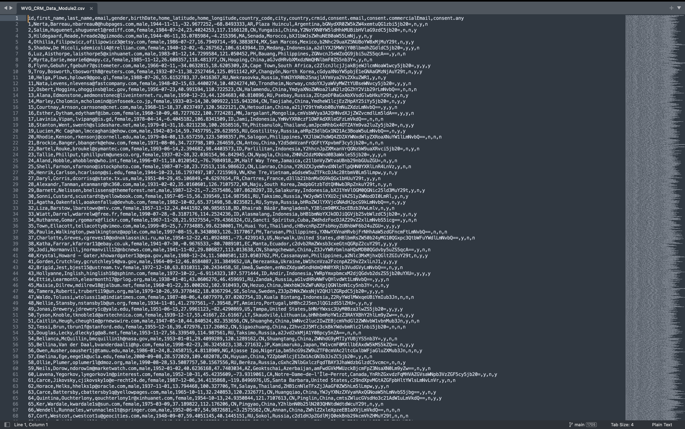
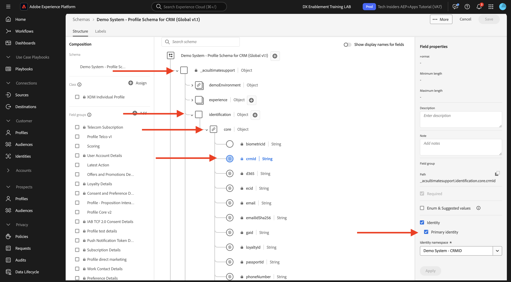

# 1.2.4 Assimilação de dados de fontes off-line

Neste exercício, o objetivo é integrar dados externos como dados do CRM na plataforma.

## Objetivos de aprendizagem

- Saiba como gerar dados de teste
- Saiba como assimilar CSV
- Saiba como usar a interface da Web para assimilação de dados por meio de fluxos de trabalho
- Entender os recursos de governança de dados do Experience Platform

## Recursos

- Mockaroo: [https://www.mockaroo.com/](https://www.mockaroo.com/)
- Adobe Experience Platform: [https://experience.adobe.com/platform/](https://experience.adobe.com/platform/)

## Tarefas

- Crie um arquivo CSV com dados de demonstração. Assimile o arquivo CSV no Adobe Experience Platform usando os fluxos de trabalho disponíveis.
- Entender as opções de governança de dados no Adobe Experience Platform

## Criar um conjunto de dados do CRM usando uma ferramenta geradora de dados

Para este exercício, você precisa de 1000 linhas de amostra de dados do CRM.

Abra o Modelo Mockaroo acessando [https://www.mockaroo.com/12674210](https://www.mockaroo.com/12674210).

No modelo, você observará os seguintes campos:

- ID
- first_name
- last_name
- email
- gênero
- birthDate
- home_latitude
- home_longitude
- country_code
- city
- país
- crmId
- consent.email
- consent.commercialEmail
- consent.any

Todos esses campos foram definidos para produzir dados compatíveis com a Platform.

Para gerar seu arquivo CSV, clique no botão **[!UICONTROL Gerar dados]**, que criará e baixará um arquivo CSV com 1000 linhas de dados de demonstração.

Abra o arquivo CSV para visualizar seu conteúdo.

Com seu arquivo CSV pronto, você pode prosseguir com a assimilação na AEP.

### Verificar o conjunto de dados

Ir para [https://experience.adobe.com/platform](https://experience.adobe.com/platform).

Antes de continuar, você precisa selecionar uma **[!UICONTROL sandbox]**. A sandbox a ser selecionada é chamada ``--aepSandboxName--``.

No Adobe Experience Platform, clique em **[!UICONTROL Conjuntos de dados]** no menu no lado esquerdo da tela.

Você usará um conjunto de dados compartilhado. O conjunto de dados compartilhado já foi criado e é chamado de **[!UICONTROL Sistema de demonstração - Conjunto de dados de perfil para CRM (Global v1.1)]**. Clique para abri-lo.

Na tela de visão geral, você pode ver três informações principais.

>[!NOTE]
>
>A visualização do conjunto de dados pode estar vazia, se nenhuma atividade tiver ocorrido nos últimos 7 dias.

Primeiro, o painel [!UICONTROL Atividade do conjunto de dados] mostra o número total de registros do CRM no conjunto de dados e nos lotes assimilados, e seus status

Em segundo lugar, rolando para baixo na página, você pode verificar quando os lotes de dados foram assimilados, quantos registros foram integrados e também se o lote foi integrado com êxito ou não. A **[!UICONTROL ID do Lote]** é o identificador de um trabalho em lotes específico, e a **[!UICONTROL ID do Lote]** é importante, pois pode ser usada para solucionar por que um lote específico não foi integrado com êxito.

Por fim, a guia de informações [!UICONTROL Conjunto de dados] mostra informações importantes, como a [!UICONTROL ID do conjunto de dados] (novamente, importante do ponto de vista da solução de problemas), o Nome do conjunto de dados e se o conjunto de dados foi habilitado para o Perfil.

A configuração mais importante aqui é o link entre o conjunto de dados e o Esquema. O Esquema define quais dados podem ser assimilados e como esses dados devem ser exibidos.

Nesse caso, estamos usando o **[!UICONTROL Sistema de Demonstração - Esquema de Perfil para CRM (Global v1.1)]**, que está mapeado para a classe de **[!UICONTROL Perfil]** e tem extensões implementadas, também chamadas de grupos de campos.

Ao clicar no nome do esquema, você é levado para a visão geral do [!UICONTROL Esquema] onde é possível ver todos os campos que foram ativados para esse esquema.

Todo esquema precisa ter um descritor primário personalizado definido. No caso do nosso conjunto de dados do CRM, o esquema definiu que o campo **[!UICONTROL crmId]** deve ser o identificador principal. Para criar um esquema e vinculá-lo ao [!UICONTROL Perfil de cliente em tempo real], é necessário definir um [!UICONTROL Grupo de campos] personalizado que faça referência ao seu descritor principal.

Você também pode ver que nossa identidade primária está localizada em `--aepTenantId--.identification.core.crmId`, vinculada ao [!UICONTROL namespace] do **[!UICONTROL Sistema de demonstração - CRMID]**.

Todos os esquemas e conjuntos de dados que devem ser usados no [!UICONTROL Perfil de cliente em tempo real] devem ter um [!UICONTROL identificador principal]. Este [!UICONTROL Identificador Principal] é o identificador de usuário pela marca de um cliente nesse conjunto de dados. No caso de um conjunto de dados do CRM, pode ser o endereço de email ou a ID do CRM, no caso de um conjunto de dados da central de atendimento, pode ser o número de celular de um cliente.

É uma prática recomendada criar um esquema separado e específico para cada conjunto de dados e definir o descritor de cada conjunto de dados especificamente para corresponder à forma como as soluções atuais usadas pela marca operam.

### Utilização de um fluxo de trabalho para mapear um arquivo CSV para um esquema XDM

O objetivo desse exercício é integrar dados do CRM na AEP. Todos os dados assimilados na Platform devem ser mapeados em relação ao esquema XDM específico. No momento, você tem um conjunto de dados CSV com 1000 linhas de um lado e um conjunto de dados vinculado a um esquema do outro lado. Para carregar esse arquivo CSV nesse conjunto de dados, é necessário fazer um mapeamento. Para facilitar esse exercício de mapeamento, temos **[!UICONTROL Workflows]** disponíveis no Adobe Experience Platform.

Clique em **[!UICONTROL Mapear CSV para Esquema XDM]** e em **[!UICONTROL Iniciar]** para iniciar o processo.

Na próxima tela, você precisa selecionar um conjunto de dados para assimilar o arquivo. Você pode escolher entre selecionar um conjunto de dados já existente ou criar um novo. Para este exercício, reutilizaremos um existente: selecione **[!UICONTROL Sistema de demonstração - Conjunto de dados de perfil para CRM (Global v1.1)]** conforme indicado abaixo e deixe as outras configurações definidas como padrão.

Clique em **Next**.

Arraste e solte seu arquivo CSV ou clique em **[!UICONTROL Escolher arquivos]**, navegue no computador até a área de trabalho e selecione seu arquivo CSV.

Depois de selecionar seu arquivo CSV, ele será carregado imediatamente e você verá uma pré-visualização do arquivo em segundos.

Clique em **Next**.

Agora é necessário mapear os cabeçalhos de coluna a partir do arquivo CSV com uma propriedade XDM no **[!UICONTROL Sistema de demonstração - Conjunto de dados de perfil para CRM]**.

A Adobe Experience Platform já fez algumas propostas para você, tentando vincular os [!UICONTROL Atributos do Source] aos [!UICONTROL Campos de Esquema de Destino].

>[!NOTE]
>
>Se você vir erros na tela de mapeamento, não se preocupe. Após seguir as instruções abaixo, esses erros serão resolvidos.

Para os [!UICONTROL Mapeamentos de esquema], o Adobe Experience Platform já tentou vincular campos. Mas nem todas as propostas de mapeamento estão corretas. Agora é necessário atualizar os **Campos de Destino** um por um.

#### birthDate

O campo de Esquema do Source **birthDate** deve estar vinculado ao campo de destino **person.birthDate**.

#### city

O campo de Esquema do Source **city** deve estar vinculado ao campo de destino **homeAddress.city**.

#### país

O campo de Esquema do Source **país** deve estar vinculado ao campo de destino **endereçoResidencial.país**.

#### country_code

O campo de Esquema do Source **country_code** deve estar vinculado ao campo de destino **homeAddress.countryCode**.

#### email

O campo de Esquema do Source **email** deve ser vinculado ao campo de destino **personalEmail.address**.

#### crmid

O campo de Esquema do Source **crmid** deve ser vinculado ao campo de destino **`--aepTenantId--`.identification.core.crmId**.

#### first_name

O campo de Esquema do Source **first_name** deve estar vinculado ao campo de destino **person.name.firstName**.

#### gênero

O campo de Esquema do Source **gênero** deve ser vinculado ao campo de destino **pessoa.gênero**.

#### home_latitude

O campo de Esquema do Source **home_latitude** deve ser vinculado ao campo de destino **homeAddress._schema.latitude**.

#### home_longitude

O campo de Esquema do Source **home_longitude** deve ser vinculado ao campo de destino **homeAddress._schema.longitude**.

#### ID

O campo de Esquema do Source **id** deve ser vinculado ao campo de destino **_id**.

#### last_name

O campo de Esquema do Source **last_name** deve estar vinculado ao campo de destino **person.name.lastName**.

#### consents.marketing.email.val

O campo de Esquema do Source **last_name** deve estar vinculado ao campo de destino **consents.marketing.email.val**.

#### consents.marketing.commercialEmail.val

O campo Esquema do Source **last_name** deve estar vinculado ao campo de destino **consents.marketing.CommercialEmail.val**.

#### consents.marketing.any.val

O campo de Esquema do Source **last_name** deve estar vinculado ao campo de destino **consents.marketing.any.val**.

Agora você deve ter isso. Clique em **Concluir**.

Depois de clicar em **[!UICONTROL Concluir]**, você verá a visão geral do **Fluxo de Dados** e, após alguns minutos, poderá atualizar sua tela para ver se o fluxo de trabalho foi concluído com êxito. Clique no **Nome do conjunto de dados de destino**.

Você verá o conjunto de dados em que a assimilação foi processada e verá uma [!UICONTROL ID do lote] que foi assimilada agora, com 1000 registros assimilados e um status de **[!UICONTROL Sucesso]**. Clique em **[!UICONTROL Visualizar Conjunto de Dados]**.

Agora você verá uma pequena amostra do conjunto de dados para garantir que os dados carregados estejam corretos.

Depois que os dados forem carregados, você poderá definir a abordagem de governança de dados correta para nosso conjunto de dados.

### Adicionar governança de dados ao seu conjunto de dados

Agora que os dados do cliente foram assimilados, é necessário garantir que esse conjunto de dados seja controlado corretamente para uso e controle de exportação. Clique na guia **[!UICONTROL Governança de dados]** e observe que você pode definir vários tipos de restrições: Contrato, Identidade e Confidencial, Ecossistema de parceiros e Personalizado.

Vamos restringir os dados de identidade para todo o conjunto de dados. Passe o mouse sobre o nome do conjunto de dados e clique no ícone Lápis para editar as configurações.

Vá para **[!UICONTROL Rótulos de identidade]** e você verá que a opção **[!UICONTROL I2]** está marcada - isso presumirá que todas as informações neste conjunto de dados são pelo menos indiretamente identificáveis para a pessoa.

Clique em **[!UICONTROL Salvar alterações]**.

Em outro módulo, faremos um aprofundamento na estrutura de quem da governança de dados e rótulos.

Com isso, você assimilou e classificou com êxito os dados do CRM no Adobe Experience Platform.

Próxima Etapa: [1.2.5 Zona de Aterrissagem de Dados](./ex5.md)

[Voltar ao módulo 1.2](./data-ingestion.md)

[Voltar a todos os módulos](../../../overview.md)
