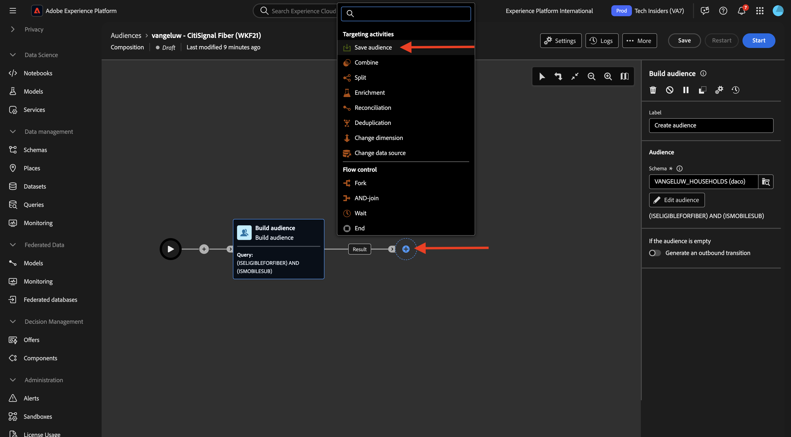
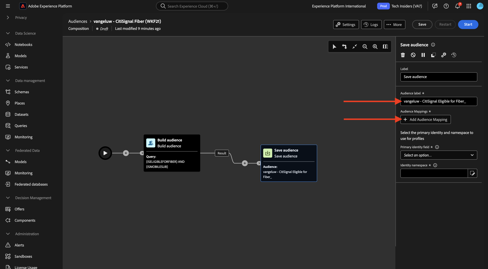

# 1.3.3 Criar uma composição federada

Agora você pode configurar a composição do público-alvo federado na AEP.

Faça logon no Adobe Experience Platform acessando esta URL: [https://experience.adobe.com/platform](https://experience.adobe.com/platform).

Depois de fazer logon, você chegará à página inicial do Adobe Experience Platform.

Antes de continuar, você precisa selecionar uma **sandbox**. A sandbox a ser selecionada é chamada ``--aepSandboxName--``. Depois de selecionar a sandbox apropriada, você verá a alteração da tela e agora estará em sua sandbox dedicada.

## 1.3.3.1 Criar seu público-alvo

No menu esquerdo, vá para **Audiences** e depois vá para **Federated compositions**. Clique em **Criar composição**.

Para o rótulo, use este: `--aepUserLdap-- - CitiSignal Fiber`. Selecione o modelo de dados criado no exercício anterior, denominado `--aepUserLdap-- - CitiSignal Snowflake Data Model`. Clique em **Criar**.

Você verá isso.

Clique no ícone **+** e clique em **Criar público-alvo**.

Você verá isso. Selecione **Criar audiência**. Clique no ícone **pesquisar** para selecionar um esquema.

Selecione o esquema **CK_HOUSEHOLDS**. Clique em **Confirmar**.

Em seguida, clique em **Continuar**.

Agora você pode começar a criar a consulta que será enviada para o Snowflake. Clique no ícone **+** e em **Condição personalizada**.

Selecione o atributo **ISELIGIBLEFORFIBER** Clique em **Confirmar**.

Você verá isso. Defina o campo **Value** como **True**. Clique em **Calcular** para encaminhar a consulta para Snowflake e obter uma estimativa dos perfis que agora estão qualificados.

Em seguida, clique novamente no ícone **+** e clique novamente em **Condição personalizada** para adicionar outra condição.

A segunda condição a ser adicionada é: `Is the user an existing CitiSignal Mobile subscriber?`. A maneira de responder a essa pergunta é usar o relacionamento entre a família e o cliente principal da organização, que é definido em outra tabela, **CK_PERSONS**. Você pode detalhar no menu de atributos usando o link **household2person**.

Selecione o atributo **ISMOBILESUB** e clique em **Confirmar**.

Defina o campo **Valor** como **Verdadeiro** Clique em **Calcular** novamente para atualizar o número de perfis que serão direcionados. Clique em **Confirmar**.

Clique no ícone **+** e em **Salvar público-alvo**.

Defina o **Rótulo do público-alvo** como `--aepUserLdap-- - CitiSignal Eligible for Fiber`.

Clique em **+ Adicionar mapeamento de público-alvo**.

Selecione **HOUSEHOLD_ID** e clique em **Confirmar**.

Clique em **+ Adicionar mapeamento de público-alvo**.

Detalhe clicando em **Targeting dimension**.

Detalhe clicando no link **household2person**.

Selecione o campo **NAME**. Clique em **Confirmar**.

Clique em **+ Adicionar mapeamento de público-alvo**.

Detalhe clicando em **Targeting dimension**.

Detalhe clicando no link **household2person**.

Selecione o campo **EMAIL**. Clique em **Confirmar**.

Você verá isso. Agora é necessário definir o **Campo de identidade principal**, defina-o como **Household2person_EMAIL**.

Clique em **Salvar**.

Sua composição foi concluída. Clique em **Iniciar** para executá-lo.

O query será agora enviado para o Snowflake, que consultará os dados de origem lá. Os resultados serão enviados de volta para a AEP, mas os dados de origem permanecerão no Snowflake.

O público-alvo agora é preenchido e pode ser direcionado de dentro do ecossistema da AEP.

Próxima etapa: [Resumo e benefícios](./summary.md)

[Voltar ao módulo 1.3](./fac.md)

[Voltar a todos os módulos](../../../overview.md)
