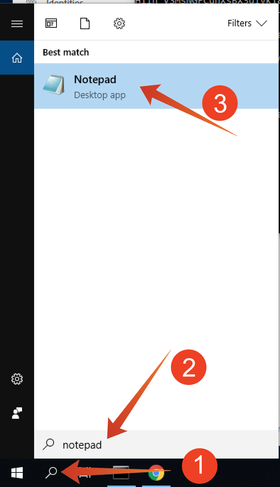

# 5.1.2 Uso do Serviço de consulta

## Objetivo

- Encontrar e explorar conjuntos de dados
- Saiba como abordar objetos e atributos do Experience Data Models em suas consultas

## Contexto

Com isso, você aprenderá a usar o PSQL para recuperar informações sobre os conjuntos de dados disponíveis, como gravar uma consulta para o Experience Data Model (XDM) e gravar suas primeiras consultas de relatórios simples usando o Serviço de consulta e os conjuntos de dados do Citi Signal.

## 5.1.2.1 Consultas básicas

Nesta seção, você aprenderá sobre os métodos para recuperar informações sobre os conjuntos de dados disponíveis e como recuperar dados corretamente com uma consulta de um conjunto de dados XDM.

Todos os conjuntos de dados que exploramos por meio do Adobe Experience Platform no início do 1 também estão disponíveis para acesso por meio de uma interface SQL como tabelas. Para listar essas tabelas, você pode usar o comando **show tables;**.

Execute **show tables;** em sua **interface de linha de comando PSQL**. (não se esqueça de terminar o comando com um ponto e vírgula).

Copie o comando **show tables;** e cole-o no prompt:


Você verá o seguinte resultado:

```text
aepenablementfy21:all=> show tables;
                            name                            |        dataSetId         |                            dataSet                             | description | resolved 
------------------------------------------------------------+--------------------------+----------------------------------------------------------------+-------------+----------
 demo_system_event_dataset_for_call_center_global_v1_1      | 5fd1a9dea30603194baeea43 | Demo System - Event Dataset for Call Center (Global v1.1)      |             | false
 demo_system_event_dataset_for_mobile_app_global_v1_1       | 5fd1a9de250e4f194bec84cd | Demo System - Event Dataset for Mobile App (Global v1.1)       |             | false
 demo_system_event_dataset_for_voice_assistants_global_v1_1 | 5fd1a9de49ee76194b85f73c | Demo System - Event Dataset for Voice Assistants (Global v1.1) |             | false
 demo_system_event_dataset_for_website_global_v1_1          | 5fd1a9dee3224d194cdfe786 | Demo System - Event Dataset for Website (Global v1.1)          |             | false
 demo_system_profile_dataset_for_loyalty_global_v1_1        | 5fd1a9de250e4f194bec84cc | Demo System - Profile Dataset for Loyalty (Global v1.1)        |             | false
 demo_system_profile_dataset_for_ml_predictions_global_v1_1 | 5fd1a9de241f58194b0cb117 | Demo System - Profile Dataset for ML Predictions (Global v1.1) |             | false
 demo_system_profile_dataset_for_mobile_app_global_v1_1     | 5fd1a9deddf353194a2e00b7 | Demo System - Profile Dataset for Mobile App (Global v1.1)     |             | false
 demo_system_profile_dataset_for_website_global_v1_1        | 5fd1a9de42a61c194dd7b810 | Demo System - Profile Dataset for Website (Global v1.1)        |             | false
 journey_step_events                                        | 5fd1a7f30268c5194bbb7e5e | Journey Step Events                                            |             | false
```

No sinal de dois pontos, pressione a barra de espaço para ver a próxima página do conjunto de resultados, ou digite `q` para reverter para o prompt de comando.

Cada conjunto de dados na Platform tem sua tabela de Serviço de consulta correspondente. Você pode encontrar a tabela de um conjunto de dados por meio da interface do usuário de conjuntos de dados:


A tabela `demo_system_event_dataset_for_website_global_v1_1` é a tabela do Serviço de Consulta que corresponde ao conjunto de dados `Demo System - Event Schema for Website (Global v1.1)`.

Para consultar algumas informações sobre onde um produto foi exibido, selecionaremos as informações **geo**.

Copie a instrução abaixo e cole-a no prompt em sua **interface de linha de comando do PSQL** e pressione Enter:

```sql
select placecontext.geo
from   demo_system_event_dataset_for_website_global_v1_1
where  eventType = 'commerce.productViews'
and placecontext.geo.countryCode <> ''
limit 1;
```

No resultado da query, você observará que as colunas no Experience Data Model (XDM) podem ser tipos complexos e não apenas tipos escalares. Na consulta acima, gostaríamos de identificar localizações geográficas em que um **commerce.productViews** ocorreu. Para identificar um **commerce.productViews**, precisamos navegar pelo modelo XDM usando o **.Notação** (ponto).

```text
aepenablementfy21:all=> select placecontext.geo
aepenablementfy21:all-> from   demo_system_event_dataset_for_website_global_v1_1
aepenablementfy21:all-> where  eventType = 'commerce.productViews'
aepenablementfy21:all-> and placecontext.geo.countryCode <> ''
aepenablementfy21:all-> limit 1;
                  geo                   
----------------------------------------
 ("(57.4694803,-3.1269422)",Tullich,GB)
(1 row)
```

Observe que o resultado é um objeto plano em vez de um valor único? O objeto **placecontext.geo** contém quatro atributos: esquema, país e cidade. E quando um objeto é declarado como uma coluna, ele retornará o objeto inteiro como uma string. O esquema XDM pode ser mais complexo do que o que você conhece, mas é muito eficiente e foi projetado para oferecer suporte a muitas soluções, canais e casos de uso.

Para selecionar as propriedades individuais de um objeto, use o **.Notação** (ponto).

Copie a instrução abaixo e cole-a no prompt em sua **interface de linha de comando do PSQL**:

```sql
select placecontext.geo._schema.longitude
      ,placecontext.geo._schema.latitude
      ,placecontext.geo.city
      ,placecontext.geo.countryCode
from   demo_system_event_dataset_for_website_global_v1_1
where  eventType = 'commerce.productViews'
and placecontext.geo.countryCode <> ''
limit 1;
```

O resultado da consulta acima deve ter esta aparência.
O resultado agora é um conjunto de valores simples:

```text
aepenablementfy21:all=> select placecontext.geo._schema.longitude
aepenablementfy21:all->       ,placecontext.geo._schema.latitude
aepenablementfy21:all->       ,placecontext.geo.city
aepenablementfy21:all->       ,placecontext.geo.countryCode
aepenablementfy21:all-> from   demo_system_event_dataset_for_website_global_v1_1
aepenablementfy21:all-> where  eventType = 'commerce.productViews'
aepenablementfy21:all-> and placecontext.geo.countryCode <> ''
aepenablementfy21:all-> limit 1;
 longitude  |  latitude  |  city   | countrycode 
------------+------------+---------+-------------
 -3.1269422 | 57.4694803 | Tullich | GB
(1 row)
```

Não se preocupe, há uma maneira fácil de obter o caminho em direção a uma propriedade específica. Na parte a seguir, você aprenderá como.

Você precisará editar uma consulta, portanto, primeiro vamos abrir um editor.

No Windows

Clique no ícone **pesquisar** na barra de ferramentas do Windows, digite **notepad** no campo **pesquisar** e clique no resultado **notepad**:



No Mac

Instale os [Colchetes](https://github.com/adobe/brackets/releases/download/release-1.14/Brackets.Release.1.14.dmg) ou use outro Editor de texto de sua escolha se não o tiver instalado e siga as instruções. Após a instalação, pesquise por **Colchetes** através da pesquisa em destaque da Mac e abra-a.

Copie a seguinte instrução no bloco de notas ou colchetes:

```sql
select your_attribute_path_here
from   demo_system_event_dataset_for_website_global_v1_1
where  eventType = 'commerce.productViews'
and placecontext.geo.countryCode <> ''
limit 1;
```

Volte para a interface do usuário do Adobe Experience Platform (deve ser aberta no navegador) ou navegue até [https://platform.adobe.com](https://platform.adobe.com).

Selecione **Esquemas**, digite `Demo System - Event Schema for Website (Global v1.1)` no campo **pesquisa** e selecione `Demo System - Event Schema for Website (Global v1.1) Schema` na lista.


Explore o modelo XDM do **Sistema de demonstração - Esquema de evento do site (Global v1.1)** clicando em um objeto. Expanda a árvore para **placecontext**, **geo** e **schema**. Ao selecionar o atributo real **longitude**, você verá o caminho completo na caixa vermelha destacada. Para copiar o caminho do atributo, clique no ícone de caminho de cópia.


Alterne para o bloco de notas/colchetes e remova **seu_caminho_de_atributo_aqui** da primeira linha. Posicione o cursor depois de **selecionar** na primeira linha e cole (CTRL-V).

Copie a instrução modificada do bloco de notas/colchetes e cole-a no prompt na **interface de linha de comando do PSQL** e pressione Enter.

O resultado deve ser semelhante a:

```text
aepenablementfy21:all=> select placeContext.geo._schema.longitude
aepenablementfy21:all-> from   demo_system_event_dataset_for_website_global_v1_1
aepenablementfy21:all-> where  eventType = 'commerce.productViews'
aepenablementfy21:all-> and placecontext.geo.countryCode <> ''
aepenablementfy21:all-> limit 1;
 longitude  
------------
 -3.1269422
```

Próxima Etapa: [5.1.3 Consultas, consultas, consultas... e análise de churn](./ex3.md)

[Voltar ao módulo 5.1](./query-service.md)

[Voltar a todos os módulos](../../../overview.md)
