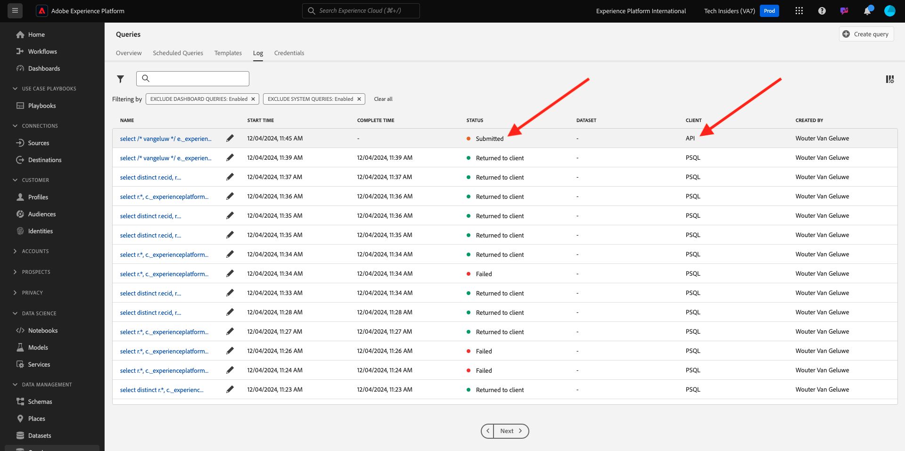
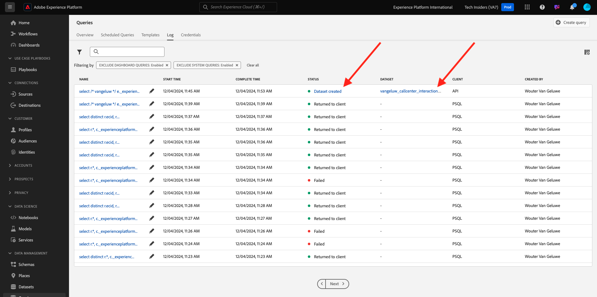

# 5.1.5 Gerar um conjunto de dados a partir de um query

## Objetivo

Saiba como gerar conjuntos de dados a partir dos resultados da consulta
Conectar o Microsoft Power BI Desktop/Tableau diretamente ao Serviço de consulta
Criação de um relatório no Microsoft Power BI Desktop/Tableau Desktop

## Contexto

Uma interface de linha de comando para consultar dados é empolgante, mas não apresenta uma boa situação. Nesta lição, guiaremos você em um fluxo de trabalho recomendado sobre como usar o Microsoft Power BI Desktop/Tableau diretamente no Serviço de consulta para criar relatórios visuais para as partes interessadas.

## Criar um conjunto de dados a partir de uma consulta SQL

A complexidade da consulta afetará quanto tempo o Serviço de consulta leva para retornar resultados. E ao consultar diretamente a partir da linha de comando ou de outras soluções, como o Microsoft Power BI/Tableau, o Serviço de consulta é configurado com um tempo limite de 5 minutos (600 segundos). E, em certos casos, essas soluções serão configuradas com tempos limite mais curtos. Para executar consultas maiores e carregar com antecedência o tempo necessário para retornar resultados, oferecemos um recurso para gerar um conjunto de dados a partir dos resultados da consulta. Esse recurso utiliza o recurso SQL padrão conhecido como Criar tabela como seleção (CTAS). Ela está disponível na interface do usuário da Platform na Lista de consultas e também está disponível para ser executada diretamente na linha de comando com PSQL.

No anterior, você substituiu **digite seu nome** pelo seu próprio ldap antes de executá-lo em PSQL.

```sql
select /* enter your name */
       e.--aepTenantId--.identification.core.ecid as ecid,
       e.placeContext.geo.city as city,
       e.placeContext.geo._schema.latitude latitude,
       e.placeContext.geo._schema.longitude longitude,
       e.placeContext.geo.countryCode as countrycode,
       c.--aepTenantId--.interactionDetails.core.callCenterAgent.callFeeling as callFeeling,
       c.--aepTenantId--.interactionDetails.core.callCenterAgent.callTopic as callTopic,
       c.--aepTenantId--.interactionDetails.core.callCenterAgent.callContractCancelled as contractCancelled,
       l.--aepTenantId--.loyaltyDetails.level as loyaltystatus,
       l.--aepTenantId--.loyaltyDetails.points as loyaltypoints,
       l.--aepTenantId--.identification.core.crmId as crmid
from   demo_system_event_dataset_for_website_global_v1_1 e
      ,demo_system_event_dataset_for_call_center_global_v1_1 c
      ,demo_system_profile_dataset_for_crm_global_v1_1 l
where  e.--aepTenantId--.demoEnvironment.brandName IN ('Citi Signal')
and    e.web.webPageDetails.name in ('Cancel Service', 'Call Start')
and    e.--aepTenantId--.identification.core.ecid = c.--aepTenantId--.identification.core.ecid
and    l.--aepTenantId--.identification.core.ecid = e.--aepTenantId--.identification.core.ecid;
```

Navegue até a interface do Adobe Experience Platform - [https://experience.adobe.com/platform](https://experience.adobe.com/platform)

Pesquise a instrução executada na interface do Adobe Experience Platform Query inserindo o ldap no campo de pesquisa:

Selecione **Consultas**, vá para **Log** e insira seu ldap no campo de pesquisa.


Selecione sua consulta e clique em **Executar como CTAS**.


Insira `--aepUserLdap-- Callcenter Interaction Analysis` como nome e descrição para o conjunto de dados e clique em **Executar como CTAS**.


Como resultado, você verá uma nova consulta com o status **Enviada**.



Após a conclusão, você verá uma nova entrada para **Conjunto de dados criado** (talvez seja necessário atualizar a página).



Assim que o conjunto de dados for criado (o que pode levar de 5 a 10 minutos), você pode continuar o exercício.

Próxima Etapa - Opção A: [5.1.6 Serviço de Consulta e Power BI](./ex6.md)

Próxima Etapa - Opção B: [5.1.7 Serviço de Consulta e Tableau](./ex7.md)

[Voltar ao módulo 5.1](./query-service.md)

[Voltar a todos os módulos](../../../overview.md)
