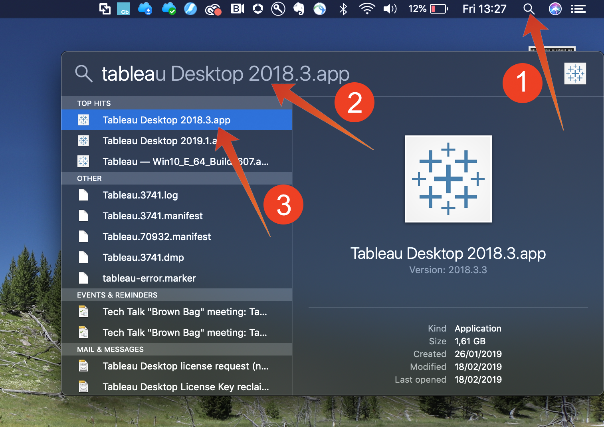

# 5.1.7 Serviço de consulta e Tableau

Abra o Tableau.

Em **Conectar-se a um Servidor**, selecione **PostgreSQL**:

Vá para o Adobe Experience Platform, para **Consultas** e para **Credenciais**.

Na página **Credenciais** do Adobe Experience Platform, copie o **Host** e cole-o no campo **Servidor**, copie o **Banco de Dados** e cole-o no campo **Banco de Dados** do Tableau, copie a **Porta** e cole no campo **Porta** no Tableau. Faça o mesmo para **Nome de Usuário** e **Senha**. Em seguida, clique em **Entrar**.

Entrar:

Clique em pesquisar (1) e insira seu **ldap** no campo de pesquisa, identifique sua tabela do conjunto de resultados e arraste-a (3) para o local chamado **Arraste tabelas aqui**. Quando terminar, clique em **Planilha 1** (3).

Para visualizar nossos dados no mapa, precisamos converter longitude e latitude em dimensões. Em **Medidas**, selecione **Latitude** (1), abra a lista suspensa do campo e selecione **Converter em Dimension** (2). Faça o mesmo para a medida **Longitude**.

Arraste a medida **Longitude** para as **Colunas** e a medida **Latitude** para **Linhas**. Automaticamente, o mapa de **Bélgica** aparecerá com pequenos pontos representando as cidades em todo o conjunto de dados.

Selecione **Nomes de Medidas** (1), abra a lista suspensa e selecione **Adicionar à Planilha** (2):

Agora você terá um mapa, com pontos de vários tamanhos. O tamanho indica o número de interações da central de atendimento para essa cidade específica. Para variar o tamanho dos pontos, navegue até o painel direito e abra **Valores de Medida** (usando o ícone suspenso). Na lista suspensa, selecione **Editar Tamanhos**. Brinque com tamanhos diferentes.

Para exibir ainda mais os dados por **Tópico de Chamada**, arraste (1) a dimensão **Tópico de Chamada** para **Páginas**. Navegue pelos **Tópicos de chamada** diferentes usando o **Tópico de chamada** (2) no lado direito da tela:

Você terminou este exercício agora.

Próxima Etapa: [5.1.8 API de Serviço de Consulta](./ex8.md)

[Voltar ao módulo 5.1](./query-service.md)

[Voltar a todos os módulos](../../../overview.md)
