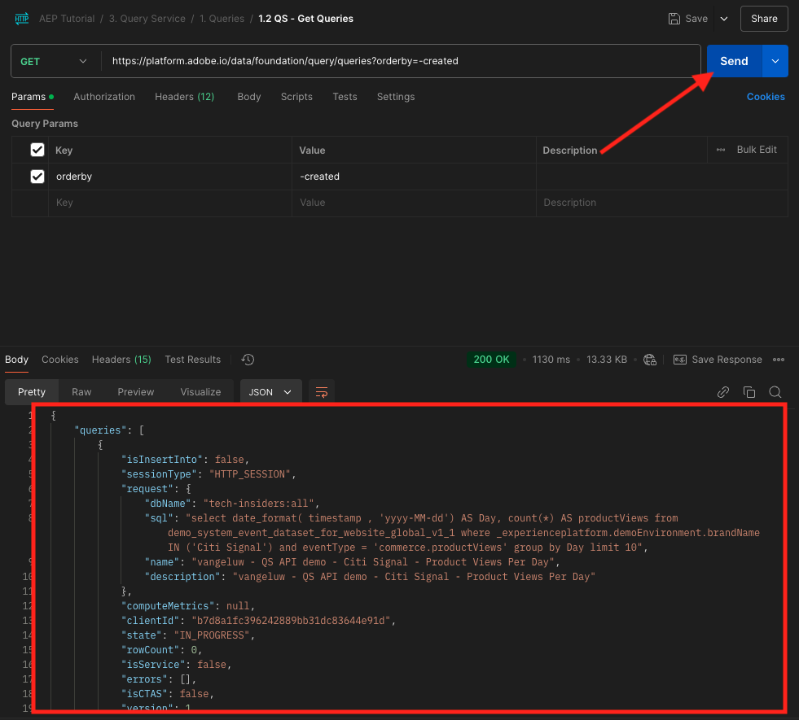
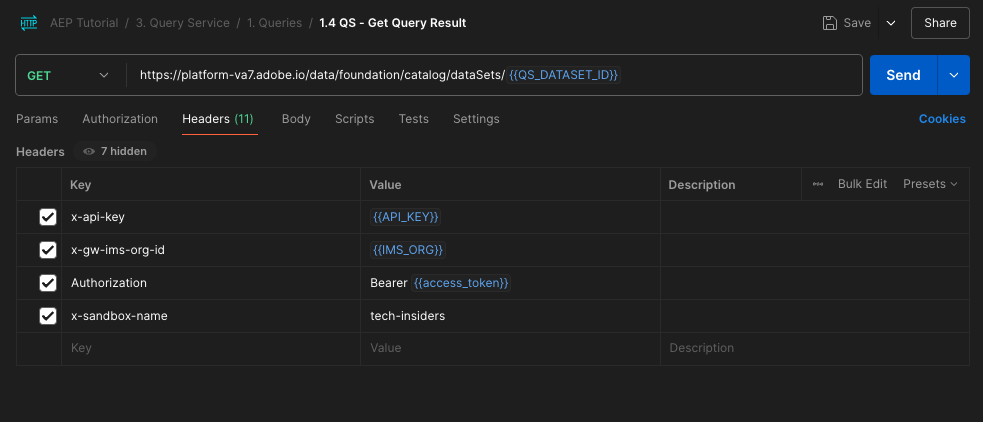

# 5.1.7 API do serviço de consulta

## Objetivo

- Use a API do Serviço de consulta para gerenciar modelos e agendamentos de consulta

## Contexto

Neste exercício, você executará chamadas de API para gerenciar modelos de consulta e agendamentos de consulta usando uma coleção do Postman. Você definirá modelos de consulta, executará consultas regulares e consultas CTAS. Uma consulta **CTAS** (criar tabela como consulta seleção) armazena seu conjunto de resultados em um conjunto de dados explícito. Embora as consultas regulares sejam armazenadas em um conjunto de dados implícito (ou gerado pelo sistema), normalmente é exportado em formato de arquivo parquet.

## Documentação

- [Ajuda do Adobe Experience Platform Query Service](https://experienceleague.adobe.com/docs/experience-platform/query/api/getting-started.html)
- [API de Serviço de Consulta](https://www.adobe.io/apis/experienceplatform/home/api-reference.html#!acpdr/swagger-specs/qs-api.yaml)

## 5.1.7.1 API do serviço de consulta

A API do Serviço de consulta permite gerenciar consultas não interativas no data lake da Adobe Experience Platform.

Não interativo significa que uma solicitação para executar uma consulta não resultará em uma resposta imediata. A consulta será processada e seu conjunto de resultados será armazenado em um conjunto de dados implícito ou explícito (CTAS: create table as select).

## 5.1.7.2 Exemplo de consulta

Como exemplo de consulta, você usará a primeira consulta listada em [4.3 - Consultas, consultas, consultas... e análise de churn](./ex3.md):

Quantas visualizações de produto temos diariamente?

**SQL**

```sql
select date_format( timestamp , 'yyyy-MM-dd') AS Day,
       count(*) AS productViews
from   demo_system_event_dataset_for_website_global_v1_1
where  --aepTenantId--.demoEnvironment.brandName IN ('Luma Telco', 'Citi Signal')
and eventType = 'commerce.productViews'
group by Day
limit 10;
```

## 5.1.7.3 Consultas

Abra o Postman no computador. Como parte do Módulo 3, você criou um ambiente do Postman e importou uma coleção do Postman. Siga as instruções no [Exercício 2.1.3](./../../../modules/rtcdp-b2c/module2.1/ex3.md) caso ainda não tenha feito isso.

Como parte da coleção do Postman que você importou, você verá uma pasta **3. Serviço de Consulta**. Se você não vir esta pasta, baixe novamente a [coleção do Postman](./../../../assets/postman/postman_profile.zip) e importe novamente essa coleção no Postman, conforme instruído no [Exercício 2.1.3](./../../../modules/rtcdp-b2c/module2.1/ex3.md).


>[!NOTE]
>
>Neste momento, somente a pasta **1. Consultas** contêm solicitações. Outras solicitações serão adicionadas em um estágio de camada.

Abra essa pasta e conheça as chamadas da API do Serviço de consulta para executar, monitorar e baixar o conjunto de resultados da consulta.

Uma chamada POST para [/query/queries] com a seguinte carga disparará a execução de nossa query;

### 5.1.7.3.1 Criar consulta

Clique na solicitação denominada **1.1 QS - Criar consulta** e vá para **Cabeçalhos**. Você verá isto:


Vamos focalizar neste campo de cabeçalho:

| Chave | Valor |
| ----------- | ----------- |
| x-sandbox-name | `--module7sandbox--` |

>[!NOTE]
>
>É necessário especificar o nome da sandbox da Adobe Experience Platform que você está usando. O campo de cabeçalho **x-sandbox-name** deve ser `--module7sandbox--`.

Vá para a seção **Corpo** desta solicitação. No **Corpo** desta solicitação, você verá o seguinte:


```sql
{
    "name" : "ldap - QS API demo - Citi Signal - Product Views Per Day",
	"description": "ldap - QS API demo - Citi Signal - Product Views Per Day",
	"dbName": "module7:all",
	"sql": "select date_format( timestamp , 'yyyy-MM-dd') AS Day, count(*) AS productViews from demo_system_event_dataset_for_website_global_v1_1 where _experienceplatform.demoEnvironment.brandName IN ('Luma Telco', 'Citi Signal') and eventType = 'commerce.productViews' group by Day limit 10"
}
```

Atenção: atualize a variável **nome** na solicitação abaixo substituindo o **ldap** pelo seu **ldap** específico.

Depois de adicionar o **ldap** específico, o Corpo deve ser semelhante a:

```json
{
    "name" : "vangeluw - QS API demo - Citi Signal - Product Views Per Day",
	"description": "vangeluw - QS API demo - Citi Signal - Product Views Per Day",
	"dbName": "module7:all",
	"sql": "select date_format( timestamp , 'yyyy-MM-dd') AS Day, count(*) AS productViews from demo_system_event_dataset_for_website_global_v1_1 where _experienceplatform.demoEnvironment.brandName IN ('Luma Telco', 'Citi Signal') and eventType = 'commerce.productViews' group by Day limit 10"
}
```

>[!NOTE]
>
>A chave **dbName** no corpo JSON acima se refere à sandbox usada na instância do Adobe Experience Platform. Se você estiver usando a sandbox PROD, o dbName deverá ser **prod:all**, se você usar outra sandbox como por exemplo **module7**, o dbName deverá ser igual a **module7:all**.

Em seguida, clique no botão azul **Enviar** para criar o segmento e exibir os resultados.


Quando a solicitação POST for bem-sucedida, retornará a seguinte resposta:

```json
{
    "isInsertInto": false,
    "request": {
        "dbName": "module7:all",
        "sql": "select date_format( timestamp , 'yyyy-MM-dd') AS Day, count(*) AS productViews from demo_system_event_dataset_for_website_global_v1_1 where _experienceplatform.demoEnvironment.brandName IN ('Luma Telco', 'Citi Signal') and eventType = 'commerce.productViews' group by Day limit 10",
        "name": "vangeluw - QS API demo - Citi Signal - Product Views Per Day",
        "description": "vangeluw - QS API demo - Citi Signal - Product Views Per Day"
    },
    "clientId": "5a143b5ae4aa4631a1f3b09cd051333f",
    "state": "SUBMITTED",
    "rowCount": 0,
    "errors": [],
    "isCTAS": false,
    "version": 1,
    "id": "8f0d7f25-f7aa-493b-9792-290f884a7e5b",
    "elapsedTime": 0,
    "updated": "2021-01-20T13:23:13.951Z",
    "client": "API",
    "userId": "A3392DB95FFF08EE0A495E87@techacct.adobe.com",
    "created": "2021-01-20T13:23:13.951Z",
    "_links": {
        "self": {
            "href": "https://platform-va7.adobe.io/data/foundation/query/queries/8f0d7f25-f7aa-493b-9792-290f884a7e5b",
            "method": "GET"
        },
        "soft_delete": {
            "href": "https://platform-va7.adobe.io/data/foundation/query/queries/8f0d7f25-f7aa-493b-9792-290f884a7e5b",
            "method": "PATCH",
            "body": "{ \"op\": \"soft_delete\"}"
        },
        "cancel": {
            "href": "https://platform-va7.adobe.io/data/foundation/query/queries/8f0d7f25-f7aa-493b-9792-290f884a7e5b",
            "method": "PATCH",
            "body": "{ \"op\": \"cancel\"}"
        }
    }
}
```

O **estado** atual da consulta é **ENVIADO**. Uma vez executado, seu estado será **SUCCESS**.

Você também pode pesquisar consultas enviadas por meio da interface do Adobe Experience Platform, abrir o [Adobe Experience Platform](https://experience.adobe.com/#/@experienceplatform/platform/home), navegar até as **Consultas**, acessar o **Log** e selecionar sua consulta:


### 5.1.7.3.2 Obter consultas

Clique na solicitação chamada **1.2 QS - Obter consultas** e vá para **Cabeçalhos**. Você verá isto:


Vamos focalizar neste campo de cabeçalho:

| Chave | Valor |
| ----------- | ----------- |
| x-sandbox-name | `--module7sandbox--` |

>[!NOTE]
>
>É necessário especificar o nome da sandbox da Adobe Experience Platform que você está usando. O campo de cabeçalho **x-sandbox-name** deve ser `--module7sandbox--`.

Ir para **Params**. Você verá isto:


O parâmetro **orderby** permite especificar uma ordem de classificação com base na propriedade **created**. Observe o sinal **&#39;-&#39;** antes de criado, o que significa que a ordem na qual a lista de consultas é retornada usará sua data de criação na ordem **decrescente**. Sua consulta deve estar no topo da lista.

Em seguida, clique no botão azul **Enviar** para criar o segmento e exibir os resultados.



Quando bem-sucedida, a solicitação retornará uma resposta semelhante à abaixo. O **estado** da resposta pode ser **ENVIADO**, **EM_ANDAMENTO** ou **SUCESSO**. Pode levar vários minutos para que a consulta tenha um estado **SUCCESS**. Você pode repetir o envio desta solicitação várias vezes até ver o estado **SUCCESS**.

```json
{
    "queries": [
        {
            "isInsertInto": false,
            "request": {
                "dbName": "module7:all",
                "sql": "select date_format( timestamp , 'yyyy-MM-dd') AS Day, count(*) AS productViews from demo_system_event_dataset_for_website_global_v1_1 where _experienceplatform.demoEnvironment.brandName IN ('Luma Telco', 'Citi Signal') and eventType = 'commerce.productViews' group by Day limit 10",
                "name": "vangeluw - QS API demo - Citi Signal - Product Views Per Day",
                "description": "vangeluw - QS API demo - Citi Signal - Product Views Per Day"
            },
            "clientId": "5a143b5ae4aa4631a1f3b09cd051333f",
            "state": "SUCCESS",
            "rowCount": 1,
            "errors": [],
            "isCTAS": false,
            "version": 1,
            "id": "8f0d7f25-f7aa-493b-9792-290f884a7e5b",
            "elapsedTime": 217481,
            "updated": "2021-01-20T13:26:51.432Z",
            "client": "API",
            "userId": "A3392DB95FFF08EE0A495E87@techacct.adobe.com",
            "created": "2021-01-20T13:23:13.951Z",
            "_links": {
                "self": {
                    "href": "https://platform-va7.adobe.io/data/foundation/query/queries/8f0d7f25-f7aa-493b-9792-290f884a7e5b",
                    "method": "GET"
                },
                "soft_delete": {
                    "href": "https://platform-va7.adobe.io/data/foundation/query/queries/8f0d7f25-f7aa-493b-9792-290f884a7e5b",
                    "method": "PATCH",
                    "body": "{ \"op\": \"soft_delete\"}"
                },
                "referenced_datasets": [
                    {
                        "id": "60080ace62c49a19490c5870",
                        "href": "https://platform-va7.adobe.io/data/foundation/catalog/dataSets/60080ace62c49a19490c5870"
                    }
                ]
            }
        }
     ]
    },
    "version": 1
}
```

Quando o estado for **SUCCESS**, continue com a próxima solicitação.

### 5.1.7.3.3 Obter status da consulta

Clique na solicitação chamada **1.3 QS - Obter Status da Consulta** e vá para **Cabeçalhos**. Você verá isto:


Vamos focalizar neste campo de cabeçalho:

| Chave | Valor |
| ----------- | ----------- |
| x-sandbox-name | `--module7sandbox--` |

>[!NOTE]
>
>É necessário especificar o nome da sandbox da Adobe Experience Platform que você está usando. O campo de cabeçalho **x-sandbox-name** deve ser `--module7sandbox--`.

Em seguida, clique no botão azul **Enviar** para criar o segmento e exibir os resultados.


Quando bem-sucedida, a solicitação retornará uma resposta semelhante à abaixo.

```json
{
    "isInsertInto": false,
    "request": {
        "dbName": "module7:all",
        "sql": "select date_format( timestamp , 'yyyy-MM-dd') AS Day, count(*) AS productViews from demo_system_event_dataset_for_website_global_v1_1 where _experienceplatform.demoEnvironment.brandName IN ('Luma Telco', 'Citi Signal') and eventType = 'commerce.productViews' group by Day limit 10",
        "name": "vangeluw - QS API demo - Citi Signal - Product Views Per Day",
        "description": "vangeluw - QS API demo - Citi Signal - Product Views Per Day"
    },
    "clientId": "5a143b5ae4aa4631a1f3b09cd051333f",
    "state": "SUCCESS",
    "rowCount": 1,
    "errors": [],
    "isCTAS": false,
    "version": 1,
    "id": "8f0d7f25-f7aa-493b-9792-290f884a7e5b",
    "elapsedTime": 217481,
    "updated": "2021-01-20T13:26:51.432Z",
    "client": "API",
    "userId": "A3392DB95FFF08EE0A495E87@techacct.adobe.com",
    "created": "2021-01-20T13:23:13.951Z",
    "_links": {
        "self": {
            "href": "https://platform-va7.adobe.io/data/foundation/query/queries/8f0d7f25-f7aa-493b-9792-290f884a7e5b",
            "method": "GET"
        },
        "soft_delete": {
            "href": "https://platform-va7.adobe.io/data/foundation/query/queries/8f0d7f25-f7aa-493b-9792-290f884a7e5b",
            "method": "PATCH",
            "body": "{ \"op\": \"soft_delete\"}"
        },
        "referenced_datasets": [
            {
                "id": "60080ace62c49a19490c5870",
                "href": "https://platform-va7.adobe.io/data/foundation/catalog/dataSets/60080ace62c49a19490c5870"
            }
        ]
    }
}
```

Quando uma consulta atingir o estado de **SUCCESS**, a resposta também indicará o número de linhas recuperadas pela consulta por meio da propriedade **rowCount**. No nosso exemplo, 10 linhas são retornadas pela query. Vamos ver na próxima seção como podemos recuperar as 10 linhas.

### 5.1.7.3.4 Recuperar resultado da consulta

A resposta **SUCCESS** acima inclui uma propriedade **referenced_datasets**, que aponta para o conjunto de dados implícito que armazena o resultado da consulta. Para obter acesso ao resultado, usamos sua propriedade **href** ou **id**.

Clique na solicitação chamada **1.4 QS - Obter Resultado da Consulta** e vá para **Cabeçalhos**. Você verá isto:



Vamos focalizar neste campo de cabeçalho:

| Chave | Valor |
| ----------- | ----------- |
| x-sandbox-name | `--module7sandbox--` |

>[!NOTE]
>
>É necessário especificar o nome da sandbox da Adobe Experience Platform que você está usando. O campo de cabeçalho **x-sandbox-name** deve ser `--module7sandbox--`.

Em seguida, clique no botão azul **Enviar** para criar o segmento e exibir os resultados.


A resposta dessa solicitação apontará para os arquivos do conjunto de dados:

```json
{
    "60080ace62c49a19490c5870": {
        "name": "Demo System - Event Dataset for Website (Global v1.1)",
        "description": "Demo System - Event Dataset for Website (Global v1.1)",
        "enableErrorDiagnostics": false,
        "tags": {
            "adobe/siphon/partition/definition": [
                "day(timestamp, _ACP_DATE)",
                "identity(_ACP_BATCHID)"
            ],
            "aep/siphon/partitions": [
                "_ACP_DATE",
                "_ACP_BATCHID"
            ],
            "acp_granular_plugin_validation_flags": [
                "identity:enabled",
                "profile:enabled"
            ],
            "adobe/siphon/buffered-promotion-recency": [
                "live"
            ],
            "adobe/siphon/use-buffered-promotion": [
                "true"
            ],
            "adobe/pqs/table": [
                "demo_system_event_dataset_for_website_global_v1_1"
            ],
            "aep/siphon/expire-snapshot-timestamp": [
                "1611141272703"
            ],
            "acp_granular_validation_flags": [
                "requiredFieldCheck:enabled"
            ],
            "acp_validationContext": [
                "enabled"
            ],
            "adobe/siphon/table/format": [
                "iceberg"
            ],
            "unifiedProfile": [
                "enabled:true",
                "enabledAt:2021-01-20 10:49:51"
            ],
            "unifiedIdentity": [
                "enabled:true"
            ]
        },
        "namespace": "ACP",
        "state": "DRAFT",
        "imsOrg": "907075E95BF479EC0A495C73@AdobeOrg",
        "sandboxId": "62cd9f38-8529-4b05-8d9f-388529db0540",
        "lastBatchId": "01EWFQZ15XRNNB1FPKPW5ETRVP",
        "lastBatchStatus": "success",
        "lastSuccessfulBatch": "01EWFQZ15XRNNB1FPKPW5ETRVP",
        "version": "1.0.6",
        "created": 1611139790698,
        "updated": 1611149266031,
        "createdClient": "750e24ee855b4ac18ccc4f4817f96ee1",
        "createdUser": "3A260B485E909A170A495E76@techacct.adobe.com",
        "updatedUser": "acp_foundation_dataTracker@AdobeID",
        "viewId": "60080ace62c49a19490c5871",
        "fileDescription": {
            "persisted": true,
            "containerFormat": "parquet",
            "format": "parquet"
        },
        "files": "@/dataSets/60080ace62c49a19490c5870/views/60080ace62c49a19490c5871/files",
        "schemaMetadata": {
            "delta": [],
            "gdpr": []
        },
        "schemaRef": {
            "id": "https://ns.adobe.com/experienceplatform/schemas/d9b88a044ad96154637965a97ed63c7b20bdf2ab3b4f642e",
            "contentType": "application/vnd.adobe.xed-full+json;version=1"
        }
    }
}
```

>[!NOTE]
>
>Em breve, mais exercícios serão adicionados para ajudar você a interagir com a API do Serviço de consulta.

Próxima etapa: [Resumo e benefícios](./summary.md)

[Voltar ao módulo 5.1](./query-service.md)

[Voltar a todos os módulos](../../../overview.md)
