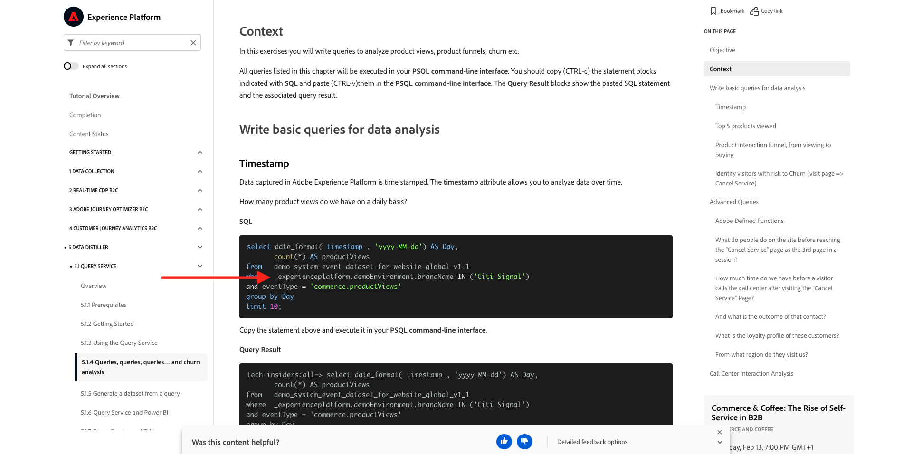
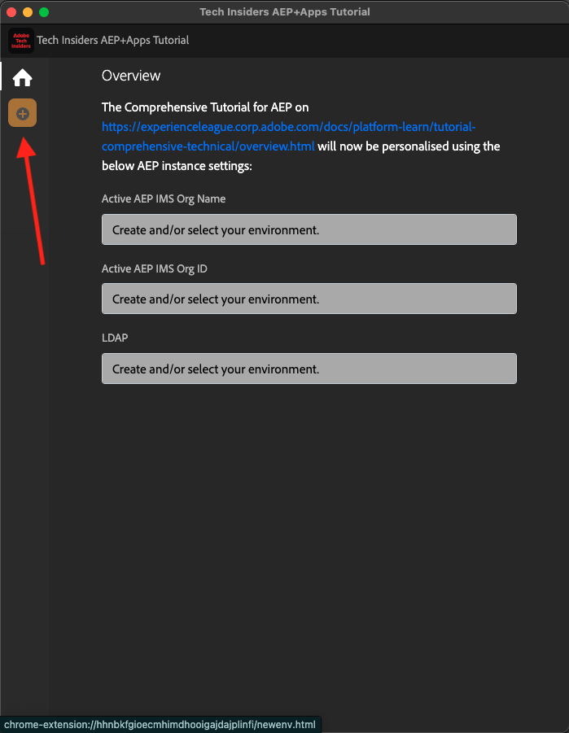

# 0.1 Instale a extensão Chrome para a documentação do Experience League

## 0.1.1 Por que criamos uma extensão do Chrome?

A documentação se tornou genérica para que possa ser facilmente reutilizada por qualquer pessoa, usando qualquer instância do Adobe Experience Platform.
Ao tornar a documentação reutilizável, as **Variáveis de ambiente** foram introduzidas na documentação, o que significa que você encontrará as **chaves** abaixo na documentação. Cada chave é uma variável específica para um ambiente específico, e a extensão do Chrome alterará essa variável para você e, como tal, facilitará a cópia do código e do texto das páginas de tutorial e a colagem nas várias interfaces do usuário que você usará como parte do tutorial.

Um exemplo desses valores pode ser encontrado abaixo. Atualmente, esses valores ainda não podem ser usados, mas assim que você instalar e ativar a extensão do Chrome, verá essas variáveis mudarem para um texto &quot;normal&quot; que pode ser copiado e reutilizado.

| Nome | Chave |
|:-------------:| :---------------:|
| ID da organização IMS da AEP | `--aepImsOrgId--` |
| ID do locatário da AEP | `--aepTenantId--` |
| Nome da sandbox da AEP | `--aepSandboxName--` |
| LDAP do perfil do aluno | `--aepUserLdap--` |

Como exemplo, na captura de tela abaixo, você pode ver uma referência a `--aepTenantId--`.

Depois que a extensão for instalada, esse mesmo texto será alterado automaticamente para refletir os valores específicos da instância.

A extensão também possibilitará:

- Cadastrar-se no tutorial

## 0.1.2 Instalar a extensão do Chrome

Para instalar essa extensão do Chrome, abra o navegador Chrome e vá para: [https://chrome.google.com/webstore/detail/platform-learn-configurat/hhnbkfgioecmhimdhooigajdajplinfi/related?hl=en&amp;authuser=0](https://chrome.google.com/webstore/detail/platform-learn-configurat/hhnbkfgioecmhimdhooigajdajplinfi/related?hl=en&amp;authuser=0). Você verá isso.

Clique em **Adicionar ao Chrome**.

Você verá isso. Clique em **Adicionar extensão**.

A extensão será instalada e você verá uma notificação semelhante.

No menu **extensões**, clique no ícone de **peça do quebra-cabeça** e fixe a extensão **Aprendizado da Plataforma - Configuração** no menu de extensão.

## 0.1.2 Configurar a extensão do Chrome

Vá para [https://experienceleague.adobe.com/docs/platform-learn/comprehensive-technical-tutorial-v22/overview.html?lang=en](https://experienceleague.adobe.com/docs/platform-learn/comprehensive-technical-tutorial-v22/overview.html?lang=en) e clique no ícone de extensão para abri-lo.

Você então verá esse pop-up. Clique no ícone **+**.

Insira seu nome e a ID de configuração criada para o ambiente do Adobe Experience Platform. Clique em **Criar novo**.

>[!IMPORTANT]
>
>Se você for um funcionário da Adobe: é possível encontrar a ID de configuração para usar no repositório Github interno (https://git.corp.adobe.com/vangeluw/platformenablement).
>
>Se você for um Parceiro de Soluções Adobe, entre em contato com seu Contato de Parceiro de Soluções ou envie um email para **spphelp@adobe.com**.

No menu esquerdo da extensão, você verá um ícone com suas iniciais. Clique nele. Em seguida, você verá o mapeamento entre as **Variáveis de ambiente** e os valores específicos da instância do Adobe Experience Platform. Clique em **Ativar configuração**.

Depois de ativar sua configuração, você verá um ponto verde ao lado das iniciais. Isso significa que sua ID de configuração agora está ativa. Você também verá várias opções adicionais de menu serem exibidas.

Agora você tem duas opções:

- Se você for um usuário existente da habilitação com uma configuração existente, vá para **0.1.3 Usuário existente - Logon**
- Se você for um usuário completamente novo que está iniciando este tutorial pela primeira vez, vá para **0.1.4 Inscrição** e ignore **0.1.3 Usuário existente - Logon**

## 0.1.3 Usuário existente - Logon

>[!IMPORTANT]
>
>Exercício **0.1.3 Usuário existente - Login** só funcionará se você for um usuário existente que se inscreveu anteriormente neste tutorial.

Se você for um usuário existente que está configurando essa extensão do Chrome pela primeira vez, clique no ícone violeta no menu esquerdo. Você verá isso.

Preencha os valores conforme necessário.

>[!IMPORTANT]
>
>O **LDAP** é o campo mais importante: você deve usar o mesmo LDAP usado ao se inscrever no tutorial pela primeira vez. Isso garantirá que seu progresso seja carregado com êxito. Se não tiver certeza do que é o seu ldap, verifique seu endereço de email. Use o texto antes de @-symbol em seu endereço de email como LDAP. Se seu endereço de email for **techinsiders@adobe.com**, o LDAP inserido aqui deverá ser **vangeluw**).

Clique em **OK**.

Após 30s-1 minuto, sua tela será alterada e você será revertido de volta para a **Página Inicial**, onde você verá isto:

Sua extensão do Chrome agora está configurada e você pode verificar se tudo está funcionando bem.

## 0.1.4 Novo usuário - Inscrição

>[!IMPORTANT]
>
>Exercício **0.1.4 Novo usuário - Inscrição** destina-se a novos usuários que estão iniciando este tutorial pela primeira vez.

Se você for um novo usuário que está se inscrevendo neste tutorial pela primeira vez, clique no ícone amarelo no menu. Você verá isso.

Preencha os campos conforme necessário. Clique em **Salvar**.

>[!IMPORTANT]
>
>O **LDAP** é o campo mais importante. Se não tiver certeza do que é o seu ldap, verifique seu endereço de email. Use o texto antes de @-symbol em seu endereço de email como LDAP. Se seu endereço de email for **techinsiders@adobe.com**, o LDAP inserido aqui deverá ser **vangeluw**).

Após 30s-1 minuto, sua tela será alterada e você será revertido de volta para a **Página Inicial**, onde você verá isto:

Sua extensão do Chrome agora está configurada e você pode verificar se tudo está funcionando bem.

## 0.1.5 Verificar o conteúdo do tutorial

Como teste, vá para [esta página](https://experienceleague.adobe.com/docs/platform-learn/comprehensive-technical-tutorial-v22/module4/ex3.html?lang=en).

Agora você deve ver que todas as **Variáveis de ambiente** foram substituídas por seus valores verdadeiros, com base na ID de configuração na extensão do Chrome.

Agora você deve ter uma exibição semelhante à mostrada abaixo, onde as variáveis de ambiente `--aepTenantId--` foram substituídas pela sua ID de locatário real, que neste caso é **_experienceplatform**.

Próxima etapa: [0.2 Use o Sistema de demonstração Próximo para configurar a propriedade do cliente da Coleção de dados da Adobe Experience Platform](./ex2.md)

[Voltar ao módulo 0](./getting-started.md)

[Voltar a todos os módulos](./../../../overview.md)
