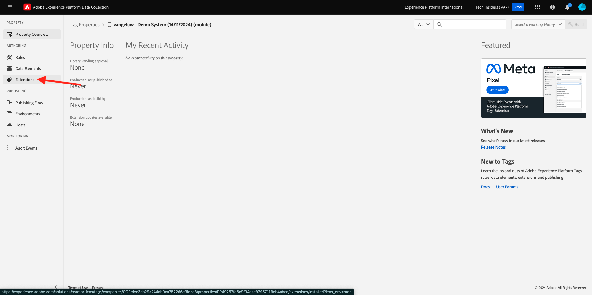

# 0.3 Criar a sequência de dados

Ir para [https://experience.adobe.com/#/data-collection/](https://experience.adobe.com/#/data-collection/). Após o exercício anterior, você agora tem duas propriedades de Coleção de dados: uma para Web e outra para dispositivos móveis.

Essas propriedades estão quase prontas para serem usadas, mas antes de começar a coletar dados usando essas propriedades, é necessário configurar um fluxo de dados. Você obterá mais informações sobre o conceito do que é um fluxo de dados e o que significa no Exercício 1.2.

Por enquanto, siga estas etapas.

## 0.3.1 Criar a sequência de dados para a Web

Clique em **[!UICONTROL Datastreams]** ou **[!UICONTROL Datastreams (Beta)]**.

No canto superior direito da tela, selecione o nome da sandbox, que deve ser `--aepSandboxName--`.

Clique em **[!UICONTROL Nova sequência de dados]**.

Para o **[!UICONTROL Nome Amigável]**, e para a descrição opcional, digite `--aepUserLdap-- - Demo System Datastream`. Para Esquema de Evento, selecione **Sistema de Demonstração - Esquema de Evento para Site (Global v1.1)**. Clique em **Salvar**.

Você verá isso. Clique em **Adicionar Serviço**.

Selecione o serviço **[!UICONTROL Adobe Experience Platform]**, que irá expor campos adicionais. Você verá isso.

Para Conjunto de Dados de Evento, selecione **Sistema de Demonstração - Conjunto de Dados de Evento para Site (Global v1.1)** e para Conjunto de Dados de Perfil, selecione **Sistema de Demonstração - Conjunto de Dados de Perfil para Site (Global v1.1)**. Clique em **Salvar**.

Agora vocês verão isto.

Por enquanto, é isso. No [Módulo 1.1](./../../../modules/datacollection/module1.1/data-ingestion-launch-web-sdk.md), você aprenderá mais sobre o SDK da Web e como configurar todos os seus recursos.

No menu esquerdo, clique em **[!UICONTROL Marcas]**.

Filtre os resultados da pesquisa para ver suas duas propriedades da Coleção de dados. Abra a propriedade de **Web** clicando nela.

Você verá isso. Clique em **Extensões**.

Na extensão SDK da Web do Adobe Experience Platform, clique em **Configurar**.

Você verá isso. Para **Datastreams**, você verá um valor fictício definido como 1. Agora é necessário clicar no botão de opção **Escolher da lista**. Na lista suspensa, selecione o fluxo de dados criado anteriormente.

Selecione sua **Sequência de dados**. DICA: você pode filtrar os resultados na lista suspensa facilmente digitando seu `--aepUserLdap--`.

Role para baixo até ver **Coleção de dados**. Certifique-se de que a caixa de seleção **Habilitar coleta de dados de cliques** não esteja habilitada. Clique em **Salvar** para salvar as alterações.

Vá para **Fluxo de Publicação**.

Clique em **...** para **Principal** e em **Editar**.

Clique em **Adicionar todos os recursos alterados** e em **Salvar e criar para desenvolvimento**.

Suas alterações estão sendo publicadas e estarão prontas em alguns minutos.

## 0.3.2 Criar a sequência de dados para dispositivos móveis

Ir para [https://experience.adobe.com/#/data-collection/](https://experience.adobe.com/#/data-collection/).

Clique em **[!UICONTROL Datastreams]** ou **[!UICONTROL Datastreams (Beta)]**.

No canto superior direito da tela, selecione o nome da sandbox, que deve ser `--aepSandboxName--`.

Clique em **[!UICONTROL Nova sequência de dados]**.

Para o **[!UICONTROL Nome Amigável]**, e para a descrição opcional, digite `--aepUserLdap-- - Demo System Datastream (Mobile)`. Para Esquema de Evento, selecione **Sistema de Demonstração - Esquema de Evento para Aplicativo Móvel (Global v1.1)**. Clique em **Salvar**.

Clique em **[!UICONTROL Salvar]**.

Você verá isso. Clique em **Adicionar Serviço**.

Selecione o serviço **[!UICONTROL Adobe Experience Platform]**, que irá expor campos adicionais. Você verá isso.

Para o Conjunto de Dados de Evento, selecione **Sistema de Demonstração - Conjunto de Dados de Evento para Aplicativo Móvel (Global v1.1)** e, para o Conjunto de Dados de Perfil, selecione **Sistema de Demonstração - Conjunto de Dados de Perfil para Aplicativo Móvel (Global v1.1)**. Clique em **Salvar**.

Você verá isso.

A sequência de dados agora está pronta para ser usada na propriedade do cliente de coleta de dados da Adobe Experience Platform para dispositivos móveis.

Vá para **Tags** e filtre os resultados da pesquisa para ver suas duas propriedades de Coleção de dados. Abra a propriedade de **Celular** clicando nela.

Você verá isso. Clique em **Extensões**.

Na extensão **Adobe Experience Platform Edge Network**, clique em **Configurar**.

Você verá isso. Agora é necessário selecionar a sandbox e a sequência de dados corretas que você acabou de configurar. A sandbox a ser usada é `--aepSandboxName--` e a sequência de dados é chamada `--aepUserLdap-- - Demo System Datastream (Mobile)`.

Para o **domínio Edge Network**, use o domínio padrão **edge.adobedc.net**.

Clique em **Salvar** para salvar as alterações.

Vá para **Fluxo de Publicação**.

Clique no **...** ao lado de **Principal** e em **Editar**.

Clique em **Adicionar todos os recursos alterados** e em **Salvar e criar para desenvolvimento**.

Suas alterações estão sendo publicadas e estarão prontas em alguns minutos.

Próxima Etapa: [0.4 Usar o site](./ex4.md)

[Voltar ao módulo 0](./getting-started.md)

[Voltar a todos os módulos](./../../../overview.md)