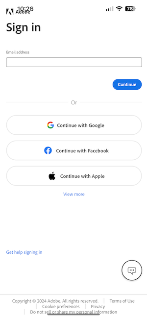

# 0.5 Usar o aplicativo móvel

## 0.5.1 Baixar o aplicativo

Vá para [https://bit.ly/dx-demo-app](https://bit.ly/dx-demo-app) no computador. Você verá isso.

Use o aplicativo **Câmera** no smartphone para instalar o aplicativo móvel para o SO do dispositivo. Para esta habilitação, você precisa instalar a **Versão 2.x** que usa o SDK do Adobe Experience Platform Mobile.

>[!NOTE]
>
>Depois de instalar o aplicativo pela primeira vez em um dispositivo iOS, você poderá receber uma mensagem de erro ao tentar abrir o aplicativo que diz: **Desenvolvedor corporativo não confiável**. Para corrigir isso, você precisa ir para **Configurações > Geral > Gerenciamento de Dispositivo > Adobe Systems Inc.** e clicar em **Confiar na Adobe Systems Inc.**.

Depois que o aplicativo for instalado, você o encontrará na tela inicial do dispositivo. Clique no ícone para abrir o aplicativo.

Quando estiver usando o aplicativo pela primeira vez, você será solicitado a fazer logon usando sua Adobe ID. Conclua o processo de logon.

Depois de fazer logon, você verá uma notificação solicitando sua permissão para enviar notificações. Enviaremos notificações como parte do tutorial, então clique em **Permitir**.

Você verá a página inicial do aplicativo. Vá para **Configurações**.

Nas configurações, você verá que, atualmente, um **Projeto público** está carregado no aplicativo. Clique em **Projeto personalizado**.

Agora você pode carregar um projeto personalizado. Clique no código QR para carregar facilmente seu projeto.

Após o exercício 0.1, você teve esse resultado. Clique para abrir o **projeto do Mobile Retail** criado para você.

Caso tenha fechado acidentalmente a janela do navegador ou para futuras sessões de demonstração ou capacitação, você também pode acessar o projeto do seu site em [https://builder.adobedemo.com/projects](https://builder.adobedemo.com/projects). Depois de fazer logon com sua Adobe ID, você verá isso. Clique no projeto do aplicativo móvel para abri-lo.

Você verá isso. Clique em **Integrações**.

É necessário selecionar a propriedade Data Collection para dispositivos móveis que foi criada no exercício 0.1. Em seguida, clique em **Executar**.

Você verá este pop-up, que contém um código QR. Digitalize este código QR de dentro do aplicativo móvel.

Você verá sua ID de projeto exibida no aplicativo e depois poderá clicar em **Salvar**.

Agora, volte para a **Página inicial** no aplicativo. Seu aplicativo está pronto para ser usado.

Você concluiu o módulo 0.

[Voltar ao módulo 0](./getting-started.md)

[Voltar a todos os módulos](./../../../overview.md)
