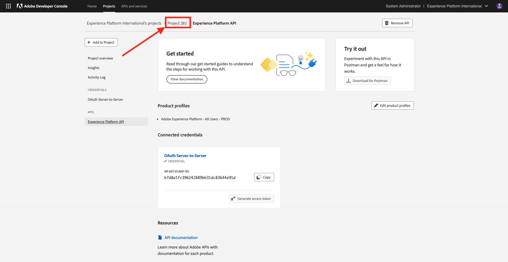
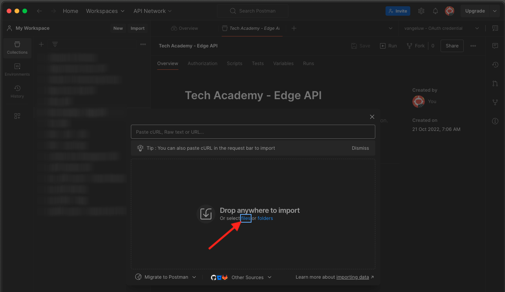

# 2.1.3 Visualizar seu próprio perfil de cliente em tempo real - API

Neste exercício, você usará o Postman e o Adobe I/O para consultar as APIs da Adobe Experience Platform e visualizar seu próprio perfil do cliente em tempo real.

## Story

No Perfil do cliente em tempo real, todos os dados do perfil são mostrados junto com os dados do evento, bem como com as associações de segmento existentes. Os dados mostrados podem vir de qualquer lugar, de aplicativos Adobe e soluções externas. Essa é a visualização mais eficiente no Adobe Experience Platform, o sistema de experiência de registro.

O Perfil do cliente em tempo real pode ser consumido por todos os aplicativos Adobe, mas também por soluções externas, como call centers ou aplicativos de clientela na loja. A maneira de fazer isso é conectar essas soluções externas às APIs do Adobe Experience Platform.

## 2.1.3.1 Seus identificadores

No painel Visualizador de perfis no site, você pode encontrar várias identidades. Cada identidade está vinculada a um namespace.


No painel Raio X, podemos ver quatro combinações diferentes de IDs e Namespaces:

| Identidade | Namespace |
|:-------------:| :---------------:|
| ID Experience Cloud (ECID) | 12507560687324495704459439363261812234 |
| ID de e-mail | woutervangeluwe+06022022-01@gmail.com |
| ID do número de celular | +32473622044+06022022-01 |

Lembrar desses identificadores na próxima etapa.

Com essas IDs em mente, acesse o Postman.

## 2.1.3.2 Configurar o projeto Adobe I/O

Neste exercício, você usará o Adobe I/O de forma bastante intensa para consultar as APIs da plataforma. Siga as etapas abaixo para configurar o Adobe I/O.

Ir para [https://developer.adobe.com/console/home](https://developer.adobe.com/console/home)


Selecione a instância correta do Adobe Experience Platform no canto superior direito da tela. Sua instância é `--envName--`.


Clique em **Criar novo projeto**.

 ou


Selecione **+ Adicionar ao Projeto** e selecione **API**.


Você verá isto:


Clique no ícone **Adobe Experience Platform**.
/images/api2.png)

Clique em **Experience Platform API**.


Clique em **Next**.


Agora você pode optar por fazer com que o Adobe I/O gere seu par de chaves de segurança ou fazer upload de um existente.

Escolha **Opção 1 - Gerar um par de chaves**.


Clique em **Gerar par de chaves**.


Você verá um ponteiro por cerca de 30 segundos.


Você verá isso e seu par de chaves gerado será baixado como um arquivo zip: **config.zip**.

Descompacte o arquivo **config.zip** na sua área de trabalho. Você verá que ele contém 2 arquivos:


- **certificate_pub.crt** é seu certificado de chave pública. De uma perspectiva de segurança, esse é o certificado usado livremente para configurar integrações com aplicativos online.
- **private.key** é sua Chave privada. Isso nunca deve ser compartilhado com ninguém. A chave privada é o que você usa para autenticar para a implementação da API e deve ser um segredo. Se você compartilhar sua chave privada com qualquer pessoa, ela poderá acessar sua implementação e abusar da API para assimilar dados mal-intencionados na Platform e extrair todos os dados contidos na Platform.


Salve o arquivo **config.zip** em um local seguro, pois ele será necessário para as próximas etapas e para acesso futuro às APIs do Adobe I/O e do Adobe Experience Platform.

Clique em **Next**.


Agora é necessário selecionar o(s) **Perfil(is) de Produto** para sua integração.

Selecione os Perfis de produto necessários.

**INFO**: em sua instância do Adobe Experience Platform, os Perfis de Produto terão um nome diferente. Você precisa selecionar pelo menos um perfil de produto com os direitos de acesso adequados, que são configurados no Adobe Admin Console.


Clique em **Salvar API configurada**.


Você verá um ponteiro por alguns segundos.


E, em seguida, você verá sua integração.


Clique no botão **Baixar para Postman** e em **Conta de Serviço (JWT)** para baixar um ambiente do Postman (aguarde até que o ambiente seja baixado, isso pode levar alguns segundos).


Role para baixo até ver **Conta de Serviço (JWT)**, que é onde você pode encontrar todos os detalhes de integração usados para configurar a integração com o Adobe Experience Platform.


Seu projeto IO atualmente tem um nome genérico. É necessário dar um nome amigável à integração. Clique no **Projeto 1** (ou nome semelhante) conforme indicado



Clique em **Editar projeto**.


Insira um Nome e uma Descrição para sua integração. Como convenção de nomenclatura, usaremos `AEP API --aepUserLdap--`. Substitua o ldap pelo seu ldap.
Por exemplo, se o ldap for vangeluw, o nome e a descrição da integração se tornarão API vangeluw da AEP.

Insira `AEP API --aepUserLdap--` como o **Título do projeto**. Clique em **Salvar**.


A integração com o Adobe I/O foi concluída.


## 2.1.3.3 Autenticação Postman para Adobe I/O

Ir para [https://www.getpostman.com/](https://www.getpostman.com/).

Clique em **Introdução**.


Em seguida, baixe e instale o Postman.


Após a instalação do Postman, inicie o aplicativo.

No Postman, há dois conceitos: Ambientes e Coleções.

- O Ambiente contém todas as variáveis de ambiente mais ou menos consistentes. No Ambiente, você encontrará informações como o IMSOrg do nosso ambiente de plataforma, além de credenciais de segurança como a sua Chave privada e outras. O arquivo de ambiente é o que você baixou durante a configuração do Adobe I/O no exercício anterior. Seu nome é assim: **service.postman_environment.json**.

- A coleção contém várias solicitações de API que podem ser usadas. Usaremos 2 coleções
   - 1 coleção para autenticação para Adobe I/0
   - 1 Coleta para os exercícios neste módulo
   - 1 coleção para os exercícios no módulo Real-Time CDP, para criação de destino

Baixe o arquivo [postman.zip](./../../../assets/postman/postman_profile.zip) no desktop local.

Neste arquivo **postman.zip**, você encontrará os seguintes arquivos:

- `_Adobe I-O - Token.postman_collection.json`
- `_Adobe Experience Platform Enablement.postman_collection.json`
- `Destination_Authoring_API.json`

Descompacte o arquivo **postman.zip** e armazene esses 3 arquivos em uma pasta no seu desktop, juntamente com o ambiente Postman baixado do Adobe I/O. Você precisa ter estes 4 arquivos nessa pasta:


Volte para o Postman. Clique em **Importar**.


Clique em **Carregar arquivos**.



Navegue até a pasta na área de trabalho em que você extraiu os 4 arquivos baixados. Selecione estes 4 arquivos ao mesmo tempo e clique em **Abrir**.


Depois de clicar em **Abrir**, o Postman mostrará uma visão geral do Ambiente e das Coleções que você está prestes a importar. Clique em **Importar**.


Agora você tem tudo o que precisa no Postman para começar a interagir com o Adobe Experience Platform por meio das APIs.

A primeira coisa a fazer é verificar se você está autenticado corretamente. Para ser autenticado, é necessário solicitar um token de acesso.

Verifique se você selecionou o ambiente correto antes de executar qualquer solicitação. Você pode verificar o Ambiente selecionado no momento verificando a lista suspensa Ambiente no canto superior direito.

O ambiente selecionado deve ter um nome semelhante a este:


Clique no ícone **olho** e em **Editar** para atualizar a Chave privada no arquivo de ambiente.


Você verá isso. Todos os campos são preenchidos previamente, exceto o campo **PRIVATE_KEY**.


A chave privada foi gerada quando você criou o Projeto Adobe I/O. Ele foi baixado como um arquivo zip chamado **config.zip**. Extraia esse arquivo zip para o desktop.


Abra a pasta **config** e abra o arquivo **private.key** com seu editor de texto preferido.


Você verá algo parecido com isso, copiará todo o texto para a área de transferência.


Retorne ao Postman e cole a chave privada nos campos ao lado da variável **PRIVATE_KEY**, para as colunas **INITIAL VALUE** e **CURRENT VALUE**. Clique em **Salvar**.


O ambiente e as coleções do Postman agora estão configurados e funcionando. Agora você pode autenticar do Postman para o Adobe I/O.

Para fazer isso, você precisa carregar uma biblioteca externa que irá cuidar da criptografia e descriptografia da comunicação. Para carregar essa biblioteca, você precisa executar a solicitação com o nome **INIT: Carregar Biblioteca de Criptografia para RS256**. Selecione esta solicitação na **_Adobe I/O - Coleção de tokens** e você a verá exibida no meio da tela.


Clique no botão azul **Enviar**. Após alguns segundos, você deve ver uma resposta exibida na seção **Body** do Postman:


Com a biblioteca de criptografia carregada, podemos autenticar no Adobe I/O.

Em **\_Adobe I/O - Token collection**, selecione a solicitação com o nome **IMS: JWT Generate + Auth**. Novamente, você verá os detalhes da solicitação exibidos no meio da tela.


Clique no botão azul **Enviar**. Após alguns segundos, você deve ver uma resposta exibida na seção **Body** do Postman:


Se a configuração tiver sido bem-sucedida, você verá uma resposta semelhante que contém as seguintes informações:

| Chave | Valor |
|:-------------:| :---------------:| 
| token_type | **portador** |
| access_token | **eyJ4NXUiOiJpbXNfbmEx...QT7mqZkumN1tdsPEioOEl4087Dg** |
| expires_in | **86399973** |

O Adobe I/O deu a você um **bearer**-token, com um valor específico (esse access_token muito longo) e uma janela de expiração.

O token que recebemos agora é válido por 24 horas. Isso significa que, após 24 horas, se você quiser usar o Postman para autenticar no Adobe I/O, precisará gerar um novo token executando essa solicitação novamente.

## 2.1.3.4 API de perfil do cliente em tempo real, esquema: perfil

Agora você pode enviar sua primeira solicitação para as APIs de perfil do cliente em tempo real da plataforma.

No Postman, localize a coleção **_Habilitação do Adobe Experience Platform**.


Em **1. Serviço de Perfil Unificado**, selecione a primeira solicitação com o nome **UPS - Perfil do GET por ID de Entidade &amp; NS**.


Para essa solicitação, há três variáveis necessárias:

| Chave | Valor | Definição |
|:-------------:| :---------------:| :---------------:| 
| entityId | **id** | a ID específica do cliente |
| entityIdNS | **namespace** | o namespace específico aplicável à ID |
| schema.name | **_xdm.context.profile** | o schema específico para o qual deseja receber informações |

Portanto, se você quiser solicitar que as APIs da Adobe Experience Platform forneçam todas as informações de perfil de sua própria ECID, será necessário configurar a solicitação da seguinte maneira:

| Chave | Valor |
|:-------------:| :---------------:| 
| entityId | **yourECID** |
| entityIdNS | **ecid** |
| schema.name | **_xdm.context.profile** |


Você também deve verificar os campos **Cabeçalho** - da sua solicitação. Ir para **Cabeçalhos**. Você verá isto:


| Chave | Valor |
| ----------- | ----------- |
| x-sandbox-name | `--aepSandboxName--` |

>[!NOTE]
>
>É necessário especificar o nome da sandbox da Adobe Experience Platform que você está usando. Seu x-sandbox-name deve ser `--aepSandboxName--`.

Clique em **Enviar** para enviar sua solicitação à Platform.

Você deve obter uma resposta imediata da Platform, mostrando algo como isto:


Esta é a resposta completa da Platform:

```javascript
{
    "A28iM3aJBJRbEQpOnUh5HOM9": {
        "entityId": "A28iM3aJBJRbEQpOnUh5HOM9",
        "mergePolicy": {
            "id": "e632ccb8-882a-4b5e-8375-96a1ba3df1aa"
        },
        "sources": [
            "61fe23c5be4b5f19485dc379",
            "profile-streaming-segment",
            "61fe23cfa07c1219489b3ba4"
        ],
        "tags": [
            "1644130566774:1542:232:va7",
            "0a1e9dd4-940a-46ec-9114-7e371cf5c4d0",
            "aep_ups_partitioned_profile_cdc_low_lag_sla_0:106:1090888313",
            "a6fed09e-2c56-403e-8692-4e99e4779dfa:IRL1",
            "1644419616318:2989:31:va7",
            "aep_ups_profile_change_event_prod_va7:71:7946633524-8361f22c-c09e-4364-b24b-b57435c4d14f"
        ],
        "identityGraph": [
            "BUF9zMKLrXq72p4HpbsHv1SSBnr0LTAxQGdtYWlsLmNvbQ",
            "GkicrkFjgmCjUg",
            "GtCbrkFjgkSOFg",
            "A2-AP9zOsakzNTe9Rqwf7Wse",
            "BkFuK4QcJpSPByuSBnr0LTAx",
            "A28jSB484ziuECF3fEoXmFlF",
            "A28iM3aJBJRbEQpOnUh5HOM9"
        ],
        "entity": {
            "_experienceplatform": {
                "individualCharacteristics": {},
                "loyaltyDetails": {
                    "level": "Basic",
                    "points": 0
                },
                "identification": {
                    "core": {
                        "phoneNumber": "+32473622044+06022022-01",
                        "email": "woutervangeluwe+06022022-01@gmail.com",
                        "loyaltyId": "5415776",
                        "ecid": "12019606991718502754997192487345616673",
                        "crmId": "1478212"
                    }
                }
            },
            "personalEmail": {
                "address": "woutervangeluwe+06022022-01@gmail.com"
            },
            "_repo": {
                "createDate": "2022-02-06T06:56:06.424Z"
            },
            "testProfile": true,
            "homeAddress": {
                "postalCode": "1831",
                "city": "Diegem",
                "street1": "Culliganlaan 2F"
            },
            "mobilePhone": {
                "number": "+32473622044+06022022-01"
            },
            "segmentMembership": {
                "ups": {
                    "bc999ded-b6d7-40d4-87a7-d3a280b950e3": {
                        "lastQualificationTime": "2022-02-09T20:38:33Z",
                        "status": "exited"
                    },
                    "23b1cd4e-d62f-44bd-8392-3095a33109c4": {
                        "lastQualificationTime": "2022-02-09T20:38:33Z",
                        "status": "exited"
                    },
                    "f0807704-a1c8-4ac4-85dd-60db2fbf18f1": {
                        "lastQualificationTime": "2022-02-09T20:38:33Z",
                        "status": "existing"
                    }
                }
            },
            "person": {
                "name": {
                    "lastName": "Van Geluwe",
                    "firstName": "Wouter"
                },
                "gender": "female",
                "birthDate": "1982-07-08"
            },
            "userActivityRegions": {
                "IRL1": {
                    "captureTimestamp": "2022-02-09T15:21:11Z"
                }
            },
            "identityMap": {
                "email": [
                    {
                        "id": "woutervangeluwe+06022022-01@gmail.com"
                    }
                ],
                "crmid": [
                    {
                        "id": "1478212"
                    }
                ],
                "ecid": [
                    {
                        "id": "12507560687324495704459439363261812234"
                    },
                    {
                        "id": "12019606991718502754997192487345616673"
                    },
                    {
                        "id": "38335942889672702722192106363935964471"
                    }
                ],
                "phone": [
                    {
                        "id": "+32473622044+06022022-01"
                    }
                ],
                "loyaltyid": [
                    {
                        "id": "5415776"
                    }
                ]
            }
        },
        "lastModifiedAt": "2022-02-09T20:38:36Z"
    }
}
```

Atualmente, todos os dados de Perfil disponíveis na Plataforma para esta ECID.

Você não é obrigado a usar a ECID para solicitar dados de perfil do Perfil do cliente em tempo real da plataforma. Você pode usar qualquer ID em qualquer namespace para solicitar esses dados.

Vamos voltar para a Postman e fingir que somos a central de atendimento, e enviar uma solicitação para a Platform especificando o namespace do **Telefone** e seu número de celular.

Portanto, se você quiser solicitar que as APIs da Platform forneçam todas as informações de perfil de um telefone específico, será necessário configurar a solicitação da seguinte maneira:

| Chave | Valor |
|:-------------:| :---------------:| 
| entityId | **seu telefone** |
| entityIdNS | **telefone** (substituir ecid por telefone) |
| schema.name | **_xdm.context.profile** |

Se o seu número de telefone contiver símbolos especiais como **+**, você precisará selecionar seu número de telefone completo, clicar com o botão direito do mouse e clicar em **EncodeURIComponent**.


Você terá isto:


Você também deve verificar os campos **Cabeçalho** - da sua solicitação. Ir para **Cabeçalhos**. Você verá isto:


| Chave | Valor |
| ----------- | ----------- |
| x-sandbox-name | `--aepSandboxName--` |

>[!NOTE]
>
>É necessário especificar o nome da sandbox da Adobe Experience Platform que você está usando. Seu x-sandbox-name deve ser `--aepSandboxName--`.

Clique no botão azul **Enviar** e verifique a resposta.


Vamos fazer o mesmo com seu endereço de email especificando o namespace do **email** e seu endereço de email.

Portanto, se você quiser solicitar que as APIs da Platform forneçam todas as informações de perfil de um endereço de email específico, será necessário configurar a solicitação da seguinte maneira:

| Chave | Valor |
|:-------------:| :---------------:| 
| entityId | **seu email** |
| entityIdNS | **email** (substituir Telefone por email) |
| schema.name | **_xdm.context.profile** |

Se seu endereço de email contiver símbolos especiais como **+**, você precisará selecionar seu endereço de email completo, clicar com o botão direito do mouse e clicar em **EncodeURIComponent**.


Você terá isto:


Você também deve verificar os campos **Cabeçalho** - da sua solicitação. Ir para **Cabeçalhos**. Você verá isto:


| Chave | Valor |
| ----------- | ----------- |
| x-sandbox-name | `--aepSandboxName--` |

>[!NOTE]
>
>É necessário especificar o nome da sandbox da Adobe Experience Platform que você está usando. Seu x-sandbox-name deve ser `--aepSandboxName--`.

Clique no botão azul **Enviar** e verifique a resposta.


Esse é um tipo muito importante de flexibilidade oferecida às marcas. Isso significa que qualquer ambiente pode enviar uma solicitação para a Platform, usando sua própria ID e namespace, sem precisar entender a complexidade de vários namespaces e IDs.

Como exemplo:

- a Central de Atendimento solicitará dados da Plataforma usando o namespace **telefone**
- o Sistema de Fidelidade solicitará dados da Platform usando o namespace **email**
- aplicativos online podem usar o namespace **ecid**

A central de atendimento não sabe necessariamente que tipo de identificador é usado no Sistema de fidelidade e o Sistema de fidelidade não sabe necessariamente que tipo de identificador é usado por aplicativos online. Cada sistema individual pode usar as informações que tem e que entende para obter as informações de que precisa, quando precisa.

## 2.1.3.5 API de perfil do cliente em tempo real, esquema: Profile e ExperienceEvent

Depois de consultar com êxito as APIs da plataforma para obter dados de perfil, vamos fazer o mesmo com os dados do ExperienceEvent.

No Postman, localize a coleção **_Habilitação do Adobe Experience Platform**.


Em **1. Serviço de Perfil Unificado**, selecione a segunda solicitação com o nome **UPS - GET Profile &amp; EE por ID de Entidade &amp; NS**.


Para essa solicitação, há quatro variáveis necessárias:

| Chave | Valor | Definição |
|:-------------:| :---------------:|  :---------------:| 
| schema.name | **_xdm.context.experienceevent** | o schema específico para o qual deseja receber informações. Nesse caso, estamos procurando dados que são mapeados em relação ao esquema ExperienceEvent. |
| relatedSchema.name | **_xdm.context.profile** | Enquanto estamos procurando dados mapeados em relação ao esquema ExperienceEvent, precisamos especificar uma identidade para a qual queremos receber esses dados. O esquema que tem acesso à identidade é o Perfil-esquema, então o relacionado Esquema aqui é o Perfil-esquema. |
| relatedEntityId | **id** | a ID específica do cliente |
| relatedEntityIdNS | **namespace** | o namespace específico aplicável à ID |

Portanto, se você quiser solicitar que as APIs da Platform forneçam todas as informações de perfil de sua própria ECID, será necessário configurar a solicitação da seguinte maneira:

| Chave | Valor |
|:-------------:| :---------------:| 
| schema.name | **_xdm.context.experienceevent** |
| relatedSchema.name | **_xdm.context.profile** |
| relatedEntityId | **yourECID** |
| relatedEntityIdNS | **ecid** |


Você também deve verificar os campos **Cabeçalho** - da sua solicitação. Ir para **Cabeçalhos**. Você verá isto:


| Chave | Valor |
| ----------- | ----------- |
| x-sandbox-name | `--aepSandboxName--` |

>[!NOTE]
>
>É necessário especificar o nome da sandbox da Adobe Experience Platform que você está usando. Seu x-sandbox-name deve ser `--aepSandboxName--`.

Clique em **Enviar** para enviar sua solicitação à Platform.

Você deve obter uma resposta imediata da Platform, mostrando algo como isto:


Abaixo está a resposta completa da Platform. Neste exemplo, há oito ExperienceEvents vinculados à ECID desse cliente. Observe os itens abaixo para ver as diferentes variáveis na solicitação, pois o que você vê abaixo é a consequência direta da sua configuração no Launch em exercícios anteriores.

Além disso, quando o painel Raio X mostra informações do ExperienceEvent, ele está usando a carga abaixo para analisar e recuperar as informações, como Nome do produto (procure por productName na carga abaixo) e URL da imagem do produto (procure por productImageUrl na carga abaixo).

```javascript
{
    "_page": {
        "orderby": "timestamp",
        "start": "d686ab8a-2d0c-4722-9ff5-bfc1020b0b55-0",
        "count": 31,
        "next": ""
    },
    "children": [
        {
            "relatedEntityId": "A28iM3aJBJRbEQpOnUh5HOM9",
            "entityId": "d686ab8a-2d0c-4722-9ff5-bfc1020b0b55-0",
            "timestamp": 1644127126596,
            "entity": {
                "environment": {
                    "ipV4": "213.118.129.117",
                    "type": "browser",
                    "browserDetails": {
                        "viewportHeight": 969,
                        "viewportWidth": 1920,
                        "userAgent": "Mozilla/5.0 (Macintosh; Intel Mac OS X 10_15_7) AppleWebKit/537.36 (KHTML, like Gecko) Chrome/98.0.4758.80 Safari/537.36"
                    }
                },
                "web": {
                    "webPageDetails": {
                        "pageViews": {
                            "value": 1
                        },
                        "name": "vangeluw-OCUC",
                        "URL": "https://builder.adobedemo.com/run/vangeluw-OCUC"
                    },
                    "webReferrer": {
                        "URL": "https://adobe.okta.com/"
                    }
                },
                "_experienceplatform": {
                    "interactionDetails": {
                        "core": {
                            "channel": "web"
                        }
                    },
                    "demoEnvironment": {
                        "brandName": "vangeluw-OCUC"
                    },
                    "identification": {
                        "core": {
                            "ecid": "12507560687324495704459439363261812234"
                        }
                    }
                },
                "implementationDetails": {
                    "name": "https://ns.adobe.com/experience/alloy/reactor",
                    "version": "2.8.0+2.9.0",
                    "environment": "browser"
                },
                "identityMap": {
                    "ECID": [
                        {
                            "id": "12507560687324495704459439363261812234",
                            "authenticatedState": "ambiguous",
                            "primary": true
                        }
                    ]
                },
                "eventType": "web.webpagedetails.pageViews",
                "_id": "d686ab8a-2d0c-4722-9ff5-bfc1020b0b55-0",
                "placeContext": {
                    "localTime": "2022-02-06T06:58:46.596+01:00",
                    "localTimezoneOffset": -60
                },
                "device": {
                    "screenOrientation": "landscape",
                    "screenWidth": 1920,
                    "screenHeight": 1080
                },
                "timestamp": "2022-02-06T05:58:46.596Z"
            },
            "lastModifiedAt": "2022-02-06T05:59:48Z"
        },
        {
            "relatedEntityId": "A28iM3aJBJRbEQpOnUh5HOM9",
            "entityId": "919a46bf-a591-4c32-9201-b72250d5f5d9-0",
            "timestamp": 1644127129876,
            "entity": {
                "environment": {
                    "ipV4": "213.118.129.117",
                    "type": "browser",
                    "browserDetails": {
                        "viewportHeight": 969,
                        "viewportWidth": 1920,
                        "userAgent": "Mozilla/5.0 (Macintosh; Intel Mac OS X 10_15_7) AppleWebKit/537.36 (KHTML, like Gecko) Chrome/98.0.4758.80 Safari/537.36"
                    }
                },
                "web": {
                    "webPageDetails": {
                        "pageViews": {
                            "value": 1
                        },
                        "name": "vangeluw-OCUC#",
                        "URL": "https://builder.adobedemo.com/run/vangeluw-OCUC#"
                    },
                    "webReferrer": {
                        "URL": "https://adobe.okta.com/"
                    }
                },
                "_experienceplatform": {
                    "interactionDetails": {
                        "core": {
                            "channel": "web"
                        }
                    },
                    "demoEnvironment": {
                        "brandName": "vangeluw-OCUC"
                    },
                    "identification": {
                        "core": {
                            "ecid": "12507560687324495704459439363261812234"
                        }
                    }
                },
                "implementationDetails": {
                    "name": "https://ns.adobe.com/experience/alloy/reactor",
                    "version": "2.8.0+2.9.0",
                    "environment": "browser"
                },
                "identityMap": {
                    "ECID": [
                        {
                            "id": "12507560687324495704459439363261812234",
                            "authenticatedState": "ambiguous",
                            "primary": true
                        }
                    ]
                },
                "eventType": "web.webpagedetails.pageViews",
                "_id": "919a46bf-a591-4c32-9201-b72250d5f5d9-0",
                "placeContext": {
                    "localTime": "2022-02-06T06:58:49.876+01:00",
                    "localTimezoneOffset": -60
                },
                "device": {
                    "screenOrientation": "landscape",
                    "screenWidth": 1920,
                    "screenHeight": 1080
                },
                "timestamp": "2022-02-06T05:58:49.876Z"
            },
            "lastModifiedAt": "2022-02-06T05:59:48Z"
        },
        {
            "relatedEntityId": "A28iM3aJBJRbEQpOnUh5HOM9",
            "entityId": "41a80489-00d4-446c-b456-8cb19c3f309a-0",
            "timestamp": 1644130597134,
            "entity": {
                "environment": {
                    "ipV4": "213.118.129.117",
                    "type": "browser",
                    "browserDetails": {
                        "viewportHeight": 1001,
                        "viewportWidth": 1920,
                        "userAgent": "Mozilla/5.0 (Macintosh; Intel Mac OS X 10_15_7) AppleWebKit/537.36 (KHTML, like Gecko) Chrome/98.0.4758.80 Safari/537.36"
                    }
                },
                "web": {
                    "webPageDetails": {
                        "pageViews": {
                            "value": 1
                        },
                        "name": "login",
                        "URL": "https://builder.adobedemo.com/run/vangeluw-OCUC/login"
                    },
                    "webReferrer": {
                        "URL": "https://builder.adobedemo.com/run/vangeluw-OCUC/login"
                    }
                },
                "_experienceplatform": {
                    "interactionDetails": {
                        "core": {
                            "channel": "web"
                        }
                    },
                    "demoEnvironment": {
                        "brandName": "vangeluw-OCUC"
                    },
                    "identification": {
                        "core": {
                            "ecid": "12507560687324495704459439363261812234"
                        }
                    }
                },
                "implementationDetails": {
                    "name": "https://ns.adobe.com/experience/alloy/reactor",
                    "version": "2.8.0+2.9.0",
                    "environment": "browser"
                },
                "identityMap": {
                    "ECID": [
                        {
                            "id": "12507560687324495704459439363261812234",
                            "authenticatedState": "ambiguous",
                            "primary": true
                        }
                    ]
                },
                "eventType": "web.webpagedetails.pageViews",
                "_id": "41a80489-00d4-446c-b456-8cb19c3f309a-0",
                "placeContext": {
                    "localTime": "2022-02-06T07:56:37.134+01:00",
                    "localTimezoneOffset": -60
                },
                "device": {
                    "screenOrientation": "landscape",
                    "screenWidth": 1920,
                    "screenHeight": 1080
                },
                "timestamp": "2022-02-06T06:56:37.134Z"
            },
            "lastModifiedAt": "2022-02-06T06:56:38Z"
        },
        {
            "relatedEntityId": "A28jSB484ziuECF3fEoXmFlF",
            "entityId": "8ACC7B6C-2320-4865-B414-3B0CFA01F628",
            "timestamp": 1644419615000,
            "entity": {
                "environment": {
                    "ipV4": "213.118.129.117",
                    "browserDetails": {
                        "userAgent": "Mozilla/5.0 (iPhone; CPU OS 15_3 like Mac OS X; en_BE)"
                    }
                },
                "eventType": "application.login",
                "_id": "8ACC7B6C-2320-4865-B414-3B0CFA01F628",
                "_experienceplatform": {
                    "interactionDetails": {
                        "core": {
                            "channel": "mobile"
                        }
                    },
                    "demoEnvironment": {
                        "brandName": "vangeluw-2L6V"
                    },
                    "identification": {
                        "core": {
                            "ecid": "12019606991718502754997192487345616673",
                            "email": "woutervangeluwe+06022022-01@gmail.com"
                        }
                    }
                },
                "timestamp": "2022-02-09T15:13:35Z",
                "identityMap": {
                    "ECID": [
                        {
                            "id": "12019606991718502754997192487345616673",
                            "authenticatedState": "ambiguous",
                            "primary": true
                        }
                    ]
                }
            },
            "lastModifiedAt": "2022-02-09T15:13:38Z"
        },
        {
            "relatedEntityId": "A28jSB484ziuECF3fEoXmFlF",
            "entityId": "54F68CE5-E9E1-4AD0-91B1-7B607A9285C4",
            "timestamp": 1644419658000,
            "entity": {
                "environment": {
                    "ipV4": "213.118.129.117",
                    "browserDetails": {
                        "userAgent": "Mozilla/5.0 (iPhone; CPU OS 15_3 like Mac OS X; en_BE)"
                    }
                },
                "_experienceplatform": {
                    "interactionDetails": {
                        "core": {
                            "channel": "mobile"
                        }
                    },
                    "demoEnvironment": {
                        "brandName": "vangeluw-2L6V"
                    },
                    "identification": {
                        "core": {
                            "ecid": "12019606991718502754997192487345616673"
                        }
                    }
                },
                "identityMap": {
                    "ECID": [
                        {
                            "id": "12019606991718502754997192487345616673",
                            "authenticatedState": "ambiguous",
                            "primary": true
                        }
                    ]
                },
                "eventType": "commerce.productViews",
                "_id": "54F68CE5-E9E1-4AD0-91B1-7B607A9285C4",
                "commerce": {
                    "productViews": {
                        "value": 1
                    }
                },
                "productListItems": [
                    {
                        "quantity": 1,
                        "productAddMethod": "Mobile",
                        "_experienceplatform": {
                            "core": {
                                "mainCategory": "Women",
                                "productURL": "product1",
                                "imageURL": "https://contentviewer.s3.amazonaws.com/helium/wh08-white_main.jpg"
                            }
                        },
                        "priceTotal": 42,
                        "name": "Cassia Funnel Sweatshirt",
                        "SKU": "product1",
                        "currencyCode": "USD"
                    }
                ],
                "timestamp": "2022-02-09T15:14:18Z"
            },
            "lastModifiedAt": "2022-02-09T15:14:21Z"
        },
        {
            "relatedEntityId": "A2-AP9zOsakzNTe9Rqwf7Wse",
            "entityId": "bfe26684-bc3b-40c5-9fe5-5aba854c3227-0",
            "timestamp": 1644420036035,
            "entity": {
                "environment": {
                    "ipV4": "193.105.139.131",
                    "type": "browser",
                    "browserDetails": {
                        "viewportHeight": 969,
                        "viewportWidth": 1920,
                        "userAgent": "Mozilla/5.0 (Macintosh; Intel Mac OS X 10_15_7) AppleWebKit/537.36 (KHTML, like Gecko) Chrome/98.0.4758.80 Safari/537.36"
                    }
                },
                "web": {
                    "webPageDetails": {
                        "pageViews": {
                            "value": 1
                        },
                        "name": "vangeluw-OCUC",
                        "URL": "https://builder.adobedemo.com/run/vangeluw-OCUC"
                    },
                    "webReferrer": {
                        "URL": "https://adobe.okta.com/"
                    }
                },
                "_experienceplatform": {
                    "interactionDetails": {
                        "core": {
                            "channel": "web"
                        }
                    },
                    "demoEnvironment": {
                        "brandName": "vangeluw-OCUC"
                    },
                    "identification": {
                        "core": {
                            "ecid": "38335942889672702722192106363935964471"
                        }
                    }
                },
                "implementationDetails": {
                    "name": "https://ns.adobe.com/experience/alloy/reactor",
                    "version": "2.8.0+2.9.0",
                    "environment": "browser"
                },
                "identityMap": {
                    "ECID": [
                        {
                            "id": "38335942889672702722192106363935964471",
                            "authenticatedState": "ambiguous",
                            "primary": true
                        }
                    ]
                },
                "eventType": "web.webpagedetails.pageViews",
                "_id": "bfe26684-bc3b-40c5-9fe5-5aba854c3227-0",
                "placeContext": {
                    "localTime": "2022-02-09T16:20:36.035+01:00",
                    "localTimezoneOffset": -60
                },
                "device": {
                    "screenOrientation": "landscape",
                    "screenWidth": 1920,
                    "screenHeight": 1080
                },
                "timestamp": "2022-02-09T15:20:36.035Z"
            },
            "lastModifiedAt": "2022-02-09T15:20:39Z"
        },
        {
            "relatedEntityId": "A2-AP9zOsakzNTe9Rqwf7Wse",
            "entityId": "0480c434-8fcd-4a80-b298-c561276ac989-0",
            "timestamp": 1644420037078,
            "entity": {
                "environment": {
                    "ipV4": "193.105.139.131",
                    "type": "browser",
                    "browserDetails": {
                        "viewportHeight": 969,
                        "viewportWidth": 1920,
                        "userAgent": "Mozilla/5.0 (Macintosh; Intel Mac OS X 10_15_7) AppleWebKit/537.36 (KHTML, like Gecko) Chrome/98.0.4758.80 Safari/537.36"
                    }
                },
                "web": {
                    "webPageDetails": {
                        "pageViews": {
                            "value": 1
                        },
                        "name": "vangeluw-OCUC#",
                        "URL": "https://builder.adobedemo.com/run/vangeluw-OCUC#"
                    },
                    "webReferrer": {
                        "URL": "https://adobe.okta.com/"
                    }
                },
                "_experienceplatform": {
                    "interactionDetails": {
                        "core": {
                            "channel": "web"
                        }
                    },
                    "demoEnvironment": {
                        "brandName": "vangeluw-OCUC"
                    },
                    "identification": {
                        "core": {
                            "ecid": "38335942889672702722192106363935964471"
                        }
                    }
                },
                "implementationDetails": {
                    "name": "https://ns.adobe.com/experience/alloy/reactor",
                    "version": "2.8.0+2.9.0",
                    "environment": "browser"
                },
                "identityMap": {
                    "ECID": [
                        {
                            "id": "38335942889672702722192106363935964471",
                            "authenticatedState": "ambiguous",
                            "primary": true
                        }
                    ]
                },
                "eventType": "web.webpagedetails.pageViews",
                "_id": "0480c434-8fcd-4a80-b298-c561276ac989-0",
                "placeContext": {
                    "localTime": "2022-02-09T16:20:37.078+01:00",
                    "localTimezoneOffset": -60
                },
                "device": {
                    "screenOrientation": "landscape",
                    "screenWidth": 1920,
                    "screenHeight": 1080
                },
                "timestamp": "2022-02-09T15:20:37.078Z"
            },
            "lastModifiedAt": "2022-02-09T15:20:39Z"
        },
        {
            "relatedEntityId": "A2-AP9zOsakzNTe9Rqwf7Wse",
            "entityId": "6b1b3983-6966-4551-a711-6b6e410fd819-0",
            "timestamp": 1644420045993,
            "entity": {
                "environment": {
                    "ipV4": "193.105.139.131",
                    "type": "browser",
                    "browserDetails": {
                        "viewportHeight": 969,
                        "viewportWidth": 1920,
                        "userAgent": "Mozilla/5.0 (Macintosh; Intel Mac OS X 10_15_7) AppleWebKit/537.36 (KHTML, like Gecko) Chrome/98.0.4758.80 Safari/537.36"
                    }
                },
                "web": {
                    "webPageDetails": {
                        "pageViews": {
                            "value": 1
                        },
                        "name": "login",
                        "URL": "https://builder.adobedemo.com/run/vangeluw-OCUC/login"
                    },
                    "webReferrer": {
                        "URL": "https://adobe.okta.com/"
                    }
                },
                "_experienceplatform": {
                    "interactionDetails": {
                        "core": {
                            "channel": "web"
                        }
                    },
                    "demoEnvironment": {
                        "brandName": "vangeluw-OCUC"
                    },
                    "identification": {
                        "core": {
                            "ecid": "38335942889672702722192106363935964471"
                        }
                    }
                },
                "implementationDetails": {
                    "name": "https://ns.adobe.com/experience/alloy/reactor",
                    "version": "2.8.0+2.9.0",
                    "environment": "browser"
                },
                "identityMap": {
                    "ECID": [
                        {
                            "id": "38335942889672702722192106363935964471",
                            "authenticatedState": "ambiguous",
                            "primary": true
                        }
                    ]
                },
                "eventType": "web.webpagedetails.pageViews",
                "_id": "6b1b3983-6966-4551-a711-6b6e410fd819-0",
                "placeContext": {
                    "localTime": "2022-02-09T16:20:45.993+01:00",
                    "localTimezoneOffset": -60
                },
                "device": {
                    "screenOrientation": "landscape",
                    "screenWidth": 1920,
                    "screenHeight": 1080
                },
                "timestamp": "2022-02-09T15:20:45.993Z"
            },
            "lastModifiedAt": "2022-02-09T15:20:47Z"
        },
        {
            "relatedEntityId": "A2-AP9zOsakzNTe9Rqwf7Wse",
            "entityId": "ae0f3551-7753-4467-8547-8fdbb66c2214-0",
            "timestamp": 1644420058565,
            "entity": {
                "environment": {
                    "ipV4": "193.105.139.131",
                    "type": "browser",
                    "browserDetails": {
                        "viewportHeight": 969,
                        "viewportWidth": 1920,
                        "userAgent": "Mozilla/5.0 (Macintosh; Intel Mac OS X 10_15_7) AppleWebKit/537.36 (KHTML, like Gecko) Chrome/98.0.4758.80 Safari/537.36"
                    }
                },
                "web": {
                    "webPageDetails": {
                        "URL": "https://builder.adobedemo.com/run/vangeluw-OCUC/home"
                    },
                    "webReferrer": {
                        "URL": "https://adobe.okta.com/"
                    }
                },
                "_experienceplatform": {
                    "interactionDetails": {
                        "core": {
                            "channel": "web"
                        }
                    },
                    "demoEnvironment": {
                        "brandName": "vangeluw-OCUC"
                    },
                    "identification": {
                        "core": {
                            "ecid": "38335942889672702722192106363935964471",
                            "email": "woutervangeluwe+06022022-01@gmail.com"
                        }
                    }
                },
                "implementationDetails": {
                    "name": "https://ns.adobe.com/experience/alloy/reactor",
                    "version": "2.8.0+2.9.0",
                    "environment": "browser"
                },
                "identityMap": {
                    "ECID": [
                        {
                            "id": "38335942889672702722192106363935964471",
                            "authenticatedState": "ambiguous",
                            "primary": true
                        }
                    ]
                },
                "eventType": "web.login",
                "_id": "ae0f3551-7753-4467-8547-8fdbb66c2214-0",
                "placeContext": {
                    "localTime": "2022-02-09T16:20:58.565+01:00",
                    "localTimezoneOffset": -60
                },
                "device": {
                    "screenOrientation": "landscape",
                    "screenWidth": 1920,
                    "screenHeight": 1080
                },
                "timestamp": "2022-02-09T15:20:58.565Z"
            },
            "lastModifiedAt": "2022-02-09T15:20:59Z"
        },
        {
            "relatedEntityId": "A2-AP9zOsakzNTe9Rqwf7Wse",
            "entityId": "5e67a9c9-b201-4e21-bd3a-4d10475f6156-0",
            "timestamp": 1644420058653,
            "entity": {
                "environment": {
                    "ipV4": "193.105.139.131",
                    "type": "browser",
                    "browserDetails": {
                        "viewportHeight": 969,
                        "viewportWidth": 1920,
                        "userAgent": "Mozilla/5.0 (Macintosh; Intel Mac OS X 10_15_7) AppleWebKit/537.36 (KHTML, like Gecko) Chrome/98.0.4758.80 Safari/537.36"
                    }
                },
                "web": {
                    "webPageDetails": {
                        "pageViews": {
                            "value": 1
                        },
                        "name": "home",
                        "URL": "https://builder.adobedemo.com/run/vangeluw-OCUC/home"
                    },
                    "webReferrer": {
                        "URL": "https://adobe.okta.com/"
                    }
                },
                "_experienceplatform": {
                    "interactionDetails": {
                        "core": {
                            "channel": "web"
                        }
                    },
                    "demoEnvironment": {
                        "brandName": "vangeluw-OCUC"
                    },
                    "identification": {
                        "core": {
                            "ecid": "38335942889672702722192106363935964471"
                        }
                    }
                },
                "implementationDetails": {
                    "name": "https://ns.adobe.com/experience/alloy/reactor",
                    "version": "2.8.0+2.9.0",
                    "environment": "browser"
                },
                "identityMap": {
                    "ECID": [
                        {
                            "id": "38335942889672702722192106363935964471",
                            "authenticatedState": "ambiguous",
                            "primary": true
                        }
                    ]
                },
                "eventType": "web.webpagedetails.pageViews",
                "_id": "5e67a9c9-b201-4e21-bd3a-4d10475f6156-0",
                "placeContext": {
                    "localTime": "2022-02-09T16:20:58.653+01:00",
                    "localTimezoneOffset": -60
                },
                "device": {
                    "screenOrientation": "landscape",
                    "screenWidth": 1920,
                    "screenHeight": 1080
                },
                "timestamp": "2022-02-09T15:20:58.653Z"
            },
            "lastModifiedAt": "2022-02-09T15:21:00Z"
        },
        {
            "relatedEntityId": "A2-AP9zOsakzNTe9Rqwf7Wse",
            "entityId": "33253c5a-6a7e-4858-a7d2-4e6d4a1c7901-0",
            "timestamp": 1644420061804,
            "entity": {
                "environment": {
                    "ipV4": "193.105.139.131",
                    "type": "browser",
                    "browserDetails": {
                        "viewportHeight": 969,
                        "viewportWidth": 1920,
                        "userAgent": "Mozilla/5.0 (Macintosh; Intel Mac OS X 10_15_7) AppleWebKit/537.36 (KHTML, like Gecko) Chrome/98.0.4758.80 Safari/537.36"
                    }
                },
                "web": {
                    "webPageDetails": {
                        "pageViews": {
                            "value": 1
                        },
                        "name": "vangeluw-OCUC",
                        "URL": "https://builder.adobedemo.com/run/vangeluw-OCUC"
                    },
                    "webReferrer": {
                        "URL": "https://builder.adobedemo.com/run/vangeluw-OCUC/home"
                    }
                },
                "_experienceplatform": {
                    "interactionDetails": {
                        "core": {
                            "channel": "web"
                        }
                    },
                    "demoEnvironment": {
                        "brandName": "vangeluw-OCUC"
                    },
                    "identification": {
                        "core": {
                            "ecid": "38335942889672702722192106363935964471"
                        }
                    }
                },
                "implementationDetails": {
                    "name": "https://ns.adobe.com/experience/alloy/reactor",
                    "version": "2.8.0+2.9.0",
                    "environment": "browser"
                },
                "identityMap": {
                    "ECID": [
                        {
                            "id": "38335942889672702722192106363935964471",
                            "authenticatedState": "ambiguous",
                            "primary": true
                        }
                    ]
                },
                "eventType": "web.webpagedetails.pageViews",
                "_id": "33253c5a-6a7e-4858-a7d2-4e6d4a1c7901-0",
                "placeContext": {
                    "localTime": "2022-02-09T16:21:01.804+01:00",
                    "localTimezoneOffset": -60
                },
                "device": {
                    "screenOrientation": "landscape",
                    "screenWidth": 1920,
                    "screenHeight": 1080
                },
                "timestamp": "2022-02-09T15:21:01.804Z"
            },
            "lastModifiedAt": "2022-02-09T15:21:03Z"
        },
        {
            "relatedEntityId": "A2-AP9zOsakzNTe9Rqwf7Wse",
            "entityId": "d8e81fb7-6de9-44c1-b9c6-60d93b520209-0",
            "timestamp": 1644420071737,
            "entity": {
                "environment": {
                    "ipV4": "193.105.139.131",
                    "type": "browser",
                    "browserDetails": {
                        "viewportHeight": 969,
                        "viewportWidth": 1920,
                        "userAgent": "Mozilla/5.0 (Macintosh; Intel Mac OS X 10_15_7) AppleWebKit/537.36 (KHTML, like Gecko) Chrome/98.0.4758.80 Safari/537.36"
                    }
                },
                "web": {
                    "webPageDetails": {
                        "pageViews": {
                            "value": 1
                        },
                        "name": "vangeluw-OCUC",
                        "URL": "https://builder.adobedemo.com/run/vangeluw-OCUC"
                    },
                    "webReferrer": {
                        "URL": "https://builder.adobedemo.com/run/vangeluw-OCUC/home"
                    }
                },
                "_experienceplatform": {
                    "interactionDetails": {
                        "core": {
                            "channel": "web"
                        }
                    },
                    "demoEnvironment": {
                        "brandName": "vangeluw-OCUC"
                    },
                    "identification": {
                        "core": {
                            "ecid": "38335942889672702722192106363935964471"
                        }
                    }
                },
                "implementationDetails": {
                    "name": "https://ns.adobe.com/experience/alloy/reactor",
                    "version": "2.8.0+2.9.0",
                    "environment": "browser"
                },
                "identityMap": {
                    "ECID": [
                        {
                            "id": "38335942889672702722192106363935964471",
                            "authenticatedState": "ambiguous",
                            "primary": true
                        }
                    ]
                },
                "eventType": "web.webpagedetails.pageViews",
                "_id": "d8e81fb7-6de9-44c1-b9c6-60d93b520209-0",
                "placeContext": {
                    "localTime": "2022-02-09T16:21:11.737+01:00",
                    "localTimezoneOffset": -60
                },
                "device": {
                    "screenOrientation": "landscape",
                    "screenWidth": 1920,
                    "screenHeight": 1080
                },
                "timestamp": "2022-02-09T15:21:11.737Z"
            },
            "lastModifiedAt": "2022-02-09T15:21:14Z"
        }
    ],
    "_links": {
        "next": {
            "href": ""
        }
    }
}
```

Atualmente, todos os dados ExperienceEvent disponíveis na Platform para esta ECID.

Você não precisa usar a ECID para solicitar dados do ExperienceEvent do Perfil em tempo real da Adobe Experience Platform. Você pode usar qualquer ID em qualquer namespace para solicitar esses dados.

Próxima Etapa: [2.1.4 Criar um segmento - Interface do Usuário](./ex4.md)

[Voltar ao módulo 2.1](./real-time-customer-profile.md)

[Voltar a todos os módulos](../../../overview.md)
