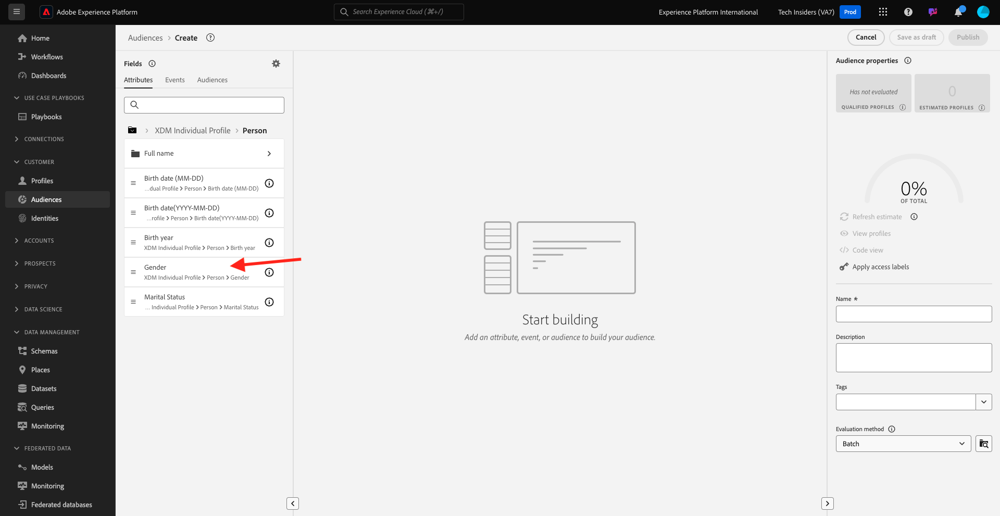
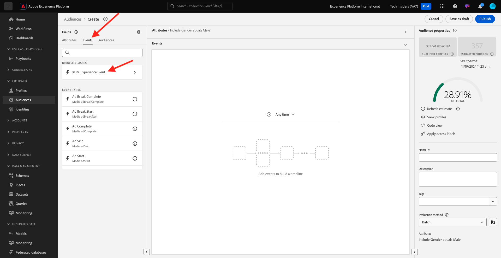

# 2.1.4 Criar um público-alvo - interface

Neste exercício, você criará um público-alvo usando o Audience Builder da Adobe Experience Platform.

Ir para [Adobe Experience Platform](https://experience.adobe.com/platform). Depois de fazer logon, você chegará à página inicial do Adobe Experience Platform.


Antes de continuar, você precisa selecionar uma **sandbox**. A sandbox a ser selecionada é chamada ``--aepSandboxName--``. Depois de selecionar a [!UICONTROL sandbox] apropriada, você verá a alteração da tela e agora estará na [!UICONTROL sandbox] dedicada.


No menu no lado esquerdo, vá para **Públicos-alvo**. Nesta página, você pode ter uma visão geral de todos os públicos-alvo existentes. Clique no botão **+ Criar público-alvo** para começar a criar um novo público-alvo.


Selecione **Regra de compilação** e clique em **Criar**.


Quando estiver no novo construtor de público-alvo, você notará imediatamente a opção de menu **Atributos** e a referência ao **Perfil individual XDM**.


Como o XDM é a linguagem que impulsiona os negócios da experiência, o XDM também é a base para o construtor de público-alvo. Todos os dados assimilados na Platform devem ser mapeados em relação ao XDM e, como tal, todos os dados se tornam parte do mesmo modelo de dados, independentemente de onde esses dados vêm. Isso oferece uma grande vantagem ao criar públicos-alvo, como nessa interface única do construtor de públicos-alvo, é possível combinar dados de qualquer origem no mesmo fluxo de trabalho. Os públicos-alvo criados no construtor de públicos-alvo podem ser enviados para soluções como Adobe Target, Adobe Campaign e Adobe Audience Manager para ativação.

Vamos criar um público que inclua todos os clientes **homens**.

Para chegar ao atributo de gênero, você precisa entender e conhecer o XDM.

Sexo é um atributo de Pessoa, que pode ser encontrado em Atributos. Para chegar lá, comece clicando em **Perfil Individual XDM**. Você verá isso. Na janela **Perfil individual XDM**, selecione **Pessoa**.


Você verá isso. Em **Pessoa**, você pode encontrar o atributo **Gênero**. Arraste o atributo Gênero para o construtor de público-alvo.



Agora é possível escolher o gênero específico entre as opções pré-preenchidas. Nesse caso, vamos escolher **Masculino**.


Depois de selecionar **Masculino**, você pode obter uma estimativa da população do público pressionando o botão **Atualizar estimativa**. Isso é muito útil para um usuário empresarial, para que ele possa ver o impacto de determinados atributos no tamanho do público resultante.


Você verá uma estimativa como a abaixo:


Em seguida, você deve refinar um pouco o seu público-alvo. Você precisa criar um público-alvo de todos os clientes do sexo masculino que visualizaram o produto **iPhone 15 Pro**.

Para criar esse público-alvo, é necessário adicionar um Evento de experiência. Você pode encontrar todos os Eventos de Experiência clicando no ícone **Eventos** na barra de menus **Campos**. Em seguida, você verá o nó **XDM ExperienceEvents** de nível superior. Clique em **XDM ExperienceEvent**.



Vá para **Itens da Lista de Produtos**.


Selecione **Nome** e arraste e solte o objeto **Nome** do menu esquerdo na tela do construtor de públicos-alvo na seção **Eventos**.


Você verá isto:


O parâmetro de comparação deve ser **igual** e, no campo de entrada, digite **iPhone 15 Pro**.


Toda vez que você adiciona um elemento ao construtor de público-alvo, você pode clicar no botão **Atualizar estimativa** para obter uma nova estimativa da população do público-alvo.

Até o momento, você só usou a interface do para criar seu público-alvo, mas também há uma opção de código para criar um público-alvo.

Ao criar um público-alvo, você está compondo uma consulta do Profile Query Language (PQL). Para visualizar o código PQL, você pode clicar no alternador da **Exibição de código**, no canto superior direito do construtor de público-alvo.


Agora você pode ver a declaração completa do PQL:

```sql
person.gender in ["male"] and CHAIN(xEvent, timestamp, [C0: WHAT(productListItems.exists(name.equals("iPhone 15 Pro", false)))])
```

Você também pode visualizar uma amostra dos perfis de clientes que fazem parte deste público-alvo clicando em **Exibir perfis**.


Por fim, vamos dar um nome ao seu público-alvo,
defina o **Método de avaliação** como **Streaming** e clique em **Publish**.

Como convenção de nomenclatura, use:

- `--aepUserLdap-- - Male customers with interest in iPhone 15 Pro`


Você será direcionado de volta à página Visão geral do público-alvo.


Próxima Etapa: [2.1.5 Veja seu Perfil de Cliente em Tempo Real em ação na Central de Atendimento](./ex5.md)

[Voltar ao módulo 2.1](./real-time-customer-profile.md)

[Voltar a todos os módulos](../../../overview.md)
