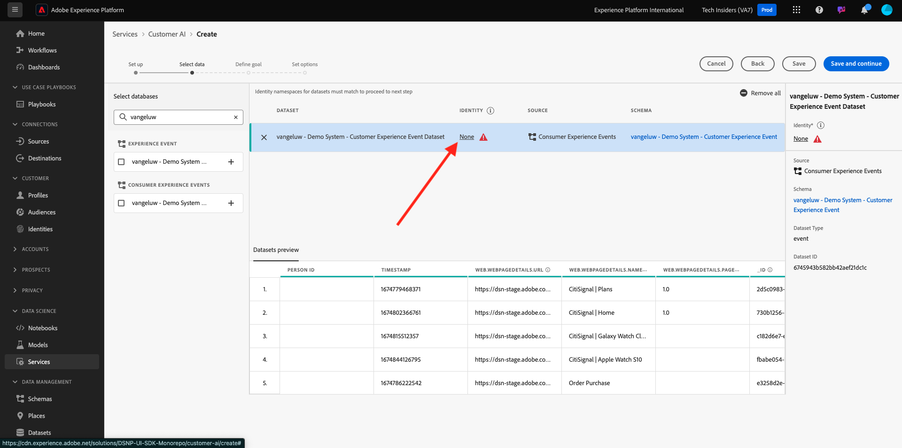

# 2.2.2 IA do cliente - Criar uma nova instância (Configurar)

A IA do cliente funciona analisando os dados existentes do Evento de experiência do consumidor para prever pontuações de churn ou propensão de conversão. A criação de uma nova instância da IA do cliente permite que os profissionais de marketing definam metas e medidas.

## Configurar uma nova instância da IA do cliente

No Adobe Experience Platform, clique em **Serviços** no menu esquerdo. O navegador **Serviços** é exibido e exibe todos os serviços disponíveis à sua disposição. No cartão da IA do cliente, clique em **Abrir**.

Clique em **Criar instância**.

Você verá isso.

Insira os detalhes necessários para a instância da IA do cliente:

- Nome: use `--aepUserLdap-- Product Purchase Propensity`
- Descrição: use: **Preveja a probabilidade de os clientes comprarem um produto**
- Tipo de propensão: selecione **Conversão**

Clique em **Salvar e continuar**.

Você verá isso. Selecione o conjunto de dados criado no exercício anterior chamado `--aepUserLdap-- - Demo System - Customer Experience Event Dataset`. Clique em **Adicionar**.

Você verá isso. você precisa definir o campo **Identidade**. Clique em **Nenhum**.

Na janela pop-up, selecione **Mapa de Identidade (identityMap)** e depois selecione o namespace **Sistema de Demonstração - CRMID (crmId)**. Em seguida, clique em **Salvar**.

Clique em **Salvar e continuar**.

Selecione **Ocorrerá** em seu conjunto de dados específico e defina o campo **commerce.purchases.value** como a variável de destino.

Em seguida, defina seu cronograma para ser executado **Semanalmente** e defina o horário o mais próximo possível de sua hora atual. Verifique se a opção **Habilitar pontuações para o Perfil** está habilitada. Clique em **Salvar e continuar**.

Após configurar a instância, você pode vê-la na lista de serviços da IA do cliente e também pode visualizar o resumo dos detalhes de configuração e execução clicando na linha de instâncias da IA do cliente. O painel de resumo também exibirá detalhes do erro caso sejam encontrados erros.

>[!NOTE]
>
>Você pode modificar qualquer definição ou atributo, desde que o status da instância da IA do cliente seja **Aguardando treinamento** ou **Erro**

Depois que seu modelo for executado, você verá isso.

Próxima etapa: [2.2.3 IA do cliente - Painel de pontuação e segmentação (Prever e executar ação)](./ex3.md)

[Voltar ao módulo 2.2](./intelligent-services.md)

[Voltar a todos os módulos](./../../../overview.md)
