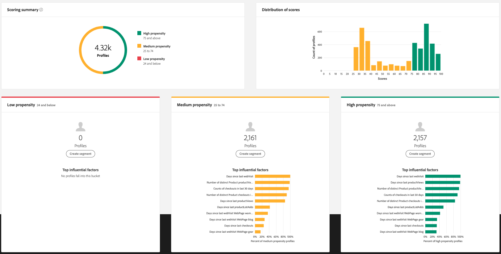
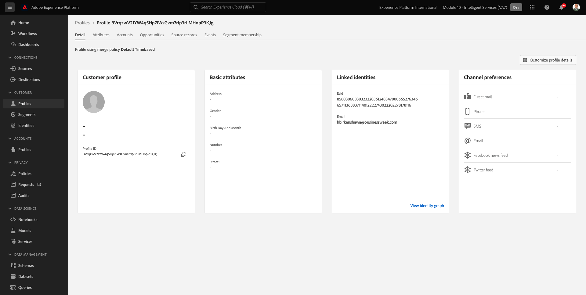

# 2.2.3 IA do cliente: painel de pontuação e segmentação (previsão e ação)

Depois que a instância da IA do cliente concluir uma execução de modelo, ela permitirá visualizar a pontuação de propensão avaliada para prever um cliente que realizará uma compra nos próximos 30 dias.

>[!NOTE]
>
>Somente uma instância da IA do cliente com status de **Sucesso** permitirá que você visualize os insights do serviço.

## 2.2.3.1 Previsão de propensão

Agora vamos analisar a propensão prevista gerada pelo modelo de instância da IA do cliente. Clique no nome da instância para exibir o painel.

O painel IA do cliente mostra o resumo sobre pontuação, distribuição de população e os fatores influentes para o modelo avaliar.

Passe o mouse sobre os fatores influentes para ver o detalhamento da distribuição de dados.

## 2.2.3.2 Ações das empresas

### 2.2.3.2.1 Segmentação de clientes

O painel IA do cliente permite definir segmentos com um único clique. Clique no botão **Criar segmento** nos cartões de propensão.

Você verá que uma definição de segmento é criada automaticamente.

Nomeie seu segmento, seguindo esta convenção de nomenclatura: `--aepUserLdap-- - Customer AI High Propensity`. Clique em **Salvar**.

Agora você pode usar esse segmento para direcionamento usando, por exemplo, a Real-time CDP, o Journey Orchestration e o Adobe Target.

### 2.2.3.2.2 Visão geral do perfil

Como a pontuação de propensão da IA do cliente se torna parte do Perfil do cliente em tempo real, você pode visualizar a pontuação de cada cliente.

No Adobe Experience Platform, vá para **Perfis** no menu esquerdo e selecione **Procurar**.

Procure um perfil usando qualquer um dos identificadores, como por exemplo **EMAIL hbirkenshawa@businessweek.com**, que estão disponíveis no arquivo JSON que você assimilou. Clique em **ID do Perfil** para abrir o perfil.

Você verá isto:

Vá para **Atributos**, que contém a saída do modelo de IA do cliente.

Role para baixo para ver a Pontuação de propensão como calculada pelo modelo de IA do cliente.

Próxima etapa: [Resumo e benefícios](./summary.md)

[Voltar ao módulo 2.2](./intelligent-services.md)

[Voltar a todos os módulos](./../../../overview.md)
