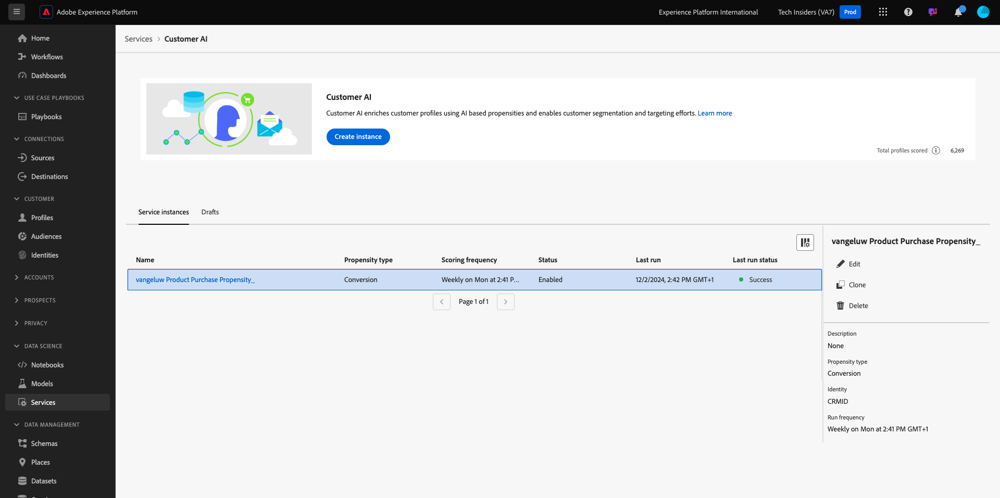

# 2.2.3 IA do cliente: painel de pontuação e segmentação (previsão e ação)

Depois que a instância da IA do cliente concluir uma execução de modelo, ela permitirá visualizar a pontuação de propensão avaliada para prever um cliente que realizará uma compra nos próximos 30 dias.

>[!NOTE]
>
>Somente uma instância da IA do cliente com status de **Sucesso** permitirá que você visualize os insights do serviço.

## Previsão de propensão

Agora vamos analisar a propensão prevista gerada pelo modelo de instância da IA do cliente. Clique no nome da instância para exibir o painel.

O painel IA do cliente mostra o resumo sobre pontuação, distribuição de população e os fatores influentes para o modelo avaliar.

Passe o mouse sobre os fatores influentes para ver o detalhamento da distribuição de dados.

## Ações comerciais

### Segmentação de clientes

O painel IA do cliente permite definir segmentos com um único clique. Clique no botão **Criar segmento** nos cartões de propensão.

Você verá que uma definição de segmento é criada automaticamente.

Nomeie seu segmento, seguindo esta convenção de nomenclatura: `--aepUserLdap-- - Customer AI High Propensity`. Clique em **Publish**.

Agora você pode usar esse segmento para direcionamento usando, por exemplo, a Real-time CDP, o Journey Optimizer e o Adobe Target.

## Cleanup

Para garantir que nenhum dado de demonstração desnecessário seja mantido em seu ambiente, exclua o conjunto de dados `--aepUserLdap-- - Demo System - Customer Experience Event Dataset` depois de concluir este exercício com êxito. Se você não excluir os dados de demonstração, haverá um impacto de custo para sua instância da AEP.

Próxima etapa: [Resumo e benefícios](./summary.md)

[Voltar ao módulo 2.2](./intelligent-services.md)

[Voltar a todos os módulos](./../../../overview.md)
