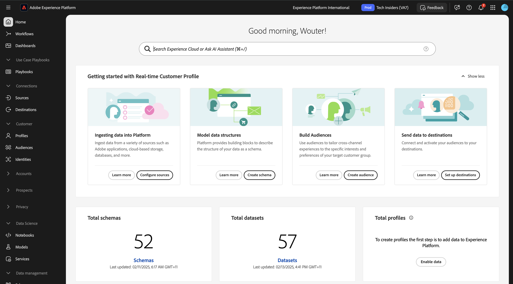

# 2.3.1 Criar um público-alvo

Neste exercício, você criará um público-alvo usando o construtor de públicos-alvo da Adobe Experience Platform.

## Contexto

Responder aos interesses de um cliente precisa ser em tempo real. Uma das maneiras de responder ao comportamento do cliente em tempo real é usando um público-alvo, com a condição de que o público-alvo se qualifique em tempo real. Neste exercício, você precisa construir um público-alvo, levando em conta a atividade real no site que estamos usando.

## Identifique o comportamento ao qual deseja reagir

Ir para [https://dsn.adobe.com](https://dsn.adobe.com). Depois de fazer logon com sua Adobe ID, você verá isso. Clique nos 3 pontos **...** do projeto do site e clique em **Executar** para abri-lo.

Você verá seu site de demonstração aberto. Selecione o URL e copie-o para a área de transferência.

Abra uma nova janela incógnita do navegador.

Cole o URL do site de demonstração que você copiou na etapa anterior. Você será solicitado a fazer logon usando sua Adobe ID.

Selecione o tipo de conta e conclua o processo de logon.

Em seguida, você verá seu site carregado em uma janela incógnita do navegador. Para cada exercício, será necessário usar uma janela do navegador nova e incógnita para carregar o URL do site de demonstração.

Neste exemplo, você deseja responder a um cliente específico que exibe um produto específico.
Na página inicial do **Citi Signal**, vá para **Telefones e dispositivos** e clique no produto **Galaxy S24**.

Portanto, quando alguém visitar a página do produto do **Galaxy S24**, você poderá realizar alguma ação. A primeira coisa a fazer para agir, é definir um público.

## Criar o público

Ir para [Adobe Experience Platform](https://experience.adobe.com/platform). Depois de fazer logon, você chegará à página inicial do Adobe Experience Platform.

Antes de continuar, você precisa selecionar uma **sandbox**. A sandbox a ser selecionada é chamada ``--aepSandboxName--``. Depois de selecionar a [!UICONTROL sandbox] apropriada, você verá a alteração da tela e agora estará na [!UICONTROL sandbox] dedicada.

No menu à esquerda, vá para **Públicos-alvo** e vá para **Procurar**, onde você pode ter uma visão geral de todos os públicos-alvo existentes. Clique no botão **Criar público-alvo** para começar a criar um novo público-alvo.

Selecione **Regra de compilação** e clique em **Criar**.

Como mencionado acima, você precisa criar um público de todos os clientes que visualizaram o produto **Galaxy S24**.

Para criar esse público-alvo, é necessário adicionar um evento. Você pode encontrar todos os eventos clicando no ícone **Eventos** na barra de menus **Públicos-alvo**.

Em seguida, você verá o nó **XDM ExperienceEvent** de nível superior.

Para encontrar clientes que visitaram o produto **Galaxy S24**, clique em **XDM ExperienceEvent**.

Role para baixo até **Itens da lista de produtos** e clique nele.

Selecione **Nome** e arraste e solte o objeto **Nome** do menu esquerdo **Itens de Lista de Produtos** na tela do construtor de públicos-alvo na seção **Eventos**.

O parâmetro de comparação deve ser **igual a** e, no campo de entrada, digite `Galaxy S24`.

Agora, suas **Regras de Eventos** devem ter esta aparência. Toda vez que você adiciona um elemento ao construtor de público-alvo, você pode clicar no botão **Atualizar estimativa** para obter uma nova estimativa da população do público-alvo.

Dê um nome ao seu público-alvo e defina o **Método de Avaliação** como **Edge**.

Como convenção de nomenclatura, use:

- `--aepUserLdap-- - Interest in Galaxy S24`

Em seguida, clique no botão **Publish** para salvar seu público-alvo.

Você será redirecionado à página de visão geral do público-alvo.

Próxima Etapa: [2.3.2 Revise como configurar o Destino DV360 usando Destinos](./ex2.md)

[Voltar ao módulo 2.3](./real-time-cdp-build-a-segment-take-action.md)

[Voltar a todos os módulos](../../../overview.md)
