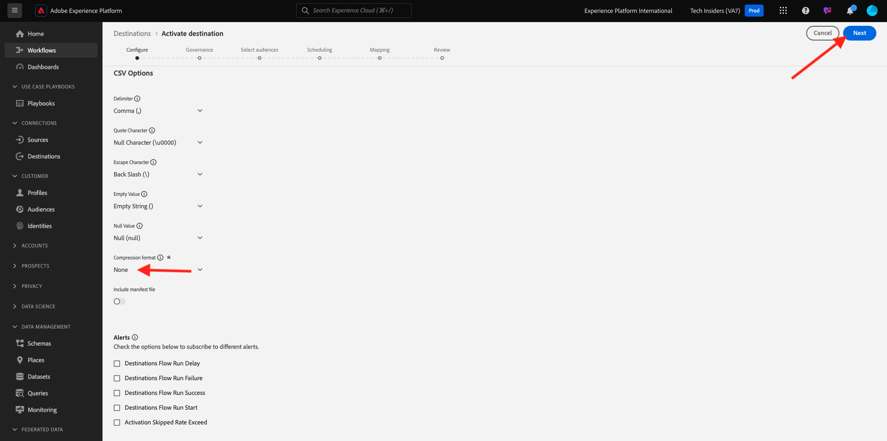
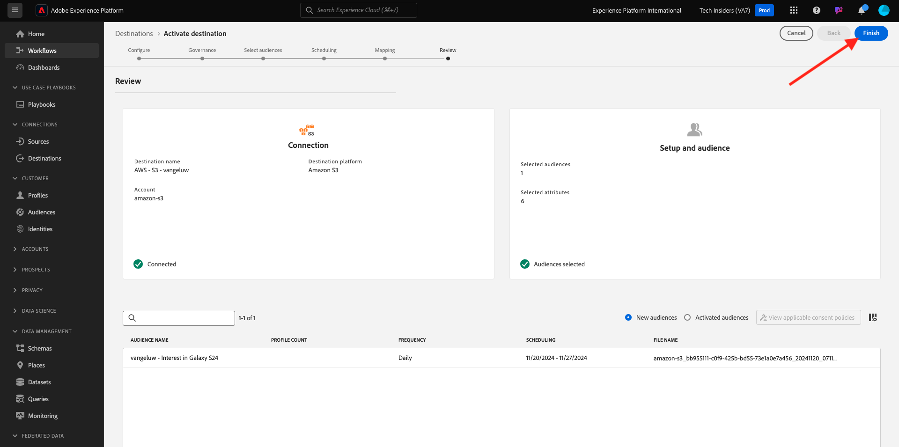

# 2.3.4 Realizar ação: enviar o público-alvo para um destino S3

O Adobe Experience Platform também pode compartilhar públicos com Destinos de marketing por email, como Salesforce Marketing Cloud, Oracle Eloqua, Oracle Responsys e Adobe Campaign.

Você pode usar o FTP ou SFTP como parte dos destinos dedicados para cada um desses Destinos de marketing por email, ou pode usar o AWS S3 para trocar listas de clientes entre o Adobe Experience Platform e esses Destinos de marketing por email.

Neste módulo, você configurará esse destino usando um bucket do AWS S3.

## Criar seu S3 bucket

Vá para [https://console.aws.amazon.com](https://console.aws.amazon.com) e entre.

>[!NOTE]
>
>Se você ainda não tiver uma conta do AWS, crie uma nova conta do AWS usando seu endereço de email pessoal.

Depois de fazer logon, você será redirecionado para o **Console de Gerenciamento do AWS**.

Na barra de pesquisa, procure por **s3**. Clique no primeiro resultado da pesquisa: **S3 - Armazenamento Escalável na Nuvem**.

Você verá a página inicial do **Amazon S3**. Clique em **Criar bloco**.

Na tela **Criar bloco**, use o nome `aepmodulertcdp--aepUserLdap--`

Deixe todas as outras configurações padrão como estão. Role para baixo e clique em **Criar bloco**.

Você verá seu bucket ser criado e será redirecionado para a página inicial do Amazon S3.

## Definir permissões para acessar seu bucket do S3

A próxima etapa é configurar o acesso ao seu bucket do S3.

Para fazer isso, vá para [https://console.aws.amazon.com/iam/home](https://console.aws.amazon.com/iam/home).

O acesso aos recursos do AWS é controlado pelo Amazon Identity and Access Management (IAM).

Agora você verá esta página.

No menu esquerdo, clique em **Usuários**. Você verá a tela **Usuários**. Clique em **Criar usuário**.

Em seguida, configure o usuário:

- Nome de Usuário: use `s3_--aepUserLdap--_rtcdp`

Clique em **Next**.

Em seguida, você verá essa tela de permissões. Clique em **Anexar políticas diretamente**.

Insira o termo de pesquisa **s3** para ver todas as políticas S3 relacionadas. Selecione a política **AmazonS3FullAccess**. Role para baixo e clique em **Próximo**.

Revise sua configuração. Clique em **Criar Usuário**.

Você verá isso. Clique em **Exibir Usuário**.

Clique em **Credenciais de segurança** e em **Criar chave de acesso**.

Selecione o **Aplicativo em execução fora do AWS**. Role para baixo e clique em **Próximo**.

Clique em **Criar chave de acesso**

Você verá isso. Clique em **Mostrar** para ver sua chave de acesso secreta:

Sua **Chave de acesso secreta** está sendo mostrada agora.

>[!IMPORTANT]
>
>Armazene suas credenciais em um arquivo de texto no computador.
>
> - ID da chave de acesso: ...
> - Chave de acesso secreta: ...
>
> Depois de clicar em **Concluído**, você nunca verá suas credenciais novamente!

Clique em **Concluído**.

Agora você criou um bucket do AWS S3 com êxito e um usuário com permissões para acessá-lo.

## Configurar destino no Adobe Experience Platform

Ir para [Adobe Experience Platform](https://experience.adobe.com/platform). Depois de fazer logon, você chegará à página inicial do Adobe Experience Platform.

Antes de continuar, você precisa selecionar uma **sandbox**. A sandbox a ser selecionada é chamada ``--aepSandboxName--``. Depois de selecionar a [!UICONTROL sandbox] apropriada, você verá a alteração da tela e agora estará na [!UICONTROL sandbox] dedicada.

No menu esquerdo, vá para **Destinos** e, em seguida, vá para **Catálogo**. Você verá o **Catálogo de Destinos**.

Clique em **Armazenamento na Nuvem** e no botão **Configurar** (ou em **Ativar Públicos**, dependendo do seu ambiente) no cartão **Amazon S3**.

Selecione **Chave de Acesso** como Tipo de Conta. Use as credenciais S3 fornecidas na etapa anterior:

| ID da chave de acesso | Chave de Acesso Secreta |
|:-----------------------:| :-----------------------:|
| AKIA... | 7Icm... |

Clique em **Conectar ao destino**.

Você verá uma confirmação visual de que esse destino está conectado agora.

Você precisa fornecer detalhes do bucket do S3 para que o Adobe Experience Platform possa se conectar ao bucket do S3.

Como convenção de nomenclatura, use o seguinte:

| ID da chave de acesso | Chave de Acesso Secreta |
|:-----------------------:| :-----------------------:|
| Nome | `AWS - S3 - --aepUserLdap--` |
| Descrição | `AWS - S3 - --aepUserLdap--` |
| Nome do bloco | `aepmodulertcdp--aepUserLdap--` |
| Caminho da pasta | /now |

Selecione **Públicos**.

Para o **Tipo de Arquivo**, selecione **CSV** e deixe as configurações padrão inalteradas.

Role para baixo. Para **Formato de compactação**, selecione **Nenhum**. Clique em **Next**.

Agora, é possível anexar uma Política de governança de dados ao novo destino. Clique em **Next**.

Na lista de públicos-alvo, procure o público-alvo criado no exercício anterior, `--aepUserLdap-- - Interest in Galaxy S24`, e selecione-o. Clique em **Next**.

Você verá isso. Se desejar, você pode editar o cronograma e o nome do arquivo clicando no ícone **lápis**. Clique em **Next**.

Agora é possível selecionar atributos de perfil para a exportação em direção ao AWS S3. Clique em **Adicionar novo campo** e verifique se o campo `--aepTenantId--.identification.core.ecid` foi adicionado e marcado como **Chave de Desduplicação**.

Como opção, você pode adicionar quantos outros atributos de perfil forem necessários.

Depois de adicionar todos os campos, clique em **Avançar**.

Revise sua configuração. Clique em **Concluir** para concluir sua configuração.

Você voltará à tela de Ativação de destino e verá seu público-alvo adicionado a esse destino.

Se você quiser adicionar mais exportações de público, clique em **Ativar públicos-alvo** para reiniciar o processo e adicionar mais públicos-alvo.

Próxima etapa: [2.3.5 Executar Ação: enviar seu público-alvo para a Adobe Target](./ex5.md)

[Voltar ao módulo 2.3](./real-time-cdp-build-a-segment-take-action.md)

[Voltar a todos os módulos](../../../overview.md)
