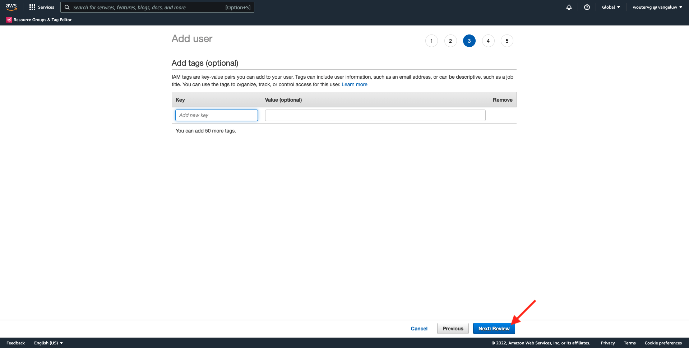

# 2.3.4 Realizar ação: enviar seu segmento para um destino S3

O Adobe Experience Platform também pode compartilhar públicos com destinos de marketing por email, como Salesforce Marketing Cloud, Oracle Eloqua, Oracle Responsys e Adobe Campaign.

Você pode usar o FTP ou SFTP como parte dos destinos dedicados para cada um desses Destinos de marketing por email, ou pode usar o AWS S3 para trocar listas de clientes entre o Adobe Experience Platform e esses Destinos de marketing por email.

Neste módulo, você configurará esse destino usando um bucket do AWS S3.

## 2.3.4.1 Criar seu S3 bucket

Acesse [https://console.aws.amazon.com](https://console.aws.amazon.com) e entre com a conta da Amazon criada anteriormente.

Depois de fazer logon, você será redirecionado para o **Console de Gerenciamento do AWS**.

No menu **Localizar Serviços**, procure **s3**. Clique no primeiro resultado da pesquisa: **S3 - Armazenamento Escalável na Nuvem**.

Você verá a página inicial do **Amazon S3**. Clique em **Criar bloco**.

Na tela **Criar bloco**, você precisa configurar dois itens:

- Nome: use o nome `aepmodulertcdp--aepUserLdap--`. Como exemplo, neste exercício, o nome do bucket é **aepmodulertcdpvangeluw**
- Região: utilizar a região **EU (Frankfurt) eu-central-1**

Deixe todas as outras configurações padrão como estão. Role para baixo e clique em **Criar bloco**.

Você verá seu bucket ser criado e será redirecionado para a página inicial do Amazon S3.

## 2.3.4.2 Definir permissões para acessar o bucket do S3

A próxima etapa é configurar o acesso ao seu bucket do S3.

Para fazer isso, vá para [https://console.aws.amazon.com/iam/home](https://console.aws.amazon.com/iam/home).

O acesso aos recursos do AWS é controlado pelo Amazon Identity and Access Management (IAM).

Agora você verá esta página.

No menu esquerdo, clique em **Usuários**. Você verá a tela **Usuários**. Clique em **Adicionar usuários**.

Em seguida, configure o usuário:

- Nome do Usuário: use `s3_--aepUserLdap--_rtcdp` como um nome, portanto, neste exemplo, o nome é `s3_vangeluw_rtcdp`.
- Tipo de acesso do AWS: selecione **Access key - Programmatic access**.

Clique em **Avançar: Permissões**.

Em seguida, você verá essa tela de permissões. Clique em **Anexar diretivas existentes diretamente**.

Insira o termo de pesquisa **s3** para ver todas as políticas S3 relacionadas. Selecione a política **AmazonS3FullAccess**. Clique em **Avançar: Marcas**.

Na tela **Tags**, não há necessidade de configurar nada. Clique em **Avançar: revisão**.

Revise sua configuração. Clique em **Criar Usuário**.

Seu usuário foi criado e você está vendo suas credenciais para acessar seu ambiente S3. Esta é a única vez que você verá suas credenciais. Por favor, anote-as.

Clique em **Mostrar** para ver sua chave de acesso secreta:

>[!IMPORTANT]
>
>Armazene suas credenciais em um arquivo de texto no computador.
>
> - ID da chave de acesso: ...
> - Chave de acesso secreta: ...
>
> Depois de clicar em **Fechar**, você nunca mais verá suas credenciais!

Clique em **Fechar**.

Agora você criou um bucket do AWS S3 com êxito e um usuário com permissões para acessá-lo.

## 2.3.4.3 Configurar o destino no Adobe Experience Platform

Ir para [Adobe Experience Platform](https://experience.adobe.com/platform). Depois de fazer logon, você chegará à página inicial do Adobe Experience Platform.

Antes de continuar, você precisa selecionar uma **sandbox**. A sandbox a ser selecionada é chamada ``--aepSandboxName--``. Você pode fazer isso clicando no texto **[!UICONTROL Produção]** na linha azul na parte superior da tela. Depois de selecionar a [!UICONTROL sandbox] apropriada, você verá a alteração da tela e agora estará na [!UICONTROL sandbox] dedicada.

No menu esquerdo, vá para **Destinos** e, em seguida, vá para **Catálogo**. Você verá o **Catálogo de Destinos**.

Clique em **Armazenamento na Nuvem** e no botão **Configurar** (ou em **Ativar Segmentos**, dependendo do seu ambiente) no cartão **Amazon S3**.

Dependendo do seu ambiente, talvez seja necessário clicar em **+ Configurar novo destino** para começar a criar seu destino.

Selecione **Nova Conta** como Tipo de Conta. Use as credenciais S3 fornecidas na etapa anterior:

| ID da chave de acesso | Chave de Acesso Secreta |
|:-----------------------:| :-----------------------:|
| AKIA... | Cm5Ln... |

Clique em **Conectar ao destino**.

Você verá uma confirmação visual de que esse destino está conectado agora.

É necessário fornecer um nome e uma pasta para que o Adobe Experience Platform possa se conectar ao bucket do S3.

Como convenção de nomenclatura, use o seguinte:

| ID da chave de acesso | Chave de Acesso Secreta |
|:-----------------------:| :-----------------------:|
| Nome | `AWS - S3 - --aepUserLdap--` |
| Descrição | `AWS - S3 - --aepUserLdap--` |
| Nome do bloco | `aepmodulertcdp--aepUserLdap--` |
| Caminho da pasta | / |

Clique em **Next**.

Agora, é possível anexar uma Política de governança de dados ao novo destino. Clique em **Next**.

Na lista de segmentos, procure o segmento que você criou no exercício 1 e selecione-o. Clique em **Next**.

Você verá isso. Se desejar, edite a programação clicando no ícone **lápis**. **Criar Agendamento**.

Defina o cronograma de sua escolha. Selecione **Exportar arquivos incrementais** e defina a frequência como **A cada** 3 horas **.** Clique em **Criar**.

Então você terá isto. Clique em **Next**.

Agora é possível selecionar atributos para a exportação em direção ao AWS S3. Clique em **Adicionar novo campo** e verifique se o campo `--aepTenantId--.identification.core.ecid` foi adicionado e marcado como **Chave de Desduplicação**.

Como opção, você pode adicionar quantos outros campos forem necessários.

Depois de adicionar todos os campos, clique em **Avançar**.

Revise sua configuração. Clique em **Concluir** para concluir sua configuração.

Você voltará à tela Ativação de destino e verá seu segmento adicionado a esse destino.

Se você quiser adicionar mais exportações de segmentos, clique em **Ativar segmentos** para reiniciar o processo e adicionar mais segmentos.

Próxima etapa: [2.3.5 Executar Ação: enviar seu segmento para a Adobe Target](./ex5.md)

[Voltar ao módulo 2.3](./real-time-cdp-build-a-segment-take-action.md)

[Voltar a todos os módulos](../../../overview.md)
