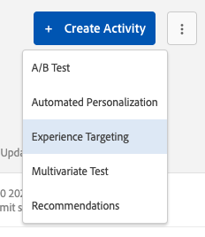
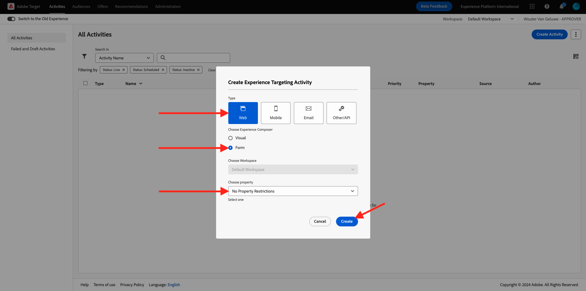
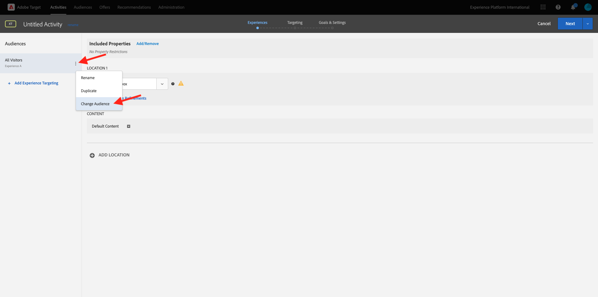
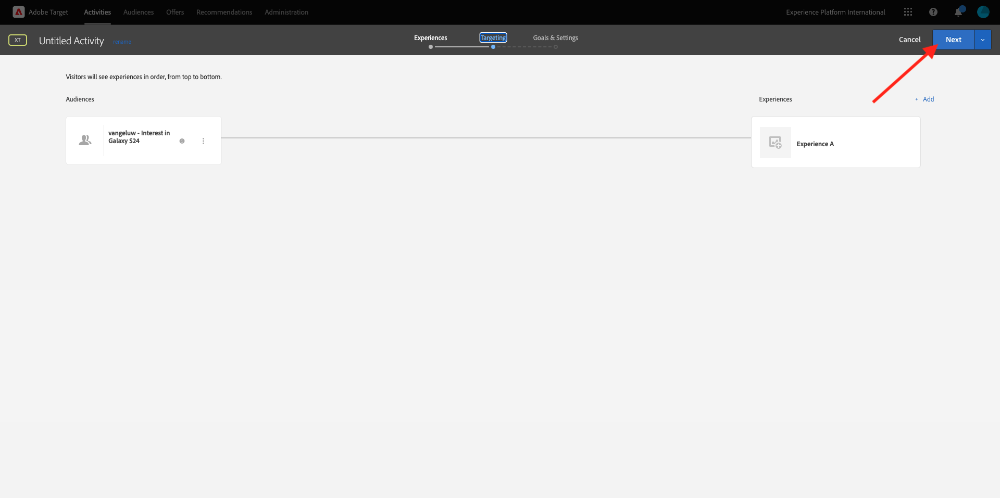

# 2.3.5 Realizar ação: enviar seu segmento para o Adobe Target

Ir para [Adobe Experience Platform](https://experience.adobe.com/platform). Depois de fazer logon, você chegará à página inicial do Adobe Experience Platform.


Antes de continuar, você precisa selecionar uma **sandbox**. A sandbox a ser selecionada é chamada ``--aepSandboxName--``. Você pode fazer isso clicando no texto **[!UICONTROL Produção]** na linha azul na parte superior da tela. Depois de selecionar a [!UICONTROL sandbox] apropriada, você verá a alteração da tela e agora estará na [!UICONTROL sandbox] dedicada.


## 2.3.5.1 Verificar o fluxo de dados

O destino do Adobe Target no Real-Time CDP é conectado ao fluxo de dados usado para assimilar dados na rede de Adobe. Se quiser secionar seu destino do Adobe Target, primeiro verifique se o fluxo de dados já está ativado para o Adobe Target. Seu datastream foi configurado no [Exercício 0.2 Criar seu Datastream](./../../../modules/gettingstarted/gettingstarted/ex2.md) e foi nomeado como `--aepUserLdap-- - Demo System Datastream`.

Vá para [https://experience.adobe.com/#/data-collection/](https://experience.adobe.com/#/data-collection/) e clique em **Datastreams** ou **Datastreams (Beta)**.


No canto superior direito da tela, selecione o nome da sandbox, que deve ser `--aepSandboxName--`.


Em Datastreams, pesquise por seu datastream chamado `--aepUserLdap-- - Demo System Datastream`. Clique na sequência de dados para abri-la.


Você verá isto, clique em **...** ao lado de **Adobe Experience Platform** e em **Editar**.


Marque as caixas de seleção para **Segmentação do Edge** e **Destinos do Personalization**. Clique em **Salvar**.


Em seguida, clique em **+ Adicionar Serviço**.


Selecione o serviço **Adobe Target**. Clique em **Salvar**.


A sequência de dados agora está configurada para o Adobe Target.


## 2.3.5.2 Configurar o destino do Adobe Target

O Adobe Target está disponível como um destino no Real-Time CDP. Para configurar sua integração com o Adobe Target, vá para **Destinos**, para **Catálogo**.


Clique em **Personalization** no menu **Categorias**. Você verá o cartão de destino **Adobe Target**. Clique em **Ativar segmentos** (ou **Configurar** dependendo do seu ambiente).


Dependendo do seu ambiente, talvez seja necessário clicar em **+ Configurar novo destino** para começar a criar seu destino.


Você verá isso.


Na tela **Configurar novo destino**, você precisa configurar dois itens:

- Nome: use o nome `--aepUserLdap-- - Adobe Target (Web)`, que deve ter esta aparência: **vangeluw - Adobe Target (Web)**.
- ID da sequência de dados: é necessário selecionar a sequência de dados configurada no [Exercício 0.2 Criar sequência de dados](./../../../modules/gettingstarted/gettingstarted/ex2.md). O nome da sequência de dados deve ser: `--aepUserLdap-- - Demo System Datastream`.

Clique em **Next**.


Na próxima tela, você pode selecionar uma política de governança. Não é necessário selecionar um. Nesse caso, não há necessidade de selecionar um. Portanto, clique em **Criar**.


Seu destino foi criado e será mostrado na lista. Selecione seu destino e clique em **Avançar** para iniciar o envio de segmentos para seu destino.


Na lista de segmentos disponíveis, selecione o segmento criado no [Exercício 6.1 Criar um segmento](./ex1.md), denominado `--aepUserLdap-- - Interest in PROTEUS FITNESS JACKSHIRT`. Em seguida, clique em **Avançar**.


Na próxima página, clique em **Avançar**.


Clique em **Concluir**.


Seu segmento agora está ativado para o Adobe Target.


>[!IMPORTANT]
>
>Quando você acaba de criar seu destino do Adobe Target no Real-Time CDP, pode levar até uma hora para o destino ficar ativo. Esse é um tempo de espera único, devido à definição da configuração de back-end. Quando a configuração inicial de 1 hora de tempo de espera e backend for concluída, os segmentos de borda recém-adicionados enviados para o destino do Adobe Target estarão disponíveis para direcionamento em tempo real.

## 2.3.5.3 Configurar a atividade do Adobe Target baseada em formulários

Agora que seu segmento do Real-Time CDP está configurado para ser enviado para o Adobe Target, você pode configurar sua atividade de Direcionamento de experiência no Adobe Target. Neste exercício, você configurará uma atividade baseada em formulário.

Vá para a página inicial do Adobe Experience Cloud em [https://experiencecloud.adobe.com/](https://experiencecloud.adobe.com/). Clique em **Target** para abri-lo.


Na página inicial do **Adobe Target**, você verá todas as atividades existentes.


Clique em **+ Criar atividade** para criar uma nova Atividade.


Selecione **Direcionamento de experiência**.



Selecione **Formulário** e selecione **Nenhuma Restrição de Propriedade**. Clique em **Next**.



Agora você está no compositor de atividades baseado em formulários.


Para o campo **LOCATION 1**, selecione **target-global-mbox**.


O público-alvo padrão é atualmente **Todos os visitantes**. Clique nos **3 pontos** ao lado de **Todos os visitantes** e clique em **Alterar público**.



Agora você está vendo a lista de públicos-alvo disponíveis, e o segmento do Adobe Experience Platform criado anteriormente e enviado para o Adobe Target agora faz parte dessa lista. Selecione o segmento criado anteriormente no Adobe Experience Platform. Clique em **Atribuir público**.


Seu segmento do Adobe Experience Platform agora faz parte dessa atividade de direcionamento de experiência.


Agora vamos alterar a Imagem do Herói na página inicial do site. Clique para abrir a lista suspensa ao lado de **Conteúdo padrão** e clique em **Criar oferta HTML**.


Cole o código a seguir. Em seguida, clique em **Avançar**.

```javascript
<script>document.querySelector("#home > div > div > div > div > div.banner_img.d-none.d-lg-block > img").src="https://parsefiles.back4app.com/hgJBdVOS2eff03JCn6qXXOxT5jJFzialLAHJixD9/ff92fdc3885972c0090ad5419e0ef4d4_Luma - Product - Proteus - Hero Banner.png"; document.querySelector(".banner_text > *").remove()</script>
```


Você verá a nova experiência com a nova imagem para o Público-alvo selecionado.



Clique no título da atividade no canto superior esquerdo para renomeá-la.


Para o nome, use:

- `--aepUserLdap-- - RTCDP - XT (Form)`


Clique em **Next**.


Na página **Metas e configurações** -, vá para **Métricas de meta**.


Defina a Meta primária como **Envolvimento** - **Tempo no site**.


Clique em **Salvar e fechar**.


Agora você está na página **Visão geral da atividade**. Você ainda precisa ativar sua Atividade.


Clique no campo **Inativo** e selecione **Ativar**.


Em seguida, você receberá uma confirmação visual de que sua atividade está online.


Sua atividade agora está ao vivo e pode ser testada no site de demonstração.

>[!IMPORTANT]
>
>Quando você acaba de criar seu destino do Adobe Target no Real-Time CDP, pode levar até uma hora para o destino ficar ativo. Esse é um tempo de espera único, devido à definição da configuração de back-end. Quando a configuração inicial de 1 hora de tempo de espera e backend for concluída, os segmentos de borda recém-adicionados enviados para o destino do Adobe Target estarão disponíveis para direcionamento em tempo real.

Se agora você voltar ao seu site de demonstração e visitar a página do produto PROTEUS FITNESS JACKSHIRT, você se qualificará instantaneamente para o segmento que criou e verá a atividade do Adobe Target ser exibida na página inicial em tempo real.


Próxima Etapa: [2.3.6 Públicos-Alvo Externos](./ex6.md)

[Voltar ao módulo 2.3](./real-time-cdp-build-a-segment-take-action.md)

[Voltar a todos os módulos](../../../overview.md)
