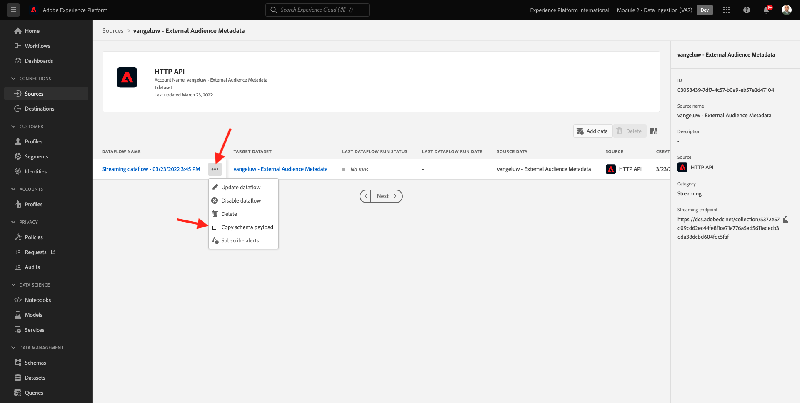
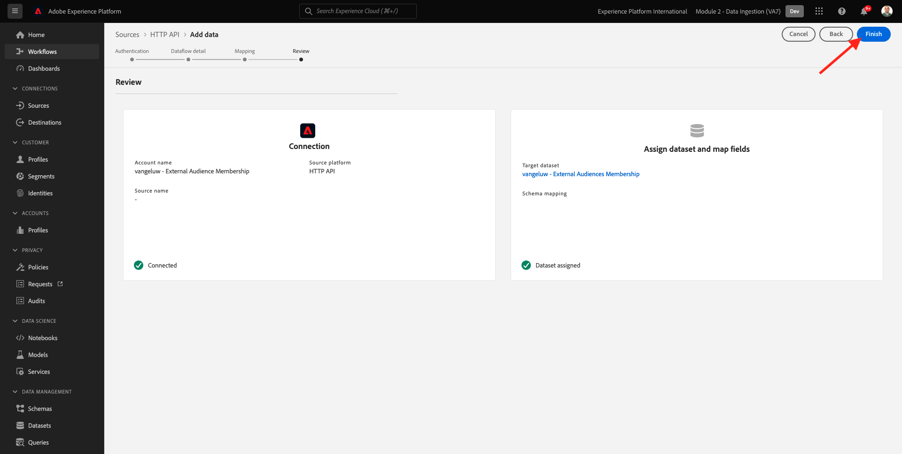
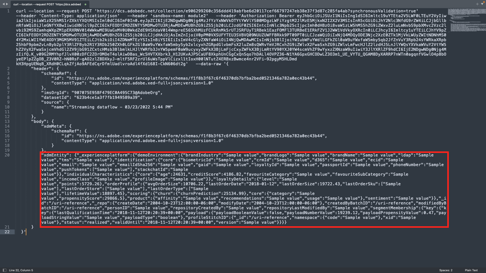
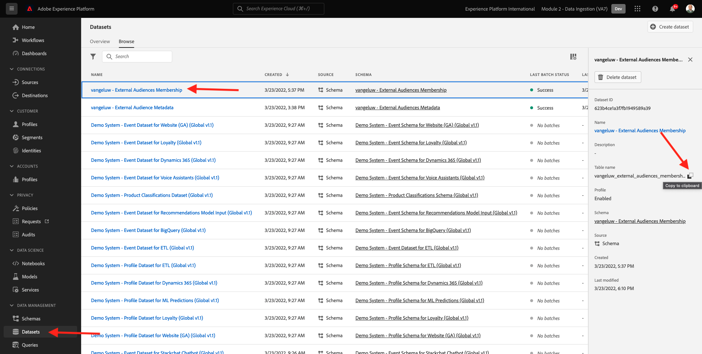

# 2.3.6 Públicos-alvo externos

Em muitos casos, sua empresa pode querer usar públicos-alvo existentes de outros aplicativos para aprimorar o perfil do cliente no Adobe Experience Platform.
Esses públicos-alvo externos podem ter sido definidos com base em um modelo de ciência de dados ou usando plataformas de dados externas.

O recurso de públicos-alvo externos do Adobe Experience Platform permite que você se concentre na assimilação dos públicos-alvo externos e sua ativação sem precisar redefinir a definição de público-alvo correspondente em detalhes no Adobe Experience Platform.

O processo global divide-se em três etapas principais:

- Importar os metadados do público-alvo externo: esta etapa destina-se a assimilar os metadados do público-alvo externo, como o nome do público-alvo, na Adobe Experience Platform.
- Atribuir a associação de público-alvo externo ao perfil do cliente: essa etapa destina-se a enriquecer o perfil do cliente com o atributo de associação de públicos-alvo externos.
- Criar os públicos no Adobe Experience Platform: esta etapa destina-se a criar públicos acionáveis com base na associação de públicos externos.

## Metadados

Ir para [Adobe Experience Platform](https://experience.adobe.com/platform). Depois de fazer logon, você chegará à página inicial do Adobe Experience Platform.


>[!IMPORTANT]
>
>A sandbox a ser usada para este exercício é ``--aepSandboxName--``!

Antes de continuar, você precisa selecionar uma **sandbox**. A sandbox a ser selecionada é chamada ``--aepSandboxName--``. Depois de selecionar a [!UICONTROL sandbox] apropriada, você verá a alteração da tela e agora estará na [!UICONTROL sandbox] dedicada.


Embora os dados do público-alvo definam a condição para que um perfil faça parte de um público-alvo, os metadados do público-alvo são informações sobre o público-alvo, como o nome, a descrição e o status do público-alvo. Como os metadados dos públicos externos serão armazenados no Adobe Experience Platform, é necessário usar um namespace de identidade para assimilar os metadados no Adobe Experience Platform.

## 2.3.6.1.1 Namespace de identidade para públicos-alvo externos

Um namespace de identidade já foi criado para uso com **Públicos-alvo externos**.
Para exibir a identidade já criada, vá para **Identidades** e pesquise por **Externas**. Clique no item &quot;Públicos externos&quot;.

Observe que:

- O símbolo de identidade **externalaudiences** será usado nas próximas etapas para fazer referência à identidade dos públicos externos.
- O tipo **Identificador não pessoal** é usado para este namespace de identidade, pois ele não se destina a identificar perfis de clientes, mas públicos.


## 2.3.6.1.2 Criar o esquema de metadados de públicos externos

Os metadados dos públicos externos são baseados no **Esquema de definição de público**. Você pode encontrar mais detalhes no [repositório GitHub XDM](https://github.com/adobe/xdm/blob/master/docs/reference/classes/segmentdefinition.schema.md).

No menu esquerdo, vá para Schemas. Clique em **+ Criar Esquema** e em **Procurar**.


Para atribuir uma classe, procure por **definição de público-alvo**. Selecione a classe **Definição de público** e clique em **Atribuir classe**.


Você verá isso. Clique em **Cancelar**.


Você verá isso. Selecione o campo **_id**. No menu direito, role para baixo e habilite as caixas de seleção **Identidade** e **Identidade principal**. Selecione o namespace de identidade **Públicos-alvo externos**. Clique em **Aplicar**.


Em seguida, selecione o nome do esquema **Esquema sem título**. Altere o nome para `--aepUserLdap-- - External Audiences Metadata`.


Habilite a opção de alternância **Perfil** e confirme. Finalmente, clique em **Salvar**.


## 2.3.6.1.3 Criar o conjunto de dados de metadados de públicos externos

Em **Esquemas**, vá para **Procurar**. Pesquise e clique no esquema `--aepUserLdap-- - External Audiences Metadata` criado na etapa anterior. Em seguida, clique em **Criar conjunto de dados a partir do esquema**.


Para o campo **Nome**, digite `--aepUserLdap-- - External Audience Metadata`. Clique em **Criar conjunto de dados**.


Você verá isso. Não esqueça de habilitar a opção de alternância **Perfil**!


## 2.3.6.1.4 Criar uma conexão HTTP API Source

Em seguida, é necessário configurar o HTTP API Source Connector, que será usado para assimilar os metadados no conjunto de dados.

Ir para **Fontes**. No campo de pesquisa, digite **HTTP**. Clique em **Adicionar dados**.


Insira a seguinte informação:

- **Tipo de conta**: selecione **Nova conta**
- **Nome da conta**: digite `--aepUserLdap-- - External Audience Metadata`
- Marque a caixa de seleção **caixa compatível com XDM**

Em seguida, clique em **Conectar à origem**.


Você verá isso. Clique em **Next**.


Selecione **Conjunto de dados existente** e, no menu suspenso, procure e selecione o conjunto de dados `--aepUserLdap-- - External Audience Metadata`.

Verifique os **detalhes do fluxo de dados** e clique em **Avançar**.


Você verá isso.

A etapa **Mapeamento** do assistente está vazia, pois você assimilará uma carga compatível com XDM no Conector Source da API HTTP e, portanto, nenhum mapeamento é necessário. Clique em **Next**.


Na etapa **Revisão**, é possível revisar opcionalmente a conexão e os detalhes do mapeamento. Clique em **Concluir**.


Você verá isso.


## 2.3.6.1.5 Assimilação de metadados de públicos externos

Na guia de visão geral do Source Connector, clique em **...** e em **Copiar carga do esquema**.



Abra o aplicativo Editor de texto no computador e cole a carga que você acabou de copiar, que se parece com isto. Em seguida, você precisa atualizar o objeto **xdmEntity** nesta carga.


O objeto **xdmEntity** precisa ser substituído pelo código abaixo. Copie o código abaixo e cole-o no arquivo de texto substituindo o objeto **xdmEntity** no editor de texto.

```
"xdmEntity": {
    "_id": "--aepUserLdap---extaudience-01",
    "description": "--aepUserLdap---extaudience-01 description",
    "segmentIdentity": {
      "_id": "--aepUserLdap---extaudience-01",
      "namespace": {
        "code": "externalaudiences"
      }
    },
    "segmentName": "--aepUserLdap---extaudience-01 name",
    "segmentStatus": "ACTIVE",
    "version": "1.0"
  }
```

Você deverá ver isso:


Em seguida, abra uma nova janela **Terminal**. Copie todo o texto no Editor de texto e cole-o na janela do terminal.


Em seguida, clique em **Enter**.

Você verá uma confirmação da assimilação de dados na janela Terminal:


Atualize a tela do conector HTTP API Source, onde agora você verá que os dados estão sendo processados:


## 2.3.6.1.6 Validar assimilação de metadados de públicos externos

Quando o processamento estiver concluído, você poderá verificar a disponibilidade dos dados no conjunto de dados usando o Serviço de consulta.

No menu direito, vá para **Conjuntos de Dados** e selecione o conjunto de dados `--aepUserLdap-- - External Audience Metadata` criado anteriormente.


No menu direito, vá para Consultas e clique em **Criar consulta**.


Insira o código a seguir e pressione **SHIFT + ENTER**:

```
select * from --aepUserLdap--_external_audience_metadata
```

Nos resultados da consulta, você verá os metadados do público-alvo externo que você assimilou.


## Associação de público

Com os metadados de público-alvo externo disponíveis, agora é possível assimilar a associação de público-alvo de um perfil de cliente específico.

Agora é necessário preparar um conjunto de dados de perfil enriquecido com o esquema de associação de público-alvo. Você pode encontrar mais detalhes no [repositório GitHub XDM](https://github.com/adobe/xdm/blob/master/docs/reference/datatypes/segmentmembership.schema.md).

### Criar o esquema de associação de públicos externos

No menu direito, vá para **Esquemas**. Clique em **Criar esquema** e em **Perfil Individual XDM**.

 do Perfil de Públicos-Alvo Externos

No pop-up **Adicionar grupos de campos**, pesquise por **Núcleo do Perfil**. Selecione o grupo de campos **Núcleo do Perfil v2**.

 do Perfil de Públicos Externos

Em seguida, no pop-up **Adicionar grupos de campos**, pesquise por **Associação de segmento**. Selecione o grupo de campos **Detalhes da associação do segmento**. Em seguida, clique em **Adicionar grupos de campos**.

 do Perfil de Públicos-Alvo Externos

Você verá isso. Navegue até o campo `--aepTenantId--.identification.core`. Clique no campo **crmId**. No menu direito, role para baixo e marque as caixas de seleção **Identidade** e **Identidade principal**. Para o **Namespace de Identidade**, selecione **Sistema de Demonstração - CRMID**.

Clique em **Aplicar**.

 do Perfil de Públicos Externos

Em seguida, selecione o Nome do esquema **Esquema sem título**. No campo nome para exibição, digite `--aepUserLdap-- - External Audiences Membership`.

 do Perfil de Públicos Externos

Em seguida, habilite a opção de alternância **Perfil** e confirme. Clique em **Salvar**.

 do Perfil de Públicos Externos

### Criar o conjunto de dados de associação de públicos externos

Em **Esquemas**, vá para **Procurar**. Pesquise e clique no esquema `--aepUserLdap-- - External Audiences Membership` criado na etapa anterior. Em seguida, clique em **Criar conjunto de dados a partir do esquema**.


Para o campo **Nome**, digite `--aepUserLdap-- - External Audiences Membership`. Clique em **Criar conjunto de dados**.


Você verá isso. Não esqueça de habilitar a opção de alternância **Perfil**!


### Criar uma conexão HTTP API Source


Em seguida, é necessário configurar o HTTP API Source Connector, que será usado para assimilar os metadados no conjunto de dados.

Ir para **Fontes**. No campo de pesquisa, digite **HTTP**. Clique em **Adicionar dados**.


Insira a seguinte informação:

- **Tipo de conta**: selecione **Nova conta**
- **Nome da conta**: digite `--aepUserLdap-- - External Audience Membership`
- Marque a caixa de seleção **caixa compatível com XDM**

Em seguida, clique em **Conectar à origem**.


Você verá isso. Clique em **Next**.


Selecione **Conjunto de dados existente** e, no menu suspenso, procure e selecione o conjunto de dados `--aepUserLdap-- - External Audiences Membership`.

Verifique os **detalhes do fluxo de dados** e clique em **Avançar**.


Você verá isso.

A etapa **Mapeamento** do assistente está vazia, pois você assimilará uma carga compatível com XDM no Conector Source da API HTTP e, portanto, nenhum mapeamento é necessário. Clique em **Next**.


Na etapa **Revisão**, é possível revisar opcionalmente a conexão e os detalhes do mapeamento. Clique em **Concluir**.



Você verá isso.


### Assimilação de dados de associação de públicos externos

Na guia de visão geral do Source Connector, clique em **...** e em **Copiar carga do esquema**.


Abra o aplicativo Editor de texto no computador e cole a carga que você acabou de copiar, que se parece com isto. Em seguida, você precisa atualizar o objeto **xdmEntity** nesta carga.



O objeto **xdmEntity** precisa ser substituído pelo código abaixo. Copie o código abaixo e cole-o no arquivo de texto substituindo o objeto **xdmEntity** no editor de texto.

```
  "xdmEntity": {
    "_id": "--aepUserLdap---profile-test-01",
    "_experienceplatform": {
      "identification": {
        "core": {
          "crmId": "--aepUserLdap---profile-test-01"
        }
      }
    },
    "personID": "--aepUserLdap---profile-test-01",
    "segmentMembership": {
      "externalaudiences": {
        "--aepUserLdap---extaudience-01": {
          "status": "realized",
          "lastQualificationTime": "2022-03-05T00:00:00Z"
        }
      }
    }
  }
```

Você deverá ver isso:


Em seguida, abra uma nova janela **Terminal**. Copie todo o texto no Editor de texto e cole-o na janela do terminal.


Em seguida, clique em **Enter**.

Você verá uma confirmação da assimilação de dados na janela Terminal:


Atualize a tela do conector HTTP API Source, onde, após alguns minutos, você verá que os dados estão sendo processados:


### Validar assimilação de associação de públicos externos

Quando o processamento estiver concluído, você poderá verificar a disponibilidade dos dados no conjunto de dados usando o Serviço de consulta.

No menu direito, vá para **Conjuntos de Dados** e selecione o conjunto de dados `--aepUserLdap-- - External Audiences Membership ` criado anteriormente.



No menu direito, vá para Consultas e clique em **Criar consulta**.


Insira o código a seguir e pressione **SHIFT + ENTER**:

```
select * from --aepUserLdap--_external_audiences_membership
```

Nos resultados da consulta, você verá os metadados do público-alvo externo que você assimilou.


## Criar um segmento

Agora você está pronto para executar ações nos públicos externos.
No Adobe Experience Platform, a ação é alcançada por meio da criação de segmentos, preenchimento dos respectivos públicos e compartilhamento desses públicos para os destinos.
Agora você criará um segmento usando o público-alvo externo que acabou de criar.

No menu esquerdo, vá para **Segmentos** e clique em **Criar segmento**.

 de Públicos-alvo externos

Ir para **Públicos-alvo**. Você verá isso. Clique em **Públicos-alvo externos**.

 de Públicos-alvo externos

Selecione o público externo que você criou anteriormente, chamado `--aepUserLdap---extaudience-01`. Arraste e solte o público-alvo na tela.

 de Públicos-alvo externos

Dê um nome ao seu segmento, use `--aepUserLdap-- - extaudience-01`. Clique em **Salvar e fechar**.

 de Públicos-alvo externos

Você verá isso. Você também observará que o perfil para o qual você assimilou a associação do segmento agora é exibido na lista de **Perfis de amostra**.

 de Públicos-alvo externos

Seu segmento está pronto agora e pode ser enviado para um destino para ativação.

## Visualizar seu perfil de cliente

Agora, você também pode visualizar a qualificação do segmento no perfil do cliente. Vá para **Perfis**, use o namespace de identidade **Sistema de demonstração - CRMID** e forneça a identidade `--aepUserLdap---profile-test-01`, que você usou como parte do exercício 6.6.2.4, e clique em **Exibir**. Em seguida, clique em **ID do Perfil** para abrir o perfil.

 de Públicos-alvo externos

Vá para **Segmentar associação**, onde você verá seu público externo aparecer.

 de Públicos-alvo externos

Próxima etapa: [2.3.7 SDK de Destinos](./ex7.md)

[Voltar ao módulo 2.3](./real-time-cdp-build-a-segment-take-action.md)

[Voltar a todos os módulos](../../../overview.md)
