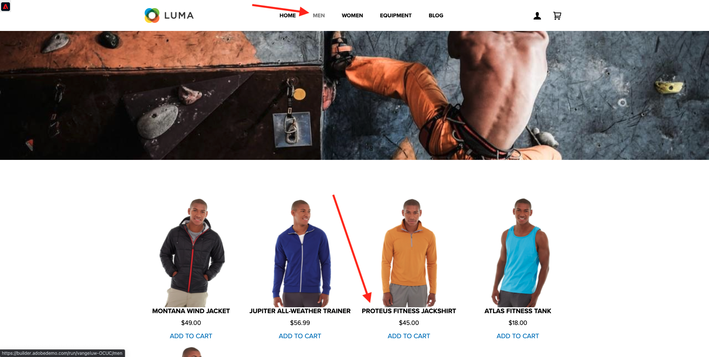

# 2.3.7 SDK de destinos

## 2.3.7.1 Configurar o projeto Adobe I/O

>[!IMPORTANT]
>
>Se você tiver criado o projeto Adobe I/O após dezembro de 2021, poderá reutilizar esse projeto, ignorar esse exercício e migrar para o exercício 6.7.2 imediatamente.
>
>Se você criou seu projeto Adobe I/O antes de dezembro de 2021, crie um novo projeto para garantir que seja compatível com a API de criação de destinos.

Neste exercício, você usará o Adobe I/O de forma bastante intensa para consultar as APIs da plataforma. Siga as etapas abaixo para configurar o Adobe I/O.

Ir para [https://developer.adobe.com/console/home](https://developer.adobe.com/console/home)


Selecione a instância correta do Adobe Experience Platform no canto superior direito da tela. Sua instância é `--envName--`.


Clique em **Criar novo projeto**.

 ou


Selecione **+ Adicionar ao Projeto** e selecione **API**.


Você verá isto:


Clique no ícone **Adobe Experience Platform**.


Clique em **Experience Platform API**.


Clique em **Next**.


Agora você pode optar por fazer com que o Adobe I/O gere seu par de chaves de segurança ou fazer upload de um existente.

Escolha **Opção 1 - Gerar um par de chaves**.


Clique em **Gerar par de chaves**.


Você verá um ponteiro por cerca de 30 segundos.


Você verá isso e seu par de chaves gerado será baixado como um arquivo zip: **config.zip**.

Descompacte o arquivo **config.zip** na sua área de trabalho. Você verá que ele contém 2 arquivos:


- **certificate_pub.crt** é seu certificado de chave pública. De uma perspectiva de segurança, esse é o certificado usado livremente para configurar integrações com aplicativos online.
- **private.key** é sua Chave privada. Isso nunca deve ser compartilhado com ninguém. A chave privada é o que você usa para autenticar para a implementação da API e deve ser um segredo. Se você compartilhar sua chave privada com qualquer pessoa, ela poderá acessar sua implementação e abusar da API para assimilar dados mal-intencionados na Platform e extrair todos os dados contidos na Platform.


Salve o arquivo **config.zip** em um local seguro, pois ele será necessário para as próximas etapas e para acesso futuro às APIs do Adobe I/O e do Adobe Experience Platform.

Clique em **Next**.


Agora é necessário selecionar o(s) **Perfil(is) de Produto** para sua integração.

Selecione os Perfis de produto necessários.

**INFO**: em sua instância do Adobe Experience Platform, os Perfis de Produto terão um nome diferente. Você precisa selecionar pelo menos um perfil de produto com os direitos de acesso adequados, que são configurados no Adobe Admin Console.


Clique em **Salvar API configurada**.


Você verá um ponteiro por alguns segundos.


E, em seguida, você verá sua integração.


Clique no botão **Baixar para Postman** e em **Conta de Serviço (JWT)** para baixar um ambiente do Postman (aguarde até que o ambiente seja baixado, isso pode levar alguns segundos).


Role para baixo até ver **Conta de Serviço (JWT)**, que é onde você pode encontrar todos os detalhes de integração usados para configurar a integração com o Adobe Experience Platform.


Seu projeto IO atualmente tem um nome genérico. É necessário dar um nome amigável à integração. Clique no **Projeto 1** (ou nome semelhante) conforme indicado


Clique em **Editar projeto**.


Insira um Nome e uma Descrição para sua integração. Como convenção de nomenclatura, usaremos `AEP API --aepUserLdap--`. Substitua o ldap pelo seu ldap.
Por exemplo, se o ldap for vangeluw, o nome e a descrição da integração se tornarão API vangeluw da AEP.

Insira `AEP API --aepUserLdap--` como o **Título do projeto**. Clique em **Salvar**.


A integração com o Adobe I/O foi concluída.


## 2.3.7.2 Autenticação Postman para Adobe I/O

Ir para [https://www.getpostman.com/](https://www.getpostman.com/).

Clique em **Introdução**.


Em seguida, baixe e instale o Postman.


Após a instalação do Postman, inicie o aplicativo.

No Postman, há dois conceitos: Ambientes e Coleções.

- O Ambiente contém todas as variáveis de ambiente mais ou menos consistentes. No Ambiente, você encontrará informações como o IMSOrg do nosso ambiente de plataforma, além de credenciais de segurança como a sua Chave privada e outras. O arquivo de ambiente é o que você baixou durante a configuração do Adobe I/O no exercício anterior. Seu nome é assim: **service.postman_environment.json**.

- A coleção contém várias solicitações de API que podem ser usadas. Usaremos 2 coleções
   - 1 coleção para autenticação para Adobe I/0
   - 1 Coleta para os exercícios neste módulo
   - 1 coleção para os exercícios no módulo Real-Time CDP, para criação de destino

Baixe o arquivo [postman.zip](./../../../assets/postman/postman_profile.zip) no desktop local.

Neste arquivo **postman.zip**, você encontrará os seguintes arquivos:

- `_Adobe I-O - Token.postman_collection.json`
- `_Adobe Experience Platform Enablement.postman_collection.json`
- `Destination_Authoring_API.json`

Descompacte o arquivo **postman.zip** e armazene esses 3 arquivos em uma pasta no seu desktop, juntamente com o ambiente Postman baixado do Adobe I/O. Você precisa ter estes 4 arquivos nessa pasta:


Volte para o Postman. Clique em **Importar**.


Clique em **Carregar arquivos**.


Navegue até a pasta na área de trabalho em que você extraiu os 4 arquivos baixados. Selecione estes 4 arquivos ao mesmo tempo e clique em **Abrir**.


Depois de clicar em **Abrir**, o Postman mostrará uma visão geral do Ambiente e das Coleções que você está prestes a importar. Clique em **Importar**.


Agora você tem tudo o que precisa no Postman para começar a interagir com o Adobe Experience Platform por meio das APIs.

A primeira coisa a fazer é verificar se você está autenticado corretamente. Para ser autenticado, é necessário solicitar um token de acesso.

Verifique se você selecionou o ambiente correto antes de executar qualquer solicitação. Você pode verificar o Ambiente selecionado no momento verificando a lista suspensa Ambiente no canto superior direito.

O ambiente selecionado deve ter um nome semelhante a este:


Clique no ícone **olho** e em **Editar** para atualizar a Chave privada no arquivo de ambiente.


Você verá isso. Todos os campos são preenchidos previamente, exceto o campo **PRIVATE_KEY**.


A chave privada foi gerada quando você criou o Projeto Adobe I/O. Ele foi baixado como um arquivo zip chamado **config.zip**. Extraia esse arquivo zip para o desktop.


Abra a pasta **config** e abra o arquivo **private.key** com seu editor de texto preferido.


Você verá algo parecido com isso, copiará todo o texto para a área de transferência.


Retorne ao Postman e cole a chave privada nos campos ao lado da variável **PRIVATE_KEY**, para as colunas **INITIAL VALUE** e **CURRENT VALUE**. Clique em **Salvar**.


O ambiente e as coleções do Postman agora estão configurados e funcionando. Agora você pode autenticar do Postman para o Adobe I/O.

Para fazer isso, você precisa carregar uma biblioteca externa que irá cuidar da criptografia e descriptografia da comunicação. Para carregar essa biblioteca, você precisa executar a solicitação com o nome **INIT: Carregar Biblioteca de Criptografia para RS256**. Selecione esta solicitação na **_Adobe I/O - Coleção de tokens** e você a verá exibida no meio da tela.


Clique no botão azul **Enviar**. Após alguns segundos, você deve ver uma resposta exibida na seção **Body** do Postman:


Com a biblioteca de criptografia carregada, podemos autenticar no Adobe I/O.

Em **\_Adobe I/O - Token collection**, selecione a solicitação com o nome **IMS: JWT Generate + Auth**. Novamente, você verá os detalhes da solicitação exibidos no meio da tela.


Clique no botão azul **Enviar**. Após alguns segundos, você deve ver uma resposta exibida na seção **Body** do Postman:


Se a configuração tiver sido bem-sucedida, você verá uma resposta semelhante que contém as seguintes informações:

| Chave | Valor |
|:-------------:| :---------------:| 
| token_type | **portador** |
| access_token | **eyJ4NXUiOiJpbXNfbmEx...QT7mqZkumN1tdsPEioOEl4087Dg** |
| expires_in | **86399973** |

O Adobe I/O deu a você um **bearer**-token, com um valor específico (esse access_token muito longo) e uma janela de expiração.

O token que recebemos agora é válido por 24 horas. Isso significa que, após 24 horas, se você quiser usar o Postman para autenticar no Adobe I/O, precisará gerar um novo token executando essa solicitação novamente.

## 2.3.7.3 Definir endpoint e formato

Para este exercício, será necessário configurar um endpoint para que, quando um segmento se qualificar, o evento de qualificação possa ser transmitido para esse endpoint. Neste exercício, você usará um terminal de exemplo usando [https://webhook.site/](https://webhook.site/). Vá para [https://webhook.site/](https://webhook.site/), onde você verá algo semelhante a isto. Clique em **Copiar para a área de transferência** para copiar a url. Você precisará especificar esse url no próximo exercício. A URL neste exemplo é `https://webhook.site/e0eb530c-15b4-4a29-8b50-e40877d5490a`.


Quanto ao formato, usaremos um modelo padrão que transmitirá as qualificações ou não qualificações do segmento junto com metadados como identificadores de clientes. Os modelos podem ser personalizados para atender às expectativas de endpoints específicos, mas neste exercício reutilizaremos um modelo padrão, o que resultará em uma carga como essa que será transmitida para o endpoint.

```json
{
  "profiles": [
    {
      "identities": [
        {
          "type": "ecid",
          "id": "64626768309422151580190219823409897678"
        }
      ],
      "AdobeExperiencePlatformSegments": {
        "add": [
          "f58c723c-f1e5-40dd-8c79-7bb4ab47f041"
        ],
        "remove": []
      }
    }
  ]
}
```

## 2.3.7.4 Criar uma configuração de servidor e modelo

A primeira etapa para criar seu próprio Destino no Adobe Experience Platform é criar uma configuração de servidor e modelo.

Para fazer isso, vá para **API de criação de destino**, para **Servidores e modelos de destino** e clique para abrir a solicitação **POST - Criar uma configuração de servidor de destino**. Você verá isso. Em **Cabeçalhos**, é necessário atualizar manualmente o valor da chave **x-sandbox-name** e defini-lo como `--aepSandboxName--`. Selecione o valor **{{SANDBOX_NAME}}**.


Substituir por `--aepSandboxName--`.


Em seguida, vá para **Corpo**. selecione o espaço reservado **{{body}}**.


Agora é necessário substituir o espaço reservado **{{body}}** pelo código abaixo:

```json
{
    "name": "Custom HTTP Destination",
    "destinationServerType": "URL_BASED",
    "urlBasedDestination": {
        "url": {
            "templatingStrategy": "PEBBLE_V1",
            "value": "yourURL"
        }
    },
    "httpTemplate": {
        "httpMethod": "POST",
        "requestBody": {
            "templatingStrategy": "PEBBLE_V1",
            "value": "{\n    \"profiles\": [\n    \n        {\n            \"identities\": [\n            \n            \n                \n                {\n                    \"type\": \"{{ namespace }}\",\n                    \"id\": \"{{ identity.id }}\"\n                },\n                ,\n            \n            ],\n            \"AdobeExperiencePlatformSegments\": {\n                \"add\": [\n                \n                    \"{{ segment.key }}\",\n                \n                ],\n                \"remove\": [\n                {#- Alternative syntax for filtering segments by status: -#}\n                \n                    \"{{ segment.key }}\",\n                \n                ]\n            }\n        },\n    \n    ]\n}"
        },
        "contentType": "application/json"
    }
}
```

Depois de colar o código acima, você precisa atualizar manualmente o campo **urlBasedDestination.url.value** e defini-lo para a url do webhook criado na etapa anterior, que era `https://webhook.site/e0eb530c-15b4-4a29-8b50-e40877d5490a` neste exemplo.


Depois de atualizar o campo **urlBasedDestination.url.value**, ele deverá ter esta aparência. Clique em **Enviar**.


Depois de clicar em **Enviar**, seu modelo de servidor será criado e, como parte da resposta, você verá um campo chamado **instanceId**. Anote-o, como você precisará dele na próxima etapa. Neste exemplo, a **instanceId** é
`eb0f436f-dcf5-4993-a82d-0fcc09a6b36c`.


## 2.3.7.5 Criar a configuração de destino

No Postman, em **API de criação de destino**, vá para **Configurações de destino** e clique para abrir a solicitação **POST - Criar uma configuração de destino**. Você verá isso. Em **Cabeçalhos**, é necessário atualizar manualmente o valor da chave **x-sandbox-name** e defini-lo como `--aepSandboxName--`. Selecione o valor **{{SANDBOX_NAME}}**.


Substituir por `--aepSandboxName--`.


Em seguida, vá para **Corpo**. selecione o espaço reservado **{{body}}**.


Agora é necessário substituir o espaço reservado **{{body}}** pelo código abaixo:

```json
{
    "name": "--aepUserLdap-- - Webhook",
    "description": "Exports segment qualifications and identities to a custom webhook via Destination SDK.",
    "status": "TEST",
    "customerAuthenticationConfigurations": [
        {
            "authType": "BEARER"
        }
    ],
    "customerDataFields": [
        {
            "name": "endpointsInstance",
            "type": "string",
            "title": "Select Endpoint",
            "description": "We could manage several instances across the globe for REST endpoints that our customers are provisioned for. Select your endpoint in the dropdown list.",
            "isRequired": true,
            "enum": [
                "US",
                "EU",
                "APAC",
                "NZ"
            ]
        }
    ],
    "uiAttributes": {
        "documentationLink": "https://experienceleague.adobe.com/docs/experience-platform/destinations/home.html?lang=en",
        "category": "streaming",
        "connectionType": "Server-to-server",
        "frequency": "Streaming"
    },
    "identityNamespaces": {
        "ecid": {
            "acceptsAttributes": true,
            "acceptsCustomNamespaces": false
        }
    },
    "segmentMappingConfig": {
        "mapExperiencePlatformSegmentName": true,
        "mapExperiencePlatformSegmentId": true,
        "mapUserInput": false
    },
    "aggregation": {
        "aggregationType": "BEST_EFFORT",
        "bestEffortAggregation": {
            "maxUsersPerRequest": "1000",
            "splitUserById": false
        }
    },
    "schemaConfig": {
        "profileRequired": false,
        "segmentRequired": true,
        "identityRequired": true
    },
    "destinationDelivery": [
        {
            "authenticationRule": "NONE",
            "destinationServerId": "yourTemplateInstanceID"
        }
    ]
}
```


Depois de colar o código acima, é necessário atualizar manualmente o campo **destinationDelivery. destinationServerId**, e você precisa defini-lo como **instanceId** do modelo de servidor de destino que você criou na etapa anterior, que era `eb0f436f-dcf5-4993-a82d-0fcc09a6b36c` neste exemplo. Em seguida, clique em **Enviar**.


Você verá essa resposta.


Seu destino foi criado no Adobe Experience Platform. Vamos lá verificar.

Ir para [Adobe Experience Platform](https://experience.adobe.com/platform). Depois de fazer logon, você chegará à página inicial do Adobe Experience Platform.


Antes de continuar, você precisa selecionar uma **sandbox**. A sandbox a ser selecionada é chamada ``--aepSandboxName--``. Você pode fazer isso clicando no texto **[!UICONTROL Produção]** na linha azul na parte superior da tela. Depois de selecionar a [!UICONTROL sandbox] apropriada, você verá a alteração da tela e agora estará na [!UICONTROL sandbox] dedicada.


No menu esquerdo, vá para **Destinos**, clique em **Catálogo** e role para baixo até a categoria **Streaming**. Você verá seu destino disponível lá agora.


## 2.3.7.6 Vincular o segmento ao destino

Em **Destinos** > **Catálogo**, clique em **Configurar** no seu destino para começar a adicionar segmentos ao seu novo destino.


Insira um token de portador fictício, como **1234**. Clique em **Conectar ao destino**.


Você verá isso. Como um nome para o seu destino, use `--aepUserLdap-- - Webhook`. Selecione um endpoint de escolha, neste exemplo **EU**. Clique em **Next**.


Opcionalmente, é possível selecionar uma política de governança de dados. Clique em **Next**.


Selecione o segmento criado anteriormente, chamado `--aepUserLdap-- - Interest in PROTEUS FITNESS JACKSHIRT`. Clique em **Next**.


Você verá isso. Mapeie o **CAMPO DO SOURCE** `--aepTenantId--.identification.core.ecid` para o campo `Identity: ecid`. Clique em **Next**.


Clique em **Concluir**.


Seu destino agora está ativo, as novas qualificações de segmento serão transmitidas para seu webhook personalizado agora.


## 2.3.7.7 Testar a ativação do segmento

Ir para [https://builder.adobedemo.com/projects](https://builder.adobedemo.com/projects). Depois de fazer logon com sua Adobe ID, você verá isso. Clique no projeto do site para abri-lo.


Agora você pode seguir o fluxo abaixo para acessar o site. Clique em **Integrações**.


Na página **Integrações**, é necessário selecionar a propriedade Coleção de dados criada no exercício 0.1.


Você verá seu site de demonstração aberto. Selecione o URL e copie-o para a área de transferência.


Abra uma nova janela incógnita do navegador.


Cole o URL do site de demonstração que você copiou na etapa anterior. Você será solicitado a fazer logon usando sua Adobe ID.


Selecione o tipo de conta e conclua o processo de logon.


Em seguida, você verá seu site carregado em uma janela incógnita do navegador. Para cada demonstração, será necessário usar uma janela do navegador nova e incógnita para carregar o URL do site de demonstração.


Na página inicial do **Luma**, vá para **Men** e clique no produto **PROTEUS FITNESS JACKSHIRT**.



Você agora visitou a página de produto do **PROTEUS FITNESS JACKSHIRT**, o que significa que agora você se qualificará para o segmento criado anteriormente neste exercício.


Ao abrir o Visualizador de perfis e acessar **Segmentos**, você verá o segmento se qualificar.


Agora volte para o webhook aberto em [https://webhook.site/](https://webhook.site/), em que você deve ver uma nova solicitação de entrada, originada no Adobe Experience Platform e que contém o evento de qualificação de segmento.


Próxima etapa: [Resumo e benefícios](./summary.md)

[Voltar ao módulo 2.3](./real-time-cdp-build-a-segment-take-action.md)

[Voltar a todos os módulos](../../../overview.md)
