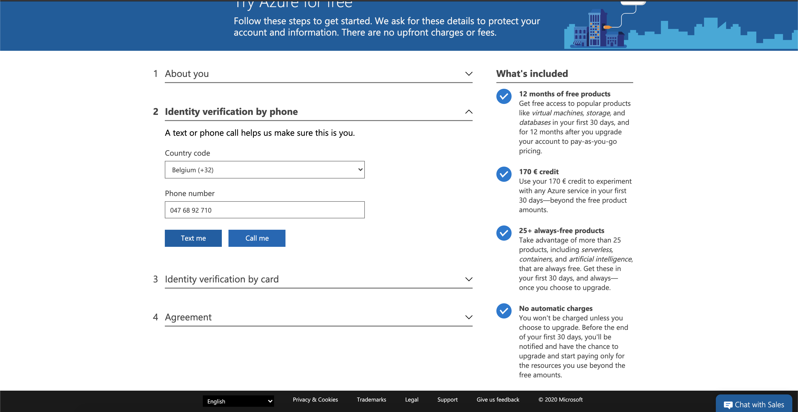

# 2.4.0 Configurar o ambiente

## 2.4.0.1 Criar uma assinatura do Azure

>[!NOTE]
>
>Se você já tiver uma Assinatura do Azure, ignore esta etapa. Nesse caso, continue com o exercício 13.0.2.

Acesse [https://portal.azure.com](https://portal.azure.com) e faça logon com sua conta do Azure. Se você não tiver um, use seu endereço de email pessoal para criar sua conta do Azure.


Depois de fazer logon, você verá a seguinte tela:


Clique no menu à esquerda e selecione **Todos os recursos**. A tela de assinatura do Azure será exibida se você ainda não tiver assinado. Nesse caso, selecione **Iniciar com uma avaliação gratuita do Azure**.


Preencha o formulário de assinatura do Azure, forneça seu celular e cartão de crédito para ativação (você terá uma camada gratuita por 30 dias e não será cobrado, a menos que atualize):



Quando o processo de assinatura for concluído, você poderá prosseguir:


## 2.4.0.2 Instalar o Visual Code Studio

Você usará o Microsoft Visual Code Studio para gerenciar seu Projeto do Azure. Você pode baixá-lo via [este link](https://code.visualstudio.com/download). Siga as instruções de instalação do sistema operacional específico no mesmo site.

## 2.4.0.3 Instalar extensões do Visual Code

Instale as Funções do Azure para Visual Studio Code de [https://marketplace.visualstudio.com/items?itemName=ms-azuretools.vscode-azurefunctions](https://marketplace.visualstudio.com/items?itemName=ms-azuretools.vscode-azurefunctions). Clique no botão de instalação:


Instale a Conta do Azure e o Logon para Visual Studio Code de [https://marketplace.visualstudio.com/items?itemName=ms-vscode.azure-account](https://marketplace.visualstudio.com/items?itemName=ms-vscode.azure-account). Clique no botão de instalação:


## 2.4.0.4 Instalar node.js

>[!NOTE]
>
>Se você já tiver o node.js instalado, ignore esta etapa. Nesse caso, continue com o exercício 13.0.5.

### macOS

Certifique-se de ter o [Homebrew](https://brew.sh/) instalado primeiro. Siga as instruções [aqui](https://brew.sh/).


Depois de instalar o Homebrew, execute este comando:

```javascript
brew install node
```

### Windows

Baixe o [Windows Installer](https://nodejs.org/en/#home-downloadhead) diretamente do site [nodejs.org](https://nodejs.org/en/).

## 2.4.0.5 Verificar a versão do node.js

Para este módulo, você precisa ter o node.js versão 12 instalado. Qualquer outra versão do node.js pode causar problemas com o exercício 13.5.

Antes de continuar, verifique sua versão do node.js agora.

Execute este comando para verificar a versão do node.js:

```javascript
node -v
```

Se sua versão for inferior ou superior a 12, será necessário atualizar ou fazer downgrade.

### Atualização/downgrade da versão node.js no macOS

Verifique se o pacote **n** está instalado.

Para instalar o pacote **n**, execute este comando:

```javascript
sudo npm install -g n
```

Se sua versão for inferior ou superior à versão 12, execute este comando para atualizar ou fazer downgrade:

```javascript
sudo n 12.6.0
```

### Atualização/Rebaixamento da versão do node.js no Windows

Desinstale o node.js do Windows > Painel de controle > Adicionar ou remover programas.

Instalando a versão necessária do site [nodejs.org](https://nodejs.org/en/).

## 2.4.0.6 Instalar pacote NPM: solicitação

Você precisa instalar o pacote **request** como parte da instalação do node.js.

Para instalar o pacote **request**, execute este comando:

```javascript
npm install request
```


Próxima etapa: [2.4.1 Configurar o ambiente do EventHub do Microsoft Azure](./ex1.md)

[Voltar ao módulo 2.4](./segment-activation-microsoft-azure-eventhub.md)

[Voltar a todos os módulos](./../../../overview.md)
