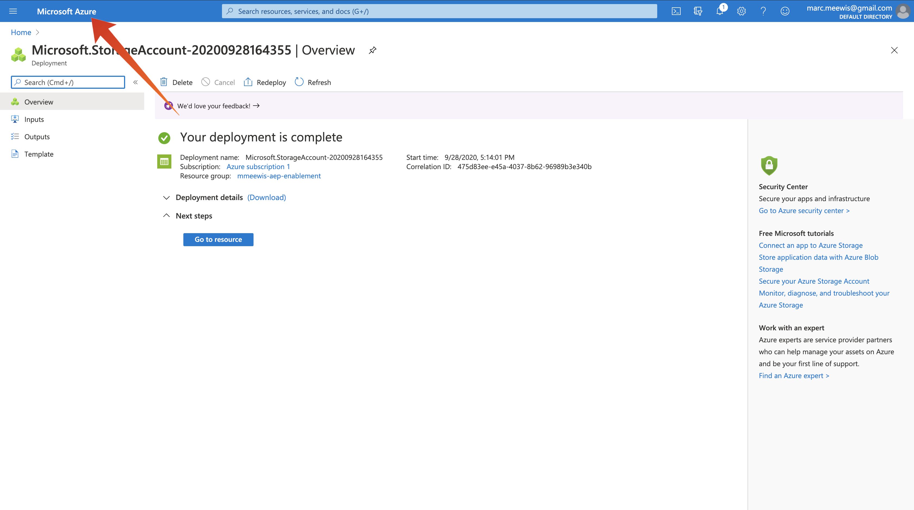

# 2.4.1 Configurar o ambiente do Microsoft Azure EventHub

Os Hubs de Eventos do Azure são um serviço de assinatura de publicação altamente escalável que pode assimilar milhões de eventos por segundo e transmiti-los em vários aplicativos. Isso permite processar e analisar as grandes quantidades de dados produzidos por seus dispositivos e aplicativos conectados.

## 2.4.1.1 O que são os Hubs de Eventos do Azure?

Os Hubs de Eventos do Azure são uma plataforma de transmissão de big data e um serviço de assimilação de eventos. Ele pode receber e processar milhões de eventos por segundo. Os dados enviados para um hub de eventos podem ser transformados e armazenados usando qualquer provedor de análise em tempo real ou adaptadores de armazenamento/agrupamento.

Os Hubs de Eventos representam a **porta de entrada** para um pipeline de eventos, geralmente chamado de assimilador de eventos em arquiteturas de solução. Um assimilador de eventos é um componente ou serviço que se situa entre editores de eventos (como o Adobe Experience Platform RTCDP) e consumidores de eventos para dissociar a produção de um fluxo de eventos do consumo desses eventos. Os Hubs de eventos fornecem uma plataforma de transmissão unificada com buffer de retenção de tempo, dissociando os produtores de eventos dos consumidores de eventos.

## 2.4.1.2 Criar um namespace de Hubs de eventos

Vá para [https://portal.azure.com/#home](https://portal.azure.com/#home) e selecione **Criar um recurso**.

Na tela de recursos, digite **Event** na barra de pesquisa e selecione **Hubs de Eventos** na lista suspensa:

Clique em **Criar**:

Se esta for a primeira vez que você cria um recurso no Azure, será necessário criar um novo **Grupo de recursos**. Se você já tiver um grupo de recursos, poderá selecioná-lo (ou criar um novo).

Selecione **Criar novo**, nomeie o grupo `--aepUserLdap---aep-enablement`.

Complete o teste dos campos conforme indicado:

- Namespace : defina seu namespace; ele deve ser exclusivo, use o seguinte padrão `--aepUserLdap---aep-enablement`
- Local: **Europa Ocidental** refere-se ao datacenter do Azure em Amsterdã
- Camada de preços: **Básica**
- Unidades de Taxa de Transferência: **1**

Clique em **Revisar + criar**.

Clique em **Criar**.

A implantação do grupo de recursos pode levar de 1 a 2 minutos. Ao obter êxito, você verá a seguinte tela:

## 2.4.1.3 Configurar o Hub de Eventos no Azure

Vá para [https://portal.azure.com/#home](https://portal.azure.com/#home) e selecione **Todos os recursos**.

Na lista de recursos, selecione seu namespace `--aepUserLdap---aep-enablement`:

Na tela de detalhes `--aepUserLdap---aep-enablement`, selecione **Hubs de Eventos**:

Clique em **+ Hub de Eventos**.

Use `--aepUserLdap---aep-enablement-event-hub` como nome e clique em **Criar**.

Clique em **Hubs de Eventos** no namespace do hub de eventos. Agora você deve ver seu **Hub de Eventos** listado. Se esse for o caso, você poderá seguir para o próximo exercício.

## 2.4.1.4 Configurar sua conta de armazenamento do Azure

Para depurar a função do Hub de Eventos do Azure em exercícios posteriores, será necessário fornecer uma Conta de Armazenamento do Azure como parte da configuração do projeto do Visual Studio Code. Agora você criará essa Conta de Armazenamento do Azure.

Vá para [https://portal.azure.com/#home](https://portal.azure.com/#home) e selecione **Criar um Recurso**.

Insira **armazenamento** na pesquisa e selecione **Conta de Armazenamento** na lista.

Selecione **Criar**.

Especifique o **Grupo de Recursos** (criado no início deste exercício), use `--aepUserLdap--aepstorage` como o nome da sua conta de Armazenamento e selecione **Armazenamento localmente redundante (LRS)** e clique em **Revisar + criar**.

Clique em **Criar**.

A criação da Conta de Armazenamento levará alguns segundos:

Quando terminar, sua tela exibirá o botão **Ir para o recurso**.

Clique em **Microsoft Azure**.

Sua Conta de Armazenamento agora está visível em **Recursos Recentes**.

Próxima Etapa: [2.4.2 Configurar o Destino do Hub de Eventos do Azure no Adobe Experience Platform](./ex2.md)

[Voltar ao módulo 2.4](./segment-activation-microsoft-azure-eventhub.md)

[Voltar a todos os módulos](./../../../overview.md)
