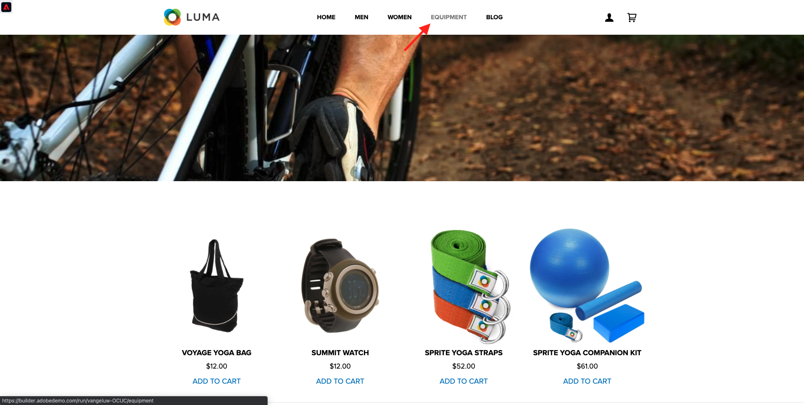

# 2.4.6 Cenário completo

## 2.4.6.1 Iniciar acionador do Hub de Eventos do Azure

Para mostrar a carga enviada pela Adobe Experience Platform Real-time CDP ao nosso Azure Event Hub na qualificação de segmento, precisamos iniciar nossa simples função de acionador do Azure Event Hub. Esta função irá &quot;despejar&quot; a carga para o console no Visual Studio Code. Mas lembre-se de que essa função pode ser estendida de qualquer maneira para fazer interface com todos os tipos de ambientes usando APIs e protocolos dedicados.

### Inicie o Visual Studio Code e inicie o projeto

Verifique se o projeto do Visual Studio Code está aberto e em execução

Para iniciar/parar/reiniciar sua função do Azure no Visual Studio Code, consulte os seguintes exercícios:

- [Exercício 13.5.4 - Iniciar projeto do Azure](./ex5.md)
- [Exercício 13.5.5 - Parar Projeto do Azure](./ex5.md)

Seu **Terminal** do Visual Studio Code deve mencionar algo semelhante a isto:

```code
[2022-02-23T05:03:41.429Z] Worker process started and initialized.
[2022-02-23T05:03:41.484Z] Debugger attached.
[2022-02-23T05:03:46.401Z] Host lock lease acquired by instance ID '000000000000000000000000D90C881B'.
```


## 2.4.6.2 Carregar o site Luma

Ir para [https://builder.adobedemo.com/projects](https://builder.adobedemo.com/projects). Depois de fazer logon com sua Adobe ID, você verá isso. Clique no projeto do site para abri-lo.


Agora você pode seguir o fluxo abaixo para acessar o site. Clique em **Integrações**.


Na página **Integrações**, é necessário selecionar a propriedade Coleção de dados criada no exercício 0.1.


Você verá seu site de demonstração aberto. Selecione o URL e copie-o para a área de transferência.


Abra uma nova janela incógnita do navegador.


Cole o URL do site de demonstração que você copiou na etapa anterior. Você será solicitado a fazer logon usando sua Adobe ID.


Selecione o tipo de conta e conclua o processo de logon.


Em seguida, você verá seu site carregado em uma janela incógnita do navegador. Para cada demonstração, será necessário usar uma janela do navegador nova e incógnita para carregar o URL do site de demonstração.


## 2.4.6.3 Qualificar-se para o seu segmento de interesse em equipamentos

Navegue até a página **Equipamento** uma vez e **não o recarregue ou atualize**. Esta ação deve qualificar você para o seu segmento `--aepUserLdap-- - Interest in Equipment`.



Para verificar, abra o painel Visualizador de perfis. Agora você deve ser membro de `--aepUserLdap-- - Interest in Equipment`. Se as associações de segmento ainda não tiverem sido atualizadas no painel Visualizador de perfis, clique no botão Recarregar.


Retorne ao Visual Studio Code e observe a guia **TERMINAL**. Você deve ver uma lista de segmentos para a sua **ECID** específica. Essa carga de ativação é entregue ao hub de eventos assim que você se qualifica para o segmento `--aepUserLdap-- - Interest in Equipment`.

Ao analisar mais de perto a carga do segmento, você pode ver que `--aepUserLdap-- - Interest in Equipment` está no status **realizado**.

Um status de segmento de **realizado** significa que nosso perfil acabou de entrar no segmento. Enquanto o status **existente** significa que nosso perfil continua a estar no segmento.


## 2.4.6.4 Visite a página Equipamento pela segunda vez

Atualize a página **Equipamento**.


Agora, volte para o Visual Studio Code e verifique sua guia **TERMINAL**. Você verá que ainda temos seu segmento, mas agora com o status **existente**, o que significa que nosso perfil continua a estar no segmento.


## 2.4.6.5 Visite a página de Esportes pela terceira vez

Se você visitar novamente a página **Esportes** pela terceira vez, nenhuma ativação ocorrerá, pois não há alteração de estado do ponto de vista de um segmento.

As ativações de segmentos só ocorrem quando o status do segmento é alterado:


Próxima etapa: [Resumo e benefícios](./summary.md)

[Voltar ao módulo 2.4](./segment-activation-microsoft-azure-eventhub.md)

[Voltar a todos os módulos](./../../../overview.md)
