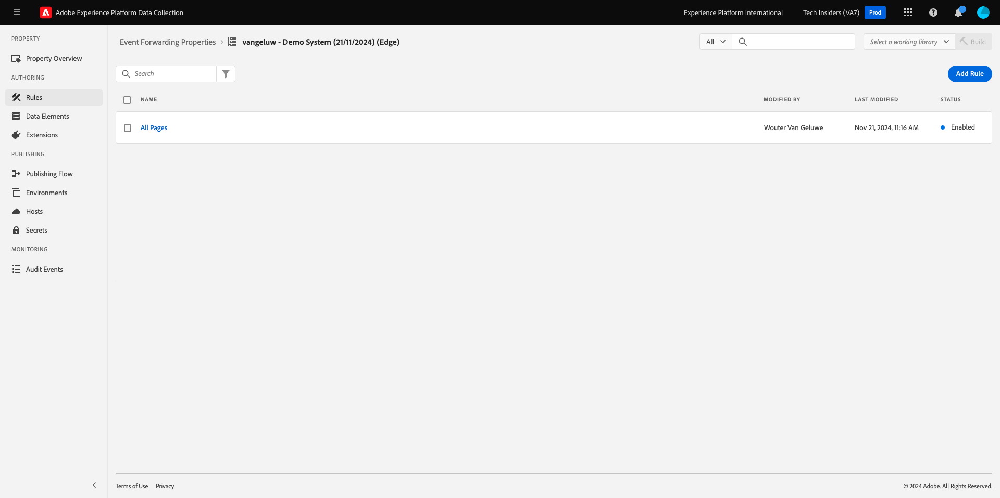

# 2.5.4 Criar e configurar uma função de nuvem do Google

## 2.5.4.1 Criar a função de nuvem do Google

Ir para [https://console.cloud.google.com/](https://console.cloud.google.com/). Ir para **Funções na nuvem**.


Você verá isso. Clique em **CRIAR FUNÇÃO**.


Você verá isso.


Faça as seguintes escolhas:

- **Nome da função**: `--aepUserLdap---event-forwarding`
- **Região**: selecione qualquer região
- **Tipo de Gatilho**: selecionar **HTTP**
- **Autenticação**: selecione **Permitir invocações não autenticadas**

Agora você deve ter isso. Clique em **SALVAR**.


Clique em **AVANÇAR**.


Você verá isto:


Faça as seguintes escolhas:

- **Tempo de execução**: selecionar **Node.js 16** (ou mais recente)
- **Ponto de entrada**: digite **helloAEP**

Clique em **HABILITAR API** para habilitar a **API de compilação na nuvem**. Você verá uma nova janela. Nessa nova janela, clique novamente em **HABILITAR**.


Você verá isso. Clique em **Habilitar**.


Depois que a **API de Compilação da Nuvem** for habilitada, você verá isso.


Volte para a sua **Função na Nuvem**.
No Editor em linha da função na nuvem, verifique se você tem o seguinte código:

```javascript
/**
 * Responds to any HTTP request.
 *
 * @param {!express:Request} req HTTP request context.
 * @param {!express:Response} res HTTP response context.
 */
exports.helloAEP = (req, res) => {
  let message = req.query.message || req.body.message || 'Hello World!';
  res.status(200).send(message);
};
```

Em seguida, clique em **IMPLANTAR**.


Você verá isso. Sua função de nuvem está sendo criada. Isso pode levar alguns minutos.


Assim que a função for criada e executada, você verá isso. Clique no nome da sua função para abri-la.


Você verá isso. Vá para **TRIGGER**. Você verá a **URL do acionador**, que é a que você usará para definir o ponto de extremidade no Launch Server Side.


Copie a URL do Acionador, que tem esta aparência: **https://europe-west1-dazzling-pillar-273812.cloudfunctions.net/vangeluw-event-forwarding**.

Nas próximas etapas, você configurará o Adobe Experience Platform Data Collection Server para transmitir informações específicas sobre **Exibições de página** para sua função da Google Cloud. Em vez de apenas encaminhar a carga completa como está, você só enviará itens como **ECID**, **carimbo de data/hora** e **Nome da página** para a sua função de nuvem do Google.

Este é um exemplo de uma carga que você precisará analisar para filtrar as variáveis mencionadas acima:

```json
{
  "events": [
    {
      "xdm": {
        "eventType": "web.webpagedetails.pageViews",
        "web": {
          "webPageDetails": {
            "URL": "https://builder.adobedemo.com/run/vangeluw-OCUC",
            "name": "vangeluw-OCUC",
            "viewName": "vangeluw-OCUC",
            "pageViews": {
              "value": 1
            }
          },
          "webReferrer": {
            "URL": "https://builder.adobedemo.com/run/vangeluw-OCUC/equipment"
          }
        },
        "device": {
          "screenHeight": 1080,
          "screenWidth": 1920,
          "screenOrientation": "landscape"
        },
        "environment": {
          "type": "browser",
          "browserDetails": {
            "viewportWidth": 1920,
            "viewportHeight": 451
          }
        },
        "placeContext": {
          "localTime": "2022-02-23T06:51:07.140+01:00",
          "localTimezoneOffset": -60
        },
        "timestamp": "2022-02-23T05:51:07.140Z",
        "implementationDetails": {
          "name": "https://ns.adobe.com/experience/alloy/reactor",
          "version": "2.8.0+2.9.0",
          "environment": "browser"
        },
        "_experienceplatform": {
          "identification": {
            "core": {
              "ecid": "08346969856929444850590365495949561249"
            }
          },
          "demoEnvironment": {
            "brandName": "vangeluw-OCUC"
          },
          "interactionDetails": {
            "core": {
              "channel": "web"
            }
          }
        }
      },
      "query": {
        "personalization": {
          "schemas": [
            "https://ns.adobe.com/personalization/html-content-item",
            "https://ns.adobe.com/personalization/json-content-item",
            "https://ns.adobe.com/personalization/redirect-item",
            "https://ns.adobe.com/personalization/dom-action"
          ],
          "decisionScopes": [
            "eyJ4ZG06YWN0aXZpdHlJZCI6Inhjb3JlOm9mZmVyLWFjdGl2aXR5OjE0YzA1MjM4MmUxYjY1MDUiLCJ4ZG06cGxhY2VtZW50SWQiOiJ4Y29yZTpvZmZlci1wbGFjZW1lbnQ6MTRiZjA5ZGM0MTkwZWJiYSJ9",
            "__view__"
          ]
        }
      }
    }
  ],
  "query": {
    "identity": {
      "fetch": [
        "ECID"
      ]
    }
  },
  "meta": {
    "state": {
      "domain": "adobedemo.com",
      "cookiesEnabled": true,
      "entries": [
        {
          "key": "kndctr_907075E95BF479EC0A495C73_AdobeOrg_identity",
          "value": "CiYwODM0Njk2OTg1NjkyOTQ0NDg1MDU5MDM2NTQ5NTk0OTU2MTI0OVIPCPn66KfyLxgBKgRJUkwx8AH5-uin8i8="
        },
        {
          "key": "kndctr_907075E95BF479EC0A495C73_AdobeOrg_consent_check",
          "value": "1"
        },
        {
          "key": "kndctr_907075E95BF479EC0A495C73_AdobeOrg_consent",
          "value": "general=in"
        }
      ]
    }
  }
}
```

Estes são os campos que contêm as informações que precisam ser analisadas:

- ECID: **events.xdm._experienceplatform.identification.core.ecid**
- carimbo de data/hora: **carimbo de data/hora**
- Nome da Página: **events.xdm.web.webPageDetails.name**

Agora vamos para o Servidor de coleta de dados da Adobe Experience Platform configurar os elementos de dados para tornar isso possível.

## 2.5.4.2 Atualize sua propriedade de encaminhamento de eventos: Elementos de dados

Vá para [https://experience.adobe.com/#/data-collection/](https://experience.adobe.com/#/data-collection/) e vá para **Encaminhamento de Eventos**. Pesquise na propriedade de encaminhamento de eventos e clique nela para abri-la.


No menu esquerdo, vá para **Elementos de Dados**. Clique em **Adicionar elemento de dados**.


Você verá um novo elemento de dados para configurar.


Faça a seguinte seleção:

- Como o **Nome**, digite **customerECID**.
- Como a **Extensão**, selecione **Principal**.
- Como o **Tipo de Elemento de Dados**, selecione **Caminho**.
- Como o **Caminho**, digite `arc.event.xdm.--aepTenantId--.identification.core.ecid`. Ao inserir este caminho, você filtrará o campo **ecid** da carga do evento enviada pelo site ou aplicativo móvel para a Adobe Edge.

>[!NOTE]
>
>Nos caminhos acima e abaixo, é feita uma referência a **arc**. **arc** significa Contexto de Recurso de Adobe e **arc** sempre significa o maior objeto disponível no contexto do Servidor. Enriquecimentos e transformações podem ser adicionados a esse objeto **arc** usando as funções do Servidor de Coleta de Dados da Adobe Experience Platform.
>
>Nos caminhos acima e abaixo, é feita uma referência ao **evento**. **event** significa um evento exclusivo e o Adobe Experience Platform Data Collection Server sempre avaliará cada evento individualmente. Às vezes, você pode ver uma referência a **eventos** na carga enviada pelo lado do cliente do SDK da Web, mas no Adobe Experience Platform Data Collection Server, cada evento é avaliado individualmente.

Agora você terá isto. Clique em **Salvar**.


Clique em **Adicionar elemento de dados**.


Você verá um novo elemento de dados para configurar.


Faça a seguinte seleção:

- Como o **Nome**, digite **eventTimestamp**.
- Como a **Extensão**, selecione **Principal**.
- Como o **Tipo de Elemento de Dados**, selecione **Caminho**.
- Como o **Caminho**, digite **arc.event.xdm.timestamp**. Ao inserir este caminho, você filtrará o campo **carimbo de data/hora** da carga do evento enviada pelo site ou aplicativo móvel para a Adobe Edge.

Agora você terá isto. Clique em **Salvar**.


Clique em **Adicionar elemento de dados**.


Você verá um novo elemento de dados para configurar.


Faça a seguinte seleção:

- Como o **Nome**, digite **pageName**.
- Como a **Extensão**, selecione **Principal**.
- Como o **Tipo de Elemento de Dados**, selecione **Caminho**.
- Como o **Caminho**, digite **arc.event.xdm.web.webPageDetails.name**. Ao inserir este caminho, você filtrará o campo **nome** da carga do evento enviada pelo site ou aplicativo móvel para a Adobe Edge.

Agora você terá isto. Clique em **Salvar**.


Agora você tem esses elementos de dados criados:


## 2.5.4.3 Atualize sua propriedade de encaminhamento de eventos: atualizar uma regra

No menu esquerdo, vá para **Regras**. No exercício anterior, você criou a regra **Todas as páginas**. Clique nessa regra para abri-la.


Então você vai ver isso. Clique no ícone **+** em **Ações** para adicionar uma nova ação.


Você verá isso.


Faça a seguinte seleção:

- Selecione a **Extensão**: **Conector de Nuvem do Adobe**.
- Selecione o **Tipo de ação**: **Fazer chamada de busca**.

Isso deve fornecer a você este **Nome**: **Conector de Nuvem Adobe - Fazer Chamada de Busca**. Agora você deve ver isso:


Em seguida, configure o seguinte:

- Altere o protocolo da solicitação de GET para **POST**
- Insira a URL da função de nuvem do Google criada em uma das etapas anteriores com esta aparência: **https://europe-west1-dazzling-pillar-273812.cloudfunctions.net/vangeluw-event-forwarding**

Agora você deve ter isso. Em seguida, vá para **Corpo**.


Você verá isso. Clique no botão de opção para **JSON**.


Configure o **Corpo** da seguinte maneira:

| CHAVE | VALOR |
|--- |--- |
| customerECID | {{customerECID}} |
| pageName | {{pageName}} |
| eventTimestamp | {{eventTimestamp}} |

Você verá isso. Clique em **Manter alterações**.


Você verá isso. Clique em **Salvar**.



Agora você atualizou sua regra existente em uma propriedade do Servidor de coleta de dados da Adobe Experience Platform. Vá para **Fluxo de Publicação** para publicar suas alterações. Abra a biblioteca de desenvolvimento **Principal** clicando em **Editar** conforme indicado.


Clique no botão **Adicionar todos os recursos alterados**, após o qual você verá sua Regra e Elemento de Dados aparecerem nesta biblioteca. Em seguida, clique em **Salvar e criar para desenvolvimento**. Suas alterações estão sendo implantadas.


Após alguns minutos, você verá que a implantação foi concluída e está pronta para ser testada.


## 2.5.3.4 Testar a configuração

Ir para [https://builder.adobedemo.com/projects](https://builder.adobedemo.com/projects). Depois de fazer logon com sua Adobe ID, você verá isso. Clique no projeto do site para abri-lo.


Agora você pode seguir o fluxo abaixo para acessar o site. Clique em **Integrações**.


Na página **Integrações**, é necessário selecionar a propriedade Coleção de dados criada no exercício 0.1.


Você verá seu site de demonstração aberto. Selecione o URL e copie-o para a área de transferência.


Abra uma nova janela incógnita do navegador.


Cole o URL do site de demonstração que você copiou na etapa anterior. Você será solicitado a fazer logon usando sua Adobe ID.


Selecione o tipo de conta e conclua o processo de logon.


Em seguida, você verá seu site carregado em uma janela incógnita do navegador. Para cada demonstração, será necessário usar uma janela do navegador nova e incógnita para carregar o URL do site de demonstração.


Ao abrir a Exibição do desenvolvedor do seu navegador, você pode inspecionar as solicitações de Rede conforme indicado abaixo. Ao usar o filtro **interagir**, você verá as solicitações de rede enviadas pelo Cliente de Coleção de Dados da Adobe Experience Platform para a Adobe Edge.


Alterne sua exibição para a Função na Nuvem da Google e vá para **LOGS**. Agora você deve ter uma visualização semelhante a esta, com várias entradas de log sendo mostradas. Toda vez que você vê **Execução da função iniciada**, significa que o tráfego de entrada foi recebido na sua Google Cloud Function.


Vamos atualizar sua função um pouco para trabalhar com os dados recebidos e exibir as informações recebidas do Servidor de coleta de dados da Adobe Experience Platform. Vá para **SOURCE** e clique em **EDITAR**.


Na próxima tela, clique em **AVANÇAR**.


Atualize o código da seguinte maneira:

```javascript
/**
 * Responds to any HTTP request.
 *
 * @param {!express:Request} req HTTP request context.
 * @param {!express:Response} res HTTP response context.
 */
exports.helloAEP = (req, res) => {
  console.log('>>>>> Function has started. The following information was received from Event Forwarding:');
  console.log(req.body);

  let message = req.query.message || req.body.message || 'Hello World!';
  res.status(200).send(message);
};
```

Então você terá isto. Clique em **IMPLANTAR**.


Após alguns minutos, sua função será implantada novamente. Clique no nome da função para abri-la.


Em seu site de demonstração, navegue até um produto, como por exemplo **DEIRDRE RELAXED-FIT CAPRI**.


Alterne sua exibição para a Função na Nuvem da Google e vá para **LOGS**. Agora você deve ter uma visualização semelhante a esta, com várias entradas de log sendo mostradas.

Para cada exibição de página no site de demonstração, você deve ver uma nova entrada de log pop-up nos logs do Google Cloud Function, que mostra as informações recebidas.


Agora você enviou com êxito os dados coletados pela Coleção de dados da Adobe Experience Platform, em tempo real, para um endpoint da Google Cloud Function. A partir daí, esses dados podem ser usados por qualquer aplicativo da Google Cloud Platform, como o BigQuery para armazenamento e relatórios ou para casos de uso de aprendizado de máquina.

Próxima etapa: [2.5.5 Encaminhar eventos em direção ao ecossistema do AWS](./ex5.md)

[Voltar ao módulo 2.5](./aep-data-collection-ssf.md)

[Voltar a todos os módulos](./../../../overview.md)
