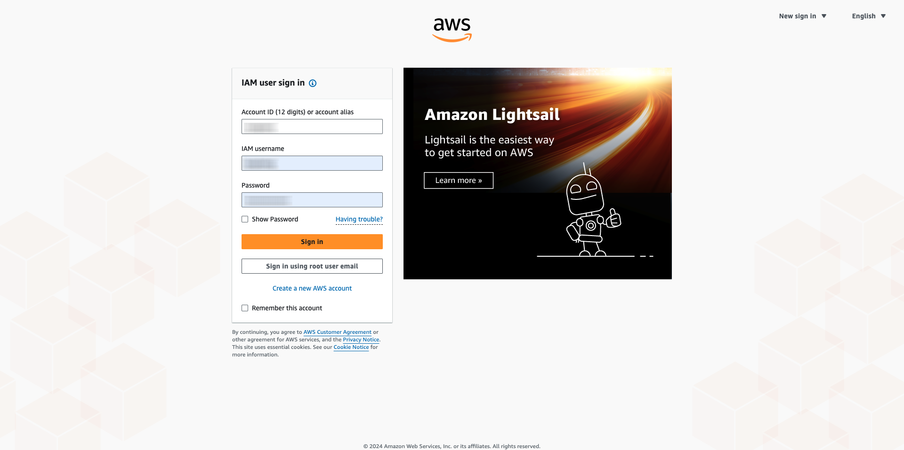
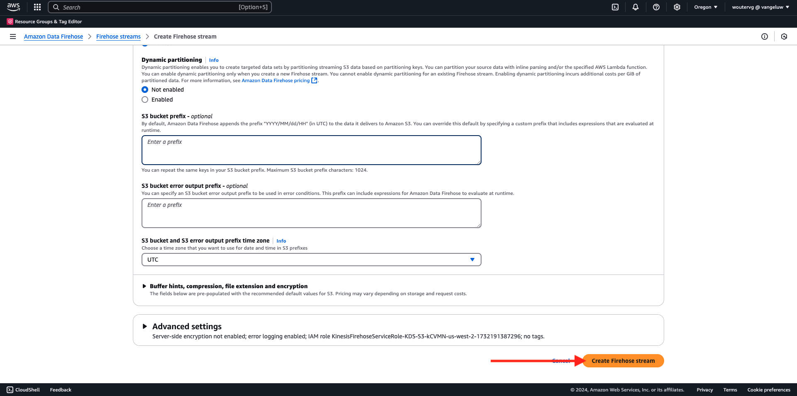
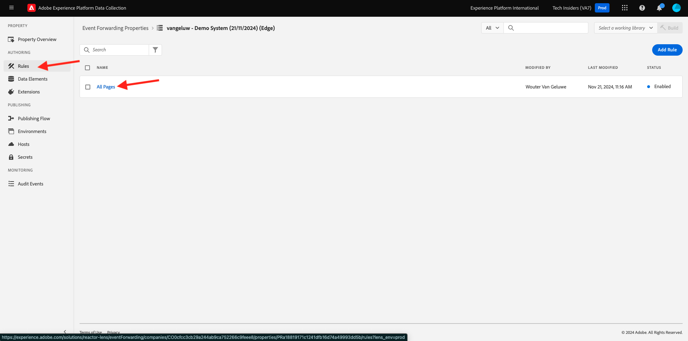
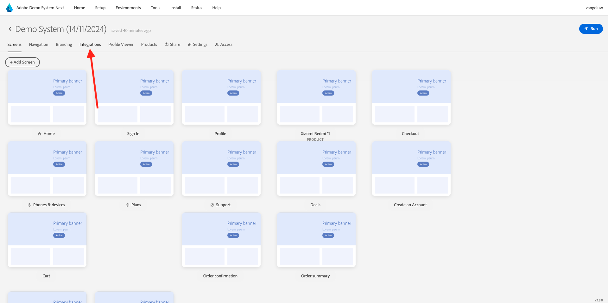

# 2.5.5 Encaminhar eventos para o ecossistema da AWS

>[!IMPORTANT]
>
>A conclusão deste exercício é opcional e envolve um custo para usar o AWS Kinesis. Embora a AWS forneça uma conta de camada gratuita que permite testar e configurar muitos serviços sem um custo, o AWS Kinesis não faz parte dessa conta de camada gratuita. Portanto, para implementar e testar esse exercício, será envolvido um custo para usar o AWS Kinesis.

## É bom saber

O Adobe Experience Platform oferece suporte a vários serviços da Amazon como destino.
Kinesis e S3 são [destinos de exportação de perfil](https://experienceleague.adobe.com/docs/experience-platform/destinations/destination-types.html?lang=en) e podem ser usados como parte do Real-Time CDP da Adobe Experience Platform.
Você pode alimentar facilmente eventos de segmento de alto valor e atributos de perfil associados em seus sistemas de escolha.

Nesta observação, você aprenderá a configurar seu próprio fluxo do Amazon Kinesis para transmitir dados do evento provenientes do ecossistema do Adobe Experience Platform Edge para um destino de armazenamento na nuvem, como o Amazon S3. Isso é útil caso você queira coletar eventos de experiência de propriedades da Web e de dispositivos móveis e enviá-los para o seu datalake para análise e relatórios operacionais. As soluções de dados geralmente assimilam dados em lote com grandes importações diárias de arquivos. Elas não expõem o endpoint http público que pode ser usado em conjunto com o encaminhamento de eventos.

O suporte aos casos de uso acima implica que os dados transmitidos precisam ser armazenados em buffer ou colocados em uma fila antes de serem gravados em um arquivo. Tenha cuidado para não abrir arquivos para acesso de gravação em vários processos. Delegar essa tarefa a um sistema dedicado é ideal para dimensionar perfeitamente, garantindo ao mesmo tempo um excelente nível de serviço. É aqui que a Kinesis é útil.

O Amazon Kinesis Data Streams concentra-se na assimilação e no armazenamento de fluxos de dados. O Kinesis Data Firehose concentra no fornecimento de fluxos de dados para destinos selecionados, como buckets do S3.

Como parte desse exercício, você...

- Executar uma configuração básica de um fluxo de dados do Kinesis
- Criar um fluxo de entrega do Firehose e usar o bucket do S3 como destino
- Configure o gateway da API do Amazon como um endpoint da API rest para receber os dados do evento
- Encaminhar dados brutos de evento do Adobe Edge para o fluxo do Kinesis

## 2.5.5.1 Configurar o bucket do AWS S3

Acesse [https://console.aws.amazon.com](https://console.aws.amazon.com) e entre com a conta da Amazon criada anteriormente.



Depois de fazer logon, você será redirecionado para o **Console de Gerenciamento do AWS**.


No menu **Localizar Serviços**, procure **s3**. Clique no primeiro resultado da pesquisa: **S3 - Armazenamento Escalável na Nuvem**.


Você verá a página inicial do **Amazon S3**. Clique em **Criar bloco**.


Na tela **Criar bloco**, você precisa configurar dois itens:

- Nome: use o nome `eventforwarding---aepUserLdap--`. Como exemplo, neste exercício, o nome do bucket é **aepmodulertcdpvangeluw**
- Região: utilizar a região **EU (Frankfurt) eu-central-1**


Deixe todas as outras configurações padrão como estão. Role para baixo e clique em **Criar bloco**.


Você verá seu bucket ser criado e será redirecionado para a página inicial do Amazon S3.


## 2.5.5.2 Configurar o fluxo de dados do AWS Kinesis

No menu **Localizar Serviços**, procure **kinesis**. Clique no primeiro resultado da pesquisa: **Kinesis - Trabalhar com dados de transmissão em tempo real**.


Selecione **Fluxos de dados do Kinesis**. Clique em **Criar fluxo de dados**.


Para o **Nome do fluxo de dados**, use `--aepUserLdap---datastream`.


Não há necessidade de alterar nenhuma das outras configurações. Role para baixo e clique em **Criar fluxo de dados**.


Você verá isso. Depois que o fluxo de dados for criado com êxito, você poderá avançar para o próximo exercício.


## 2.5.5.3 Configurar o fluxo de entrega do AWS Firehose

No menu **Localizar Serviços**, procure **kinesis**. Clique em **Kinesis Data Firehose**.


Clique em **Criar fluxo de entrega**.


Para **Source**, selecione **Amazon Kinesis Data Streams**. Para **Destino**, selecione **Amazon S3**. Clique em **Procurar** para selecionar seu fluxo de dados.


Selecione o fluxo de dados. Clique em **Escolher**.


Você verá isso. Lembre-se do **Nome do fluxo de entrega**, pois você precisará dele mais tarde.


Role para baixo até ver **Configurações de destino**. Clique em **Procurar** para selecionar seu bucket do S3.


Selecione seu bucket de S3 e clique em **Escolher**.


Então você verá algo assim. Atualize as seguintes configurações:

- Particionamento dinâmico: definido como **Habilitado**
- Desagregação de vários registros: definida como **Desabilitada**
- Novo delimitador de linha: definido como **Habilitado**
- Análise embutida para JSON: definido como **Habilitado**


Role para baixo um pouco e você verá isso. Atualize as seguintes configurações:

- Chaves de particionamento dinâmico
   - Nome da chave: **dynamicPartitioningKey**
   - Expressão JQ: **.dynamicPartitioningKey**
- Prefixo do bucket do S3: adicione o seguinte código:

```bash
!{partitionKeyFromQuery:dynamicPartitioningKey}/!{timestamp:yyyy}/!{timestamp:MM}/!{timestamp:dd}/!{timestamp:HH}/}
```

- Prefixo de saída do erro do bucket do S3: definido como **erro**


Finalmente, role para baixo mais um pouco e clique em **Criar fluxo de entrega**



Após alguns minutos, seu fluxo de entrega será criado e **estará ativo**.


## 2.5.5.4 Configurar sua função do AWS IAM

No menu **Localizar Serviços**, procure **iam**. Clique em **Gateway de API**.


Clique em **Funções**.


Procure sua função de **KinesisFirehose**. Clique para abri-lo.


Clique no nome da Política de permissões para abri-la.


Na nova tela que é aberta, clique em **Editar Política**.


Em **Kinesis** - **Actions**, verifique se as permissões **Write** para **PutRecord** estão habilitadas. Clique em **Revisar política**.


Clique em **Salvar alterações**.


Você estará de volta aqui. Clique em **Funções**.


Procure sua função de **KinesisFirehose**. Clique para abri-lo.


Vá para **Relações de confiança** e clique em **Editar diretiva de confiança**.


Substitua a diretiva de confiança atual colando este código para substituir o código existente:

```json
{
	"Version": "2012-10-17",
	"Statement": [
		{
			"Effect": "Allow",
			"Principal": {
				"Service": [
                    "firehose.amazonaws.com",
                    "kinesis.amazonaws.com",
                    "apigateway.amazonaws.com"
                ]
			},
			"Action": "sts:AssumeRole"
		}
	]
}
```

Clique em **Atualizar política**


Você verá isso. Você precisará especificar o **ARN** para esta função na próxima etapa.


## 2.5.5.5 Configurar o gateway da API do AWS

O Amazon API Gateway é um serviço da AWS para criar, publicar, manter, monitorar e proteger APIs REST, HTTP e WebSocket em qualquer escala. Os desenvolvedores de API podem criar APIs que acessam o AWS ou outros serviços da Web, bem como dados armazenados na AWS Cloud.

Agora você vai expor o fluxo de dados do Kinesis para a Internet por meio de um terminal HTTPS que pode ser consumido diretamente pelos serviços da Adobe, como o encaminhamento de eventos.

No menu **Localizar Serviços**, procure por **gateway de API**. Clique em **Gateway de API**.


Então você verá algo assim. Clique em **Criar API**.


Clique em **Build** no cartão **REST API**.


Você verá isso. Preencha as configurações desta forma:

- Escolha o protocolo: selecione **REST**
- Criar nova API: selecione **Nova API**
- Configurações:
   - Nome da API: use `--aepUserLdap---eventforwarding`
   - Tipo de Ponto de Extremidade: select **Regional**

Clique em **Criar API**.


Você verá isso. Clique em **Ações** e em **Criar Recurso**.


Você verá isso. Definir **Nome do Recurso** como **fluxo**. Clique em **Criar Recurso**.


Você verá isso. Clique em **Ações** e em **Criar método**.


Na lista suspensa, selecione **POST** e clique no botão **v**.


Você verá isso. Preencha as configurações desta forma:

- Tipo de integração: **AWS Service**
- Região do AWS: selecione a região usada pelo seu Fluxo de Dados do Kinesis, neste caso: **us-west-2**
- Serviço AWS: selecione **Kinesis**
- Subdomínio do AWS: deixe em branco
- Método HTTP: selecione **POST**
- Tipo de ação: selecionar **Usar nome da ação**
- Ação: inserir **PutRecord**
- Função de execução: cole o **ARN** da função de execução que é usada pelo seu Kinesis Data Firehose, conforme instruído no exercício anterior
- Manuseio de Conteúdo: selecione **Passagem**
- Usar tempo limite padrão: ativar a caixa de seleção

Clique em **Salvar**.


Você verá isso. Clique em **Solicitação de integração**.


Clique em **HTTP Headers**.


Role para baixo um pouco e clique em **Adicionar cabeçalho**.


Definir **Nome** como **Tipo de Conteúdo**, definir **Mapeado de** a `'application/x-amz-json-1.1'`. Clique no ícone **v** para salvar suas alterações.


Você verá isso. Para **Solicitar passagem do corpo**, selecione **Quando não houver modelos definidos (recomendado)**. Em seguida, clique em **Adicionar modelo de mapeamento**.


Em **Content-Type**, digite **application/json**. Clique no ícone **v** para salvar suas alterações.


Role para baixo para encontrar uma janela do editor de código. Cole o código abaixo nele:

```json
{
  "StreamName": "$input.path('StreamName')",
  "Data": "$util.base64Encode($input.json('$.Data'))",
  "PartitionKey": "$input.path('$.PartitionKey')"
}
```

Clique em **Salvar**.


Em seguida, role para cima e clique em **&lt;- Execução de Método** para voltar.


Clique em **TEST**.


Role para baixo e cole este código em **Solicitar corpo**. Clique em **Testar**.

```json
{
  "Data": {
    "message": "Hello World",
    "dynamicPartitioningKey": "v2"
  },
  "PartitionKey": "1",
  "StreamName": "--aepUserLdap---datastream"
}
```


Você verá um resultado semelhante:


Você verá isso. Clique em **Ações** e em **Implantar API**.


Para **Estágio de implantação**, selecione **Novo Estágio**. Como **Nome do estágio**, digite **prod**. Clique em **Implantar**.


Você verá isso. Clique em **Salvar alterações**. INFO: a URL na imagem é a URL para a qual enviar dados (neste exemplo: https://vv1i5vwg2k.execute-api.us-west-2.amazonaws.com/prod).


Você pode testar sua configuração usando a solicitação cURL abaixo. Basta substituir a URL abaixo pela sua, `https://vv1i5vwg2k.execute-api.us-west-2.amazonaws.com/prod` neste exemplo e adicionar `/stream` ao final da URL.

```json
curl --location --request POST 'https://vv1i5vwg2k.execute-api.us-west-2.amazonaws.com/prod/stream' \
--header 'Content-Type: application/json' \
--data-raw '{
    "Data": {
        "userid": "--aepUserLdap--@adobe.com",
        "firstName":"--aepUserLdap--",
        "offerName":"10% off on outdoor gears",
        "offerCode": "10OFF-SPRING",
        "dynamicPartitioningKey": "campaign"
    },
    "PartitionKey": "1",
    "StreamName": "--aepUserLdap---datastream"
}'
```

Cole o código atualizado acima em uma janela Terminal e pressione Enter. Você verá essa resposta, semelhante à resposta que poderia ver ao testar acima.


## 2.5.5.6 Atualize sua propriedade de encaminhamento de eventos

Agora é possível ativar para o fluxo de dados do AWS Kinesis por meio do AWS API Gateway, para que você possa enviar seus eventos de experiência brutos para o ecossistema do AWS. Usando o Real-Time CDP Connections e o Encaminhamento de eventos, agora é possível habilitar facilmente o encaminhamento de eventos para o endpoint do AWS API Gateway recém-criado.

### 2.5.5.6.1 Atualize sua propriedade de encaminhamento de eventos: Criar um elemento de dados

Vá para [https://experience.adobe.com/#/data-collection/](https://experience.adobe.com/#/data-collection/) e vá para **Encaminhamento de Eventos**. Pesquise na propriedade de encaminhamento de eventos e clique nela para abri-la.


No menu esquerdo, vá para **Elementos de Dados**. Clique em **Adicionar elemento de dados**.


Você verá um novo elemento de dados para configurar.


Faça a seguinte seleção:

- Como o **Name**, digite **awsDataObject**.
- Como a **Extensão**, selecione **Principal**.
- Como o **Tipo de elemento de dados**, selecione **Código personalizado**.

Agora você terá isto. Clique em **&lt;/> Abrir editor**.


No Editor, cole o seguinte código na linha 3. Clique em **Salvar**.

```javascript
const newObj = {...arc.event.xdm, dynamicPartitioningKey: "event_forwarding"}
return JSON.stringify(newObj);
```


>[!NOTE]
>
>No caminho acima, é feita uma referência a **arc**. **arc** significa Contexto de Recurso de Adobe e **arc** sempre significa o maior objeto disponível no contexto do Servidor. Enriquecimentos e transformações podem ser adicionados a esse objeto **arc** usando as funções do Servidor de Coleta de Dados da Adobe Experience Platform.
>
>No caminho acima, é feita uma referência ao **evento**. **event** significa um evento exclusivo e o Adobe Experience Platform Data Collection Server sempre avaliará cada evento individualmente. Às vezes, você pode ver uma referência a **eventos** na carga enviada pelo lado do cliente do SDK da Web, mas no Encaminhamento de eventos da coleção de dados da Adobe Experience Platform, cada evento é avaliado individualmente.

Você estará de volta aqui. Clique em **Salvar** ou **Salvar na Biblioteca**.


### 2.5.5.6.2 Atualizar a propriedade do Servidor de coleta de dados da Adobe Experience Platform: atualizar a regra

No menu esquerdo, vá para **Regras**. Clique para abrir a regra **Todas as páginas** que você criou em um dos exercícios anteriores.



Você verá isso. Clique no ícone **+** para adicionar uma nova ação.


Você verá isso. Faça a seguinte seleção:

- Selecione a **Extensão**: **Conector de Nuvem do Adobe**.
- Selecione o **Tipo de ação**: **Fazer chamada de busca**.

Isso deve fornecer a você este **Nome**: **Conector de Nuvem Adobe - Fazer Chamada de Busca**. Agora você deve ver isso:


Em seguida, configure o seguinte:

- Altere o método de solicitação de GET para **POST**
- Insira a URL do ponto de extremidade do AWS API Gateway criado em uma das etapas anteriores, com esta aparência: `https://vv1i5vwg2k.execute-api.us-west-2.amazonaws.com/prod/stream`

Agora você deve ter isso. Em seguida, vá para **Cabeçalhos**.


Em cabeçalhos, adicione um novo cabeçalho com a chave **Content-Type** e o valor **application/json**. Em seguida, vá para **Corpo**.


Você verá isso. Cole o seguinte código no campo **Corpo (bruto)**. Clique em **Manter alterações**.

```json
{
    "Data":{{awsDataObject}},
    "PartitionKey": "1",
    "StreamName": "--aepUserLdap---datastream"
}
```


Então você vai ver que está de volta aqui. Clique em **Salvar** ou **Salvar na Biblioteca**.


Agora você configurou sua primeira regra em uma propriedade de encaminhamento de eventos. Vá para **Fluxo de Publicação** para publicar suas alterações.
Abra a biblioteca de desenvolvimento clicando em **Principal**.


Clique no botão **Adicionar todos os recursos alterados**, após o qual você verá suas alterações de Regra e Elemento de Dados aparecerem nesta biblioteca. Em seguida, clique em **Salvar e criar para desenvolvimento**. Suas alterações estão sendo implantadas.


Após alguns minutos, você verá que a implantação foi concluída e está pronta para ser testada.


## 2.5.5.7 Testar a configuração

Ir para [https://builder.adobedemo.com/projects](https://builder.adobedemo.com/projects). Depois de fazer logon com sua Adobe ID, você verá isso. Clique no projeto do site para abri-lo.


Agora você pode seguir o fluxo abaixo para acessar o site. Clique em **Integrações**.



Na página **Integrações**, é necessário selecionar a propriedade Coleção de dados criada no exercício 0.1.


Você verá seu site de demonstração aberto. Selecione o URL e copie-o para a área de transferência.


Abra uma nova janela incógnita do navegador.


Cole o URL do site de demonstração que você copiou na etapa anterior. Você será solicitado a fazer logon usando sua Adobe ID.


Selecione o tipo de conta e conclua o processo de logon.


Em seguida, você verá seu site carregado em uma janela incógnita do navegador. Para cada demonstração, será necessário usar uma janela do navegador nova e incógnita para carregar o URL do site de demonstração.


Ao abrir a Exibição do desenvolvedor do seu navegador, você pode inspecionar as solicitações de Rede conforme indicado abaixo. Ao usar o filtro **interagir**, você verá as solicitações de rede enviadas pelo Cliente de Coleção de Dados da Adobe Experience Platform para a Adobe Edge.


Se você selecionar a carga bruta, vá para [https://jsonformatter.org/json-pretty-print](https://jsonformatter.org/json-pretty-print) e cole a carga. Clique em **Tornar Bonito**. Você verá a carga JSON, o objeto **events** e o objeto **xdm**. Em uma das etapas anteriores, ao definir o Elemento de dados, você usou a referência **arc.event.xdm**, que resultará na análise do objeto **xdm** desta carga.


Mudar sua exibição para **AWS**. Ao abrir seu fluxo de dados e entrar na guia **Monitoramento**, você verá o tráfego de entrada.


Ao abrir o fluxo de entrega e ir para a guia **Monitoramento**, você também verá o tráfego de entrada.


Por fim, ao examinar o S3 bucket, agora você notará arquivos que estão sendo criados nele como consequência da assimilação de dados.


Ao baixar esse arquivo e abri-lo usando um editor de texto, você verá que ele contém a carga XDM dos eventos que foram encaminhados.


Próxima etapa: [Resumo e benefícios](./summary.md)

[Voltar ao módulo 2.5](./aep-data-collection-ssf.md)

[Voltar a todos os módulos](./../../../overview.md)
