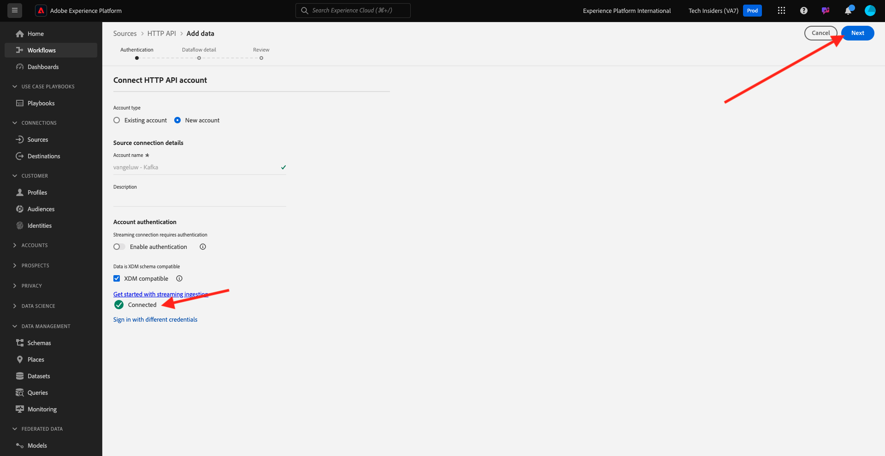

# 2.6.3 Configurar o endpoint de transmissão da API HTTP no Adobe Experience Platform

Antes de configurar o Conector do Adobe Experience Platform Sink no Kafka, é necessário criar um Conector do Source da API HTTP no Adobe Experience Platform. O URL do ponto de extremidade de transmissão da API HTTP é necessário para configurar o Conector do coletor do Adobe Experience Platform.

Para criar um Conector Source da API HTTP, faça logon no Adobe Experience Platform acessando esta URL: [https://experience.adobe.com/platform](https://experience.adobe.com/platform).

Depois de fazer logon, você chegará à página inicial do Adobe Experience Platform.

Antes de continuar, você precisa selecionar uma **sandbox**. A sandbox a ser selecionada é chamada ``--aepSandboxName--``. Você pode fazer isso clicando no texto **[!UICONTROL Produção]** na linha azul na parte superior da tela. Depois de selecionar a sandbox apropriada, você verá a alteração da tela e agora estará em sua sandbox dedicada.

No menu esquerdo, vá para **Fontes** e role para baixo no **Catálogo de Fontes** até ver **API HTTP**. Clique em **Adicionar dados**.

Clique em **Nova conta**. Use `--aepUserLdap-- - Kafka` como o nome da sua conexão de API HTTP, neste caso **vangeluw - Kafka**. Habilite a caixa de seleção para **Compatível com XDM**. Clique em **Conectar à origem**.

Você verá isso, clique em **Avançar**.

Selecione **Conjunto de dados existente**, abra o menu suspenso. Pesquise e selecione o conjunto de dados **Sistema de demonstração - Conjunto de dados de evento para Call Center (Global v1.1)**.

Clique em **Next**.

Clique em **Next**.

Clique em **Concluir**.

Em seguida, você verá uma visão geral do HTTP API Source Connector que acabou de criar.

Você precisará copiar a URL do **endpoint de transmissão**, que se parece com a abaixo, como você precisará dela no próximo exercício.

`https://dcs.adobedc.net/collection/d282bbfc8a540321341576275a8d052e9dc4ea80625dd9a5fe5b02397cfd80dc`

Você concluiu este exercício.

Próxima etapa: [2.6.4 Instale e configure o Kafka Connect e o Conector do Coletor do Adobe Experience Platform](./ex4.md)

[Voltar ao módulo 2.6](./aep-apache-kafka.md)

[Voltar a todos os módulos](../../../overview.md)
