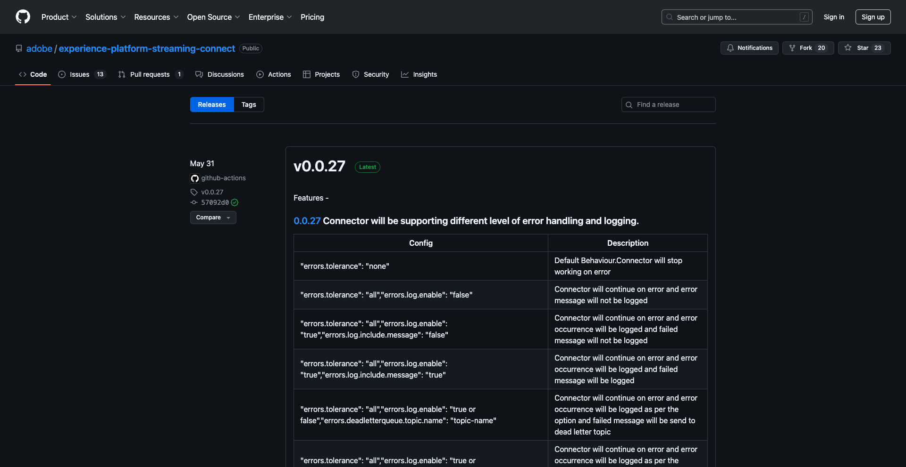
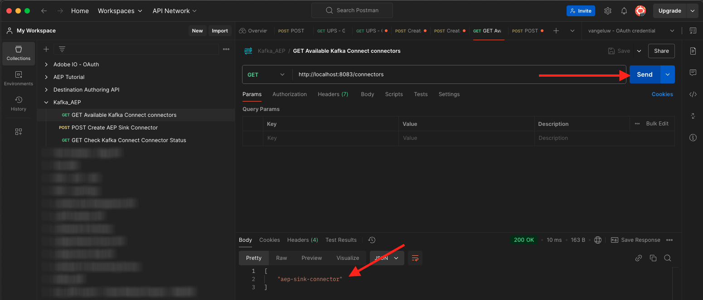
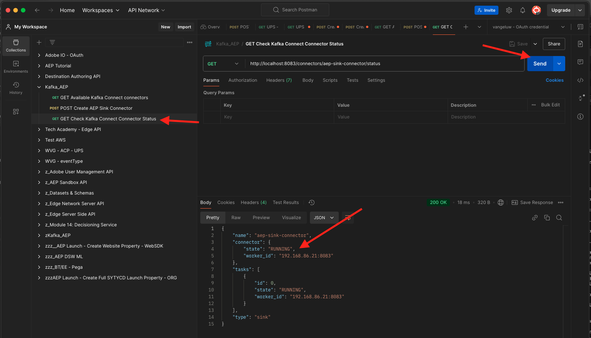

# 2.6.4 Instale e configure o Kafka Connect e o Conector do dissipador do Adobe Experience Platform

## 2.6.4.1 Baixar o conector do coletor Adobe Experience Platform

Acesse [https://github.com/adobe/experience-platform-streaming-connect/releases](https://github.com/adobe/experience-platform-streaming-connect/releases) e baixe a versão oficial mais recente do Adobe Experience Platform Sink Connector.



Coloque o arquivo de download, **streaming-connect-sink-0.0.14-java-11.jar**, no desktop.


## 2.6.4.2 Configurar o Kafka Connect

Vá para a pasta na sua área de trabalho chamada **Kafka_AEP** e navegue até a pasta `kafka_2.13-3.1.0/config`.
Nessa pasta, abra o arquivo **connect-distribut.properties** usando qualquer Editor de Texto.


No Editor de Texto, vá para as linhas 34 e 35 e certifique-se de definir os campos `key.converter.schemas.enable` e `value.converter.schemas.enable` como `false`

```json
key.converter.schemas.enable=false
value.converter.schemas.enable=false
```

Salve as alterações neste arquivo.


Em seguida, volte para a pasta `kafka_2.13-3.1.0` e crie manualmente uma nova pasta e a nomeie como `connectors`.


Clique com o botão direito na pasta e clique em **Novo terminal na Pasta**.


Você verá isso. Digite o comando `pwd` para recuperar o caminho completo dessa pasta. Selecione o caminho completo e copie-o para a área de transferência.


Volte para o Editor de Texto, para o arquivo **connect-distribution.properties** e role para baixo até a última linha (linha 86 na captura de tela). Você deve remover o comentário da linha que começa com `# plugin.path=` e colar o caminho completo na pasta chamada `connectors`. O resultado deve ser semelhante a este:

`plugin.path=/Users/woutervangeluwe/Desktop/Kafka_AEP/kafka_2.13-3.1.0/connectors`

Salve as alterações no arquivo **connect-distribut.properties** e feche o Editor de Texto.


Em seguida, copie a versão oficial mais recente do Adobe Experience Platform Sink Connector que você baixou para a pasta chamada `connectors`. O arquivo que você baixou antes se chama **streaming-connect-sink-0.0.14-java-11.jar**. Basta movê-lo para a pasta `connectors`.


Em seguida, abra uma nova janela Terminal no nível da pasta **kafka_2.13-3.1.0**. Clique com o botão direito nessa pasta e clique em **Novo Terminal na Pasta**.

Na janela Terminal, cole este comando: `bin/connect-distributed.sh config/connect-distributed.properties` e clique em **Enter**. Este comando iniciará o Kafka Connect e carregará a biblioteca do Adobe Experience Platform Sink Connector.


Após alguns segundos, você verá algo assim:


## 2.6.4.3 Crie seu conector de coletor do Adobe Experience Platform usando o Postman

Agora você pode interagir com o Kafka Connect usando o Postman. Para fazer isso, baixe [esta coleção do Postman](./../../../assets/postman/postman_kafka.zip) e descompacte-a no computador local na área de trabalho. Você terá um arquivo chamado `Kafka_AEP.postman_collection.json`.


Você precisa importar esse arquivo no Postman. Para fazer isso, abra o Postman, clique em **Importar**, arraste e solte o arquivo `Kafka_AEP.postman_collection.json` no pop-up e clique em **Importar**.


Você encontrará essa coleção no menu esquerdo do Postman. Clique na primeira solicitação, **Conectores do GET Kafka Connect** disponíveis para abri-la.


Você verá isso. Clique no botão azul **Enviar**, após o qual você deverá ver uma resposta vazia `[]`. A resposta vazia se deve ao fato de que nenhum conector Kafka Connect está definido no momento.


Para criar um conector, clique em para abrir a segunda solicitação na coleção Kafka, **POST Criar conector de coletor AEP**. Você verá isso. Na linha 11, onde diz **&quot;aep.endpoint&quot;: &quot;&quot;**, é necessário colar na URL do ponto de extremidade de transmissão da API HTTP recebida no final do exercício [15.3](./ex3.md). A URL do ponto de extremidade de Streaming da API HTTP tem esta aparência: `https://dcs.adobedc.net/collection/d282bbfc8a540321341576275a8d052e9dc4ea80625dd9a5fe5b02397cfd80dc`.


Depois de colá-lo, o corpo da solicitação deve ter esta aparência. Clique no botão azul **Enviar** para criar seu conector. Você receberá uma resposta imediata da criação do conector.


GET Clique na primeira solicitação, **Conectores disponíveis do Kafka Connect**, para abri-la novamente e clique novamente no botão azul **Enviar**. agora você verá que um conector Kafka Connect é criado.



GET Em seguida, abra a terceira solicitação da coleção Kafka, **Verifique o status do conector de conexão Kafka**. Clique no botão azul **Enviar** para obter uma resposta como a abaixo, informando que o conector está em execução.



## 2.6.4.4 Produzir um evento de experiência

Abra uma nova janela do **Terminal** clicando com o botão direito do mouse na sua pasta **kafka_2.13-3.1.0** e clicando em **Novo Terminal na Pasta**.


Digite o seguinte comando:

`bin/kafka-console-producer.sh --broker-list 127.0.0.1:9092 --topic aep`


Você verá isso. Cada nova linha seguida do pressionamento do botão Enter resultará no envio de uma nova mensagem para o tópico **aep**.


Agora você pode enviar uma mensagem, que resultará no consumo pelo Adobe Experience Platform Sink Connector e que será assimilada no Adobe Experience Platform em tempo real.

Vamos fazer uma pequena demonstração para testar isto.

Ir para [https://builder.adobedemo.com/projects](https://builder.adobedemo.com/projects). Depois de fazer logon com sua Adobe ID, você verá isso. Clique no projeto do site para abri-lo.


Na página **Screens**, clique em **Executar**.


Você verá seu site de demonstração aberto. Selecione o URL e copie-o para a área de transferência.


Abra uma nova janela incógnita do navegador.


Cole o URL do site de demonstração que você copiou na etapa anterior. Você será solicitado a fazer logon usando sua Adobe ID.


Selecione o tipo de conta e conclua o processo de logon.


Em seguida, você verá seu site carregado em uma janela incógnita do navegador. Para cada demonstração, será necessário usar uma janela do navegador nova e incógnita para carregar o URL do site de demonstração.


Clique no ícone do logotipo do Adobe no canto superior esquerdo da tela para abrir o Visualizador de perfis.


Consulte o painel Visualizador de perfis e o Perfil do cliente em tempo real com a **ID de Experience Cloud** como o identificador principal para este cliente atualmente desconhecido.


Vá para a página Registro/Logon. Clique em **CRIAR UMA CONTA**.


Preencha seus detalhes e clique em **Registrar**; depois disso, você será redirecionado para a página anterior.


Abra o painel Visualizador de perfis e vá para Perfil do cliente em tempo real. No painel Visualizador de perfis, você deve ver todos os seus dados pessoais exibidos, como emails recém-adicionados e identificadores de telefone.


Você pode ver alguns eventos de experiência com base em atividades anteriores.


Vamos alterar isso e enviar um evento de experiência do Callcenter do Kafka para o Adobe Experience Platform.

Pegue a carga útil do evento de experiência de amostra abaixo e copie-a em um Editor de texto.

```json
{
  "header": {
    "datasetId": "61fe23fd242870194a6d779c",
    "imsOrgId": "--aepImsOrgID--",
    "source": {
      "name": "Launch"
    },
    "schemaRef": {
      "id": "https://ns.adobe.com/experienceplatform/schemas/b0190276c6e1e1e99cf56c99f4c07a6e517bf02091dcec90",
      "contentType": "application/vnd.adobe.xed-full+json;version=1"
    }
  },
  "body": {
    "xdmMeta": {
      "schemaRef": {
        "id": "https://ns.adobe.com/experienceplatform/schemas/b0190276c6e1e1e99cf56c99f4c07a6e517bf02091dcec90",
        "contentType": "application/vnd.adobe.xed-full+json;version=1"
      }
    },
    "xdmEntity": {
      "eventType": "callCenterInteractionKafka",
      "_id": "",
      "timestamp": "2022-02-23T09:54:12.232Z",
      "_experienceplatform": {
        "identification": {
          "core": {
            "phoneNumber": ""
          }
        },
        "interactionDetails": {
          "core": {
            "callCenterAgent": {
              "callID": "Support Contact - 3767767",
              "callTopic": "contract",
              "callFeeling": "negative"
            }
          }
        }
      }
    }
  }
}
```

Você verá isso. É necessário atualizar manualmente dois campos:

- **_id**: defina-a como uma ID aleatória, algo como `--aepUserLdap--1234`
- **carimbo de data/hora**: atualize o carimbo de data/hora para a data e hora atuais
- **phoneNumber**: digite o phoneNumber da conta que acabou de ser criada no site de demonstração. Você pode encontrá-lo no painel Visualizador de perfis em **Identidades**.

Também é necessário verificar e talvez atualizar estes campos:
- **datasetId**: é necessário copiar a ID do conjunto de dados para o Sistema de demonstração do conjunto de dados - Conjunto de dados de evento para a Central de atendimento (Global v1.1)
- **imsOrgID**: sua ID de Organização IMS é `--aepImsOrgId--`

>[!NOTE]
>
>O campo **_id** precisa ser exclusivo para cada assimilação de dados. Se você produzir vários eventos, atualize o campo **_id** sempre para um valor novo e exclusivo.


Você deve ter algo assim:


Em seguida, copie o evento de experiência completa para a área de transferência. O espaço em branco da carga JSON precisa ser removido e uma ferramenta online será usada para fazer isso. Vá para [http://jsonviewer.stack.hu/](http://jsonviewer.stack.hu/) para fazer isso.


Cole o evento de experiência no editor e clique em **Remover espaço em branco**.


Em seguida, selecione todo o texto de saída e copie-o para a área de transferência.


Volte para a janela do Terminal.


Cole o novo conteúdo sem espaços em branco na janela do Terminal e clique em **Enter**.


Em seguida, volte para o site de demonstração e atualize a página. Agora você deve ver um evento de experiência no seu perfil, em **Outros eventos**, exatamente como o abaixo:


>[!NOTE]
>
>Se quiser que as interações da central de atendimento apareçam no painel Visualizador de Perfis, adicione o rótulo e o filtro abaixo em seu projeto em [https://builder.adobedemo.com/projects](https://builder.adobedemo.com/projects), acessando a guia **Visualizador de Perfis**.


Você concluiu este exercício.

Próxima etapa: [Resumo e benefícios](./summary.md)

[Voltar ao módulo 2.6](./aep-apache-kafka.md)

[Voltar a todos os módulos](../../../overview.md)
