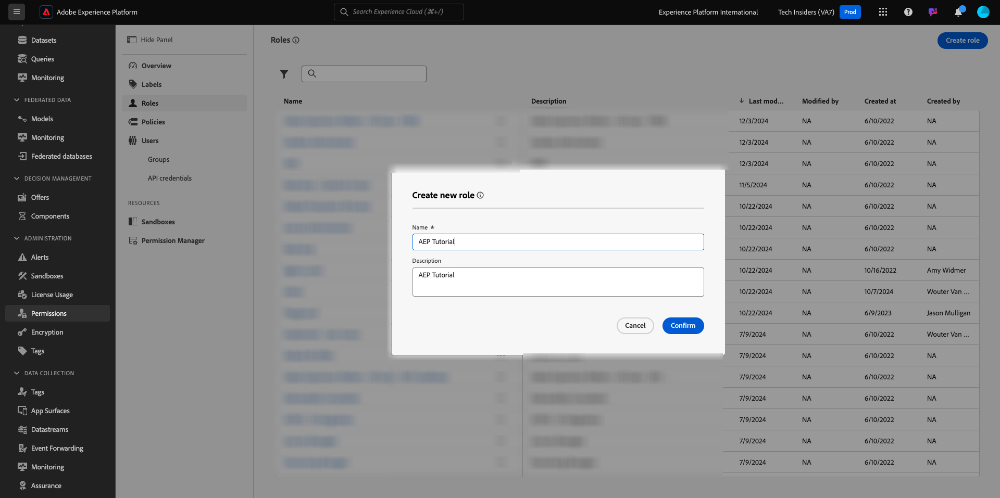
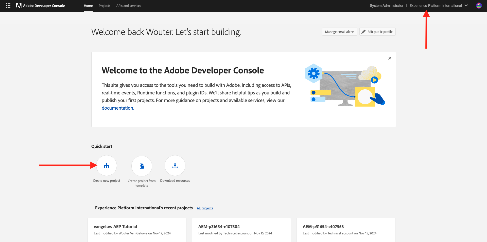
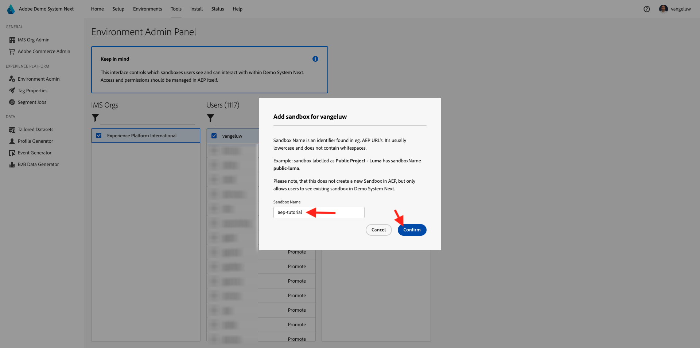

# Configurar sua instância do Adobe Experience Platform

>[!IMPORTANT]
>
>Esta página destina-se somente a funções de Administrador do sistema. Você precisa de direitos de acesso de Administrador do sistema para a sua instância específica para seguir as etapas abaixo. Se você não for um Administrador do sistema na sua organização da Adobe Experience Cloud, entre em contato com o Administrador do sistema e solicite aprovação e ajuda antes de prosseguir com qualquer uma das etapas abaixo.

## Visão geral

Para utilizar todos esses tutoriais de forma prática, os seguintes aplicativos da Adobe Experience Cloud precisam ser provisionados em sua Organização IMS:

- CDP em tempo real do Adobe
- Coleção de dados da Adobe Experience Platform
- Adobe Journey Optimizer
- Customer Journey Analytics
- Destilador de dados
- Composição de público-alvo federado

Se um serviço de aplicativo específico não for provisionado para sua Organização IMS, você não poderá realizar esse exercício específico na prática.

## Criar uma sandbox

Para percorrer o tutorial em sua própria instância do Adobe Experience Platform, é aconselhável primeiro configurar uma nova sandbox de desenvolvimento. Para criar uma nova sandbox, vá para [https://experience.adobe.com/platform](https://experience.adobe.com/platform), vá para Sandboxes e vá para **Procurar**. Clique em **Criar sandbox**.

Crie sua sandbox da seguinte maneira:

- Tipo: **Desenvolvimento**
- Nome: **aep-tutorial**
- Título: **Tutorial do Adobe Experience Platform**

Clique em **Criar**.

Sua sandbox será criada. Depois de alguns minutos você verá isso.

## Configurar permissões

Vá para **Permissões** e vá para **Funções**.

Clique para abrir a **Função** específica que será usada pelos alunos que passarão por este tutorial. Clique em **Criar função**.

Dê um nome à sua função, como **Tutorial do Adobe Experience Platform**, clique em **Confirmar**.

No menu suspenso **Sandboxes**, selecione a sandbox que você acabou de criar e remova qualquer outra sandbox (também remova **Prod**).

Adicione os vários recursos e defina permissões. Certifique-se de não adicionar permissões para **Administração de sandbox**.

Adicione mais recursos conforme indicado e defina as permissões.

Adicione mais recursos conforme indicado e defina as permissões. Clique em **Salvar**. Em seguida, clique em **Fechar**.

## Configurar Adobe I/O

Ir para
[https://developer.adobe.com/console/integrations](https://developer.adobe.com/console/integrations). Verifique se você está na instância correta. Clique em **Criar novo projeto**.

Clique em **Adicionar ao Projeto** e em **API**.

Clique em **Adobe Experience Platform** e habilite a **API Experience Platform**. Clique em **Next**.

Para o **Nome da credencial**, use o **Tutorial da DSN AEP**. Clique em **Next**.

Selecione um dos perfis de produto disponíveis. Este perfil de produto não determina permissões para este projeto Adobe I/O - isso será feito em uma próxima etapa. Clique em **Salvar API configurada**.

Clique em **Adicionar ao Projeto** e em **API** novamente.

Clique em **Adobe Experience Platform** e habilite a **API Experience Platform Launch**. Clique em **Next**.

Clique em **Next**.

Selecione um perfil de produto que permita criar e gerenciar propriedades de coleta de dados. Clique em **Salvar API configurada**.

Você verá isso. Clique no nome atual do **Projeto XXX**.

Clique em **Editar projeto**.

Insira um novo **Título do projeto**, como o **Tutorial do DSN Adobe Experience Platform**. Clique em **Salvar**.

Seu projeto do Adobe I/O está pronto.

## Vincular projeto Adobe I/O à função

Vá para **Permissões**, para **Funções** e clique na nova função criada anteriormente.

Ir para **credenciais de API**. Clique em **+ Adicionar credenciais de API**.

Você verá a credencial de Adobe I/O criada na etapa anterior. Selecione e clique em **Salvar**.

Seu Projeto Adobe I/O agora está configurado com as permissões necessárias para acessar as APIs do Adobe Experience Platform.

>[!IMPORTANT]
>
>É necessário aguardar pelo menos 10 minutos antes de continuar com as próximas etapas da Demonstração do sistema.

## Configurar o ambiente no Sistema de demonstração Próximo

Ir para [https://dsn.adobe.com/tools/org-admin](https://dsn.adobe.com/tools/org-admin). Clique em **+ Adicionar Organização**.

Preencha os campos obrigatórios:

- ID organizacional IMS
- Nome
- ID do inquilino (não inclua nenhum **sublinhado**)
- Região

O administrador do sistema poderá ajudá-lo com os valores desses campos.

Clique em **Salvar**.

Seu ambiente agora fará parte da lista. Localize-o na lista e clique no ícone **link**.

Agora é necessário inserir os valores criados como parte das credenciais do Projeto Adobe I/O. Você pode encontrar **ID do Cliente**, **Segredo do Cliente** e **Escopos** aqui:

**ID da Conta Técnica**:

Copie e cole aqui, clique em **Salvar**.

Seu ambiente DSN agora está configurado corretamente.

## Configurar o acesso ao ambiente do DSN

Ir para [https://dsn.adobe.com/tools/environment-admin](https://dsn.adobe.com/tools/environment-admin). Selecione a Organização IMS que você acabou de criar, selecione seu usuário e clique em **+ Atribuir** em **Sandboxes**.

Insira o **Nome da sandbox** definido na primeira etapa acima. Deve ter esta aparência:

- Nome: **aep-tutorial**

Clique em **Confirmar**.

Sua sandbox agora está disponível para o usuário selecionado.

## Configuração rápida de DSN

Ir para [https://dsn.adobe.com/quick-setup](https://dsn.adobe.com/quick-setup). Abra o menu suspenso **Ambiente** e selecione sua Organização IMS/Sandbox.

Para **Configuração**, selecione **Global v2.0**.

Role para baixo até **Setor - Empresa de telecomunicações** e selecione **Citi Signal - Advanced**.

Role para cima e clique em **Iniciar**.

Insira um **Título** e clique em **Iniciar**.

>[!NOTE]
>
>Você pode obter erros caso nenhuma Política de mesclagem padrão tenha sido criada na sandbox. Se esse for o caso, aguarde um pouco mais para que a política de mesclagem seja criada automaticamente ou acesse manualmente o Adobe Experience Platform em Perfis > Políticas de mesclagem e crie uma nova política de mesclagem padrão.

Você verá o progresso da instalação em andamento, que levará alguns minutos.

Depois que tudo for concluído com sucesso, sua instância do Adobe Experience Platform será configurada e estará pronta para os alunos seguirem o tutorial.

>[!NOTE]
>
>A etapa Importação de dados não é usada pelo tutorial, portanto, se essa etapa falhar, não se preocupe e continue.

Vá para [https://experience.adobe.com/platform](https://experience.adobe.com/platform), para **Conjuntos de Dados**. Agora você deve ver uma lista semelhante de conjuntos de dados, que foram todos criados pela Configuração rápida do DSN.

>[!NOTE]
>
>Obrigado por investir seu tempo aprendendo tudo o que há para saber sobre o Adobe Experience Platform e seus aplicativos. Em caso de dúvidas, envie um email para **techinsiders@adobe.com** para compartilhar comentários gerais sobre sugestões para conteúdo futuro. Entre em contato diretamente com o Tech Insiders.

{width="50px" align="left"}

>[!NOTE]
>
>Em caso de dúvidas, envie um email para **techinsiders@adobe.com** para compartilhar comentários gerais sobre sugestões para conteúdo futuro. Entre em contato diretamente com o Tech Insiders.

[Voltar a todos os módulos](./overview.md)
